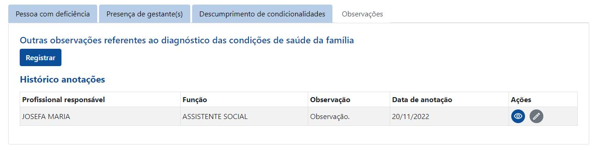
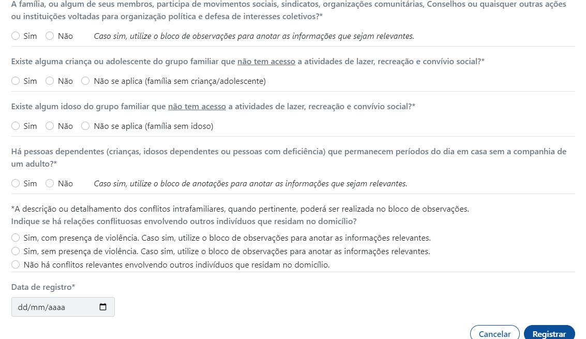
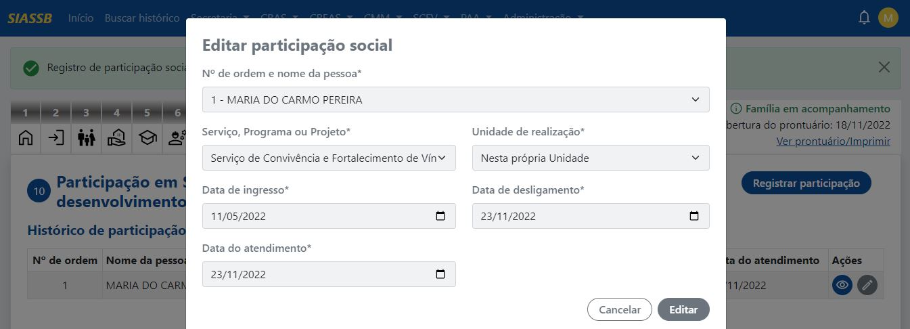
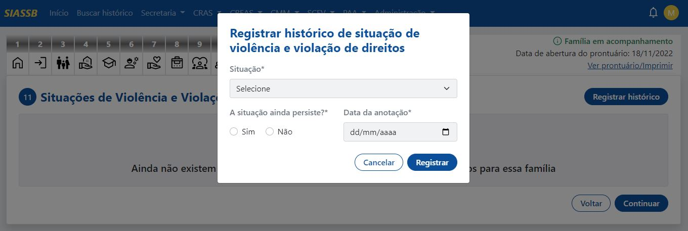
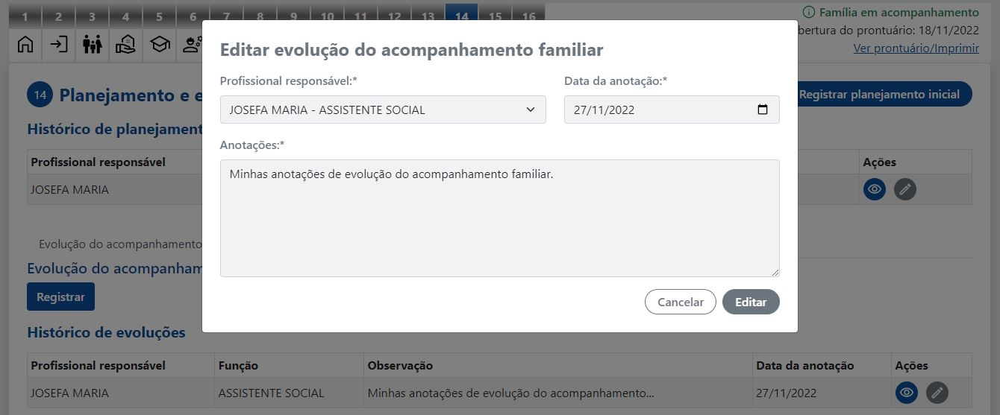

# Prontuário SUAS

O Prontuário SUAS é um instrumento técnico formado por um conjunto de informações relativas à família ou membro familiar que possibilita a comunicação entre os membros da equipe de referência do CRAS ou do CREAS e a continuidade do serviço prestado ao indivíduo.

A Tipificação Nacional dos Serviços Socioassistenciais aponta que a utilização de prontuário é requisito essencial para o trabalho social com famílias no âmbito do SUAS. O registro sistemático de informações em prontuário representa um indicador de qualidade do serviço ofertado, além de se constituir como um instrumento técnico para respaldo ético e legal dos profissionais responsáveis pelo serviço ofertado e para a família e indivíduos acompanhados no âmbito do PAIF (Serviço de Proteção e Atendimento Integral à Família) e do PAEFI (Serviço de Atendimento Especializado a Famílias e Indivíduos).

Dentre as funcionalidades no sistema, podemos citar:

- [`Cadastro da família`](#cadastrar-nova-família)

## Cadastrar nova família

Para cadastrar um novo Prontuário SUAS, deve-se ir em **CRAS -> Prontuário SUAS -> Cadastrar**, com isso, o sistema será redirecionado para a tela de abertura.

### Abertura do prontuário

Na abertura do Prontuário SUAS é necessário identificar a pessoa de referência da família, o número do prontuário, data de abertura, bem como o tipo, o número e o nome da unidade. Nota-se que a intenção do registro dessa informação é facilitar sua localização no momento em que a Equipe Técnica do CRAS ou CREAS precisar utilizar o prontuário, seja para dar continuidade ao trabalho social com a família, seja para coletar dados e consolidar informações.

Abaixo segue o passo a passo para o registro das anotações nesse formulário:

**Nome da pessoa de referência da família:** Informe o nome completo da pessoa de referência da família, conforme consta na Certidão de Nascimento, Documento de Identidade ou outro documento legal. O registro dessa informação é de grande relevância para estabelecer um contato personalizado com a família. 

**Nº do prontuário:** O número do Prontuário SUAS deve ser criado e padronizado pelas próprias unidades dos CRAS e dos CREAS. Tem como objetivo facilitar a localização dos prontuários que serão utilizados pelos técnicos de nível superior do CRAS ou CREAS seja para registro das informações coletadas durante o acompanhamento da família/indivíduo, seja para realização de estudos sociais ou ainda para coleta de dados sobre as famílias. 

**Data da abertura:** Data em que o profissional registrou o primeiro contato com a família.

**Tipo de unidade:** Equipamento do SUAS (CRAS ou CREAS) que será responsável pelo acompanhamento da família. 

**Nº da unidade (código do equipamento):** O número da unidade do CRAS ou CREAS se refere àquele gerado a partir da
inscrição da unidade no Cadastro Nacional do Sistema Único da Assistência Social (CadSUAS). A intenção de registrar essa informação no Prontuário SUAS consiste em facilitar a organização dos documentos técnicos nas unidades de CRAS e CREAS.

Caso não tenha nenhum registro, deve ir em: **CRAS -> Prontuário SUAS -> Código do equipamento (recurso)**, o sistema irá redirecionar para a listagem de todos os códigos dos equipamentos, conforme a imagem abaixo.

Perceba que não existe nenhum código cadastrado, assim basta clicar no botão "Cadastrar", o sistema irá redirecionar para a seguinte tela.

Para preencher o Nº da unidade (código do equipamento) e o Nome da unidade, basta acessar o CADSUAS (essa informação é pública e não necessita de senha) e seguir as orientações abaixo:

1. Acesse a área do CADSUAS, por meio do link: http://aplicacoes.mds.gov.br/cadsuas
2. No item "Tipo de Busca" clique em "Rede Socioassistencial"
3. Selecione a Unidade Federativa (UF)
4. Selecione o Município
5. Selecione o tipo de unidade (CRAS ou CREAS)
6. Clique em "Pesquisar"
7. O sistema exibirá uma tabela com todas as unidades do CRAS e do CREAS que foram cadastradas no CADSUAS pelo município. Nesta tabela aparecerá o nome da Unidade, o Número Identificador, UF e Município.

Após obter os dados, clicar no botão "Cadastrar", o sistema irá redirecionar para a listagem geral já com o cadastro do novo registro.

Feito isso, basta ir novamente em **CRAS -> Prontuário SUAS -> Cadastrar**, e no campo Nº da unidade (código do equipamento), selecionar o Nº do CRAS ou CREAS.

**Nome da unidade:** Nesse item o profissional deve indicar o nome fantasia do CRAS ou do CREAS que
corresponde à denominação atribuída a cada unidade a fim de melhor identificá-la, especialmente para os municípios que possuem mais de uma unidade de CRAS ou de CREAS no município. Em muitos casos, o nome fantasia faz referência  bairro e/ou território no qual a unidade está instalada, conforme disposto nas Orientações Técnicas: Centro de Referencia de Assistência Social – CRAS (2009). 

Feito o preenchimento de todos os campos, o próximo passo é clicar no botão "Salvar e continuar" que o sistema irá redirecionar para os blocos do prontuário.

### Blocos do prontuário SUAS

O Prontuário SUAS é subdividido em blocos que organizam o registro de informações sobre a família e seu histórico de utilização dos serviços, identificação e endereço da família, forma de acesso ao Serviço/Unidade e razão do primeiro atendimento, bem como informações sobre as características socioeconômicas da família, características do domicílio, identificação de vulnerabilidades, riscos e violações de direitos, acesso da família (ou indivíduo) a serviços e benefícios, registro dos encaminhamentos realizados, informações relativas à referência e contrarreferência e anotações relativas ao processo de acompanhamento. Os blocos do Prontuário SUAS estão assim organizados: 

1. [Identificação da Pessoa de Referência e Endereço da Família;](#identificação-da-pessoa-de-referência-e-endereço-da-família)
2. [Forma de Ingresso na Unidade e Motivo do Primeiro Atendimento;](#forma-de-ingresso-na-unidade-e-motivo-do-primeiro-atendimento)
3. Composição Familiar;
4. Condições Habitacionais da Família;
5. Condições Educacionais da Família;
6. Condições de Trabalho e Rendimento da Família;
7. Condições de Saúde da Família;
8. Acesso a Benefícios Eventuais;
9. Convivência Familiar e Comunitária;
10. Participação em Serviços, Programas e Projetos;
11. Situações de Violência e Violação de Direitos;
12. Histórico de Cumprimento de Medidas Socioeducativas;
13. Histórico de Acolhimento Institucional;
14. Planejamento e Evolução do Acompanhamento Familiar; e
15. Formulário de Controle de Encaminhamentos
16. Registro Simplificado dos Atendimentos;

### Identificação da Pessoa de Referência e Endereço da Família

Neste bloco, é necessário registrar os dados de identificação da pessoa de referência bem como o endereço da família. A intenção desse bloco é proporcionar a equipe de referência do CRAS ou CREAS fácil acesso a família usuária do serviço e assim melhor viabilizar o trabalho social com as famílias. Ter esses registros, além de facilitar o contato com a família, facilita também na mobilização/convite das famílias para a participação em ações e serviços ofertados pelas unidades, pela rede socioassistencial do SUAS e ainda pela rede setorial de políticas públicas.

**Nome completo da pessoa de referência:** Escrever o nome completo da pessoa de referência conforme consta no seu
registro de identidade. O nome da pessoa de referência deve constar na capa do Prontuário SUAS. 

**Apelido (caso seja relevante):** O apelido se refere à forma como a pessoa de referência é conhecida socialmente ou como prefere ser chamada.

:::info Importante
Em consonância com o Programa Nacional de Direitos Humanos (Decreto nº 7.037, de 21 de Dezembro de 2009), sugere-se que o(a) profissional utilize nesse campo o nome social adotado pela pessoa de referência, mediante o interesse e solicitação do(a) usuário(a), caso seja necessário.
:::

**Nome da mãe:** Informar o nome completo da mãe (biológica ou não), que consta na certidão de nascimento, carteira de identidade ou em outro documento legal.

**NIS da pessoa de referência:** O NIS se refere ao Número de Inscrição Social que é o número de referência do usuário(a) no Cadastro Único. De posse deste número (NIS) os(as) interessados(as) podem se candidatar aos diversos programas sociais do Governo Federal, desde que atenda aos requisitos exigidos.

**CPF da pessoa de referência:** Registrar o número do Cadastro de Pessoa Física (CPF). O CPF é destinado a pessoas físicas e é emitido pela Receita Federal. O CPF contém um número identificador que não muda mesmo em caso de segunda via do cartão.

**RG (número):** Anote nesse campo o número do Registro Geral (RG) contido no documento de identidade (Carteira de Identidade) da pessoa de referência.

**RG (órgão):** órgão que emitiu o RG.

**RG (UF):** Unidade Federativa no qual o RG foi registrado.

**RG (data de emissão):** Data no formato dd/mm/aaaa.

:::caution Atenção
Caso a pessoa de referência não possua RG, a equipe técnica deverá realizar o encaminhamento para providenciar esse documento. Lembre-se que o CRAS é o equipamento do SUAS que garante o acesso e a promoção dos direitos socioassistenciais no território, inclusive o direito à documentação civil básica (certidão de nascimento,
CPF, RG, título de eleitor).
:::

**Endereço (Rua, Av.):** O profissional deverá registrar o local onde está situada a residência ou local de moradia da pessoa de referência considerando o nome da rua, avenida, praça, quadra e outras informações importantes que auxiliem na identificação do local onde a pessoa de referência reside.

**Bairro:** Selecione o nome do bairro no qual está situado o local de moradia da pessoa de referência.

**UF:** Selecione o Unidade Federativa.

**CEP:** Informe o Código de Endereçamento Postal (CEP). O CEP é um código desenvolvido pelas administrações postais e criado com o intuito de facilitar a organização logística e localização espacial de um endereço postal.

**Município:** Informe o nome completo do município no qual está situado o local de moradia da pessoa de referência.

**Complemento:** O complemento se refere às informações adicionais relacionados ao endereço e que sejam importantes informar para melhor localizar o local de moradia da pessoa de referência.

**Ponto de referência:** Refere-se a um ou mais pontos estratégicos para facilitar a localização da moradia da pessoa de referência.

**Telefones de contato:** Informe todos os telefones de contato da pessoa de referência ou dos indivíduos da
família, considerando o DDD e o número de telefone. 

:::tip Dica
Sugere-se registrar o número telefônico da residência, do local de trabalho, do celular e de um vizinho de referência, caso seja possível, para facilitar a localização da pessoa de referência.
:::

**Data de registro:** Informar a data no formato dd/mm/aaaa.

**Localização do domicílio:** Selecione se o local de moradia da pessoa de referência está situado na área urbana
ou na área rural do município.

**Assinale caso o endereço seja de um abrigo:** Neste caso, informe apenas quando a pessoa de referência da família tem como referência de moradia algum equipamento que oferta serviços de acolhimento para adultos ou famílias.

Feito o preenchimento de todos os campos, basta clicar no botão "Registrar", assim será exibida a seguinte imagem.

Perceba que após o registro do bloco de identificação, houve uma subdivisão em dois blocos:
- Sub-bloco de identificação da pessoa de referência
- Sub-bloco de editar endereço atual da família

#### Sub-bloco de identificação da pessoa de referência

Os campos deste sub-bloco pode ser modificados, para alterar os dados basta substituis os campos que deseje alterar e depois clicar no botão "Editar", assim a atualização será realizada e os campos alterados.

#### Sub-bloco de editar endereço atual da família

Três botãos foram exibidos:
- [Editar endereço atual](#editar-enderec3a7o-atual-1)
- [Regsitrar novo endereço](#registrar-novo-endereço)
- [Histórico de endereços](#histórico-de-mudanças-de-endereços)

##### Editar endereço atual

Caso haja a necessidade de editar o endereço atual, basta realizar as alterações necessárias e clicar no botão "Editar endereço atual".

##### Registrar novo endereço

Nas situações em que ocorrer mudança de endereço é necessário que todos os
campos sejam registrados, isto inclui as circunstâncias em que a pessoa de referência
deixou de residir em equipamentos que ofertam serviços de acolhimento ou se passou a morar nesses equipamentos, por demandar proteção especial da assistência social.

Para realziar um novo registro, basta clicar no botão "Registrar novo endereço", a aberta uma janela modal conforme a imagem a seguir.

Após isso, basta preencher todos os campos necessários e clicar no botão "Registrar".

##### Histórico de mudanças de endereços

Esse espaço é reservado para visualizar o histórico de mudanças de dados relativos ao domicílio da pessoa de referência. O registro dessa informação é essencial para o trabalho social com as famílias, pois a mudança de endereço implica em alteração nas características do domicílio e, em algumas situações, em alteração nas
características do território. Nesse caso, deve ser registrada também a data em que foi realizada essa atualização no Prontuário SUAS. Para visualizar o histórico, basta clicar no botão "Histórico de endereços".

### Forma de Ingresso na Unidade e Motivo do Primeiro Atendimento

Neste bloco é necessário registrar a forma de acesso da família usuária ao CRAS ou CREAS. A intenção é historiar a forma como os(as) usuários(as) acessaram a unidade, o que possibilita à *posteriori* mapear e identificar a cobertura da rede prestadora de serviço. Essa informação fornece indicadores que possibilitam analisar a relação de articulação do CRAS/CREAS com a rede de serviços socioassistenciais do SUAS e ainda com a rede setorial de políticas públicas existentes no território de abrangência, além de subsidiar o planejamento
das ações a serem realizadas com a família no âmbito do PAIF e do PAEFI.

:::note Nota
A Tipificação Nacional de Serviços Socioassistenciais (2009) elenca as condições e formas de acesso dos(as) usuários(As) ao PAIF e ao PAEFI, compreendidas como a procedência dos(as) usuários(as) e formas de encaminhamentos adotados pelos Serviços, respectivamente.
:::

São quatro as formas de acesso ao PAIF descritas pela Tipificação:

- Por busca espontânea; 
- Por busca ativa; 
- Por encaminhamento da rede socioassistencial; 
- Por encaminhamento das demais políticas públicas. 

Após as explicações acima, o bloco da Forma de Ingresso na Unidade e Motivo do Primeiro Atendimento é exibido na seguinte imagem.

**De que forma a família (ou membro da família) acessou a unidade para o primeiro atendimento?** Deve ser selecionado uma das seguintes opções: 
- Em decorrência de busca ativa realizada pela equipe da unidade
- Em decorrência de encaminhamento realizado por outras políticas setorias
- Em decorrência de encaminhamento realizado pela área da educação
- Em decorrência de encaminhamento realizado pela área da saúde
- Em decorrência de encaminhamento realizado pelo poder judiciário
- Em decorrência de encaminhamento realizado pelo sistema de garantia de direitos (defensoria pública, ministério público, delegacias)
- Em decorrência de encaminhamento realizado por outros serviços/unidades da proteção social especial
- Outros encaminhamentos 
- Por demanda espontânea

**Sempre que o acesso for decorrente de algum encaminhamento, identifique o nome e o contato do órgão/unidade que encaminhou o usuário:** Nesse item deverá ser informado o nome e contato (telefone ou endereço) do órgão ou da unidade do órgão que encaminhou a família/indivíduo, para atendimento na unidade.

**Quais as razões, demandas ou necessidades que motivaram este primeiro atendimento?** descreva quais foram os principais motivos apresentados pela família, membro da família ou órgão/serviço para o acompanhamento da mesma no CRAS ou CREAS. 

:::info Importante
Mesmo nos casos em que a família tenha sido encaminhada por outro órgão/serviço, é importante verificar com a família/membro da família, quais os motivos relacionados ao encaminhamento.
:::

**Assinale abaixo caso a família, ou algum de seus membros, seja beneficiária de algum dos seguintes programas sociais:** por padrão, o sistema só vem com a opção de BPC disponível para seleção, caso haja a necessidade de registrar novos programas sociais, basta ir em **CRAS -> Prontuário SUAS -> Programas Sociais (recurso)**, a seguinte imagem será exibida.

Para registrar um novo programa, basta clicar no botão "Cadastrar", a nova tela será mostrada.

Após o preenchimento dos campos, deve-se clicar no botão "Cadastrar", o sistema irá redirecionar para a tela de listagem de todos os programas.

Perceba que o SCFV foi registrado.

Agora ao retornar para a tela do prontuário SUAS no bloco de Forma de Ingresso na Unidade.

Por fim, basta clicat no botão "Atualizar", feito a atualização. basta clicar no botão "Continuar", que o sistema irá redirionar para o bloco da Composição Familiar.

### Composição Familiar

Foi fundamentado no conceito de matricialidade sociofamiliar proposto pela PNAS (Política Nacional de Assistência Social) que o bloco da Composição Familiar no Prontuário SUAS foi pensado e elaborado. Sendo essencial que a equipe de referência do CRAS e do CREAS registre nesse item todas as informações pessoais de cada membro da família usuária do serviço, o que contribui para o planejamento da oferta qualificada do PAIF e do PAEFI.

Veja abaixo, o bloco da composição familiar em seu primeiro acesso.

A intenção desse bloco, além de contribuir para o planejamento do trabalho social com a família, é viabilizar o efetivo acesso da população aos seus direitos. Por exemplo, nos casos em que se identifiquem membros das famílias sem algum ou alguns dos documentos civis (certidão de nascimento, CPF, RG, título eleitoral, CTPS), a equipe técnica deverá orientá-lo e encaminhá-lo para providenciar os documentos. 

:::tip Lembre-se
O CRAS é o equipamento do SUAS que garante o acesso e a promoção dos direitos socioassistenciais no território, inclusive o direito à documentação civil básica.
:::

#### Registrando nova pessoa

Para registrar uma nova pessoa, deve-se clicar no botão "Adicionar pessoa", será aberta uma nova janela modal conforme a imagem abaixo.

:::caution Atenção
A primeira pessoa da família registrada neste quadro é a pessoa de referência, seguido dos demais membros familiares;
:::

**Nome completo:** Nesse quadro deve ser registrado o nome completo de todas as pessoas da família. Deve ser registrado o nome completo sem abreviações e sem ausência de um dos nomes compostos ou de algum dos
sobrenomes. Cada membro da família terá um número de ordem atribuído de forma automática pelo sistema.

**Sexo:** No Prontuário este item se refere ao sexo biológico de cada membro familiar, Masculino (M) e Feminino (F).

**Data de nascimento:** A data de nascimento de cada pessoa da família deve constar o dia, mês e ano, seguindo o padrão dd/mm/aaaa, conforme consta no Registro Civil de Nascimento, Carteira de Identidade ou outros documentos
legais.

**Parentesco:** O parentesco com a pessoa de referência deve ser marcado conforme a lista de códigos de parentescos
contida na lista seguinte:

**1.** Pessoa de Referência  
**2.** Cônjuge/companheiro(a)  
**3.** Filho(a)  
**4.** Enteado(a)  
**5.** Neto(a) Bisneto(a)  
**6.** Pai/Mãe  
**7.** Sogro(a)  
**8.** Irmão/irmã  
**9.** Genro/Nora  
**10.** Outro parente  
**11.** Não parente  

**Pessoa com deficiência:** Caso exista, é importante registrar no Prontuário a presença de pessoa com deficiência na família.

:::note Nota
A PNAS estabelece como usuários da política de assistência social “cidadãos e grupos que se encontram em situações de vulnerabilidade e riscos”, em especial pessoas com deficiência.
:::

:::info Importante
A Tipificação Nacional de Serviços Socioassistenciais orienta que no trabalho com famílias de pessoas com deficiência sejam incluídas ações que envolvam grupos e organizações comunitárias para troca de informações acerca de direitos da pessoa com deficiência, potenciais das crianças, importância e possibilidades de ações inclusivas. 
:::

**Assinale caso seja identificada necessidade de providenciar documentação civil da pessoa:** Selecione nesse campo apenas os documentos civis que cada pessoa da família necessita providenciar, dentro os documentos, podemos citar:
- CN - Certidão de Nascimento (1ª ou uma 2ª via)
- CPF - Cadastro de Pessoa Física
- CTPS - Carteira de Trabalho e Previdência social
- RG - Carteira de Identidade
- TE - Título de Eleitor

:::danger Fique atento
Famílias com integrantes sem a documentação civil básica devem ser inseridas nos serviços de acompanhamento familiar do PAIF com prioridade! A unidade do CRAS ou do CREAS deve oferecer informações sobre os locais onde é possível providenciar tal documentação e possibilitar o encaminhamento.
:::

**Data de registro:** A data de registro do atendimento de cada pessoa da família deve constar o dia, mês e ano, seguindo o padrão dd/mm/aaaa.

Por fim, preenchido todos os campos necessários, basta clicar no botão "Adicionar membro", a seguinte tela será exibida.

Conforme a imagem acima, o status do cadastro da família foi alterado da situação "Pendente" para "Família em acompanhamento", com o cadastro se torna válido e pode ser impresso.

No registro da pessoa, existem as ações de visualizar, alterar dados e excluír membro da família que iremos ver adiante.

##### Visualizar pessoa

Ao clicar no ícone do olho (visualizar) da pessoa correspondente, uma nova janela modal será aberta, com os dados do membro da família, veja abaixo.

Os campos mostrados são: Nome completo, Sexo, Data de nascimento, Idade, Parentesco com a pessoa de referência e Pessoa com deficiência.

##### Editar pessoa

Ao clicar no ícone do lápis (editar) da pessoa correspondente, uma nova janela modal será aberta, com os dados do membro da família, veja abaixo.

Para editar, é necessário realizar todas as modificações e clicar no botão "Editar", que os campos serão alterados com sucesso.

##### Excluir pessoa

Caso necessite excluir uma pessoa do quadro da Composição Familiar por motivo de separação, divisão de família, óbito, etc., clique no ícone da lixeira (excluir) da pessoa correspondente, irá abrir uma janela modal, conforme a imagem abaixo.

Ondem devem ser preenchidos os seguintes campos:

**Profissional responsável:** Selecionar o profissional que irá excluir a pessoa.

**Data da exclusão:** A data de exclusão de cada pessoa da família deve constar o dia, mês e ano, seguindo o padrão dd/mm/aaaa.

**Motivo da exclusão:** Separação, divisão de família, óbito, dentre outros motivos.

Preenchido todos os campos, deve-se clicar no botão "Excluir". Realizada a exclusão, a seguinte tela será exibida.

Perceba que o usuário PEDRO DOS SANTOS teve o seu cadastro excluído e foi passado um "traço" em seus dados, ficando disponível apenas as açoes de ver os dados e a exclusão

O campo "EXCLUÍDO" pode ser clicado, onde o técnico poderá visualizar novamente o motivo da exclusão daquele usuário em específico.

#### Perfil etário

Esse recurso foi elaborado para possibilitar aos profissionais um campo onde seja possível sintetizar algumas relações que demonstrem, por exemplo, a relação provedor–dependente na família e a visualização de quantos
adultos e quantas crianças existem na família. Essa informação permite que os profissionais possam compreender as expressões de proteção/desproteção das famílias.

:::info Importante
O perfil etário é gerado automaticamente após a inclusão dos membros da família, confira na imagem abaixo.
:::

#### Especificidades sociais, étnicas ou culturais da família

Segundo a definição adotada pelo Decreto Nº 6.040, de 7 de fevereiro de 2007, que institui a Política Nacional de Desenvolvimento Sustentável dos Povos e Comunidades Tradicionais: 

:::tip Especificidades sociais, étnicas ou culturais da família
"São grupos culturalmente diferenciados e que se reconhecem como tais, que possuem formas próprias de organização social, que ocupam e usam territórios e recursos naturais como condição para sua reprodução cultural, social, religiosa, ancestral e econômica, utilizando conhecimentos, inovações e práticas gerados e transmitidos pela tradição".
:::

Abaixo segue o formulário para o registro das informações:

**Tipo de especificidade:** Selecione nesse campo apenas o tipo de especificidadde do grupo familiar, onde temos as seguintes opções:

- Família cigana
- Família indígena não residente em aldeia/reserva
- Família indígena residente em aldeia/reserva
- Família ou pessoa em situação de rua
- Família quilombola
- Família ribeirinha
- Outras

**Caso seja família indígena residente em aldeia/reserva, especifique o povo/etnia:** Para as Famílias Indígenas é necessário especificar o Povo/Etnia e ainda se possível registrar a aldeia ou a reserva que a família reside.

**Caso seja família indígena não residente em aldeia/reserva, especifique o povo/etnia:** Para as Famílias Indígenas não residente em aldeia é necessário especificar o Povo/Etnia.

Após o preenchimento dos campos necessários, basta clicar no botão "Salvar".

#### Observações

Para registrar uma nova obervação, basta selecionar a aba e preencher os campos, veja na imagem abaixo.

**Profissional responsável:** Selecionar o profissional que irá registrar a anotação.

**Data da anotação:** A data de anotação deve constar o dia, mês e ano, seguindo o padrão dd/mm/aaaa.

**Observações:** A observação dos registros permite que seja pensado um conjunto de ações e atividades planejadas que garantam o acesso a direitos, oportunidades de participação, desenvolvimento da autonomia dos usuários e inserção destes nos demais serviços da rede socioassistencial ou nas demais políticas setoriais, contribuindo para a prevenção de situações de exclusão, isolamento social e na redução de ocorrência de riscos sociais.

Feito todo o procedimento, basta clicar no botão "Salvar", que o sistema irá redirecionar e mostrar a listagem de todos as observações realizadas neste bloco.

Após a primeira anotação registrada, é exibido o histórico de alterações, com os botões de visualizar e editar, caso queira visualizar os dados, basta clicar no ícone do olho do registro correspondente.

Caso haja a necessidade de alterar os dados das anotações, basta clicar no ícone do lápis, e realizar toda a edição necessária.

Realizada todas as ações no bloco da composição familiar, basta clicar no botão "Continuar".

### Condições habitacionais da família

A intenção desse bloco é possibilitar aos técnicos dos CRAS e CREAS uma leitura do espaço de vivência domiciliar da família que está em acompanhamento familiar, com o objetivo de promover uma reflexão sobre as peculiaridades do espaço domiciliar que podem impactar na dinâmica familiar e assim implementar ações adequadas às experiências vividas pela família.

As informações registradas nesse bloco contribuem para a elaboração do diagnóstico das condições habitacionais da família e para o planejamento do acompanhamento familiar.

:::info Importante
As informações solicitadas neste bloco não, necessariamente, precisam ser solicitas no momento em que a família está sendo atendida pela equipe técnica no CRAS ou CREAS. Os profissionais podem observar as características das condições habitacionais da família no momento da visita domiciliar, por exemplo. Ou ainda retirar essas informações do CadÚnico, caso a família seja cadastrada e permaneça morando no mesmo endereço.
:::

Abaixo segue o passo a passo para o registro das informações, conforme a imagem a seguir:

Perceba que ainda não existem condições habitacionais registradas para essa família, então deve-se clicar no botão **"Registrar condição habitacional"**, assim será exibida uma janela modal, conforme a imagem abaixo.

:::caution Atenção
Este bloco não deve ser usado para as situações em que a família/indivíduo resida em equipamentos de serviços de acolhimento ou estejam em situação de rua.
:::

**a. Tipo de residência:** Selecione nesse campo apenas o tipo de residência que a família habita atualmente, onde temos as seguintes opções:

- Própria: Residência "própria" refere-se ao imóvel que possui escritura/registro em nome da pessoa de referência da família ou em nome de um dos seus membros.

- Alugada: A residência "alugada" se refere ao imóvel que possui contrato de locação, mesmo que informal, em nome da pessoa de referência da família ou em nome de um dos seus membros.

- Cedida: A residência "cedida" se refere ao imóvel público ou privado cedido à família, sem ônus, exceto despesa de manutenção.

- Ocupada: Residência "ocupada" se refere a imóveis que foram ocupados de forma irregular, já que este não pertence à família e não foi cedido nem alugado por terceiros, como, por exemplo, no caso de invasão. Considere essa opção também para as situações em que o terreno foi ocupado, mas a família foi responsável pela construção do imóvel.

**b. Material das paredes externas do domicílio** Selecione nesse campo apenas o tipo de material predominante na parede externa do domicílio, onde temos as seguintes opções:

- Alvenaria ou madeira aparelhada: Entende-se por alvenaria as construções de estruturas e de paredes utilizando tijolos ou materiais que necessitam de argamassa para sua união e firmeza. Estas unidades podem ser blocos (de cerâmica, de vidro ou de betão) e pedras.

Por madeira aparelhada entende-se que as paredes externas do domicílio são formadas por madeiras resistentes e que podem proteger a parte interna do domicílio. Madeiras feitas especialmente para o intuito de construção. Casas pré-moldadas podem ser consideradas sendo de alvenaria ou madeira, se for o caso.

- Madeira aproveitada, taipa ou outros materiais precários: A madeira aproveitada é a madeira reutilizada de construções ou estruturas anteriores. Não feitas com a finalidade última deste domicilio em particular. A taipa, por sua vez, se refere à construção realizada à base de argila (barro) e cascalho.

:::caution Atenção
Nos casos em que as paredes externas do domicílio forem formadas por mais de um material, marcar apenas o material da maior parte das paredes externas da residência.
:::

**c. Acesso a energia elétrica** Selecione nesse campo o tipo de ligação de energia elétrica da residência da família atendida/acompanhada.

- Sim, com medidor próprio: Quando os domicílios possuem medidor próprio de energia significa que a residência possui um dispositivo ou equipamento eletromecânico e/ou eletrônico capaz de medir o consumo de energia elétrica de uma única residência.

- Sim, com medidor compartilhado: Quando os domicílios possuem medidor compartilhado de energia significa que a residência possui um dispositivo ou equipamento eletromecânico e/ou eletrônico capaz de medir o consumo de energia elétrica de várias residências.

- Sim, sem medidor: Quando os domicílios não possuem medidor de energia significa que não existe na residência nenhum equipamento capaz de medir o consumo de energia elétrica da residência.

- Não possui energia elétrica no domícilio: Selecione essa opção quando o lugar de moradia não possuir iluminação elétrica.

:::tip Dica
O Governo Federal, por meio do Programa Tarifa Social de Energia Elétrica, vem promovendo a universalização do acesso à energia elétrica. Conforme determina a [Lei 12.2012 de 20 de janeiro de 2010](https://www.planalto.gov.br/ccivil_03/_Ato2007-2010/2010/Lei/L12212.HTM), a Tarifa Social de Energia é um desconto fornecido pelo Governo Federal na conta de energia de famílias de baixa renda. Para ter acesso ao desconto na conta de luz é imprescindível que a família esteja inscrita no CadÚnico, saiba mais no portal [gov.br](https://www.gov.br/cidadania/pt-br/acoes-e-programas/assistencia-social/beneficios-assistenciais/tarifa-social-de-energia).
:::

**d. Possui água canalizada:** Marque sim para as situações em que a residência da família atendida/acompanhada possuir água canalizada proveniente de rede geral de abastecimento, com distribuição interna para um ou mais cômodos. 

Marque não, para os casos que a residência da família não possua água canalizada. 

:::info Importante
O Governo Federal por meio Decreto [Nº 7.535 de 26, de julho de 2011](http://www.planalto.gov.br/ccivil_03/_ato2011-2014/2011/decreto/d7535.htm) instituiu o Programa Nacional de Universalização do Acesso e Uso da Água - “ÁGUA PARA TODOS”, com o objetivo de *"promover a universalização do acesso à água em áreas rurais para consumo humano e para a produção agrícola e alimentar, visando ao pleno desenvolvimento humano e à segurança alimentar e nutricional de famílias em situação de vulnerabilidade social".*
:::

**e. Forma de abastecimento de água:** Selecione qual é a forma de abastecimento de água da residência da família atendida/acompanhada.

- Rede geral de distribuição: Entende-se por rede de distribuição o conjunto de peças especiais destinadas a conduzir a água até os pontos de tomada das instalações prediais, ou os pontos de consumo público, sempre de forma contínua e segura. 

- Poço ou nascente: Poço é aquela forma de abastecimento de água que capta a água de camadas abaixo do solo. Nascentes são águas que afloram na superfície, fruto do acumulo da água.

- Cisterna de captação de águas de chuva:** O sistema de captação de águas de chuva consiste no aproveitamento de águas pluviais, por meio de calhas e coletores (verticais e horizontais) que desviam a água das chuvas para reservatórios. A água coletada é armazenada e destinada ao abastecimento de reservatórios e utilizada em todas as atividades no domicílio.

- Carro pipa: O abastecimento das comunidades por meio de carro pipa é uma alternativa nas comunidades vulneráveis à escassez de água.

- Outra forma: Selecione esta opção apenas quando a forma de abastecimento de água não se referir a nenhuma das mencionadas anteriormente.

**f. Escoamento sanitário:** Selecione qual é a forma de escoamento sanitário da residência da família atendida/acompanhada.

:::danger Muita atenção
Prestar atenção nesse dado, pois nas ocasiões em que o escoamento sanitário for inadequado ou não existir, pode ser um indicativo de condições mais precárias de vida!
:::

- Rede coletora de esgoto ou pluvial: A instalação de esgoto ou pluvial compreende a canalização das águas servidas e dos dejetos provenientes do banheiro ou sanitário, que ligada a um sistema de coleta, os conduz a um desaguadouro geral da área, região ou município, mesmo que o sistema não disponha de estação de tratamento da matéria esgotada.

- Fossa séptica: As fossas sépticas são unidades de tratamento primário de esgoto doméstico, nas quais são feitas a separação e a transformação físico-química da matéria sólida contida no esgoto. 

- Fossa rudimentar: Quando os dejetos ou águas proveniente do banheiro ou sanitário forem escoados para um poço, buraco ou fossa negra sem passar por nenhum processo de tratamento.

- Direto para vala, rio, lago ou mar: O escoamento sanitário com passagem direta para vala é aquele em que os dejetos do(s) banheiro(s) ou sanitário(s) são encaminhados diretamente para uma vala a céu aberto. O escoamento sanitário também pode ser realizado diretamente para rios, lagos ou mar sem que tenha passado por qualquer tipo de tratamento.

- Domicílio sem banheiro: É aquele domicílio que não possui, dentre seus cômodos, um específico para higiene pessoal e que não possua instalações sanitárias. 

**g. Coleta de lixo:** Selecione qual é a forma de coleta de lixo da residência/território da família atendida/acompanhada.

:::danger Muita atenção
Prestar atenção nesse dado, pois nas ocasiões em que a coleta de lixo for inadequada ou não existir, pode ser um indicativo de condições mais precárias de vida!
:::

- Sim, coleta direta: Entende-se por coleta de lixo direta aquela que é feita no domicílio por serviço ou empresa pública ou privada.

- Sim, coleta indireta: Considera-se coleta de lixo indireta quando o lixo é depositado em caçamba, tanque ou outro depósito, fora do domicílio, sendo posteriormente coletado por serviço ou empresa de limpeza urbana (pública ou privada).

- Não possui coleta: selecione essa opção, quando a residência da família não possui coleta de lixo, sendo o mesmo depositado em qualquer lugar. 

:::info Importante
O acesso à energia elétrica, água potável, escoamento sanitário e coleta de lixo impactam na melhoria na situação de vida das famílias. São indicadores que sinalizam redução da pobreza e exclusão social, diminuição da desigualdade socioeconômica, melhoria na situação nutricional e de saúde das famílias, por exemplo.
:::

**h. Qual o número total de cômodos do domicílio:** Informe nesse campo o número total de cômodos existentes na residência da família acompanhada. É fundamental registar essa informação, pois essa característica habitacional influencia na dinâmica familiar.

Considera-se como cômodo todo compartimento, coberto por um teto e limitado por paredes, que fosse parte integrante do domicílio particular permanente, com exceção de corredor, alpendre, varanda aberta, garagem, depósito e outros compartimentos utilizados para fins não residenciais.

**i. Qual o nº de cômodos utilizados como dormitório:** Informe nesse campo o número de cômodos utilizados como dormitório na residência da família acompanhada. É fundamental registar essa informação, pois essa característica habitacional influencia na dinâmica familiar. 

:::note Nota
Essa informação pode ser obtida por meio de uma visita domiciliar com a família e não necessita ser perguntada no momento do atendimento/acompanhamento na unidade. A visita no domicílio da família permite que a equipe de referência conheça os arranjos familiares e a forma de convivência familiar. Essas informações são essenciais para adequar as ações do PAIF e do PAEFI ao acompanhamento de cada situação familiar.
:::

**j. Quanto é o nº de pesssoas do domicílio dividido pelo nº de dormitórios?** Calcular o número de pessoas na família e dividir pelo número de quartos existentes na residência. É essencial registar essa informação, pois a essa característica habitacional influencia na dinâmica familiar. 

**Exemplo:** na residência da família atendida/acompanhada no CRAS moram 9 pessoas e na casa existem 3 quartos. No momento em que a equipe técnica realizou uma visita domiciliar na casa dessa família, com a intenção de colher subsídios para um estudo de caso, a família informou que dormiam 3 pessoas por quarto. Logo, 9/3 = 3, caso o resultado seja uma dízima periódica 8/3 = 2,666666... arrendondar para baixo, o resultado será o valor 2.

**k. O domicílio possui acessibilidade para pessoas com dificuldade de locomoção?** Selecione se a residência da família atendida/acompanhada possui acessibilidade para pessoas com mobilidade reduzida (pessoas idosas, pessoas com deficiência, etc.). É fundamental registar essa informação, pois essa característica habitacional influencia no contexto familiar. Importante destacar que espaços com acessibilidade garantem que pessoas com
mobilidade reduzida circulem com segurança nos diversos ambientes do domicílio.

- Sim, tanto nos espaços internos como na comunicação com a rua: Exemplo, rampas de acesso, banheiros adaptados, piso antiderrapante, espaços ampliados para tornar possível a passagem de cadeiras de rodas, dentre outros.

- Sim, apenas nos espaços internos, mais possui "barreiras" na comunicação com a rua: existe a acessibilidade (conforme o item acima), porém, com certas barreiras.

- Não possui condições de acessibilidade: Selecione essa opção, caso não exista nenhum tipo de acessibilidade no domicílio.

**l. O domicílio está localizado em área de risco de desabamento ou alagamento?** Nesse campo, marque sim para as situações em que a residência da família atendida/acompanhada esteja localizada em área onde há risco de desabamento ou alagamento. 

Marque não, para os casos que a residência da família não esteja localizada em área onde exista risco de desabamento ou alagamento.

:::info Importante
O Protocolo Nacional Conjunto para Proteção Integral a Crianças e Adolescentes, Pessoas Idosas e Pessoas com Deficiência em Situação de Riscos e Desastres, instituído pela Portaria Interministerial nº 2, de 6 de dezembro de 2012, tem como principal objetivo assegurar a proteção integral e reduzir a vulnerabilidade dessas pessoas nas situações de riscos e desastres. 
:::

**m. O domicílio está localizado em área de difícil acesso geográfico?** Entende-se como área de difícil acesso geográfico aquelas residências que ficam distantes da rede de serviços ofertados no território como: escolas, creches, serviços de saúde, serviços socioassistenciais e demais serviços setoriais.

Marque sim para as situações em que a residência da família atendida/acompanhada esteja localizada em área de difícil acesso. 

Marque não, para os casos que a residência da família usuária não esteja localizada em área que não se caracterize como de difícil acesso geográfico.

**n. O domicílio está localizado em área com forte presença de conflito/violência?** Entende-se como área com forte presença de conflito/violência aquela área onde exista contexto de extrema violência (tráfico de drogas, crime organizado, homicídios) ou áreas onde ocorrem disputas étnicas pelo direito a terra (situações vivenciadas em territórios indígenas, quilombolas e extrativistas, por exemplo).

É importante que as equipes do PAIF e do PAEFI, planejem e adequem suas ações considerando as particularidades do território e, assim, desenvolvam mobilizações voltadas ao enfrentamento de situações de conflito e violência presente nos territórios de abrangência dos CRAS e dos CREAS, visando o desenvolvimento de ações de prevenção e redução das situações de violência.

Marque sim para as situações em que a residência da família atendida/acompanhada esteja localizada em área com forte presença de conflito ou violência. 

Marque não, para os casos que a residência da família usuária não esteja localizada em área com forte presença de conflito ou violência.

:::tip Dica e sugestão de trabalho
Nas oficinas com famílias realizadas pelo PAIF, o tema "Território – Problemas e Soluções" é uma das sugestões para o trabalho, que objetiva promover a reflexão sobre a elaboração de estratégias para identificar e fortalecer as potencialidades do território, bem como para mobilizar as famílias na superação das vulnerabilidades enfrentadas.
:::

**Data da anotação:** A data de anotação deve constar o dia, mês e ano, seguindo o padrão dd/mm/aaaa.

Preenchido todo os campos necessários, deve-se clicar no botão "Registrar", após o registro, o sistema irá exibir a seguinte imagem.

Perceba, que houve uma mudança no bloco de habitação, onde você poderá acompanhar o histórico de situações de habitação, como também registrar observações relacionadas a moradia da família.

##### Ver condição habitacional da família

Para visualizar, basta clicar no ícone do olho (visualizar) do registro correspondente.

##### Ediar condição habitacional da família

Para editar, basta clicar no ícone do lápis (editar) do registro correspondente.

#### Observações

Durante o acompanhamento da família, este espaço deverá ser utilizado para registrar informações que contribuam para o trabalho social com a família e que possam também servir de base e orientação para os demais profissionais da equipe de referência que trabalham direta ou indiretamente com a família e que possam ter acesso ao prontuário.

##### Registrando observação

Para registrar uma nova observação, basta clicar no botão "Registrar anotação" que será aberta uma nova janela modal, conforme a imagem abaixo.

**Profissional responsável:** Selecionar o profissional que irá registrar a anotação.

**Data da anotação:** A data de anotação deve constar o dia, mês e ano, seguindo o padrão dd/mm/aaaa.

**Observações:** Neste espaço o profissional pode registrar outras informações sobre as Condições Habitacionais da Família, que sejam relevantes para o acompanhamento da família ou membro familiar, e que não foram contempladas nos itens fechados do bloco.

Feito todo o procedimento, basta clicar no botão "Registrar", que o sistema irá redirecionar e mostrar a listagem de todos as observações realizadas neste bloco.

Onde o registro de anotação, poderá ser visualizado ou editado.

Para visualizar a anotação, basta clicar no ícone do "olho" (visualizar) do registro selecionado, será aberta uma janela modal, mostrando estes dados, veja na imagem abaixo.

Para editar a anotação, basta clicar no ícone do "lápis" (editar) do registro selecionado, será aberta uma janela modal, veja na imagem abaixo.

Feito todas as ações, o próximo passo é clicar no botão "Continuar" e prosseguir para o próximo bloco.

### Condições educacionais da família

:::tip Importante
Conforme a **Constituição Federal – Art. 205**: *"A educação, direito de todos e dever do Estado e da família, será
promovida e incentivada com a colaboração da sociedade, visando
ao pleno desenvolvimento da pessoa, seu preparo para o exercício
da cidadania e sua qualificação para o trabalho"*.
:::

As informações registradas nesse bloco contribuem para a elaboração do diagnóstico das condições educacionais da família e para o planejamento do acompanhamento familiar, pois permite que o profissional compreenda as interações entre os contextos familiar, comunitário, econômico, cultural e ambiental nos quais o grupo familiar está inserido.

Abaixo segue o passo a passo para o registro das informações, conforme a imagem a seguir:

Perceba que ainda não existem condições educacionais registradas para essa família, então deve-se clicar no botão **"Registrar condição educacional"**, assim será exibida uma janela modal, conforme a imagem abaixo.

**Nº de ordem e nome da pessoa:** Nesse campo deve-se selecionar o número de ordem seguido do nome da pessoa, onde esses dados foram registrados anteriormente no bloco da Composição Familiar, não necessita, portanto, ser solicitado à família novamente, bastando ser selecionado pelo profissional responsável. 

**Sabe ler e escrever:** Nesse campo informe se as pessoas da família sabem ler e escrever. Esse registro
deve ser feito para cada membro familiar.

:::caution Atenção
Para as situações em que exista algum membro na família que não saiba ler nem escrever, sugere-se que a equipe técnica oriente e encaminhe a família para a rede de serviços educacionais.
:::

**Frequenta escola atualmente:** Nesse campo informe se as pessoas da família estão frequentando a escola. Considere nesse item as situações em que as pessoas da família estão matriculadas na rede de ensino e frequentando regularmente a escola. Esse registro de ser feito para cada membro familiar e deve ser atualizado sempre que necessário.

**Escolaridade *(Última série concluída com aprovação)*:** Nas situações em que for registrado que a pessoa da família atualmente frequenta a escola, selecione o "Código de Escolaridade", conforme a lista abaixo:

- 00 - Nunca frequentou escola
- 01 - Creche
- 02 - Educação Infantil
- 11 - 1º Ano E. Fundamental
- 12 - 2º Ano E. Fundamental
- 13 - 3º Ano E. Fundamental
- 14 - 4º Ano E. Fundamental
- 15 - 5º Ano E. Fundamental
- 16 - 6º Ano E. Fundamental
- 17 - 7º Ano E. Fundamental
- 18 - 8º Ano E. Fundamental
- 19 - 9º Ano E. Fundamental
- 21 - 1º Ano E. Médio
- 22 - 2º Ano E. Médio
- 23 - 3º Ano E. Médio
- 30 - Superior Incompleto
- 31 - Superior Completo
- 40 - EJA - Ensino Fundamental
- 41 - EJA - Ensino Médio
- 99 - Outros
- 42 - E. Fundamental Incompleto

**Data da anotação:** Nesse campo deve ser registrada a data da primeira anotação referente às situações educacionais da família atendida/acompanhada e deve constar o dia, o mês e o ano, seguindo o padrão dd/mm/aaaa.

Feito todo o preenchimento dos campos, basta clicar no botão "Regsitrar" que o sistema irá exibir uma nova tela, veja na imagem abaixo.

Perceba que o sistema agora exibiu os dados do histórico do usuário registrado, e mais dois sub-blocos de identificação de vulnerabilidades e anotações.

#### Histórico das condições educacionais

Ao clicar no nome do usuário registrado, será aberto todo o seu histórico de atendimento relacionados a educação, veja abaixo.

Perceba que existe um ícone do "lápis" onde poderemos editar o registro selecionado. caso necessite, basta clicar no ícone, assim será exibida uma janela modal com os seguintes dados para atualização.

Após todos as alterações nos campos correspondentes, basta clicar no botão "Editar".

#### Identificação de vulnerabilidades educacionais

Ao clicar no botão "Ver vulnerabilidades", um novo modal será aberto, veja na imagem abaixo.

:::info Importante
Este quadro facilita a visualização da situação educacional da família conforme o ciclo de vida, contribuindo para o planejamento das ações que devem ser ofertadas para a família atendida/acompanhada e possíveis encaminhamentos para rede de serviços da Educação.
:::

:::caution Atenção
Para as situações em que exista algum membro da família atendida/acompanhada, em idade escolar, que não esteja matriculado na rede de ensino nem frequentando regularmente a escola, ou ainda que exista alguma pessoa da família que não saiba ler nem escrever, sugere-se que a equipe técnica oriente e encaminhe a família para a rede de serviços educacionais.
:::

#### Anotações sobre o descumprimento de condicionalidades de educação no Programa Auxílio Brasil

As anotações nesse campo irá contribuir efetivamente para o acompanhamento do descumprimento das condicionalidades da educação do Programa Auxílio Brasil (PAB). A oferta de serviços socioassistenciais associada a programas de transferência de renda e ao acompanhamento das condicionalidades é essencial para promover o acesso a serviços de educação e saúde. 

:::info Importante
O acompanhamento das condicionalidades da educação do PAB é fundamental para garantir o acesso e a permanência de crianças e adolescentes beneficiárias do PAB na escola e isso reflete em melhores desempenhos escolares e implica na diminuição das desigualdades educacionais.
:::

Para registrar um novo descumprimento de condicionalidades, deve-se clicar no botão "Registrar Descumprimento" e seguir o passo a passo abaixo:

**Nº de ordem e nome da pessoa:** Nesse campo deve-se selecionar o número de ordem seguido do nome da pessoa, onde esses dados foram registrados anteriormente no bloco da Composição Familiar, não necessita, portanto, ser solicitado à família novamente, bastando ser selecionado pelo profissional responsável. 

**Data da ocorrência:** Nesse campo deve ser registrada a data que ocorreu o descumprimento da condicionalidade do PAB e deve constar o dia, o mês e o ano, seguindo o padrão dd/mm/aaaa.

**Efeito:** Os códigos para os efeitos gerados pelo descumprimento de condicionalidades do Programa Auxílio Brasil são:

1. Advertência - Não afeta ou altera o recebimento do benefício, uma vez que a família apenas foi
notificada sobre o descumprimento da condicionalidade.
2. Bloqueio - O benefício é bloqueado por alguns dias, mas a família recebe o valor retroativo no mês seguinte.
3. Suspensão - A suspensão do benefício ocorrerá e não haverá pagamento retroativo aos meses referentes ao período de suspensão.
4. Cancelamento - Conforme a Instrução Operacional Conjunta SENARC e SNAS N° 19 de 07 de
fevereiro de 2013, a atividade de cancelamento do benefício das famílias do PAB ocorrerá somente após o registro no Sistema de Condicionalidades − SICON de que a família foi inserida em serviço socioassistencial de acompanhamento familiar do município e, cumulativamente:

   - Permaneça em situação de suspensão durante 12 meses, contados a partir da data de coexistência do acompanhamento familiar e da fase de suspensão;

   - Se, após 12 meses, apresentou novo descumprimento com efeito no benefício nas repercussões posteriores, respeitando os 6 meses para reinício dos efeitos gradativos.

**Solicitada suspensão do efeito:** Caso seja solicitada a suspensão do efeito, o profissional deve marcar a opção "sim", caso contrário, deve marcar a opção "não".

Após o preenchimento e seleção de todos os campos, deve-se clicar no botão "Registrar", realizado o reistro de descumprimento, será mostrado o histórico de todos os descumprimentos.

O profissional poderá visualizar todos os registros no histórico, além de também ter a possibilidade de alterar esses dados, clicando no ícone do "lápis", veja na imagem abaixo.

Realizada todas as modificações, basta clicar no botão "Editar".

#### Outras observações referentes ao diagnóstico das condições educacionais da família

Para registrar uma observação, basta clicar no botão "Registrar observação" e seguir o passo a passo abaixo:

**Profissional responsável:** Selecionar o profissional que irá registrar a anotação.

**Data da anotação:** A data de anotação deve constar o dia, mês e ano, seguindo o padrão dd/mm/aaaa.

**Observações:** Neste espaço o profissional pode registrar outras informações sobre as Condições Educacionais da Família, que sejam relevantes para o acompanhamento da família ou membro familiar, e que não foram contempladas nos itens fechados do bloco, como por exemplo, o nome da Escola ou Colégio que as pessoas da família estudam. 

Feito todos os procedimentos, basta clicar no botão "Registrar", que o sistema irá redirecionar e mostrar a listagem de todas as observações realizadas neste sub-bloco.

Após a primeira anotação registrada, é exibido o histórico de alterações, com os botões de visualizar e editar, caso queira visualizar os dados, basta clicar no ícone do olho do registro correspondente.

Caso haja a necessidade de alterar os dados das anotações, basta clicar no ícone do lápis, e realizar toda a edição necessária.

Realizada todas as ações no bloco das condições educacionais da família, basta clicar no botão "Continuar".

### Condições de trabalho e rendimentos da família

Um dos objetivos da Assistência Social, garantido pela LOAS, é promover a proteção social, por meio da promoção da integração ao mercado de trabalho [(artigo 2º, inciso I, alínea c)](http://www.planalto.gov.br/ccivil_03/leis/l8742.htm).

Nesse contexto, este bloco foi pensado e elaborado para a equipe de referência do CRAS e do CREAS registrar todas as informações pessoais de cada membro da família usuária do serviço sobre a situação atual de ocupação e renda. 

Abaixo segue o passo a passo para o registro das informações, conforme a imagem a seguir:

:::caution Atenção
Neste quadro devem ser inseridas apenas as pessoas da família que possuem condições para trabalhar, mesmo que não estejam trabalhando, ou pessoas da família que recebem algum tipo de rendimento, incluindo aqueles provenientes de programas de transferência de renda.
:::

Perceba que ainda não existem condições de trabalho e renda registradas para essa família, então deve-se clicar no botão **"Registrar condição"**, assim será exibida uma janela modal, conforme a imagem abaixo.

**Nº de ordem e nome da pessoa:** Nesse campo deve-se selecionar o número de ordem seguido do nome da pessoa, onde esses dados foram registrados anteriormente no bloco da Composição Familiar, não necessita, portanto, ser solicitado à família novamente, bastando ser selecionado pelo profissional responsável. 

**Possui carteira de trabalho:** Marque nesse campo se a pessoa da família possui ou não Carteira de Trabalho e
Previdência Social (CTPS). Essa informação deve ser armazenada para cada membro da família que for registrado nesse quadro.

**Condição de ocupação:** Para o registro nesse item, é necessário utilizar os códigos numéricos que constam
na lista de Códigos da Condição de Ocupação:

0 - Não trabalha  
1 - Trabalhador por conta própria (bico, autônomo)  
2 - Trabalhador temporário em área rural  
3 - Empregado sem carteira de trabalho assinada  
4 - Empregado com carteira de trabalho assinada  
5 - Trabalhador doméstico sem carteira de trabalho assinada  
6 - Trabalhador doméstico com carteira de trabalho assinada  
7 - Trabalhador não remunerado  
8 - Militar ou servidor público  
9 - Empregador  
10 - Estagiário  
11 - Aprendiz (tem condição legal)  

:::danger Muita atenção
Crianças e adolescentes menores de 16 anos que esteja trabalhando, mas não se encontre na condição de aprendiz não devem ser registrados neste formulário. Esta situação caracteriza **trabalho infantil!**
:::

**Possui qualificação profissional:** Marque nesse item se as pessoas da família possuem ou
não qualificação profissional. Essa informação deve ser registrada para cada membro da família que for apontado nesse quadro.

**Caso sim, qual:** Nas ocasiões em que for registrado que as pessoa da família possuam alguma qualificação profissional, é necessário historiar e descrever todas as qualificações declaradas.

**Data da anotação:** Nesse campo deve ser registrada a data da anotação referente às condições de trabalho e renda da família acompanhada e deve constar o dia, o mês e o ano, seguindo o padrão dd/mm/aaaa.

**Renda mensal (R$):** Informe nesse campo a renda mensal de cada pessoa. Essa informação é fundamental para identificar pessoas elegíveis aos programas de transferência de renda e ou benefícios assistenciais, mas que ainda não foram contempladas.

A renda deve ser informada somente com números inteiros, caso o valor seja 89,90 deve-se arredondar para 89, se o membro da família não trabalha e não possui nenhum outro tipo de renda, deve-se informar o valor 0.

:::caution Atenção
Para o registro de renda mensal não devem ser considerados os recursos provenientes de programas de transferência de renda como BPC ou PAB, por exemplo. 
:::

Preenchido todo os campos, o próximo passo é clicar no botão "Registrar".

Perceba que o sistema agora exibiu os dados do histórico das condições de trabalho, e mais dois sub-blocos de outras fontes de renda e observações.

#### Histórico de condições de trabalho e renda da família

Ao clicar no nome do usuário registrado, será aberto todo o seu histórico de atendimentos relacionados ao trabalho e renda, veja abaixo.

##### Visualizar histórico de trabalho e renda

Perceba que existe um ícone do "olho" onde poderemos visualizar o registro selecionado. caso necessite, basta clicar no ícone, assim será exibida uma janela modal com os seguintes dados.

##### Editar histórico de trabalho e renda

Perceba que existe um ícone do "lápis" onde poderemos editar o registro selecionado. caso necessite, basta clicar no ícone, assim será exibida uma janela modal com os seguintes dados para atualização.

Após todos as alterações nos campos correspondentes, basta clicar no botão "Editar".

#### Outras fontes de renda

Para registrar outras fontes de renda, basta clicar no botão "Registrar outras fontes de renda", que será aberta uma janela modal, conforme a imagem abaixo.

Por padrão a renda total da família e a renda per capita já automaticamente calculadas pelo sistema, assim não havendo a necessidade de preencher estes campos.

**A família recebe dinheiro de algum programa social:** Marque neste item se a família ou algum dos seus membros recebem recursos financeiros provenientes de programas de transferência de renda.

**Anote os valores recebidos pela família por meio de programas sociais:** Registe neste campo o Programa de Transferência de Renda e o valor recebido no qual a família está inscrita, caso tenha informado no item anterior que a família ou algum dos seus membros recebem recursos financeiros provenientes de programas de transferência de renda. 

**Selecione as pessoas da família que são beneficiária(s) do BPC:** Caso seja registrado que a família tem
como renda o Benefício de Prestação Continuada (BPC), marque no campo correspondente apenas o registro da pessoa da família que recebe este benefício.

**Algum membro da família é aposentado ou pensionista:** Registre neste campo as situações em que algum membro da família for aposentado ou pensionista (Sim ou Não).

:::tip Saiba mais
`Aposentadoria:` A aposentadoria pode ser adquirida por idade, tempo de contribuição e invalidez.

`Pensionista:` A pensão é um benefício (Pensão por Morte) da Previdência Social concedido aos dependentes do trabalhador falecido, através do INSS.
:::

**Se sim, selecione as pessoas que são aposentadas ou pensionistas:** Caso seja registrado que a família possui aposentados ou pensionistas, marque no campo correspondente apenas o registro do membro familiar que recebe este benefício.

**Data da anotação:** Nesse campo deve ser registrada a data da anotação referente às outras fontes de renda da família e deve constar o dia, o mês e o ano, seguindo o padrão dd/mm/aaaa.

Registrados todos os passos acima, basta clicar no botão "Registrar", assim o sistema irá registrar outra fonte de renda.

Perceba que o sistema agora exibiu os dados do histórico das outras fontes de renda.

Perceba que existe um ícone do "olho" onde poderemos ver o registro selecionado. caso necessite, basta clicar no ícone, assim será exibida uma janela modal com os seguintes dados.

Perceba que também existe um ícone do "lápis" onde poderemos editar o registro selecionado. caso necessite, basta clicar no ícone, assim será exibida uma janela modal com os seguintes dados para atualização.

Após todos as alterações nos campos correspondentes, basta clicar no botão "Editar".

#### Outras observações referentes ao diagnóstico das condições de trabalho e rendimentos da família

Para registrar uma nova obervação, basta selecionar a aba e preencher os campo, veja na imagem abaixo.

**Profissional responsável:** Selecionar o profissional que irá registrar a anotação.

**Data da anotação:** A data de anotação deve constar o dia, mês e ano, seguindo o padrão dd/mm/aaaa.

**Observações:** Neste espaço o profissional pode registrar outras informações sobre as Condições de Trabalho e Rendimento da Família, que sejam relevantes para o acompanhamento da família, e que não foram contempladas nos itens fechados do bloco.

Além disso, este espaço deverá ser utilizado para registrar informações sobre os principais gastos e despesas da família como, por exemplo: aluguel (se for o caso), gastos com água e energia elétrica, alimentação, educação vestuário, higiene, lazer, saúde, medicamentos, entre outros.

Feito todos os procedimentos, basta clicar no botão "Salvar", que o sistema irá redirecionar e mostrar a listagem de todos as observações realizadas neste bloco.

Após a primeira anotação registrada, é exibido o histórico de alterações, com os botões de visualizar e editar, caso queira visualizar os dados, basta clicar no ícone do "olho" do registro correspondente.

Caso haja a necessidade de alterar os dados das anotações, basta clicar no ícone do "lápis", e realizar toda a edição necessária.

Realizada todas as ações no bloco de Condições de trabalho e rendimentos da família, basta clicar no botão "Continuar".

### Condições de saúde da família

> "Os níveis de saúde expressam a organização social e econômica do País, tendo a saúde como determinantes e condicionantes, entre outros, a alimentação, a moradia, o saneamento básico, o meio ambiente, a renda, a educação, a atividade física, o transporte, o lazer e o acesso aos bens e serviços essenciais” (Art. 3º da Lei nº 12.864/2013).

Considerando o Art. 2º da LOAS que aponta a defesa de direitos como um dos objetivos da Assistência Social, esse bloco do Prontuário foi elaborado para subsidiar e qualificar o serviço ofertado as famílias que estão em acompanhamento familiar do PAIF e do PAEFI, considerando o direito constitucional de acesso a saúde.

Abaixo segue o passo a passo para o registro das informações:

Perceba que ainda não existem condições de saúde registradas para essa família, então deve-se clicar no botão **"Registrar condição"**, assim será exibida uma janela modal, conforme a imagem abaixo.

**A família possui algum integrante que, devido ao envelhecimento ou à doença, necessite de cuidados constantes de outra pessoa para realizar atividades básicas, tais como, tomar banho, alimentar-se, ficar só em casa, locomover-se dentro de casa etc.:** Nesse campo registe a situação em que a família usuária possua entre seus
membros alguém que necessite de cuidados constantes em decorrência da idade (pessoa idosa) ou em virtude de alguma doença orgânica crônica, marque "Sim" ou "Não". 

Caso sim, selecione o(s) nome(s) da(s) pessoa(s) e registre o responsável pelo cuidado

:::danger Fique atento
Nas situações em que a pessoa necessite de cuidados constantes, mas não possa contar com a presença de um(a) cuidador(a), a equipe responsável pelo acompanhamento familiar deve ficar mais atenta, pois esta circunstância pode indicar situações vulnerabilidade e risco pessoal.
:::

**A família declara, ou fornece indícios, de que vivencía situação de insegurança alimentar devido a insuficiência de alimentos:** 

Nesse campo registre se família usuária apresenta indícios de situação de insegurança alimentar e nutricional devido à insuficiência de alimentos. A informação registrada nesse item também pode ser declarada pela própria família, selecione "Sim" ou "Não".

:::caution Atenção
[A Lei Orgânica de Segurança Alimentar e Nutricional – LOSAN (Lei nº 11.346 de 15
de setembro de 2006)](https://www.planalto.gov.br/ccivil_03/_ato2004-2006/2006/lei/l11346.htm) que institui o Sistema Nacional de Segurança Alimentar e Nutricional (SISAN) visando assegurar o direito humano à alimentação adequada, preconiza que o poder público adote políticas e ações intersetoriais que se façam necessárias para promover e garantir a segurança alimentar e nutricional da população, bem como a promoção da saúde, da nutrição e da alimentação saudável, priorizando grupos populacionais específicos e pessoas em situação de vulnerabilidade social.
:::

**Algum membro da família é portador de alguma doença grave:** Registe nesse campo a situação em que na família acompanhada pelo PAIF ou PAEFI exista a presença de algum membro familiar com alguma doença considerada grave ou crônica, marque "Sim" ou "Não".

Caso sim, selecione o(s) nome(s) da(s) pessoa(s) e o(s) tipo(s) de doença(s).

:::tip Importante
De acordo com a [Lei nº 12.008, de 29 de julho de 2009](http://www.planalto.gov.br/ccivil_03/_ato2007-2010/2009/lei/L12008.htm), são consideradas doenças graves: AIDS, Neoplasia Maligna (Câncer), Cardiopatia Grave, Cegueira, Contaminação por Radiação, Nefropatia Grave, Hepatopatia Grave, Fibrose Cística, Doença de Paget (em estados avançados), Doença de Parkinson, Espondiloartrose Anquilosante (tipo de artrose que causa uma série de alterações na coluna lombar, cervical ou dorsal, afetando os ossos, ligamentos, disco intervertebral e nervos, provocando), Esclerose Múltipla, Hanseníase, Paralisia Irreversível e Incapacitante e Tuberculose Ativa. Considere para este item também pessoas com doenças consideradas crônicas, como diabetes e doenças respiratórias (Doença Pulmonar Obstrutiva Crônica e Asma Crônica).
:::

**Algum membro da família faz uso de remédios controlados (tarja preta) para transtornos mentais:** Registe nesse campo se a pessoa com transtorno mental da família faz tratamento farmacológico utilizando medicamentos psicotrópicos para controle dos sintomas de depressão, ansiedade, ou esquizofrenia, por exemplo. 

Caso sim, selecione o nome da(s) pessoa(s).

:::danger Atenção
Os "remédios controlados" são popularmente conhecidos como remédios "tarja preta". Esses remédios só podem ser vendidos em locais autorizados ou são distribuídos gratuitamente nas unidades de saúde do SUS ou com descontos nas Farmácias Populares mediante prescrição médica. A utilização desses medicamentos necessita de acompanhamento clínico/médico regular. 
:::

**Algum membro da família faz uso abusivo de álcool:** Registe nesse item a situação em que na família acompanhada pelo PAIF ou PAEFI exista a presença de algum membro familiar que faça uso abusivo de álcool ou apresente diagnóstico de dependência alcoólica, marque "Sim" ou "Não".

Caso sim, selecione o(s) nome(s) da(s) pessoa(s).

:::caution Atenção
O abuso ou dependência do álcool se refere ao consumo excessivo de bebidas alcoólicas, independentemente da idade, que aumenta o risco de consequências prejudiciais a pessoa comprometendo suas relações familiares, sociais, educacionais ou profissionais. 
:::

**Algum membro da família faz uso abusivo de crack ou outras drogas (cocaína, maconha, etc):**  Registe nesse campo a situação em que na família acompanhada pelo PAIF ou PAEFI exista a presença de algum membro familiar que faça uso abusivo de crack ou outras drogas ou apresente diagnóstico de dependência de substância psicoativa.

Caso sim, selecione o(s) nome(s) da(s) pessoa(s) e registre o(s) tipo(s) de substância(s).

:::caution Atenção
O abuso e dependência de drogas se referem ao consumo excessivo de drogas ilícitas, independentemente da idade, que resulta em dano físico ou mental, com consequências sociais, comprometendo as relações familiares, sociais, educacionais ou profissionais.
:::

**Data da anotação:** Nesse campo deve ser registrada a data da anotação referente às condições de saúde da família e deve constar o dia, o mês e o ano, seguindo o padrão dd/mm/aaaa.

Registrados todos os passos acima, basta clicar no botão "Registrar", assim o sistema irá exibir a seguinte tela.

Perceba, que houve uma mudança no bloco de saúde, onde você poderá acompanhar o histórico de condições de saúde da família, como também foram liberadas 4 abas: 
- Pessoa com deficiência 
- Presença de gestante(s)
- Descumprimento de condicionalidades
- Observações

##### Ver histórico de condições de saúde 

Ao clicar no ícone do "olho" do registro correspondente, será exibida uma janela modal com os seguintes dados.

##### Editar histórico de condições de saúde 

Ao clicar no ícone do "olho" do registro correspondente, será exibida uma janela modal com os seguintes dados para atualização.

#### Pessoa com deficiência 

Esta aba deverá ser usada apenas nas situações em que seja identificada a presença de pessoas com deficiência na família que está em acompanhamento no CRAS ou CREAS.

:::tip Importante
O Decreto [nº 7.612, de 17 de novembro de 2011](https://www.planalto.gov.br/ccivil_03/_ato2011-2014/2011/decreto/d7612.htm), que Institui o Plano Nacional dos Direitos da Pessoa com Deficiência – Plano Viver sem Limite, considera pessoas com deficiência “aquelas que têm impedimentos de longo prazo de natureza física, mental, intelectual ou sensorial, os quais, em interação com diversas barreiras, podem obstruir sua participação plena e efetiva na sociedade em igualdades de condições com as demais pessoas” (Art. 2º).
:::

Veja abaixo o passo a passo de como realizar o cadastramento de deficientes.

Ir na aba Pessoa com deficiência -> clicar no botão "Registrar", será aberta uma nova janela modal, conforme a imagem abaixo.

**Nº de ordem e nome da pessoa da família:** Nesse campo deve-se selecionar o número de ordem seguido do nome da pessoa, onde esses dados foram registrados anteriormente no bloco da Composição Familiar, não necessita, portanto, ser solicitado à família novamente, bastando ser selecionado pelo profissional responsável. 

**Data de registro:** Nesse campo deve ser registrada a data de registro referente à aba de pessoa com deficiência da família acompanhada e deve constar o dia, o mês e o ano, seguindo o padrão dd/mm/aaaa.

**Tipo(s) de deficiência(s):** Para registrar o tipo de deficiência no Prontuário, considere os seguintes códigos numéricos:

1. `Cegueira`: É aquela pessoa que não enxerga nada ou quase nada, ou seja, os dois olhos não apresentam capacidade de perceber a luz, a forma e a cor dos objetos, havendo necessidade de aprender a leitura e a escrita por meio de sistema especial de comunicação, denominado Braille, e de ter um treinamento especial para a locomoção, geralmente com uso de bengala ou de cães adestrados.
2. `Baixa Visão`: Deficiência visual parcial em ambos os olhos, ou seja, a pessoa percebe a luz, mas tem muita dificuldade para enxergar as formas, as cores dos objetos, mesmo com o uso de óculos.
3. `Surdez severa/profunda`: As pessoas com surdez profunda têm dificuldades para ouvir por meio dos dois ouvidos, de forma que não escutam nada ou quase nada, não percebem os sons e, muitas vezes, não aprendem a falar espontaneamente.
4. `Surdez leve/moderada`: A pessoa com surdez moderada pode ouvir com os dois ouvidos alguns sons, em geral os mais graves e fortes (por exemplo, o barulho de um trovão, som de avião), mas não ouve sons mais agudos ou fraco (como a fala humana, o som da TV ligada, o barulho de um carro passando na rua, entre outros).
5. `Deficiência física`: A redação dada pelo [Decreto nº 5.296, de 2004](http://www.planalto.gov.br/ccivil_03/_ato2004-2006/2004/decreto/d5296.htm), considera a pessoa com deficiência física aquela que apresenta: “alteração completa ou parcial de um ou mais segmentos do corpo humano, acarretando o comprometimento da função física, apresentando-se sob a forma de paraplegia, paraparesia, monoplegia, monoparesia, tetraplegia, tetraparesia, triplegia, triparesia, hemiplegia, hemiparesia, ostomia, amputação ou ausência de membro, paralisia cerebral, nanismo, membros com deformidade congênita ou adquirida, exceto as deformidades estéticas e as que não produzam dificuldades para o desempenho de funções” (Art. 4º, inciso I).
6. `Deficiência mental ou intelectual`: A deficiência mental/intelectual abrange vários níveis, entre leve e severo, em decorrência de distintas causas podendo ao não estar associada a outras deficiências. E é preciso ainda muito cuidado para não confundir a Deficiência Mental/Intelectual com o Transtorno/Doença Mental, uma vez que este último possivelmente demandará o encaminhamento para a rede de saúde.
7. `Síndrome de Down`: A Síndrome de Down ou Trissomia do 21, é uma alteração cromossômica geneticamente determinada, causada pela presença de um cromossomo 21 extra. “As pessoas com essa síndrome apresentam dificuldade no processo de aprendizagem e na movimentação do corpo (hipotônicas) e são facilmente reconhecidas pelos sinais físicos: olhos “puxados” devido à prega nas pálpebras, prega única na palma da mão ao invés de duas, membros pequenos, pescoço grosso e curto”. (Cadastro Único para Programas Sociais - Manual do Entrevistador, MDS/SENARC, 2011).
8. `Transtorno/doença mental`: Caracteriza-se pela situação de sofrimento psíquico/mental vivenciada pelo indivíduo e manifestada pela presença de sintomas e sinais de alterações psicopatológicas que podem afetar a linguagem, o pensamento, a afetividade, o humor, a atenção ou memória, por exemplo, podendo resultar em episódios psiquiátricos graves como: distúrbios psíquicos graves (psicoses: esquizofrenia, paranoia, melancolia), neuroses graves e suas complicações (depressão, síndrome do pânico, transtornos obsessivos compulsivos, anorexia, bulimia dentre outras);

:::info Importante
Para registrar o tipo de deficiência/transtorno/síndrome a equipe técnica deverá ter o cuidado de registrar essa informação considerando a declaração da família e, sempre que possível solicitar a cópia do diagnóstico clínico. Destaca-se ainda a importância das articulações com os demais serviços oferecidos pela rede de saúde aos quais a família possa estar vinculada, como forma de garantir continuidade e unicidade na direção do trabalho social com a família.
:::

**Necessita de cuidados constantes de outra pessoa:** Registre nesse campo as situações em que a pessoa com deficiência da família necessite da presença constante de uma ou mais pessoas para seus cuidados diários, marque "Sim" ou "Não".

**Se sim, quem é o responsável pelo cuidado:** Caso tenha sido marcado como "Sim" no campo anterior, em decorrência da sua deficiência, informe quem é o responsável pelos cuidados.

Após o registro da pessoa com deficiência, é exibido o histórico de pessoas com deficiência na família, conforme a imagem abaixo.

Perceba que agora ao clicar na aba "Pessoa com deficiência" é mostrado o histórico, onde em cada registro pode ser visualizado ou editado.

##### Visualizando histórico de pessoas com deficiência

Ao clicar no ícone do "olho" (visualizar) da pessoa correspondente, uma nova janela modal será aberta, com os dados do membro da família, veja abaixo.

##### Editando histórico de pessoas com deficiência

Ao clicar no ícone do "lápis" (editar) da pessoa correspondente, uma nova janela modal será aberta, com os dados do membro da família, veja abaixo.

Realizada todas as alterações, basta clicar no botão "Editar".

#### Presença de gestante(s)

As informações registradas nessa aba são fundamentais para a que equipe técnica possa acompanhar as gestantes do Programa Auxílio Brasil, principalmente no que se refere ao cumprimento da condicionalidade da saúde. 

Abaixo segue a imagem e o passo a passo para as anotações referentes à presença de gestantes na família acompanhada pelo PAIF e PAEFI:

**Nº de ordem e nome da pessoa:** Nesse campo deve-se selecionar o número de ordem seguido do nome da pessoa, onde esses dados foram registrados anteriormente no bloco da Composição Familiar, não necessita, portanto, ser solicitado à família novamente, bastando ser selecionado pelo profissional responsável. 

**Quantos meses de gestação:** Registe nesse campo o período de gestação em que a grávida se encontra.

:::caution Atenção
Caso a gestante não saiba informar com precisão com quantos meses de gestação está, solicite que a mesma informe um período aproximado e encaminhe imediatamente esta gestante para a rede de saúde para que a mesma possa iniciar o pré-natal
:::

**Já iniciou o pré-natal:** Registre nesse item se a gestante já iniciou o pré-natal.

:::note Nota
Caso a gestante ainda não tenha iniciado o pré-natal o profissional deverá encaminhar **imediatamente** esta gestante para a rede de serviços de saúde do município, independe da gestante ser contemplada pelo Programa Auxílio Brasil.
:::

**Data da anotação:** Informe a data em que as anotações foram feitas, devendo constar o dia, o mês e o
ano em que essas informações foram registradas, seguindo o padrão dd/mm/aaaa.

Feito todo o preenchimento dos campo, basta clicar no botão "Registrar", que o sistema vai exibir a seguinte tela.

Perceba que agora ao clicar na aba "Presença de gestante(s)" é mostrado o histórico, onde cada registro pode ser visualizado ou editado.

##### Visualizando presença de gestantes

Ao clicar no ícone do "olho" (visualizar) da pessoa correspondente, uma nova janela modal será aberta, com os dados do membro da família, veja abaixo.

##### Editando presença de gestantes

Ao clicar no ícone do "lápis" (editar) da pessoa correspondente, uma nova janela modal será aberta, com os dados do membro da família, veja abaixo.

Realizada todas as alterações, basta clicar no botão "Editar".

#### Descumprimento de condicionalidades

As anotações neste campo irá contribuir efetivamente para o acompanhamento do descumprimento das condicionalidades da saúde do Programa Auxílio Brasil (PAB). O Protocolo de Gestão Integrada de Serviços, Benefícios e Transferências de Renda no âmbito do SUAS estabeleceu que o MDS instituísse diretrizes e parâmetrosmpara potencializar o acompanhamento das famílias beneficiárias de programas de transferência de renda nos serviços de PSB e PSE com o objetivo de assegurar o acompanhamento sistemático das condicionalidades do Programa Auxílio Brasil, pois o descumprimento das condicionalidades podem revelar situações que indiquem alto grau de vulnerabilidades das famílias.

Para registrar um novo descumprimento, deve-se ir na aba descumprimento de condicionalidades -> clicar no botão "Registrar", assim será aberta uma nova janela modal, conforme a imagem a seguir.

**Nº de ordem e nome da pessoa:** Nesse campo deve-se selecionar o número de ordem seguido do nome da pessoa, onde esses dados foram registrados anteriormente no bloco da Composição Familiar, não necessita, portanto, ser solicitado à família novamente, bastando ser selecionado pelo profissional responsável. 

**Semestre de ocorrência (Semestre/Ano):** Informe o semestre e o ano de ocorrência do descumprimento da condicionalidade da saúde do Programa Auxílio Brasil utilizando as seguintes orientações:

- 1º semestre (meses de janeiro, fevereiro, março, abril, maio, junho e julho).
- 2º semestre (meses de agosto, setembro, outubro, novembro e dezembro).

:::info Importante
As famílias que descumprem as condicionalidades do PAB recebem os efeitos gradativos do descumprimento (com validade de seis meses): os efeitos se iniciam com uma advertência; caso o descumprimento persista, se aplica o bloqueio (isto é, atrasa o recebimento do benefício em 30 dias) e, posteriormente, a suspensão (a
família beneficiária passa dois meses sem sacar o benefício) – Instrução Operacional Conjunta SENARC e SNAS N° 19 de 07 de fevereiro de 2013.
:::

**Efeito:** Os códigos para os efeitos gerados pelo descumprimento de condicionalidades do Programa Auxílio Brasil são:

1. Advertência: Não afeta ou altera o recebimento do benefício, uma vez que a família apenas é chamada a atenção sobre o descumprimento da condicionalidade.
2. Bloqueio: O benefício é bloqueado por 30 (trinta) dias, mas a família recebe o valor retroativo no mês seguinte
3. Suspensão: A suspensão do benefício ocorrerá por 60 (sessenta dias) e não haverá pagamento retroativo aos dois meses referentes ao período de suspensão.
4. Cancelamento: Conforme a Instrução Operacional Conjunta SENARC e SNAS N° 19 de 07 de fevereiro de 2013, a atividade de cancelamento do benefício das famílias do PBF ocorrerá somente após o registro no Sistema de Condicionalidades − SICON.

O cancelamento do benefício das famílias no Programa Auxílio Brasil será realizado pela SENARC, a partir de alterações cadastrais efetuadas pelos municípios no CADÚNICO baseadas em uma das seguintes ocorrências: falecimento da criança ou adolescente; criança ou adolescente não mais reside com a família; duplicidade cadastral ou idade igual ou superior a 16 (dezesseis) anos para adolescentes.

**Solicitada suspensão do efeito:** Registe nesse campo as situações em que tenha sido solicitada suspensão do efeito gerado pelo não cumprimento das condicionalidades do PAB.

**Data da anotação:** Informe a data em que as anotações foram feitas, devendo constar o dia, o mês e o
ano em que essas informações foram registradas, seguindo o padrão dd/mm/aaaa.

Feito todos os procedimentos, deve-se clicar no botão "Registrar".

Perceba que agora ao clicar na aba "Descumprimento de condicionalidades" é mostrado o histórico, onde cada registro pode ser visualizado ou editado.

##### Visualizando descumprimento de condicionalidade

Ao clicar no ícone do "olho" (visualizar) da pessoa correspondente, uma nova janela modal será aberta, com os dados do membro da família, veja abaixo.

##### Editando descumprimento de condicionalidade

Ao clicar no ícone do "lápis" (editar) da pessoa correspondente, uma nova janela modal será aberta, veja abaixo.

Realizada todas as alterações, basta clicar no botão "Editar".

#### Outras observações referentes ao diagnóstico das condições de saúde da família

Para registrar uma nova obervação, basta selecionar a aba, clicar no botão "Registrar", será aberta uma nova janela modal, veja na imagem abaixo.

**Unidade Básica de Saúde (UBS):** Sempre que possível, informar o nome da UBS que referencia esta família.

:::info Importante
Caso não exista nenhum UBS cadastrada no sistema, deve-se cadastrar clicando no link "nova UBS", o sistema irá abrir uma nova aba onde haverá uma listagem de todas as UBS já registradas, para cadastrar uma nova, basta clicar no botão "Cadastrar", preencher todos os campos e registrar.
:::

**Agente Comunitário de Saúde (ACS):** Sempre que possível, informar o nome do Agente Comunitário de Saúde que costuma visitá-la.

**Profissional responsável:** Selecionar o profissional que irá registrar a anotação.

**Data da anotação:** A data de anotação deve constar o dia, mês e ano, seguindo o padrão dd/mm/aaaa.

**Observações:** Neste espaço o profissional pode registrar outras informações sobre as Condições de Saúde da Família, que sejam relevantes para o acompanhamento da família, e que não foram contempladas nos itens fechados do bloco.

Feito todos os procedimentos, basta clicar no botão "Registrar", que o sistema irá redirecionar e mostrar a listagem de todos as observações realizadas nesta aba.

Após a primeira anotação registrada, é exibido o histórico de alterações, com os botões de visualizar e editar, caso queira visualizar os dados, basta clicar no ícone do "olho" do registro correspondente.

Caso haja a necessidade de alterar os dados das anotações, basta clicar no ícone do "lápis", e realizar toda a edição necessária.

Realizada todas as ações no bloco de Condições de saúde da família, basta clicar no botão "Continuar".

### Acesso a benefícios eventuais

Garantido pela Lei Orgânica da Assistência Social – LOAS (Lei nº 8.742, de 1993 e Lei nº 12.435, de 2011) os Benefícios Eventuais da Assistência Social são aqueles benefícios, de caráter suplementar e provisório, concedidos aos cidadãos e as famílias em virtude de morte, nascimento, calamidade pública e situações de vulnerabilidade temporária.

Os Benefícios Eventuais no âmbito do SUAS caracterizam-se como direitos sociais instituídos legalmente. Visam o atendimento das necessidades humanas básicas e devem ser integrados aos demais serviços, programas, projetos e benefícios de assistência social no município, contribuindo dessa forma, com o fortalecimento das potencialidades de indivíduos e familiares.

Abaixo segue o passo a passo para o registro das informações, conforme a imagem abaixo:

Perceba que ainda não existem acesso a benefícios eventuais registrados para essa família, então deve-se clicar no botão **"Conceder benefício eventual"**, assim será exibida uma janela modal, conforme a imagem abaixo.

**Data da concessão:** Registe a data em que a família ou membro familiar começou a receber os benefícios eventuais. A informação deve seguir o padrão dd/mm/aaaa.

**Tipo de benefício:** Para selecionar o tipo de benefício eventual concedido à família, utilize os códigos numéricos seguido do tipo do benefício, assim distribuídos:

1. Auxílio Natalidade;
2. Auxílio Funeral;
3. Item/Kit específico para enfrentamento de situações de Emergência ou Calamidade Pública;
4. Cesta Básica;
5. Aluguel social/pagamento de aluguel;
6. Auxílio passagem;
7. Ajuda financeira;
8. Outros;

**O benefício é do tipo auxílio natalidade:** O benefício natalidade é o benefício eventual para situações de nascimento e "constitui-se em uma prestação temporária, não contributiva da assistência social, em pecúnia ou em bens de consumo, para reduzir vulnerabilidade provocada por nascimento de membro da família" (Art. 4º da Resolução CNAS nº 212/2006). Marque "Sim" ou "Não".

**Informe o Nº do registro de nascimento da criança:** Caso o benefício foi do tipo auxílio natalidade, Registre nesse campo o número do Registro Civil de Nascimento (RCN) que consta no documento emitido pelo Cartório de Registro Civil.

**O benefício é do tipo auxílio funeral:** O benefício eventual por situação de morte constituise em uma prestação temporária, não contributiva da assistência social, em pecúnia ou em bens de consumo, para reduzir vulnerabilidade provocada por morte de membro da família. Marque "Sim" ou "Não".

**Informe o Nº do CPF da pessoa falecida:** Caso o benefício foi do tipo auxílio funeral, Registre nesse item o número do CPF da pessoa que faleceu na família, cuja família recebeu o benefício funeral.

**Observação:** Campo destinado às observações realizadas pelo profissional durante o atendimento ao usuário.

Feito todos os procedimentos, deve-se clicar no botão "Registrar".

Perceba que agora é mostrado o histórico de todas as concessões de benefícios eventuais concedidos para essa família, onde cada registro pode ser visualizado ou editado.

##### Visualizando histórico de benefícios eventuais

Ao clicar no ícone do "olho" (visualizar) da concessão correspondente, uma nova janela modal será aberta, com os dados da concessão do benefício, veja abaixo.

##### Editando histórico de benefícios eventuais

Ao clicar no ícone do "lápis" (editar) da concessão correspondente, uma nova janela modal será aberta, veja abaixo.

Realizada todas as alterações, basta clicar no botão "Editar".

#### Outras observações referentes ao acesso a Benefícios Eventuais

Para registrar uma nova obervação, basta selecionar a aba, clicar no botão "Registrar", será aberta uma nova janela modal, veja na imagem abaixo.

**Profissional responsável:** Selecionar o profissional que irá registrar a anotação.

**Data da anotação:** A data de anotação deve constar o dia, mês e ano, seguindo o padrão dd/mm/aaaa.

**Observações:** Neste espaço o profissional pode registrar outras informações sobre os benefícios eventuais concedidos à família que não foram contempladas nos itens fechados do bloco, explicitando os motivos da concessão do benefício, por exemplo.

Feito todos os procedimentos, basta clicar no botão "Registrar", que o sistema irá redirecionar e mostrar a listagem de todos as observações realizadas nesta aba.

Após a primeira anotação registrada, é exibido o histórico de alterações, com os botões de visualizar e editar, caso queira visualizar os dados, basta clicar no ícone do "olho" do registro correspondente.

Caso haja a necessidade de alterar os dados das anotações, basta clicar no ícone do "lápis", e realizar toda a edição necessária.

Realizada todas as ações no bloco de acesso a benefícios eventuais, basta clicar no botão "Continuar".

### Convivência familiar e comunitária

A Política Nacional de Assistência Social (2004) caracteriza-se por ser uma política de proteção social que deve garantir três tipos de segurança: 

- I) Segurança de Sobrevivência; 
- II) Segurança de Acolhida; 
- III) Segurança de Convívio Familiar e Comunitário. 

Para este momento as orientações aqui pontuadas abordarão apenas os aspectos da segurança de convívio. Cabe ressaltar ainda que a segurança de convívio é um direito reconhecido pelo Estatuto da Criança e do Adolescente, pelo Estatuto do Idoso e pela LOAS.

Assim, em consonância com a PNAS, este bloco do Prontuário tem a finalidade de orientar técnicos do CRAS e CREAS no registro de informações sobre as relações familiares e comunitárias da família com o objetivo de qualificar o trabalho social com as famílias do PAIF e do PAEFI. 

Abaixo segue o passo a passo para as anotações desse bloco no Prontuário, considerando a relação das famílias com as especificidades do seu território:

Perceba que ainda não existem ações de convivência familiar e comunitária registradas para essa família, então deve-se clicar no botão **"Registrar convivência"**, assim será exibida uma janela modal, conforme a imagem abaixo.

**Há quantos anos a família mora neste estado:** Registre nesse item o tempo (em anos) que a família reside atualmente no Estado. 

Para as famílias que sempre residiram no mesmo estado, marque na segunda opção, não sendo necessário registrar o tempo total de residência no estado.

**Há quantos anos a família mora no município:** Registre nesse item o tempo (em anos) que a família reside atualmente no município. 

Para as famílias que sempre residiram no mesmo município, marque na segunda opção, não sendo necessário registrar o tempo total de residência no município. 

**Há quantos anos a família mora no bairro atual:** Registre nesse item o tempo (em anos) que a família reside atualmente no Bairro. 

Para as famílias que sempre moraram no mesmo Município, marque na segunda opção, não sendo necessário registrar o tempo total de residência no bairro.

**A família, ou algum de seus membros, é vítima de ameaças ou de discriminação na comunidade onde reside:** Registre nesse item a situação em que for identificada a presença de algum membro da família acompanhada que foi (ou seja) vítima de ameaças ou discriminações no território onde reside. Marque "Sim" ou "Não".

:::info Atenção
A [`Lei Nº 12.288, de 20 de julho de 2010, que institui o Estatuto da Igualdade Racial`](https://www.planalto.gov.br/ccivil_03/_ato2007-2010/2010/lei/l12288.htm), define *"discriminação racial ou étnico-racial como toda distinção, exclusão, restrição ou preferência baseada em raça, cor, descendência ou origem nacional ou étnica que tenha por objeto anular ou restringir o reconhecimento, gozo ou exercício, em igualdade de condições, de direitos humanos e liberdades fundamentais nos campos político, econômico, social, cultural ou em qualquer outro campo da vida pública ou privada"* (Art. 1º, inciso I). Além de ratificar o caráter criminoso dos atos de discriminação racial. 
:::

Caso sim, utilize o bloco de observações para anotar as informações que sejam relevantes.

**A família possui parentes que residam próximo ao seu local de moradia e que constituam rede de apoio e solidariedade:** Registre nesse item a situação em que a família acompanhada possua (ou não) parentes que, além de morar próximo ao seu local de domicílio, também façam parte da sua rede de apoio e de solidariedade. Marque "Sim" ou "Não".

Caso sim, utilize o bloco de observações caso queira anotar o nome, parentesco e contato destes parentes mais próximos.

:::caution Atenção
O registro dessa informação permite a equipe de referência do CRAS e do CREAS identificar as famílias que necessitam constituir ou fortalecer redes sociais de apoio com parentes que residem no mesmo território. Acredita-se que o acompanhamento familiar em grupo nessa situação possibilita o fortalecimento ou a reconstrução dos vínculos familiares com o objetivo de constituir redes de apoio e solidariedade para o grupo familiar. 
:::

**A família possui vizinhos que constituam rede de apoio e solidariedade:** Registre nesse item a situação em que a família acompanhada possua (ou não) vizinhos que façam parte da sua rede de apoio e de solidariedade. Utilize para este item o mesmo conceito de rede de apoio social apresentado no campo anterior. Marque "Sim" ou "Não".

Caso sim, utilize o bloco de observações caso queira anotar o nome e contato de algum vizinho mais próximo.

:::note Nota
O registro dessa informação permite a equipe de referência do CRAS e do CREAS identificar as famílias no território que necessitam constituir ou fortalecer redes sociais de apoio. Essas famílias podem ser inseridas no acompanhamento familiar em grupo com o objetivo de proporcionar trocas de vivências e experiências, possibilitando, desse modo, a identificação e constituição de redes de apoio e solidariedade.
:::

**A família, ou algum de seus membros, participa de grupos religiosos, comunitários ou outros grupos/instituições que constituam rede de apoio e solidariedade:** Registre nesse item a situação em que a família ou algum membro da família participe de algum grupo religioso, comunitário, ou outros grupos/instituições que constituam rede de apoio e solidariedade. Marque "Sim" ou "Não".

Caso sim, utilize o bloco de observações para anotar as informações que sejam relevantes.

**A família, ou algum de seus membros, participa de movimentos sociais, sindicatos, organizações comunitárias, Conselhos ou quaisquer outras ações ou instituições voltadas para organização política e defesa de interesses coletivos:** Registre nesse item se a família ou algum dos seus membros familiares participa de movimentos sociais, sindicatos, organizações comunitárias, conselhos ou quaisquer outras ações ou instituições voltada para organização política e defesa de interesses coletivos. Marque "Sim" ou "Não".

Caso sim, utilize o bloco de observações para anotar as informações que sejam relevantes.

**Existe alguma criança ou adolescente do grupo familiar que `não tem acesso` a atividades de lazer, recreação e convívio social:** Registre nesse item a situação em que as crianças e adolescentes da família acompanhada tenham (ou não) acesso a atividades de lazer, recreação e ou convívio social na comunidade. 

Registre "não", para a situação em que as crianças e adolescentes da família participam de atividade de lazer,
recreação e convívio social no território. Para as famílias que não tenham crianças nem adolescentes em seu núcleo, registre a opção "não se aplica".

:::info Importante
O Lazer é um direto social garantido pela [Constituição Federal (Art. 6º)](https://www.planalto.gov.br/ccivil_03/constituicao/constituicao.htm) e que por tanto deve ser assegurado pelo Estado. O lazer é fundamental para o desenvolvimento de crianças e adolescentes e para a qualidade de vida das pessoas.
:::

**Existe algum idoso do grupo familiar que `não tem acesso` a atividades de lazer, recreação e convívio social:** Registre "sim", para a situação em que as pessoas idosas da família acompanhada não tenha acesso a nenhuma atividade de lazer, recreação e ou convívio social na comunidade. 

Registre "não", para a situação em que as pessoas idosas da família usuária participam de atividade de lazer recreação e convívio social no território.

Para as famílias que não tenham pessoas idosas em seu núcleo familiar, registre a opção "não se aplica".

**Há pessoas dependentes (crianças, idosos dependentes ou pessoas com deficiência) que permanecem períodos do dia em casa sem a companhia de um adulto:** Registre nesse item a situação em que exista na família acompanhada a presença de pessoas dependentes (crianças, pessoas idosas e ou pessoas com deficiência) que permanecem períodos do dia em casa sem a companhia de um adulto. Marque "Sim" ou "Não".

Caso sim, utilize o bloco de anotações para anotar as informações que sejam relevantes.

**Indique se há relações conflituosas envolvendo outros indivíduos que residam no domicílio:** Nesse item registre a percepção/avaliação técnica sobre as relações conflituosas de convivência familiar entre os demais membros da família que residam no domicílio, mas que não foram contempladas no quadro. Considere como relações conflituosas aquelas situações que produzem sofrimento:

- **`Sim, com presença de violência`**: Entende-se por relação conflituosa as relações de convivência familiar, cujos conflitos são resolvidos com violência e resultam em sofrimento para algum membro familiar, configurando-se como uma vulnerabilidade relacional que pode provocar fragilidade ou rompimento dos vínculos familiares.

Caso sim, utilize o bloco de observações para anotar as informações relevantes.

- **`Sim, sem presença de violência`**: A partir dos parâmetros descritos acima acerca do que se considera uma "situação conflituosa", registre essa opção para as situações de convivência familiar onde sejam percebidas relações conflituosas que causam sofrimento, mas que não tenham indícios de qualquer tipo de violência.

Caso sim, utilize o bloco de observações para anotar as informações relevantes.

- **`Não há conflitos relevantes envolvendo outros indivíduos que residam no domicílio`**: Entende-se por relação sem conflitos relevantes àquela relação onde os conflitos familiares são solucionados pelo diálogo sem causar sofrimento nem rompimento dos vínculos familiares.

**Data de registro**: Nesse campo deve ser registrada a data do atendimento referente às situações de convivência familiar e comunitária da família acompanhada e deve constar o dia, o mês e o ano, seguindo o padrão dd/mm/aaaa.

Feito todos os procedimentos, deve-se clicar no botão "Registrar".

Perceba, que houve uma mudança no bloco, onde você poderá acompanhar o histórico de convivência familiar e comunitária da família, como também foram liberadas 2 novas abas: 

- Relações de Convivência Intrafamiliares
- Observações

#### Ver histórico de convivência familiar e comunitária

Para visualizar, basta clicar no ícone do olho (visualizar) do registro correspondente, será aberta uma janela modal.

#### Editar histórico de convivência familiar e comunitária

Perceba que existe um ícone do "lápis" onde poderemos editar o registro selecionado. caso necessite, basta clicar no ícone, assim será exibida uma janela modal com os seguintes dados para atualização.

Realizada todas as alterações, basta clicar no botão "Editar".

#### Aba Relações de Convivência Intrafamiliares

A equipe de referência do PAIF ou do PAEFI poderá utilizar o quadro abaixo para registrar informações sobre a avaliação técnica das relações de convivência familiar da família acompanhada, considerando as situações de conflito que possam produzir vulnerabilidades relacionais. Note que os profissionais podem ter percepções diferenciadas sobre os conflitos que perpassam as relações familiares, por isso mesmo todas as informações registradas nesse campo devem ser justificadas no bloco de observações.

:::caution Atenção
Importante destacar que para o registro dessas informações devem ser rejeitadas concepções valores e posturas preconceituosas e discriminatórias que reforcem as desigualdades no âmbito familiar.
:::

Abaixo segue o formulário para as anotações referentes às relações de convivência intrafamiliar:

**Percepção/Avaliação do técnico sobre as relações conjugais na família, se for o caso:** Considere relações conflituosas aquelas situações que produzem sofrimento, assim:

- Conflituoso, com violência
- Conflituoso, sem violência
- Sem conflitos relevantes

**Percepção/Avaliação do técnico sobre as relações entre pais/responsáveis e os filhos inclusive entre o padrasto ou madrasta com o(s) enteados(as), se for o caso:** Selecione uma das opções abaixo:

- Conflituoso, com violência
- Conflituoso, sem violência
- Sem conflitos relevantes

**Percepção/Avaliação do técnico sobre as relações entre os irmãos, se for o caso:** Selecione uma das opções abaixo:

- Conflituoso, com violência
- Conflituoso, sem violência
- Sem conflitos relevantes

**Nome do técnico:** Selecionar o profissional que irá registrar a anotação.

**Data da anotação:** A data de anotação deve constar o dia, mês e ano, seguindo o padrão dd/mm/aaaa.

Feito todos os procedimentos, basta clicar no botão "Registrar".

Perceba que agora é mostrado o histórico de todas as relações de convivência intrafamiliar, onde cada registro pode ser visualizado ou editado.

##### Visualizando histórico de relações de convivência intrafamiliares

Ao clicar no ícone do "olho" (visualizar) do registro correspondente, uma nova janela modal será aberta, com os dados da relação intrafamiliar, veja abaixo.

##### Editando histórico de relações de convivência intrafamiliares

Ao clicar no ícone do "lápis" (editar) do registro correspondente, uma nova janela modal será aberta, veja abaixo.

#### Outras observações referentes ao diagnóstico das condições de convivência familiar e comunitária

Para registrar uma nova obervação, basta selecionar a aba, clicar no botão "Registrar", será aberta uma nova janela modal, veja na imagem abaixo.

**Profissional responsável:** Selecionar o profissional que irá registrar a anotação.

**Data da anotação:** A data de anotação deve constar o dia, mês e ano, seguindo o padrão dd/mm/aaaa.

**Observações:** Neste espaço o profissional pode registrar outras informações sobre as situações de Convivência Familiar e Comunitária, que sejam relevantes para o acompanhamento da família, e que não foram contempladas nos itens fechados do bloco. 

Feito todos os procedimentos, basta clicar no botão "Registrar", que o sistema irá redirecionar e mostrar a listagem de todos as observações realizadas nesta aba.

Após a primeira anotação registrada, é exibido o histórico de alterações, com os botões de visualizar e editar, caso queira visualizar os dados, basta clicar no ícone do "olho" do registro correspondente.

Caso haja a necessidade de alterar os dados das anotações, basta clicar no ícone do "lápis", e realizar toda a edição necessária.

Realizada todas as ações na aba de observações, basta clicar no botão "Continuar" para prosseguir para o próximo bloco.

### Participação em Serviços, Programas ou Projetos que contribuam para o desenvolvimento da convivência comunitária e para o fortalecimento de vínculos

Esse bloco foi elaborado para que a equipe técnica de referência do CRAS e do CREAS responsáveis pelo acompanhamento familiar registre as participações dos membros familiares em serviços, programas e projetos da rede socioassistencial ou de outras políticas setoriais de forma a contribuir no planejamento do trabalho social a ser desenvolvido com famílias.

:::info Importante
A política de Assistência Social deve promover proteção social por meio da articulação entre transferência de renda, benefícios e serviços socioassistenciais, materializando a rede de proteção social nos territórios.
:::

Abaixo segue o passo a passo para as anotações nesse bloco, conforme a imagem abaixo:

Perceba que ainda não existem ações de ocndições de participação registradas para essa família, então deve-se clicar no botão **"Registrar participação"**, assim será exibida uma janela modal, conforme a imagem abaixo.

**Nº de ordem e nome da pessoa:** Nesse campo deve-se selecionar o número de ordem seguido do nome da pessoa, onde esses dados foram registrados anteriormente no bloco da Composição Familiar, não necessita, portanto, ser solicitado à família novamente, bastando ser selecionado pelo profissional responsável. 

**Serviço, Programa ou Projeto:** Para o registro dessa informação devem ser utilizados os "Códigos para Serviços, Programas ou Projetos", assim distribuídos:

1. Serviço de Convivência e Fortalecimento de Vínculo para crianças e/ou adolescentes
2. Serviço de Convivência e Fortalecimento de Vínculos para pessoas idosas
3. Grupo específico desenvolvido pelo PAIF
4. Grupo específico desenvolvido pelo PAEFI
5. Programas ou projetos específicos da Assistência Social que não configurem serviços continuados
6. Programas ou projetos de outras políticas setoriais (Educação, Esporte, Cultura, etc.)
99. Outros

**Serviço, Programa ou Projeto:** Para o registro dessa informação deve ser utilizado o "Código para Unidade de Realização do respectivo Serviço, Programa ou Projeto", dispostos no final deste quadro no Prontuário SUAS, assim distribuídos:

1. Nesta própria Unidade
2. Em outra Unidade Pública da Rede Socioassistencial
3. Em unidade/entidade privada da Rede Socioassistencial
4. Em unidade de rede de educação
9. Outra unidade vinculada a outras políticas

:::info
Se a oferta do serviço, programa ou projeto for na própria unidade de CRAS ou CREAS, a equipe técnica deve ser registrar a participação da família acompanhada ou membro do familiar no "Registro Simplificado de Atendimentos".
:::

**Data de ingresso:** Informe a data em que a pessoa da família iniciou sua participação nos serviços, programas ou projetos, considerando o dia, mês e o ano, seguindo o padrão dd/mm/aaaa. 

**Data de desligamento:** Informe a data em que a pessoa da família deixou de participar dos serviços, programas ou projetos, considerando o dia, mês e o ano, seguindo o padrão dd/mm/aaaa.

**Data do atendimento:** Informe a data em que foi realizado o atendimento, considerando o dia, mês e o ano, seguindo o padrão dd/mm/aaaa.

Feito todos os procedimentos, basta clicar no botão "Registrar", o sistema irá mostra a seguinte página.

Perceba, que houve uma mudança no bloco, onde você poderá acompanhar o histórico de participação social da família, como também foi liberada a aba de "Observações".

#### Ver histórico de participação social

Para visualizar, basta clicar no ícone do olho (visualizar) do registro correspondente, será aberta uma janela modal.

#### Editar histórico de participação social

Perceba que existe um ícone do "lápis" onde poderemos editar o registro selecionado. caso necessite, basta clicar no ícone, assim será exibida uma janela modal com os seguintes dados para atualização.

Realizada todas as alterações, basta clicar no botão "Editar".

#### Aba Outras observações referentes ao diagnóstico das condições de convivência familiar e comunitária

Para registrar uma nova obervação, basta selecionar a aba, clicar no botão "Registrar observação", será aberta uma nova janela modal, veja na imagem abaixo.

**A participação foi realizada na própria unidade:** Marque "Sim" ou "Não". Caso seja selecionado o valor "Sim", pule para o campo de profissional responsável.

**Nome da unidade:** Informe o nome da unidade, caso a participação da família foi realizada em outra própria unidade.

**Contato da unidade:** Informe o contato da unidade, caso o participação da família foi realizada em outra unidade.

**Profissional responsável:** Selecionar o profissional que irá registrar a anotação.

**Data da anotação:** A data de anotação deve constar o dia, mês e ano, seguindo o padrão dd/mm/aaaa.

**Observações:** Neste espaço profissional pode registrar outras informações sobre essa participação, que sejam
relevantes para o acompanhamento da família, e que não foram contempladas nos itens fechados do bloco. 

Feito todos os procedimentos, basta clicar no botão "Registrar", que o sistema irá redirecionar e mostrar a listagem de todos as observações realizadas nesta aba.

Após a primeira anotação registrada, é exibido o histórico de alterações, com os botões de visualizar e editar, caso queira visualizar os dados, basta clicar no ícone do "olho" do registro correspondente.

Caso haja a necessidade de alterar os dados das anotações, basta clicar no ícone do "lápis", e realizar toda a edição necessária.

Realizada todas as ações na aba de observações, basta clicar no botão "Continuar" para prosseguir para o próximo bloco.

### Situações de Violência e Violações de Direitos

A PNAS, por meio de leis e normativas, assegura prestação de serviços a indivíduos e famílias que se encontram em situação de risco pessoal ou social, por violação de direitos ou contingência, que demandam intervenções especializadas de proteção social especial. 

:::info Atenção
De acordo com a Tipificação Nacional de Serviços Socioassistenciais, o Serviço de Proteção e Atendimento Especializado a Famílias e Indivíduos – PAEFI deve ser ofertado, com a finalidade de prestar apoio, orientação e acompanhamento a famílias e indivíduos em situação de ameaça ou violação de direitos.
:::

Abaixo segue o passo a passo para as anotações nesse bloco, conforme a imagem abaixo:

Perceba que ainda não existem ações de situações de violência e violações de direitos registradas para essa família, então deve-se clicar no botão **"Registrar histórico"**, assim será exibida uma janela modal, conforme a imagem abaixo.

**Situação:** Selecione o tipo de violação de direito e violência que pode atingir a família, conforme as opções abaixo:

1. **`Violência Física:`** A violência física se refere a toda e qualquer ação intencional (única ou repetida) cometida por um agente agressor, com a intenção de punir e castigar, provocando danos físicos que podem variar entre as lesões leves ou graves, podendo levar a morte.
2. **`Violência Psicológica:`** Qualquer conduta, continuada e intencional que cause dano emocional e diminuição da autoestima, que prejudique e perturbe o pleno desenvolvimento ou que vise degradar ou controlar no outro suas ações, comportamentos, crenças e decisões, mediante ameaça, constrangimento, humilhação, desqualificação, manipulação, intimidação, isolamento, vigilância constante, perseguição contumaz, insulto, chantagem, ridicularização, exploração e limitação do direito de ir e vir ou qualquer outro meio que lhe cause prejuízo à saúde psicológica e à autodeterminação.
3. **`Exploração Sexual:`** A Exploração Sexual infanto-juvenil é considerada pela Organização Internacional do Trabalho (OIT 1999) como uma das piores formas de exploração de trabalho infantil, sendo caracterizada como todo e qualquer uso de crianças e adolescentes para fins sexuais mediadas por lucro ou por outros elementos de troca.
4. **`Abuso/Violência Sexual:`** É todo ato ou jogo sexual, que tem como intenção estimular sexualmente outra pessoa ou utilizá-la para obter satisfação sexual.
5. **`Negligência ou Abandono:`** É identificada quando existe falta de cuidados na proteção da criança, adolescente, pessoa com deficiência, pessoa idosa e da pessoa que necessita de cuidados constantes por parte daqueles que tem o dever de cuidar e proteger: como a família, o Estado e a sociedade.
6. **`Trabalho Infantil:`** O trabalho infantil provoca danos físicos e psicológicos nas crianças e adolescentes afetando seu processo de crescimento e desenvolvimento. O Estatuto da Criança e do Adolescente proíbe o trabalho para todas as crianças e adolescentes até os 16 anos, salvo na posição de aprendiz, a partir dos 14 anos.
7. **`Trajetória de Rua:`** De acordo com a Política Nacional para a População em Situação de Rua, esse segmento consiste em um grupo populacional heterogêneo que possui em comum a pobreza extrema, os vínculos familiares interrompidos ou fragilizados e a inexistência de moradia convencional regular, utilizando, assim, os logradouros públicos e as áreas degradadas como espaço de moradia e de sustento, de forma temporária ou permanente, bem como as unidades de acolhimento para pernoite temporário ou moradia provisória (Decreto n.º 7.053, de 23 de dezembro de 2009).
8. **`Tráfico de Pessoas:`** É definido como "o recrutamento, o transporte, a transferência, o alojamento ou o acolhimento de pessoas, recorrendo à ameaça ou uso da força ou a outras formas de coação, ao rapto, à fraude, ao engano, ao abuso de autoridade ou à situação de vulnerabilidade ou à entrega ou aceitação de pagamentos ou benefícios para obter o consentimento de uma pessoa que tenha autoridade sobre outra para fins de exploração. A exploração incluirá, no mínimo, a exploração da prostituição de outrem ou outras formas de exploração sexual, o trabalho ou serviços forçados, escravatura ou práticas similares à escravatura, a servidão ou a remoção de órgãos".
9. **`Discriminação por orientação sexual:`** Refere-se à aversão ou à discriminação de uma pessoa ou grupo em razão de sua orientação sexual. Pode incluir formas explícitas ou sutis, silenciosas e insidiosas de discriminação. 
10. **`Violência Patrimonial contra Idoso ou PCD:`** Configura-se como uma forma de reter, subtrair, destruir parcial ou totalmente, bens, objetos, documentos pessoais, valores e direitos de outra pessoa como forma de humilhar, impedir o direito de ir vir, de exercer plenamente sua cidadania, desejos e vontades.
99. **`Outra:`** Registre esta opção, caso a família ou membro familiar seja vítima de outras formas de violações de  direitos e ou violência que não foram contempladas no quando. 

É fundamental que o técnico responsável pelo registro dessa informação explicite a situação de violência ou violação de direitos vivenciada pela família ou indivíduo na aba de observações. 

**A situação ainda persiste:** Caso a situação ainda persista marque "Sim", caso contrário marque "Não".

**Data da anotação:** Nesse campo deve ser registrada a data da anotação referente às situações de violência e violação de direitos da família acompanhada e deve constar o dia, o mês e o ano, seguindo o padrão dd/mm/aaaa.

Feito todos os procedimentos, deve-se clicar no botão "Registrar".

Perceba, que houve uma mudança no bloco, onde você poderá acompanhar o histórico de situações da família, como também foram liberadas 2 novas abas: 

- Período de acompanhamento
- Observações

:::caution Atenção
Caso o acompanhamento esteja sendo realizado pelo CREAS, será exibida a aba "Situações de violações identificadas no grupo familiar"

Onde deve ser informado:
- Pessoa vitimada
- Tipo de violência e violações de direitos
- Indício ou Confirmada
- Data do Registro (dia/mês/ano)

`Em caso de suspeita de situação de violação de direitos e ou violência envolvendo crianças e adolescentes a equipe técnica deverá notificar o caso ao Conselho Tutelar.`
:::

#### Ver histórico de Situações de Violência e Violações de Direitos

Para visualizar, basta clicar no ícone do olho (visualizar) do registro correspondente, será aberta uma janela modal.

#### Editar histórico de Situações de Violência e Violações de Direitos

Perceba que existe um ícone do "lápis" onde poderemos editar o registro selecionado. caso necessite, basta clicar no ícone, assim será exibida uma janela modal com os seguintes dados para atualização.

Realizada todas as alterações, basta clicar no botão "Editar".

#### Aba período de acompanhamento

A equipe técnica de referência do CRAS deve registrar se a família acompanhada pelo PAIF está ou esteve em acompanhamento familiar no âmbito do PAEFI em virtude da vivência de situações de violência e ou violações de direitos. Nele, devem ser registras as informações pontuais sobre o período que a família foi usuária do CREAS e a identificação do CREAS.

Para realizar o registro, basta clicar na aba e depois clicar no botão "Regsitrar período", assim será aberta uma nova janela modal, conforme a imagem abaixo.

**Data Início (Dia/Mês/Ano):** Informar a data de inicío utilizando o formato dd/mm/aaaa.

**Data Final (Dia/Mês/Ano):** Informar a data final utilizando o formato dd/mm/aaaa.

**Identificação do CREAS:** Selecionar a unidade do CREAS, onde a família foi acompanhada.

Feito todos os procedimentos, basta clicar no botão "Registrar".

Perceba, que houve uma mudança na aba, onde você poderá acompanhar o histórico do período de acompanhamento, conforme a imagem abaixo.

#### Ver histórico período de acompanhamento

Para visualizar, basta clicar no ícone do olho (visualizar) do registro correspondente, será aberta uma janela modal.

#### Editar histórico período de acompanhamento

Perceba que existe um ícone do "lápis" onde poderemos editar o registro selecionado. caso necessite, basta clicar no ícone, assim será exibida uma janela modal com os seguintes dados para atualização.

Realizada todas as alterações, basta clicar no botão "Editar".

#### Aba observações (situação de violência e violação de direitos)

Para registrar uma nova obervação, basta selecionar a aba e preencher os campos, veja na imagem abaixo.

**Profissional responsável:** Selecionar o profissional que irá registrar a anotação.

**Data da anotação:** A data de anotação deve constar o dia, mês e ano, seguindo o padrão dd/mm/aaaa.

**Observações:** Neste espaço o profissional pode registrar outras informações sobre as Situações de Violência e Violações de Direitos, que sejam relevantes para o acompanhamento da família, e que não foram contempladas nos itens fechados do bloco. 

Feito todo o procedimento, basta clicar no botão "Salvar", que o sistema irá redirecionar e mostrar a listagem de todos as observações realizadas neste bloco.

Após a primeira anotação registrada, é exibido o histórico de alterações, com os botões de visualizar e editar, caso queira visualizar os dados, basta clicar no ícone do olho do registro correspondente.

Caso haja a necessidade de alterar os dados das anotações, basta clicar no ícone do lápis, e realizar toda a edição necessária.

Realizada todas as ações no bloco da Situações de Violência e Violações de Direitos, basta clicar no botão "Continuar".

### Histórico de Cumprimento de Medidas Socioeducativas

Famílias com a presença de adolescentes que cumpriram ou estão em cumprimento de medidas socioeducativas demandam e requerem proteção da Assistência Social e devem ser inseridas com prioridade nos serviços ofertados nos CRAS e CREAS ou a eles referenciados. Sendo necessário também o registro documental das informações sobre o histórico de cumprimento de medidas socioeducativas para garantir proteção social integral ao adolescente e a sua família, com a finalidade de qualificar as ações do acompanhamento familiar no âmbito do SUAS.

A PNAS estabelece como usuários da política de assistência social "cidadãos e grupos que se encontram em situações de vulnerabilidade e riscos", garantindo, nesse sentindo, proteção social a adolescentes, em conformidade com a Lei 8.069, de 13 de julho de 1990 (Estatuto da Criança e do Adolescente).

Abaixo segue o passo a passo para as anotações nesse bloco, conforme a imagem abaixo:

Perceba que ainda não existem ações de situações de Cumprimento de Medidas Socioeducativas registradas para essa família, então deve-se clicar no botão **"Registrar histórico"**, assim será exibida uma janela modal, conforme a imagem abaixo.

**Nº de ordem e nome da pessoa:** Nesse campo deve-se selecionar o número de ordem seguido do nome da pessoa, onde esses dados foram registrados anteriormente no bloco da Composição Familiar, não necessita, portanto, ser solicitado à família novamente, bastando ser selecionado pelo profissional responsável. 

**Tipo de medida:** Para o registro das informações neste campo deve ser utilizado os Códigos dos Tipos de Medidas Socioeducativas dispostos a seguir:

1. **`Liberdade Assistida (LA):`** É uma medida socioeducativa aplicada pelo poder judiciário visando acompanhar, auxiliar e orientar o adolescente a partir de uma intervenção educativa centrada no atendimento personalizado, garantindo a promoção social do mesmo, por meio do fortalecimento dos vínculos familiares e comunitários, inserção no mercado de trabalho e/ou cursos profissionalizantes.
2. **`Prestação de Serviços à Comunidade (PSC):`** A Prestação de Serviços Comunitários – PSC consiste na realização de tarefas gratuitas de interesse geral, por período não excedente a seis meses, junto a entidades assistenciais, hospitais, escolas e outros estabelecimentos congêneres, bem como em programas comunitários ou governamentais (Art. 117, ECA).
3. **`Advertência:`** A advertência consistirá em admoestação verbal, que será reduzida a termo e assinada. (Art. 115, ECA).
4. **`Obrigação de Reparar o Dano:`** Em se tratando de ato infracional com reflexos patrimoniais, a autoridade poderá determinar, se for o caso, que o adolescente restitua a coisa, promova o ressarcimento do dano, ou, por outra forma, compense o prejuízo da vítima (Art. 116, ECA).
5. **`Semiliberdade:`** O regime de semiliberdade pode ser determinado desde o início, ou como forma de transição para o meio aberto, possibilitada a realização de atividades externas, independentemente de autorização judicial (Art. 120, ECA).
6. **`Internação:`** A internação constitui medida privativa da liberdade, sujeita aos princípios de brevidade, excepcionalidade e respeito à condição peculiar de pessoa em desenvolvimento (Art. 121, ECA).

**Número do processo:** É o número gerado pela Vara da Infância e Juventude para o acompanhamento do cumprimento da medida socioeducativa pelo adolescente que praticou ato infracional. A intenção da coleta desse dado consiste em aperfeiçoar a articulação das equipes de referência do CRAS e do CREAS com as instâncias jurídicas.

**Data de início:** A data de início deve constar o dia, mês e ano, seguindo o padrão dd/mm/aaaa.

**Data de fim:** A data de fim deve constar o dia, mês e ano, seguindo o padrão dd/mm/aaaa.

Feito todos os procedimentos, basta clicar no botão "Registrar".

Perceba, que houve uma mudança no bloco, onde você poderá acompanhar o histórico de Cumprimento de Medidas Socioeducativas da família, como também foram liberadas 2 novas abas: 

- Medida socioeducativa de LA ou PSC
- Observações

##### Ver histórico de cumprimento de medidas socioeducativas

Ao clicar no ícone do "olho" do registro correspondente, será exibida uma janela modal com os seguintes dados.

##### Editar histórico de cumprimento de medidas socioeducativas

Ao clicar no ícone do "olho" do registro correspondente, será exibida uma janela modal com os seguintes dados para atualização.

#### Aba medida socioeducativa de LA ou PSC

Para registrar um novo acompanhamento de medida socioeducativa, basta selecionar a aba, clicar no botão "Registrar", será aberta uma nova janela modal, veja na imagem abaixo.

**Nº de ordem e nome da pessoa:** Nesse campo deve-se selecionar o número de ordem seguido do nome da pessoa, onde esses dados foram registrados anteriormente no bloco da Composição Familiar, não necessita, portanto, ser solicitado à família novamente, bastando ser selecionado pelo profissional responsável. 

**Acompanhado pelo CREAS:** Registre neste item se houve (ou não) acompanhamento da medida socioeducativa
do adolescente pelo CREAS.
 
**Data da anotação:** Informe a data em que foi realizada a anotação sobre o cumprimento de medida socioeducativa, considerando o dia, mês e ano, seguindo o padrão dd/mm/aaaa.

**Está cumprindo medida socioeducativa de PSC:** Marque "Sim" ou "Não". Caso Sim, informar Local de prestação do serviço e o Orientador responsável.

**Observação:** Caso o adolescente esteja cumprindo medida socioeducativa de PSC, registre mais detalhes sobre os contatos relativos ao local de prestação do serviço e do orientador responsável pelo acompanhamento. Considere que esses são dados importantes para o acompanhamento da medida socioeducativa do adolescente e para o trabalho social desenvolvido com a sua família.

Feito todos os procedimentos, basta clicar no botão "Registrar".

##### Ver histórico aba medida socioeducativa de LA ou PSC

Ao clicar no ícone do "olho" do registro correspondente, será exibida uma janela modal com os seguintes dados.

##### Editar histórico aba medida socioeducativa de LA ou PSC

Ao clicar no ícone do "olho" do registro correspondente, será exibida uma janela modal com os seguintes dados para atualização.

#### Aba observações de Cumprimento de Medidas Socioeducativas

Para registrar uma nova observação de medida socioeducativa, basta selecionar a aba, clicar no botão "Registrar", será aberta uma nova janela modal, veja na imagem abaixo.

**Profissional responsável:** Selecionar o profissional que irá registrar a anotação.

**Data da anotação:** A data de anotação deve constar o dia, mês e ano, seguindo o padrão dd/mm/aaaa.

**Observações:** Neste espaço o profissional pode registrar outras informações sobre os Cumprimento de Medidas Socioeducativas, que sejam relevantes para o acompanhamento da família, e que não foram contempladas nos itens fechados do bloco. 

Feito todo o procedimento, basta clicar no botão "Salvar", que o sistema irá redirecionar e mostrar a listagem de todos as observações realizadas neste bloco.

Após a primeira anotação registrada, é exibido o histórico de alterações, com os botões de visualizar e editar, caso queira visualizar os dados, basta clicar no ícone do olho do registro correspondente.

Caso haja a necessidade de alterar os dados das anotações, basta clicar no ícone do lápis, e realizar toda a edição necessária.

Realizada todas as ações no bloco do Cumprimento de Medidas Socioeducativas, basta clicar no botão "Continuar".

### Acolhimento Institucional ou Familiar

Os Serviços de Acolhimento integram o Sistema Único de Assistência Social e estão normatizados na Tipificação Nacional de Serviços Socioassistenciais (Resolução CNAS nº 109/2009) integrando o rol de Serviços de Proteção Social Especial de Alta Complexidade, assim organizados:

- Serviço de Acolhimento Institucional, nas seguintes modalidades:
   - Abrigo Institucional;
   - Casa-Lar;
   - Casa de Passagem;
   - Residência Inclusiva.
- Serviço de Acolhimento em República;
- Serviço de Acolhimento em Família Acolhedora;
- Serviço de Proteção em Situações de Calamidades Públicas e de
Emergências.

:::caution Atenção
Crianças, adolescentes, pessoas idosas e pessoas com deficiência em situação de acolhimento são consideradas público prioritário para inclusão nos Serviços de Convivência e Fortalecimento de Vínculos (SCFV), conforme a Resolução CIT nº 01/2013. Logo, caso seja identificado na família usuária à presença de crianças, adolescentes, pessoas idosas e ou pessoas com deficiência em situação de acolhimento, estas devem ser encaminhadas, imediatamente, para participação nos SCFV ofertados no território. 
:::

Abaixo segue o passo a passo para as anotações nesse bloco no Prontuário:

Perceba que ainda não existem ações de Acolhimento Institucional ou Familiar registradas para essa família, então deve-se clicar no botão **"Registrar acolhimento"**, assim será exibida uma janela modal, conforme a imagem abaixo.

**Nº de ordem e nome da pessoa:** Nesse campo deve-se selecionar o número de ordem seguido do nome da pessoa, onde esses dados foram registrados anteriormente no bloco da Composição Familiar, não necessita, portanto, ser solicitado à família novamente, bastando ser selecionado pelo profissional responsável. 

**Período de acolhimento (Início e Fim):** É importante que seja registrado nesse quadro a data em que a pessoa da família entrou e saiu da instituição de acolhimento, seguindo o padrão dia/mês/ano. Essa informação permite que a equipe de referência do CRAS ou CREAS saiba por quanto tempo a pessoa permaneceu afastada do convívio familiar e comunitário, ou se ainda estar em situação de acolhimento. 

De posse dessa informação a equipe pode propor ações e atividades específicas para cada família, considerando as peculiaridades da dinâmica familiar e do seu contexto socioeconômico, como o objetivo de estimular a convivência familiar e social. 

**Motivo:** Neste item deve ser registrado de forma sucinta o motivo da situação de acolhimento. Exemplo: Medida de Proteção. Entretanto, todas as informações que forem registras nesse quadro deverão ser justificadas e fundamentadas na aba de observações. É importante perceber ainda se o motivo do acolhimento é decorrente da situação de pobreza vivenciada pela família. "Essa situação exige o investimento imediato de estratégias para retorno da pessoa em situação de acolhimento ao convívio familiar" (Brasil, 2009, p. 36)

Realizado todos os procedimentos, basta clicar no botão "Registrar".

Perceba, que houve uma mudança no bloco, onde você poderá acompanhar o histórico Acolhimento Institucional ou Familiar, como também foram liberadas 2 novas abas: 

- Acompanhamento familiar
- Observações

##### Ver histórico aba acolhimento institucional ou familiar

Ao clicar no ícone do "olho" do registro correspondente, será exibida uma janela modal com os seguintes dados.

##### Editar histórico aba acolhimento institucional ou familiar

Ao clicar no ícone do "lápis" do registro correspondente, será exibida uma janela modal com os seguintes dados para atualização.

#### Aba Acolhimento familiar

Para registrar um novo Acolhimento familiar, basta selecionar a aba, clicar no botão "Registrar acolhimento familiar", será aberta uma nova janela modal, veja na imagem abaixo.

**Caso o grupo familiar, em seu conjunto, já tenha vivenciado alguma situação de acolhimento institucional (abrigamento) decorrente da perda, temporária ou definitiva do domicílio, quer em função de catástrofe natural ou de fatalidade pessoal, registre o período em que o fato ocorreu e o motivo/fato que levou ao acolhimento:** A equipe de referência do CRAS ou do CREAS deve registrar o período em que essa situação ocorreu e o motivo que levou ao acolhimento. 

**Caso alguma criança/adolescente da família esteja, ou já tenha estado, sob guarda (legal ou informal) de outra pessoa não residente no domicílio (família extensa, amigos, patrões etc), registre o período em que o fato ocorreu, a razão pela qual ocorreu, a pessoa que esteve com a guarda e o nome ou número de ordem da criança/adolescente:** Registre o período em que essa situação ocorreu, a razão/motivo pela qual ocorreu, o nome da pessoa que esteve com a guarda e ainda o nome ou Número de Ordem da criança ou adolescente, conforme definido no bloco da Composição Familiar.

**Outras situações de afastamento do convívio familiar:** Registre também no Prontuário as situações de afastamento do convívio familiar e comunitário de algum membro da família acompanhada pelo PAIF ou PAEFI em consequência de estar cumprindo pena em uma instituição prisional ou cumprindo medida socioeducativa de internação, no caso dos(as) adolescentes.

Feito todo o procedimento, basta clicar no botão "Registrar".

##### Ver histórico aba acolhimento institucional ou familiar

Ao clicar no ícone do "olho" do registro correspondente, será exibida uma janela modal com os seguintes dados.

##### Editar histórico aba acolhimento institucional ou familiar

Ao clicar no ícone do "lápis" do registro correspondente, será exibida uma janela modal com os seguintes dados para atualização.

##### Aba observações acolhimento

Para registrar uma nova observação de Acolhimento Institucional ou Familiar, basta selecionar a aba, clicar no botão "Registrar observação", será aberta uma nova janela modal, veja na imagem abaixo.

**Profissional responsável:** Selecionar o profissional que irá registrar a anotação.

**Data da anotação:** A data de anotação deve constar o dia, mês e ano, seguindo o padrão dd/mm/aaaa.

**Observações:** Neste espaço o profissional pode registrar outras informações sobre as situações acolhimento, que sejam relevantes para o acompanhamento da família, e que não foram contempladas nos itens fechados do bloco.

Feito todo o procedimento, basta clicar no botão "Registrar", que o sistema irá redirecionar e mostrar a listagem de todos as observações realizadas neste bloco.

Após a primeira anotação registrada, é exibido o histórico de alterações, com os botões de visualizar e editar, caso queira visualizar os dados, basta clicar no ícone do olho do registro correspondente.

Caso haja a necessidade de alterar os dados das anotações, basta clicar no ícone do lápis, e realizar toda a edição necessária.

Realizada todas as ações no bloco do Acolhimento Institucional ou Familiar, basta clicar no botão "Continuar".

### Planejamento e evolução do acompanhamento familiar

Este bloco tem a intenção de fomentar e estimular a prática sistemática do registro das informações sobre as ações desenvolvidas com as famílias, do registro sobre os procedimentos adotados e abordagens metodológicas utilizadas no acompanhamento das famílias e também o registro da evolução do acompanhamento familiar, em um único instrumento. Note que o registro e consolidação dessas informações irão contribuir para o gerenciamento do trabalho social com famílias do PAIF e do PAEFI.

Nesta seção do Prontuário os técnicos responsáveis pelo acompanhamento familiar podem registrar informações referentes à direção, planejamento, organização, monitoramento e avaliação do trabalho social com famílias no âmbito do PAIF e do PAEFI. 

Abaixo segue o passo a passo para as anotações nesse bloco do Prontuário:

Perceba que ainda não existem ações de planejamento e evolução do acompanhamento familiar registradas para essa família, então deve-se clicar no botão **"Registrar planejamento inicial"**, assim será exibida uma janela modal, conforme a imagem abaixo.

**Profissional responsável e função:** Selecionar o profissional que irá registrar a anotação.

**Data da anotação** A data de anotação deve constar o dia, mês e ano, seguindo o padrão dd/mm/aaaa.

**Anotações** Nas anotações devem estar contidos os objetivos, estratégias, metas e atividades a serem desenvolvidas com a família ou membro familiar, que possam contribuir para nortear o trabalho social a ser desenvolvido com a família/indivíduo, a elaboração do Plano de Acompanhamento Familiar, contribuindo para a avaliação dos resultados e evolução do acompanhamento familiar.

Feito o preenchimento de todos os campos, basta clicar no botão "Registrar", assim será exibida a seguinte imagem.

Perceba, que houve uma mudança no bloco de planejamento, onde você poderá acompanhar o histórico de planejamento e evolução do acompanhamento familiar, como também foram liberadas 3 abas: 

- Evolução do acompanhamento familiar
- Avaliação do acompanhamento familiar
- Desligamento da família

:::info Atenção
Caso a família seja desligada, será exibida uma nova aba chamada `"Reativação da família"`.
:::

##### Ver histórico aba planejamento

Ao clicar no ícone do "olho" do registro correspondente, será exibida uma janela modal com os seguintes dados.

##### Editar histórico aba planejamento

Ao clicar no ícone do "lápis" do registro correspondente, será exibida uma janela modal com os seguintes dados para atualização.

#### Aba evolução do acompanhamento familiar

Para registrar uma nova evolução do acompanhamento familiar, basta selecionar a aba, clicar no botão "Registrar", será aberta uma nova janela modal, veja na imagem abaixo.

**Profissional responsável e função:** Selecionar o profissional que irá registrar a anotação..

**Data da anotação** A data de anotação deve constar o dia, mês e ano, seguindo o padrão dd/mm/aaaa.

**Anotações** Este espaço no Prontuário é destinado às anotações qualitativas sobre aspectos importantes da dinâmica familiar que venham a ser identificados durante o processo de acompanhamento. Deve, também, ser utilizado para anotações pertinentes aos procedimentos e atividades desenvolvidas com a família e para avaliação dos resultados obtidos.

Feito o preenchimento de todos os campos, basta clicar no botão "Registrar", assim será exibida a seguinte imagem.

Após a primeira evolução registrada, é exibido o histórico de alterações, com os botões de visualizar e editar, caso queira visualizar os dados, basta clicar no ícone do olho do registro correspondente.

Caso haja a necessidade de alterar os dados das anotações, basta clicar no ícone do lápis, e realizar toda a edição necessária.

#### Aba avaliação do acompanhamento familiar

A avaliação de resultados do acompanhamento familiar pode ser realizada sempre que a equipe técnica julgar necessária, sendo fundamental para a adequação no Plano de Acompanhamento Familiar. A avaliação de resultados deve ser realizada com a participação da família acompanhada, devendo ser consideradas as opiniões e percepções da própria família. Para essa avaliação é importante considerar ainda os fatores que contribuem ou dificultam o alcance dos resultados.

Abaixo segue o passo a passo para o registro da avaliação nessa aba do Prontuário:

**Nome do profissional responsável:** Selecionar o profissional que realizou a avaliação dos resultados do acompanhamento da família do PAIF ou PAEFI.

**Data da avaliação** Nesse item deve ser registrada a data da avaliação do resultado do acompanhamento familiar. A informação deve seguir o padrão dia/mês/ano.

**Número de meses que a família está sendo acompanhada:** Registre nesse item o número de meses que a família foi ou está sendo acompanhada pelo PAIF ou PAEFI, o qual deve ser contado a partir do mês em que a família foi inserida no serviço até o mês em que foi desligada do acompanhamento familiar.

**Foram efetivamente disponibilizadas para a família/indivíduo todas as ofertas de Assistência Social (em termos de serviços, benefícios, programas e projetos) cuja necessidade havia sido identificada pelo profissional:** Lembre-se que promover o acesso dos usuários do PAIF e do PAEFI aos serviços, benefícios, programas e projetos socioassistenciais, é objetivo dos serviços ofertados no âmbito do SUAS. Essa informação possibilita avaliar se o "Estado ofereceu respostas adequadas às demandas e necessidades apresentadas pelas famílias, conforme orientações técnicas do PAIF" (Brasil, 2012, p. 81).

**Em relação aos encaminhamentos da família/indivíduo para as demais políticas, houve atendimento efetivo e resolutivo por parte da área que recebeu o(s) encaminhamento(s):** Dessa forma, selecione "Sim", caso tenha sido feito o encaminhamento da família ou membro familiar para serviços de outras políticas públicas (Educação, Saúde, Esporte, Cultura, Segurança, etc.) e se houve atendimento com resolutiva do problema. Selecione "Parcialmente", para as situações onde foi feito o encaminhamento da família ou indivíduo para serviços de outras políticas públicas (Educação, Saúde, Segurança, etc.), houve o atendimento, mas não houve resolutiva do problema. Selecione "Não", caso tenha sido feito o encaminhamento para serviços das políticas públicas setoriais (Educação, Saúde, Segurança, etc.), mas que não houve atendimento. Registre "Não se Aplica" para as situações onde não houve nenhum encaminhamento para serviços das demais políticas públicas setoriais.

**A família reconhece o Serviço de Acompanhamento como algo que contribui para a superação ou enfrentamento dos seus problemas e dificuldades e deseja continuar recebendo atenções deste Serviço:** Importante lembrar que o registro desse item deve ser declarado pela família que foi ou está em acompanhamento familiar do PAIF ou PAEFI.

**Como você classifica os resultados obtidos, até o presente momento, no que se refere à ampliação da capacidade de enfrentamento ou superação das condições de vulnerabilidade e/ou risco social e pessoal por parte da família/indivíduo:**

- Houve um agravamento/piora em relação à situação inicial da família/indivíduo;
- A situação atual é equivalente à situação inicial, sem avanços identificáveis;
- Houve avanço/melhoria da capacidade de enfrentamento ou de superação dos riscos e vulnerabilidades;
- Houve significativo avanço/melhoria da capacidade de enfrentamento ou de superação dos riscos e vulnerabilidades, justificando-se o desligamento do acompanhamento sistemático, sem prejuízo da eventual permanência da família ou indivíduo em outros programas, projetos, serviços ou benefícios da Assistência Social.

Feito o preenchimento de todos os campos, basta clicar no botão "Registrar", assim será exibida a seguinte imagem.

Após a primeira avaliação registrada, é exibido o histórico de alterações, com os botões de visualizar e editar, caso queira visualizar os dados, basta clicar no ícone do olho do registro correspondente.

Caso haja a necessidade de alterar os dados das anotações, basta clicar no ícone do lápis, e realizar toda a edição necessária.

#### Aba desligamento da família

Para desligar uma família, basta clicar na aba de desligamento, a imagem abaixo será exibida.

Após isso, basta clicar no botão "Registrar desligamento", será mostrado o modal conforme a imagem abaixo.

**Técnico responsável e função:** Selecionar o profissional que irá realizar o desligamento da família.

**Data de desligamento:** Nesse item deve ser registrada a data do desligamento da família. A informação deve seguir o padrão dia/mês/ano.

**Razão do desligamento:** A razão do desligamento deve ser selecione conforme os items abaixo:

- Avaliação técnica
- Evasão ou recusa da família
- Mudança de município
- Outros

Feito o preenchimento de todos os campos, basta clicar no botão "Desligar", assim será exibida a seguinte imagem.

Perceba que a situação cadastral da família foi modificada de "Família em acompanhamento" para "Família desligada". Além disso uma nova aba foi exibida chamada de "Reativação da família".

Caso haja a necessidade de editar o registro de desligamento, basta clicar no ícone do "lápis" do registro correspondente.

#### Aba reativação da família

Caso haja a necessidade de reativar a família, basta clicar na aba, que será exibida a seguinte aba.

Após a abertura da aba, basta clicar no botão "Reativar", assim a família voltará para situação de acompanhamento familiar.

Realizada todas as ações no bloco de planejamento e evolução do acompanhamento familiar, basta clicar no botão "Continuar".

### Encaminhamentos

Este bloco do Prontuário tem a intenção de possibilitar aos técnicos do PAIF e do PAEFI um modelo de formulário de encaminhamento que seja padrão nos serviços ofertados no âmbito do SUAS, além de possibilitar aos profissionais um espaço onde possa ser feito um controle sistemático dos encaminhamentos realizados no processo de acompanhamento
familiar. 

As Orientações Técnicas do PAIF definem ENCAMINHAMENTOS como: "Processos de orientação e direcionamento das famílias, ou algum de seus membros, para serviços e ou benefícios socioassistenciais ou de outros setores, cujo objetivo
consiste em promover aos usuários o acesso aos seus direitos e a conquista da cidadani". 

Abaixo segue o passo a passo para as informações sobre os encaminhamentos no Prontuário:

Perceba que ainda não existem encaminhamentos registrados para essa família, então deve-se clicar no botão **"Registrar encaminhamento"**, assim será exibida uma janela modal, conforme a imagem abaixo.

**Nº de ordem e nome da pessoa:** Nesse campo deve-se selecionar o número de ordem seguido do nome da pessoa, onde esses dados foram registrados anteriormente no bloco da Composição Familiar, não necessita, portanto, ser solicitado à família novamente, bastando ser selecionado pelo profissional responsável. 

**Área para a qual está sendo realizado o encaminhamento:** Para registrar a área para a qual a família (ou algum de seus membros) está sendo encaminhada utilize a "Tabela de Códigos de Encaminhamento", veja a seguir:

- **05** - Para Serviços de Convivência e Fortalecimento de Vínculos voltados a Crianças e Adolescentes
- **06** - Para Serviços de Convivência e Fortalecimento de Vínculos voltados para idosos
- **07** - Para atualização cadastral no CadÚnico (inclusive quando realizada nesta própria Unidade)
- **08** - Para inclusão no CadÚnico (inclusive quando realizada nesta própria Unidade)
- **09** - Para o INSS, visando acesso ao BPC
- **10** - Para o INSS, visando acesso a outros direitos, que não o BPC
- **11** - Para acesso a Benefícios Eventuais
- **12** - Para acesso a Documentação Civil (Certidão de Nascimento, RG, Carteira de Trabalho, etc)
- **13** - Encaminhamento do CRAS para o CREAS (marcação exclusiva para o CRAS)
- **14** - Encaminhamento do CREAS para o CRAS (marcação exclusiva para o CREAS)
- **15** - Encaminhamento para outras unidades/serviços de Proteção Social Especial
- **30** - Para Serviços de Saúde Bucal (por exemplo: Brasil Sorridente)	
- **31** - Para Serviços de Saúde Mental	
- **32** - Para Serviços de Saúde voltados ao acesso de órteses e próteses para pessoas com deficiência
- **33** - Para Unidades de Saúde da Família
- **34** - Para outros serviços ou unidades do Sistema Único de Saúde
- **40** - Para Educação – Creche e Pré-escola (ensino infantil)
- **41** - Para Educação – Rede regular de ensino (ensino fundamental e ensino médio)
- **42** - Para Educação de Jovens de Adultos (por exemplo: Brasil Alfabetizado)
- **50** - Para Serviços, Programas ou Projetos voltados à capacitação profissional
- **51** - Para Serviços, Programas ou Projetos voltados à geração de trabalho e renda
- **52** - Para Serviços, Programas ou Projetos voltados à intermediação de mão-de-obra
- **53** - Para acesso a microcrédito
- **54** - Para o Programa BPC-Trabalho
- **60** - Para programa da área de habitação
- **61** - Para acesso à Tarifa Social de Energia Elétrica
- **70** - Para Conselho Tutelar
- **71** - Para Poder Judiciário
- **72** - Para Ministério Público
- **73** - Para Defensoria Pública
- **74** - Para Delegacias (especializadas ou não)
- **99** - Outros

**A unidade para o qual está sendo feito este encaminhamento pertence a secretaria de assistência social:** O profissional deve marcar "Sim" ou "Não".

Caso sim, o profissional deve selecionar a Unidade da secretaria de assistência social.

**Localização do Órgão/Unidade:** Informar a localização do órgão/unidade.

**Objetivo/Motivo:** Registre brevemente o motivo do encaminhamento.

**Descrição do encaminhamento:** Nesse campo devem ser registradas anotações complementares sobre a situação da família acompanhada pelo serviço, que possam contribuir para o atendimento da família na rede socioassistencial ou na rede setorial de políticas públicas.

**Data do encaminhamento** Informe a data em que foi realizado o encaminhamento, considerando o dia, mês e o ano, seguindo o padrão dd/mm/aaaa.

**Telefone para contato:** Caso seja necessário, informar o telefone para contato do órgão que está encaminhando.

**Nome do profissional:** É obrigatório registrar a identificação do profissional responsável pelo encaminhamento.

Feito todos os procedimentos, basta clicar no botão "Registrar", que o sistema irá redirecionar e mostrar a listagem de todas as observações realizadas neste sub-bloco.

Após o registro do primeiro encaminhamento, é exibido o histórico, com os botões de visualizar, editar, ralizar acompanhamento e imprimir.

#### ver encaminhamento

Caso queira visualizar os dados, basta clicar no ícone do olho do registro correspondente.

#### editar encaminhamento

Caso haja a necessidade de alterar os dados do encaminhamento, basta clicar no ícone do "lápis", e realizar toda a edição necessária.

#### imprimir encaminhamento

Para imprimir o formulário de encaminhamento, basta clicar no ícone da "impressora", o sistema irá abrir uma nova aba, após isso basta imprimir o documento ou salvar como PDF, conforme a imagem abaixo.

:::caution Atenção
O encaminhamento deve ser formalizado por meio de algum tipo de documento ou formulário que possa ser entregue ao usuário e/ou enviado para a outra unidade. Caso o encaminhamento seja realizado entre equipamentos da própria assistência social, a impressão do documento é opcional pois o sistema já notifica a equipe de destino através de alertas.
:::

#### Registrar acompanhamento do encaminhamento

Para registrar uma observação do encaminhamento, basta clicar no ícone de "anotação", que irá ser aberta a seguinte janela modal.

Nesse campo devem ser registradas anotações complementares sobre a situação da família acompanhada pelo serviço, que possam contribuir para o atendimento da família na rede socioassistencial ou na rede setorial de políticas públicas.

Realizada todas as ações no bloco do encaminhamento, basta clicar no botão "Continuar".

### Registro simplificado dos atendimentos

