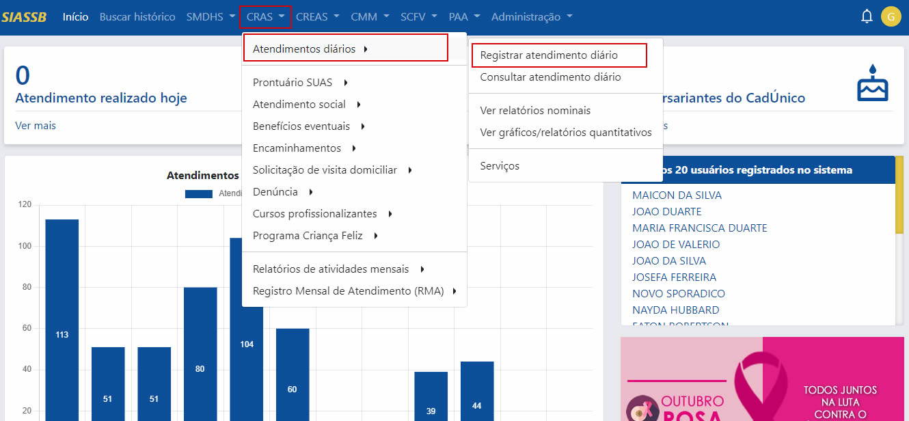
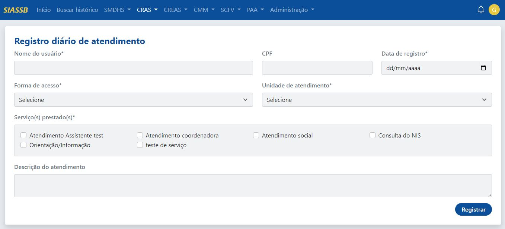
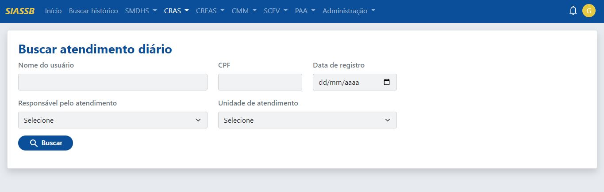
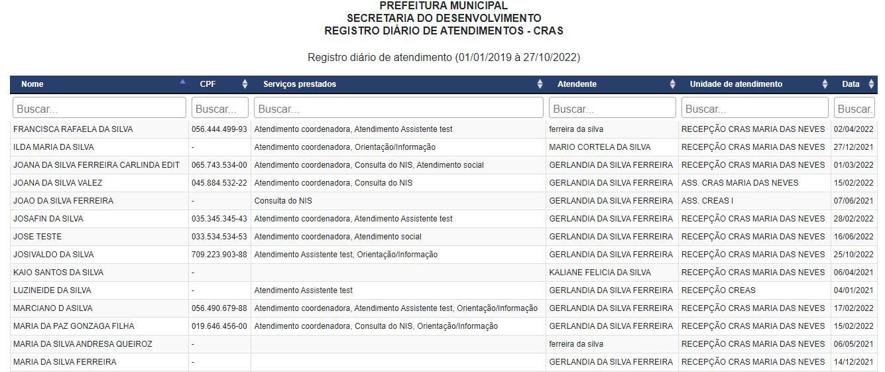
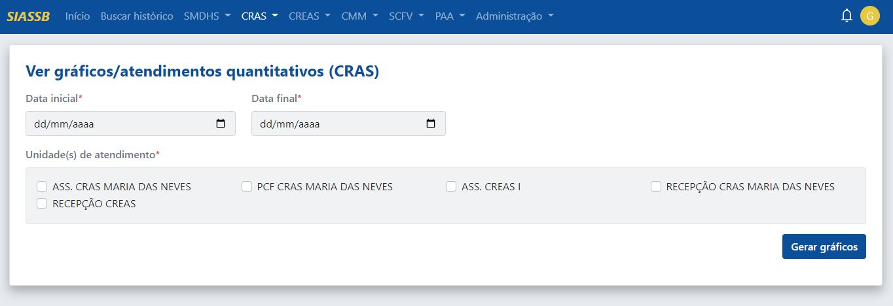
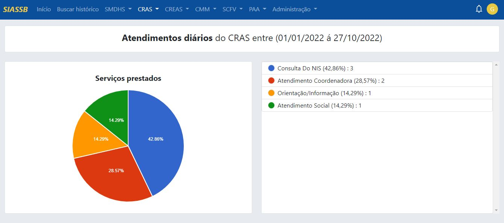
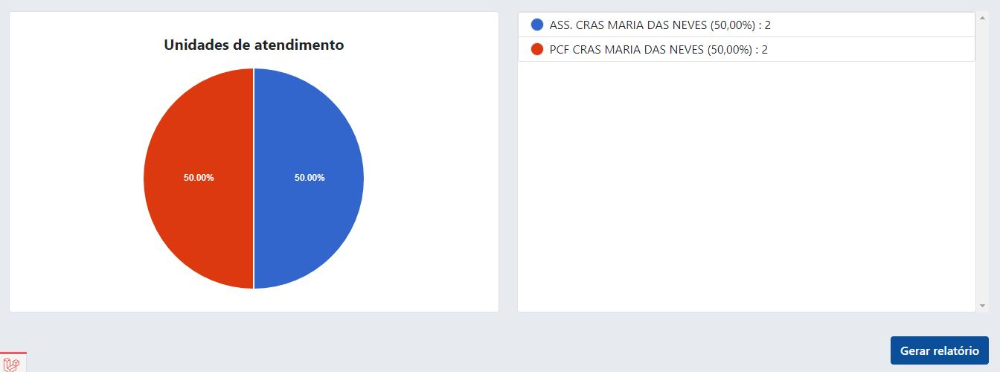
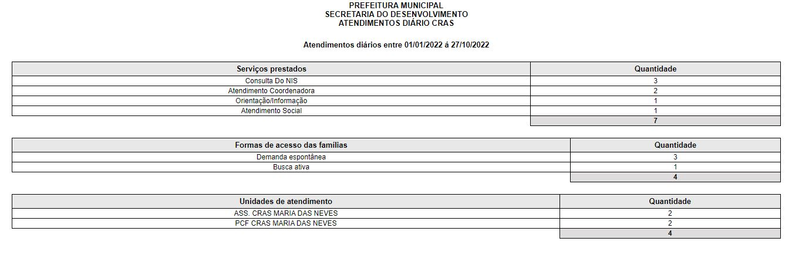

# Triagem do CRAS

O módulo de triagem do CRAS é usado para recepcionar os usuários que procuram a unidade, sejam por meio de demanda espontânea ou por outra forma de acesso, e será a principal ferramenta utilizada pelos profissionais da recepção dos CRAS.

O objetivo principal da triagem é agilizar o atendimento, fazendo com que os técnicos da assistência social ganhem tempo e os usuários ganhem qualidade durante sua passagem pelo equipamento. Isso ajuda na redução de filas de espera e na superlotação desses espaços.

## Registrando seu primerio atendimento diário

Após o processo de login no sistema, para registrar um atendimento na recepção, basta clicar na unidade CRAS -> Atendimentos diários -> Registrar atendimento diário, conforme a imagem abaixo:

Com isso, a recepcionista será redirecionada para a tela de registro diário de atendimentos.

O formulário de registro diário de atendimentos é composto pelos seguintes campos:

- **Nome do usuário** (Deve ser informado o nome completo do usuário)
- **CPF** do usuário (É através do preenchimento do campo CPF que é gerada uma linha do tempo, onde fica registrado um histórico completo do usuário)
- **Data de registro** (a data que está sendo realizado o atendimento)
- **Forma de acesso** (Como o usuário chegou até ao equipamento)
- **Unidade de atendimento** (Deve ser informada a recepção do CRAS)
- **Serviços prestados** (Pode ser selecionado mais de um)
- **Descrição do atendimento** (Uma observação que pode ser realizada pelo recepcionista)

:::caution Atenção
Os campos com * são obrigatórios
:::

## Consultar atendimento diário

Para identificar os atendimentos que foram registrados na recepção, siga os passos: CRAS -> Atendimentos diários -> Consultar atendimento diário

A busca pode ser realizada atráves do nome do usuário, CPF do usuário, Data de registro, Responsável pelo atendimento ou Unidade de atendimento.

:::tip Dica! O nome do usuário pode ser buscado por partes.
Por exemplo: imagina que a busca é para retornar o usuário MARIA FRANCISCA

Logo, no ato da busca basta digitar MARIA que o sistema vai retornar todas as Marias
:::

Realizada a busca, conforme as necessidades do profissional, será exibida uma tela com todos os registros encontrados.

Caso necessite ver mais dados de um registro em específico, basta clicar no ícone do olho, botão arendodado na cor azul;

## Ver atendimento diário

Clicado sobre o botão azul arredondado (ícone do olho) você será redirecionado para a aba de dados do atendimento, será apresentado o resumo do registro, inclusive, qual o profissional que registrou o atendimento. Nesta visualização, é possível acessar o registro completo da triagem.

## Editar atendimento diário

Na aba ao lado, existe a funcionalidade de editar os dados do atendimento diário, caso o profissional verificou que houve alguma inconsistência nos dados, os mesmos podem ser alterados nesta aba.

## Visualizando relatórios nominais

Os relatórios nominais nos dão a possibilidade de identificarmos quem foram os usuários que passaram pela triagem da recepção. Para isso, deve-se inserir uma data inicial e uma data final para obtermos o relatório de forma mais detalhada.

:::caution atenção
A data inicial sempre deve ser menor que a data final, recomendamos que o período selecionado seja de no máximo um ano!
:::

Com a selelação correta da data inicial e data final, os registros serão exibidos numa nova aba.

Assim, os registros realizados na triagem podem ser impressos, ou salvos no formato PDF.

## Visualizando gráficos

Os gráficos são um forma de visualizar os dados de uma forma quantitativa, para iniciar o processo de geração de gráficos, o acesso se dá através do CRAS -> Atendimentos diários -> Ver gráficos/relatórios quantitativos.

Para gerar gráficos, é necessário selecionar a data inicial e a data final, como também as unidades de atendimento, podendo ser selecionadas mais de uma unidade, por fim basta clicar em gerar gráficos, o modelo dos gráficos é do tipo pizza.

Além disso, existe o opção de gerar relatório analítico, basta clicar no botão azul chamado "gerar relatório", será exebido um relatório em formato de tabelas numa nova aba.

O mesmo pode ser impresso ou salvo no formato PDF.
