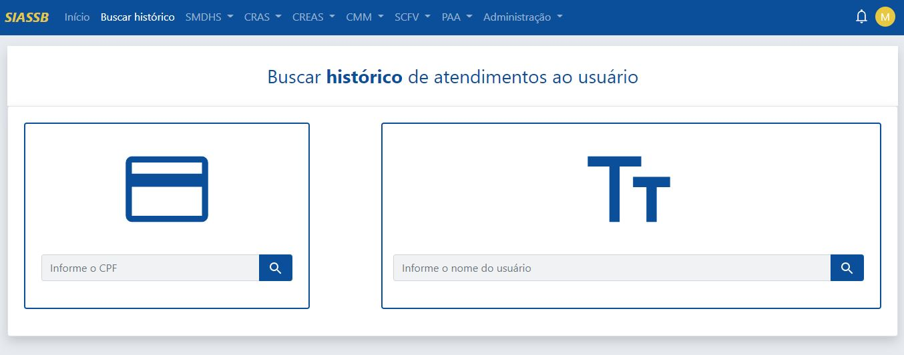
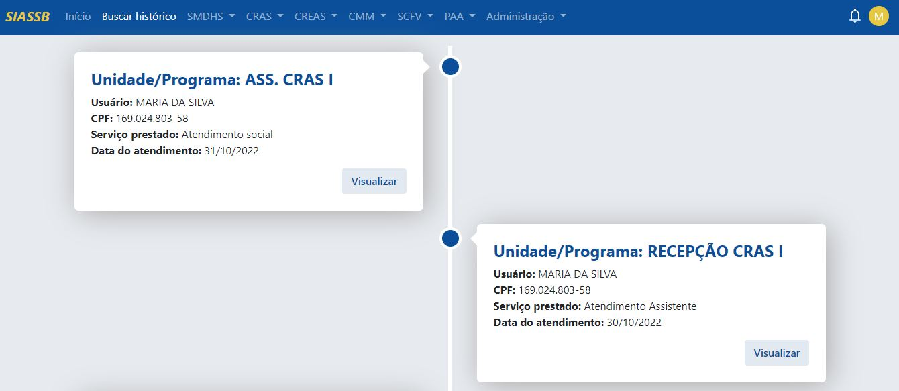
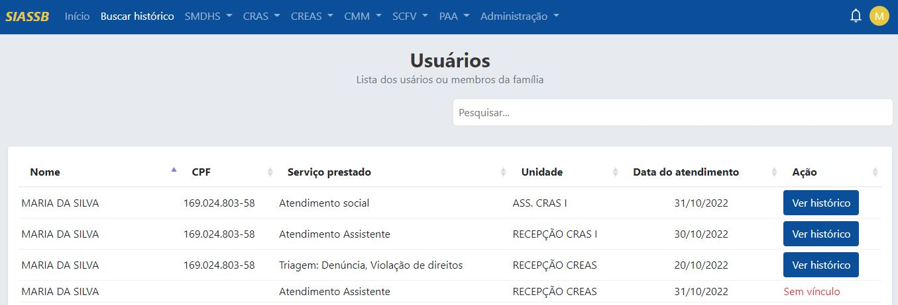

# Buscar histórico do usuário

## Introdução 

O histórico de atendimentos do usuário é um registro necessário para a padronização do atendimento. A partir das informações reunidas ao longo do tempo de interação, é possível observar as principais vulnerabilidades da família.

O compartilhamento do histórico entre todas as equipes técnicas é essencial para que a padronização possa se expandir para todos os setores. Assim, a secretaria de assistência social consegue fornecer um atendimento coerente, com padrões determinados na maioria dos processos.

Um histórico bem documentado traz informações valiosas, que podem ser utilizadas na tomada de decisões. Com os dados registrados, é possível avaliar quais são as principais necessidades daquele usuário em específico. As decisões são tomadas com mais precisão, pois são baseadas em evidências sólidas.

:::info Importante
Quando não existe esse histórico, os atendimentos ao usuário ficam "soltos" e sem um eixo para organizá-los, demandando um excesso de consultas ao sistema que poderia ser evitado.
:::

## Acessando o histórico

Para acessar o histórico do usuário, deve-se acessar o painel inicial do sistema e no topo da página clicar no menu **"Buscar histórico"**, assim o sistema irá exibir a seguinte tela.

Conforme a imagem acima, podem ser realizadas dois tipos de buscas:
- [`Buscar usuário pelo CPF`](#buscar-usuário-pelo-cpf)
- [`Buscar usuário pelo nome`](#buscar-usuário-pelo-nome)

## Buscar usuário pelo CPF

Ao realizar a busca pelo CPF do usuário e a pesquisa conseguiu retornar algum resultado, o sistema exibe uma linha do tempo (*timeline*) da data mais recente para a data mais antiga dos registros, mostrando que tipo de unidade o usuário frequentou, que tipo de serviço foi prestado e a data que foi realizado o atendimento, assim **unificando** todos os registros do usuário que procurou a secretaria de assistência social.

### Visualizar histórico de forma detalhada

Conforme a imagem acima, em cada bloco da linha do tempo, existe um botão chamado "Visualizar", clicando em visualizar, o técnico da unidade saberá como foi realizado aquele atendimento em específico e que informações foram declaradas.

Assim, com o acesso ao histórico de forma mais detalhda, facilitará o trabalho do técnico, ajudando na otimização de tarefas e proporcionando um melhor atendimento ao usuário final.

:::caution Atenção
A linha de tempo só é gerada para os usuários que possuem **CPF** registrado no sistema! É extremamente importante que os usuários no ato do atendimento estejam munidos deste documento, pois é através dele que é gerada a linha do tempo e a unificação dos dados do usuário.
:::

## Buscar usuário pelo nome

Ao realizar a busca pelo nome do usuário, o sistema exibe uma lista de registros, mostrando o nome do usuário, CPF, serviço prestado, data do atendimento e a ação de ver o histórico, conforme imagem abaixo.

Conforme a imagem acima, um dos registros da usuária MARIA DA SILVA não foi registrado com o seu número do CPF, portanto o registro não possue uma linha do tempo associada a este registro. Com isso, o registro é caracterizado "Sem vínculo" e não possui nenhuma unificação de dados.

Todos os outros registros que possuem um CPF associado, tem a sua disposição todo o histórico de atendimentos, assim melhorando a qualidade do atendimento.

:::tip Dica
A busca pelo nome do usuário pode ser realizada através de partes do seu nome. 

Por exemplo: ao buscar por MARIA DE LOURDES, e não foi encontrado nenhum resultado, a busca pode ser realizada apenas pelo nome MARIA, assim exibindo todas as MARIAS cadastradas no sistema, onde MARIA DE LOURDES poderia estar registrado no sistema como MARIA DE LURDES.
:::

:::danger Reforçando
É extremamente importante que os usuários no ato do atendimento estejam munidos do seu **CPF**, pois é através deste documento que é gerada a linha do tempo e a unificação dos dados do usuário. 
:::

A falta de documentação do histórico da jornada de usuários pode gerar decisões equivocadas. Cada interação com o usuário é uma fonte rica de informações e esses dados podem ser utilizados de forma estratégica.
