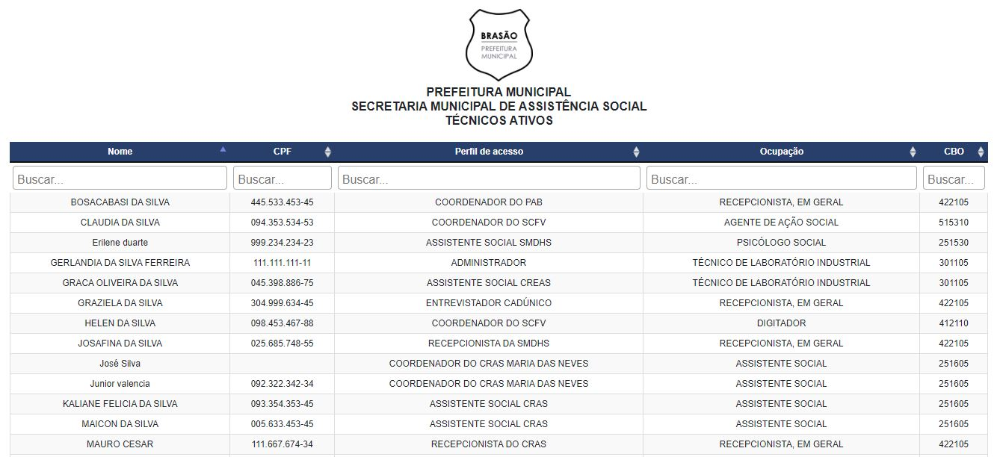

# Introdução

O SIASSB é um *software* que interliga as unidades de atendimento (também chamados de pontos de atendimento) da secretaria de assistência social.

:::info Importante
Os pontos de atendimento são espaços (cômodos) que pertencem a um determinado equipamento.

Exemplo: No CRAS existe a recepção e a sala dos assistentes socias, logo, são caracterizados como dois pontos de atendimento que podem ser chamados de **RECEPÇÃO CRAS** e **ASS. CRAS** (ASS - Assistência Social).
:::

O principal objetivo do sistema é organizar os dados de forma sistemática, como também melhorar a rotina de trabalho dos profissionais da assistência social. Além disso, o sistema registra informações referentes aos atendimentos dos usuários que buscam pelos serviços prestados na secretaria.

Os módulos disponíveis da aplicação são:

- **Buscar histórico**
- **Secretaria**
- **CRAS** (Centro de Referência de Assistência Social)
- **CREAS** (Centro de Referência Especializado de Assistência Social)
- **CMM** (Coordenadoria Municipal da Mulher)
- **SCFV** (Serviço de Convivência e Fortalecimento de Vínculos)
- **PAA** (Programa de Aquisição de Alimentos)
- **Administração**

:::caution Atenção
Os dados utilizados no manual do sistema, são **dados fictícios** utilizados apenas para fins de treinamento, em nenhum momento foram utilizados dados reais, sejam eles dados dos profissionais ou dados dos usuários.
:::

## Processo de login

Antes de acessar o sistema, é necessário realizar o cadastro prévio do profissional. O cadastro é realizado pelo Administrador do sistema.

:::info Importante
O Administrador do sistema é um tipo de perfil que tem acesso a todas as funcionalidades do sistema.
:::

O acesso ao sistema se dá única e exclusivamente por meio de **CPF** e **SENHA**. Estes são de seu uso pessoal e intransferível, devendo, portanto, o profissional tomar todas as medidas necessárias para manter em sigilo as referidas informações.

Antes de iniciarmos o processo de primeiro acesso ao sistema, é importante entendermos o conceito de [**autenticação**](#autenticação) e [**autorização**](#autorização). O uso destas duas técnicas nos proporciona uma maior segurança aos recursos do sistema.

### Autenticação

A autenticação verifica a identidade digital do profissional da assistência social, ou seja, é o processo de verificação de uma identidade. Em termos mais simples, é quando o profissional prova de fato quem ele é.

O sistema faz a primeira checagem através do CPF e a da senha do profissional.

:::info Importante
A senha do profissional é criptografada no banco de dados, trazendo ainda mais segurança ao processo de login.

Exemplo: se sua senha for **minhasenha0906** ela será criptografada e salva no banco de dados como **$tyOiuasY09%bm3Piury89+sdsdYT**, assim não tem como saber que sua senha é **minhasenha0906**.
:::

Desta forma, ao logar-se no sistema, o profissional está passando por um processo de autenticação. No entando, não é apenas este procedimento que autentica um profissional, além disso o sistema faz mais duas verificações, checa se o profissional está ativo e também se o horário de funcionamento da unidade condiz com o horário atual de login no sistema.

### Autorização

Por sua vez, a autorização é o processo que ocorre após ser validada a autenticação. Diz respeito aos privilégios que são concedidos a determinado profissional ao utilizar o sistema.

Serve para verificar se determinado profissional terá a permissão para utilizar, executar recursos ou manipular determinadas ações, que é de fundamental importância dentro do sistema.

Um exemplo que podemos atribuir a autorização é o uso do perfil de recepcionista.

Após realizar a autenticação no sistema, a recepcionista terá acesso apenas aos módulos correspondentes à realização de seu trabalho, como realizar triagem, buscar por usuário atendido na triagem, dentre outros processos.

## Primeiro acesso ao sistema

Após concluir os processos de autenticação e autorização, será realizado o primeiro acesso ao sistema, o profissional deve concordar com os termos de uso, primeiramente realizar toda a leitura do termo e depois clicar no botão "Li e concordo".

Após concordar com os termos de uso, o usuário será redirecionado para a tela inicial do sistema.

A tela inicial, também chamada de *Dashboard* ou Painel de controle é dividida nos seguintes blocos:

- Bloco 1 - [`Barra de navegação`](#barra-de-navegação)
- Bloco 2 - [`Atendimentos realizados hoje`](#atendimentos-realizados-hoje) 
- Bloco 3 - [`Técnicos ativos`](#técnicos-ativos) 
- Bloco 4 - [`Aniversariantes do CadÚnico`](#aniversariantes-do-cadúnico) 
- Bloco 5 - [`Gráficos de atendimentos realizados por mês`](#gráficos-de-atendimentos-realizados-por-mês) 
- Bloco 6 - [`Úlmitos usuários registrados no sistema`](#úlmitos-20-usuários-registrados-no-sistema) 
- Bloco 7 - [`Campanhas de conscientização`](#campanhas-de-conscientização) 

### Barra de navegação

A barra de navegação está localizada na parte superior da aplicação, e nela constam as unidades de atendimento que o usuário tem acesso. No lado esquerdo estão a logo do sistema e os módulos de acesso, já no lado direito estão o ícone de notificações e o avatar representado pela primeira letra do nome do profissional.

:::info Importante
Dependendo do nível de acesso, o profissional pode estar registrado em mais de uma unidade de atendimento, podendo acumular diversas permissões de acesso.
:::

### Atendimentos realizados hoje

Neste bloco, são mostrados todos os atendimentos realizados em toda rede socioassistêncial. Caso deseje ver todos os atendimentos do dia de forma mais específica, basta clicar em cima do bloco.

Clicando no bloco, você será redirecionado para a tela de relatórios nominais e relatórios quantitativos, conforme imagem abaixo.

Perceba que além dos atendimentos do dia, podem ser exibidos atendimentos do mês e do ano atual.

Na seção relatórios nominais, clicando em "Atendimentos realizados hoje", será aberta uma nova aba em seu navegador, mostrando todos os atendimentos do dia de forma nomeada.

Já na seção Relatórios quantitativos/Gráficos, clicando em "Atendimentos realizados hoje", a página será redirecionada para o bloco de gráficos, mostrando todos os atendimentos do dia de forma gráfica.

### Técnicos ativos

Neste bloco, são exibidos todos os técnicos que possuem vínculo ativo com a secretaria, os técnicos são os profissionais que realizam atendimentos mais específicos dentro da rede socioassistêncial.

Clicando no bloco "Técnicos ativos", será aberta uma nova aba com a realação de todos os técnicos, conforme a imagem abaixo.

Os dados que são exibidos na tela são:

- Nome (Nome completo do profissional)
- CPF (Documento único e obrigatório que referencia o técnico)
- Perfil de acesso (É o perfil que lhe concede acesso as funcionalidades do sistema)
- Ocupação (É o tipo de ocupação do técnico conforme os códigos das ocupações CBO's)
- CBO (Código CBO, conforme a Classificação Brasileira de Ocupações)

### Aniversariantes do CadÚnico

Como uma forma de fidelizar o usuário que acessa os programas da asssistência social, foi criada a funcionalidade de aniversariantes do CadÚnico, para que este recurso funcione corretamente é necessário que o administrador do sistema realize a importação da base de dados do CadÚnico do seu município.

:::info Importante
A base de dados do CadÚnico de seu município é obtida através do portal CECAD
:::

Ao clicar no bloco de Aniversariantes do CadÚnico, será aberta uma nova aba com todos os aniversariantes (responsáveis familiares) do dia que pertencem ao seu município.

Todo os registros listados possuem o número do telefone declarado pelo responsável familiar no ato da inclusão/atualização cadastral, com isso o técnico da assistência tem a possibilidade de entrar em contato com o aniversariante e parabenizá-lo(a) por essa data que é muito importante em sua vida. Caso o profissional tenha acesso ao sistema do Cadastro Único, poderá abrir um diálogo com o aniversariante, verificando como está a situação cadastral, se a família está passando por algum dificuldade ou não.

### Gráficos de atendimentos realizados por mês

É mostrado um grafico de barras, exibindo todos os atendimentos realizados durantes todos os meses do ano atual. Os atendimentos são referentes a toda rede socioassistêncial.

O gráfico é atualizado em tempo real, todo novo atendimento realizado altera os dados do gráfico, além disso é uma importante ferramenta de análise e para futuras tomadas de decisões por parte do gestor municipal.

### Úlmitos 20 usuários registrados no sistema

Clicando no bloco dos últimos usuários registrados, haverá um redirecionamento para os últimos atendimentos, conforme a imagem abaixo:

É mostrado um resumo de cada atendimento realizado, onde:

- **Usuário** (é o nome completo do usuário que foi atendido)
- **CPF** (documento do usuário que foi atendido)
- **Unidade de atendimento** (local onde foi realizado o atendimento)
- **Serviço prestado** (Serviços prestados durante o atendimento, podendo ser mais de um)
- **Responsável pelo cadastramento** (profissional que registrou o atendimento no sistema)
- **Data do atendimento** (data que foi realizado o atendimento)
- **Registrado no sistema em** (carimbo ou data registrada de forma automática pelo sistema)

:::note Nota
Se o atendimento foi realizado manualmente via papel e foi inserido no sistema em uma data posterior, deve ser inserida a data que consta no papel, este tipo de atendimento é caracterizado como um **atendimento tárdio**.
:::

### Campanhas de conscientização

As campanhas de conscientização são um conjunto de ações na promoção de apoio a iniciativas de solidariedade e de promoção à vida. Tem como objetivo promover a vida, despertando a consciência sobre o cuidado com a saúde do corpo e da “casa comum” que é o planeta terra. Conforme o mês, o sistema exibe as seguintes campanhas:

- **Janeiro branco** (quem cuida da mente, cuida da vida)
- **Fevereiro roxo** (todos juntos na luta contra o lúpus, fibromialgia e mal de alzheimer)
- **Março lilás** (todos juntos na luta contra o câncer do colo do útero)
- **Abril azul** (todos a favor da conscientização do autismo)
- **Maio laranja** (todos juntos contra o abuso e a exploração sexual de crianças e adolescentes)
- **Junho violeta** (todos juntos na luta contra a violência a pessoa idosa)
- **Julho ECA (todos** juntos a favor do estátuto da criança e do adolescente)
- **Agosto lilás** (todos juntos na luta contra a violência contra a mulher)
- **Setembro verde** (todos juntos na inclusão social de pessoas com deficiência)
- **Outubro rosa** (todos juntos na luta contra o câncer de mama)
- **Novembro azul** (todos juntos na luta contra o câncer de prostota)
- **Dezembro PNA** (todos a favor da política nacional de assistência social)

## Recuperar senha de acesso

Se por algum motivo, o profissional não conseguir logar no sistema com as suas credenciais de acesso, existem duas formas de recuperar a senha, são elas:

1. O próprio usuário [recupera e redefine uma nova senha](#1ª-forma-de-recuperar-a-senha)
2. O administrador do sistema [cria uma nova senha de acesso temporário](#2ª-forma-de-recuperar-a-senha)

### 1ª Forma de recuperar a senha

Caso o profisisonal tenha esquecido a senha de acesso, poderá solicitar uma nova senha, clicando no link "Esqueci minha senha", será enviado um e-email, conforme o e-mail cadastrado que está associado a sua conta de acesso ao sistema. Recomendados o cadastro de e-mails confiáveis como o *gmail* (serviço gratuito de webmail criado pela Google) ou através do *outlook* (serviço gratuito de webmail criado pela Microsoft).

:::caution Atenção
Caso o e-mail não tenha "chegado" na sua caixa de entrada, é importante sempre verificar a **caixa de spam**.
:::

### 2ª Forma de recuperar a senha

Caso a primeira forma de recuperar a senha não funcione, o profissional deverá entrar em contato com o administrador do sistema e solicitar a criação de uma nova senha de acesso temporário.

O administrador, vai entrar com sua conta e ir em **Administração -> Gerenciamento de usuários -> Usuários**

O próximo passo é selecionar o registro do profissional que deseja redefinir a senha, ir até o final da linha, clicar no ícone dos 3 pontinhos (mais opções) -> Redefinir senha.

:::danger Atenção
Fique atento para não redefinir a senha de outro profissional, pois o processo é **irreversível**, caso seja redefinida a senha de outro profissional, deverá entrar em contato com o mesmo urgentemente, informando a nova senha que foi gerada!
:::

Ao clicar na opção "Redefinir senha", será exibida uma janela modal para confirmação da ação.

:::caution Importante
Por questões de segurança, todas as senhas redefinidas são diferentes, únicas e exclusivas para cada profissional. A senha gerada é de acesso temporário, recomendamos fortemente que o profissional **altere essa senha**, além disso, também recomendamos que o profissional modifique a sua senha a cada 6 meses.
:::
