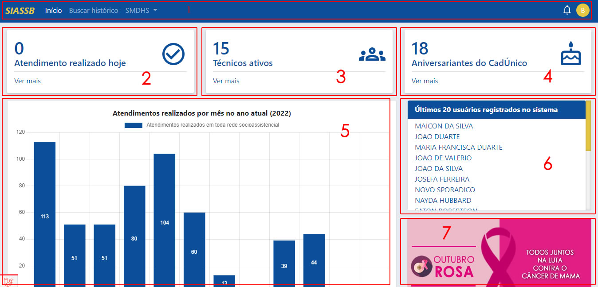

# Introdução

O SIASSB é um software que se comunica entre setores da secretaria de assistência social, agilizando os processos internos, melhorando a interação entre os profissionais, assim trazendo mais qualidade no atendimento final ao público em geral. Os módulos disponíveis da aplicação são:

- **Buscar histórico**
- **Secretaria**
- **CRAS** (Centro de Referência de Assistência Social)
- **CREAS** (Centro de Referência Especializado de Assistência Social)
- **CMM** (Coordenadoria Municipal da Mulher)
- **SCFV** (Serviço de Convivência e Fortalecimento de Vínculos)
- **PAA** (Programa de Aquisição de Alimentos)
- **Administração**

:::info Importante
Os dados utilizados e mostrados no manual do sistema, são dados fictícios utilizados apenas para fins de treinamento.
:::

## Acesso ao sistema

Antes de acessar o sistema, é necessário realizar o cadastro prévio do usuário. O cadastro é realizado pelo Administrador do sistema.

O acesso ao sistema se dá única e exclusivamente por meio de **CPF** e **SENHA**. Estes são de seu uso pessoal e intransferível, devendo, portanto, o usuário do sistema tomar todas as medidas necessárias para manter em sigilo as referidas informações.

## Recuperar senha de acesso

Existem duas formas de recuperar a senha de acesso:

1. O próprio usuário recupera e redefine uma nova senha
2. O administrador do sistema cria uma nova senha de acesso temporário

### 1ª Forma de recuperar a senha

Caso o usuário tenha esquecido a senha de acesso, poderá solicitar uma nova senha, clicando no link "Esqueci minha senha", será enviado um e-email, conforme o e-mail cadastrado que está associado a sua conta de acesso ao sistema. Recomendados o cadastro de e-mails confiáveis como o *gmail* ou o *outlook*.

:::caution Atenção
Caso o e-mail não tenha chegado na sua caixa de entrada, é importante verificar a **caixa de spam**.
:::

### 2ª Forma de recuperar a senha

Caso a primeira forma de recuperar a senha não funcione, o usuário deverá entrar em contato com o administrador do sistema e solicitar a criação de uma nova senha de acesso temporário.

O administrador, vai entrar com sua conta e ir em Administração -> Gerenciamento de usuários -> Usuários

Depois vai na linha do usuário que deseje redefinir a senha e vai até o final da linha, clica nos 3 pontinhos (mais opções) -> Redefinir senha

:::caution Atenção
Fique atento para não redefinir a senha de outro usuário, pois o processo é irreversível, caso seja redefinida a senha de outro usuário, deverá entrar em contato com o mesmo, informando a nova senha que foi gerada!
:::

Ao clicar na opção "Redefinir senha", será exibida uma janela modal para confirmação da ação.

:::info Importante
Por questões de segurança, todas as senhas redefinidas são diferentes, únicas e exclusivas para cada usuário. A senha gerada é de acesso temporário, recomendamos fortemente que o usuário altere essa senha, além disso, também recomendamos que o usuário altere a sua senha de acesso a cada 6 meses.
:::

## Primeiro acesso ao sistema

Ao realizar o primeiro acesso ao sistema, o usuário deve concordar com os termos de uso, primeiramente fazendo toda a leitura do termo e depois clicar em "Li e concordo".

Após concordar com os termos de uso, o usuário será redirecionado para a tela inicial do sistema.

A tela inicial, também chamada de *Dashboard* ou Painel de controle é divida nos seguintes blocos:

- Bloco 1 - [`Barra de navegação`](#barra-de-navegação)
- Bloco 2 - [`Atendimentos realizados hoje`](#atendimentos-realizados-hoje) 
- Bloco 3 - [`Técnicos ativos`](#técnicos-ativos) 
- Bloco 4 - [`Aniversariantes do CadÚnico`](#aniversariantes-do-cadúnico) 
- Bloco 5 - [`Gráficos de atendimentos realizados por mês`](#gráficos-de-atendimentos-realizados-por-mês) 
- Bloco 6 - [`Úlmitos 20 usuários registrados no sistema`](#úlmitos-20-usuários-registrados-no-sistema) 
- Bloco 7 - [`Campanhas de conscientização`](#campanhas-de-conscientização) 

### Barra de navegação

A barra de navegação está localiza na parte superior da aplicação, e nela constam as unidades que o usuário tem acesso. No lado esquerdo estão a logo do sistema, e os menus de acesso, já no lado direito estão o ícone de notificações (importante para o recebimento de encaminhamentos), e o avatar que possui informações relacionadas ao seus dados pessoais e de acesso ao sistema.

:::info Importante
O sistema possui a funcionalidade de permissões de acesso, conforme o perfil do usuário, ele tem acesso a determinadas funcionalidades. Exemplo: o perfil de recepcionista, só pode ter acesso a sua unidade e funcionalidades relacionadas a recepção.

Dependendo do usuário, o mesmo pode estar registrado em mais de uma unidade de atendimento, podendo acumular diversas permissões de acesso.
:::

### Atendimentos realizados hoje

Neste bloco, são mostrados todos os atendimentos realizados em toda rede socioassistêncial. Caso deseje ver todos os atendimentos do dia de forma mais específica, basta clicar em cima do bloco.

Clicando no bloco, você será redirecionado para a tela de relatórios nominais e relatórios quantitativos, conforme imagem abaixo.

Perceba que além dos atendimentos do dia, podem ser exibidos atendimentos do mês e do ano atual.

Na seção relatórios nominais, clicando em "Atendimentos realizados hoje", será aberta uma nova aba em seu navegador, mostrando todos os atendimentos do dia de forma nomeada.

Já na seção Relatórios quantitativos/Gráficos, clicando em "Atendimentos realizados hoje", a página será redirecionada para o bloco de gráficos, mostrando todos os atendimentos do dia de forma gráfica.

### Técnicos ativos

Neste bloco, são exibidos todos os técnicos que possuem vínculo ativo com a secretaria, os técnicos são os profissionais que realizam atendimentos mais específicos dentro da rede socioassistêncial.

Clicando no bloco "Técnicos ativos", será aberta uma nova aba com a realação de todos os técnicos, conforme a imagem abaixo.

Os dados que são exebidos na tabela são:

- Nome (Nome completo do profissional)
- CPF (Documento único e obrigatório que referencia o técnico)
- Perfil de acesso (É o perfil que lhe concede acesso as funcionalidades do sistema)
- Ocupação (É o tipo de ocupação do técnico conforme os códigos das ocupações CBO's)
- CBO (Código CBO, conforme a Classificação Brasileira de Ocupações)

### Aniversariantes do CadÚnico

Como uma forma de fidelizar o usuário que acessa os programas da asssistência social, foi criada a funcionalidade de aniversariantes do CadÚnico, para que este recurso funcione é necessário que o administrador realize a importação da base de dados do CadÚnico do seu município.

:::info Importante
A base de dados do Cadúnico de seu município é obtida através do portal CECAD
:::

Ao clicar no bloco de Aniversariantes do CadÚnico, será aberta uma nova aba com todos os aniversariantes (responsável familiar) do dia que pertencem ao seu município.

Todo os registros listados possuem o número do telefone do responsável familiar pelo cadastro, com isso o técnico da assistência tem a possibilidade de entrar em contato com o usuário aniversariante e parabenizá-lo(a) por essa data que é muito importante em sua vida. Caso o profissional tenha acesso ao sistema do Cadastro Único, o mesmo pode verificar como está a situação e já notificar ao aniversariante se precisar realizar uma nova atualização ou não.

### Gráficos de atendimentos realizados por mês

É mostrado um grafico de barras, exibindo todos os atendimentos realizados durantes todos os meses do ano atual. Os atendimentos são referentes a toda rede socioassistêncial.

O gráfico é atualizado em tempo real, todo novo atendimento realizado altera os dados do gráfico, além disso é uma importante ferramenta de análise e para tomadas de decisões por parte do gestor municipal.

### Úlmitos 20 usuários registrados no sistema

Clicando no bloco dos últimos 20 usuários registrados, haverá um redirecionamento para os últimos registros, conforme a imagem abaixo:

É mostrado um resumo de cada atendimento realizado, onde:

- **Usuário** (é o nome do usuário que foi atendido)
- **CPF** (documento do usuário que foi atendido)
- **Unidade de atendimento** (local onde foi realizado o atendimento)
- **Serviço prestado** (Serviços prestado duranto o atendimento, podendo ser mais de um)
- **Responsável pelo cadastramento** (profissional responsável por registrar o atendimento no sistema)
- **Data do atendimento** (data que foi realizado o atendimento, se o atendimento foi realizado manualmente via papel e foi inserido no sistema em uma data posterior, deve ser inserida a data que consta no papel)
- **Registrado no sistema em** (carimbo ou data registrada de forma automática pelo sistema)

### Campanhas de conscientização

As campanhas de conscientização são o conjunto de ações na promoção de apoio a iniciativas de solidariedade e de promoção à vida. Tem como objetivo promover a vida, despertando a consciência sobre o cuidado com a saúde do corpo e da “casa comum” que é o planeta terra. Conforme o mês, o sistema exibe as seguintes campanhas:

- **Janeiro branco** (quem cuida da mente, cuida da vida)
- **Fevereiro roxo** (todos juntos na luta contra o lúpus, fibromialgia e mal de alzheimer)
- **Março lilás** (todos juntos na luta contra o câncer do colo do útero)
- **Abril azul** (todos a favor da conscientização do autismo)
- **Maio laranja** (todos juntos contra o abuso e a exploração sexual de crianças e adolescentes)
- **Junho violeta** (todos juntos na luta contra a violência a pessoa idosa)
- **Julho ECA (todos** juntos a favor do estátuto da criança e do adolescente)
- **Agosto lilás** (todos juntos na luta contra a violência contra a mulher)
- **Setembro verde** (todos juntos na inclusão social de pessoas com deficiência)
- **Outubro rosa** (todos juntos na luta contra o câncer de mama)
- **Novembro azul** (todos juntos na luta contra o câncer de prostota)
- **Dezembro PNA** (todos a favor da política nacional de assistência social)
