# Benefícios eventuais

Os benefícios eventuais são de caráter suplementar e provisório, prestados aos cidadãos e às
famílias em virtude de nascimento, morte, situações de vulnerabilidade temporária e de calamidade pública.

Dentre as funcionalidades no sistema, podemos citar:

- [Cadastro da família](#cadastrar-nova-família)
- Edição de dados
- Concessão de novo benefício eventual
- Prorrogar concessão de benefícios
- Remover prorrogação de benefícios
- Anexar arquivos
- Histórico de concessões
- Editar endereço
- Cadastrar nova pessoa
- Ver composição familiar
- Imprimir folha resumo
- Imprimir relatório social

## Cadastrar nova família

Para registrar um novo benefício eventual, deve-se ir em **Secretaria -> Benefícios eventuais -> Cadastrar família**, a seguinte tela será exibida.

O cadastro da família para a concessão de um novo benefício eventual é dividido em 3 blocos:

1. [Identificação e controle](#identificação-e-controle)
2. [Membros da família](#membros-da-família)
3. [Anexos](#anexos)

### Identificação e controle

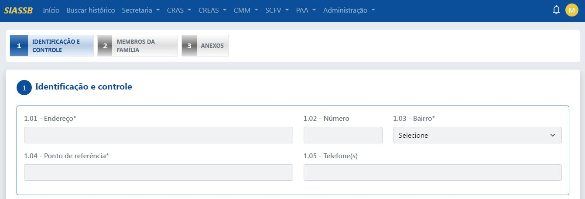
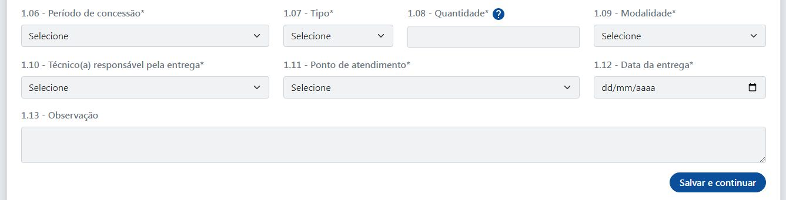

Os seguintes campos serão apresentados:

- Endereço
- Número
- Bairro
- Ponto de referência
- Telefone(s)
- Período de concessão
- Tipo
- Quantidade (quantidade de benefícios eventuais a serem concedidos no ato do cadastro)
- Modalidade
- Técnico responsável pela entrega
- Ponto de atendimento
- Data de entrega
- Observação

No sub-bloco de endereço serão informados dados relacionados ao endereço da família. Com relação ao campo número, caso o domicílio informado não possua número, o profissional pode informar o texto "S/N", "SN" ou deixar o campo em branco.

:::caution Importante 
Caso a família possua mais de um telefone para contato, os mesmos podem ser informados no mesmo campo. 
:::

Já no sub-bloco de identificação serão informadas dados relacionados ao responsável pela unidade familiar.

:::caution Atenção
Fique atento ao campo quantidade, a quantiade é o total de benefícios que serão concedidos no ato do cadastro da família, já o período de concessão é todo o período que a família será contemplada com os benefícos eventuais.
:::

Preenchido todos os campos, clicar no botão "Salvar e continuar" e prosseguir para o próximo bloco.

### Membros da família

O bloco de membros da família é dividido em dois sub-blocos:

- Cadastrar nova pessoa
- Membros da família

#### Cadastrar pessoa

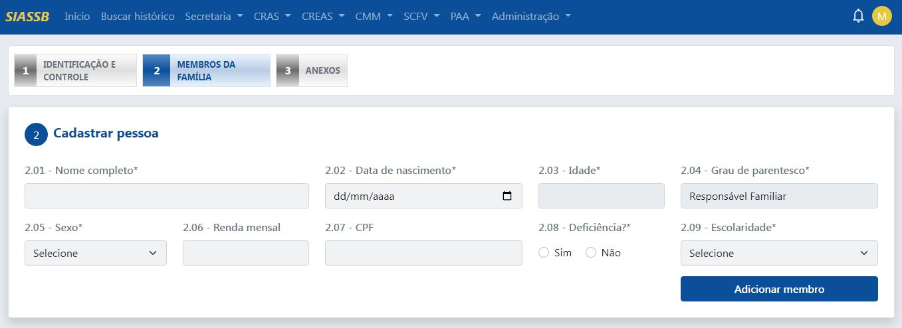

Ao preencher o campo data de nascimento, automaticamente o sistema calcula a quantidade de anos da pessoa.

:::caution Atenção 
O campo de renda mensal deve ser preenchido apenas com valores inteiros, caso a pessoa não possua renda, é recomendado inserir o valor 0 ou deixar o campo em branco. 
:::

#### Lista de membros da família

Após a inclusão do primeiro membro da família, o bloco da lista de membros será exibido.

No sub-bloco de membros da família, serão listados todos os dados dos membros da família. Onde será possível realizações as operações de visualizar, alterar e excluir os dados dos membros da família.

Clicando no ícone do "olho", será aberta uma janela modal, onde você poderá visualizar os dados da pessoa em específico, conforme a imagem abaixo.

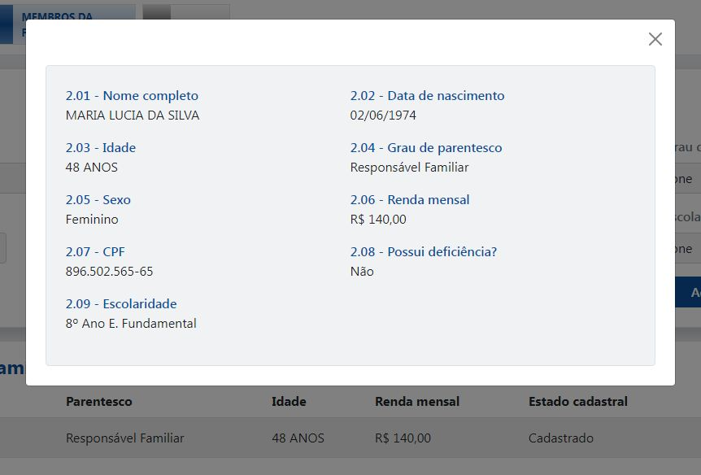

Clicando no ícone do lapís, será aberta uma janela modal onde você poderá editar os dados da pessoa em específico, conforme a imagem abaixo.

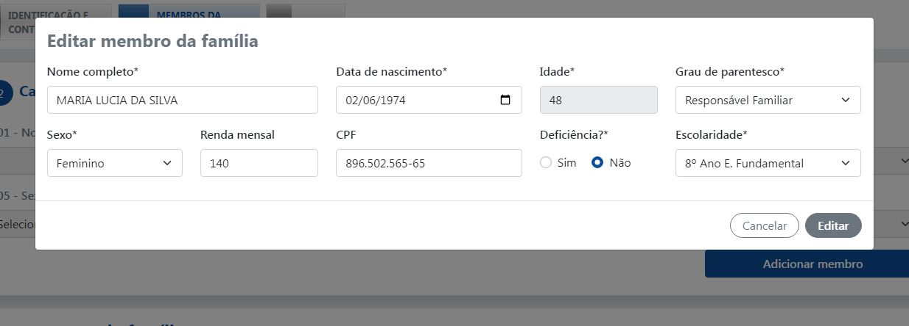

:::caution Atenção 
Sempre atentar para a renda mensal, utilizar apenas números inteiros, caso não possua renda preencher com valor 0 ou deixar em branco. 
:::

Clicando no ícone da lixeira, será aberta uma janela modal, onde você poderá excluir uma pessoa da família, conforme a imagem abaixo.

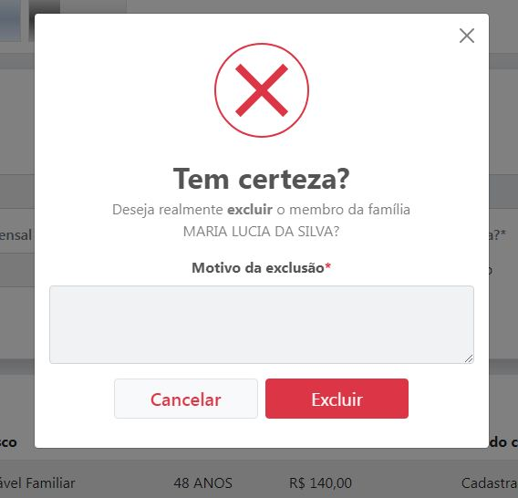

Para realizar a exclusão de uma pessoa, é obrigatório informar o motivo.

Realizada a exclusão da pessoa, os dados ainda podem ser visualizados, para isso basta ir no registro da pessoa que foi excluída, ir na coluna Estado cadastral e clicar em "EXCLUÍDO", irá ser aberta uma janela modal informando o motivo da exclusão, data e quem excluiu.

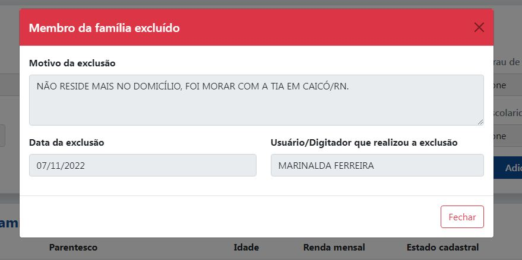

Realizada a inclusão de todos os membros da família, o próximo passo é prosseguir para o bloco de Anexos, basta clicar no botão "Continuar".

#### Anexos

Neste bloco devem ser anexados os documentos da família, veja na imagem abaixo.

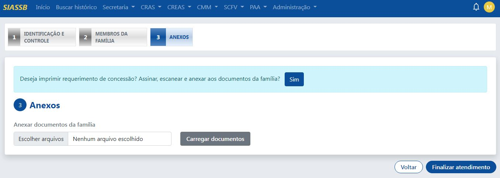

Antes de iniciar o processo de anexo de documentos, recomendamos que a documentação seja escaneada e convertida para o formato PDF.

Com toda a documentação no formato PDF, basta clicar em escolher arquivos e depois clicar no botão "Carregar documentos".

:::caution Atenção 
A funcionalidade de anexar documentos não é obrigatória! Caso o técnico observou que não há a necessidade de anexar documentos da família, deve ignorar este campo.
:::

Por fim, basta clicar no botão "Finalizar atendimento" que o sistema irá redirecionar para a seguinte página.

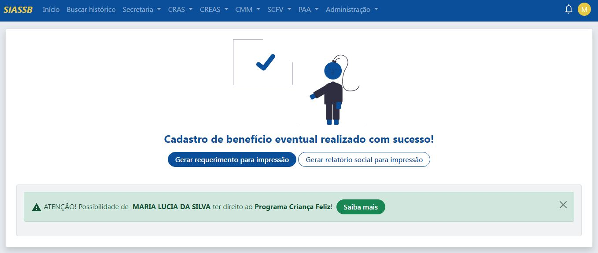

Com isso, o atendimento foi finalizado com sucesso e o assistente social, poderá realizar a impressão do relatório social ou do requerimento para concessão do benefício eventual. Além disso o sistema exibe alertas sobre a possibilidade da família que foi atendida ter direito a outros benefícios sociais.

##### Gerando relatório social

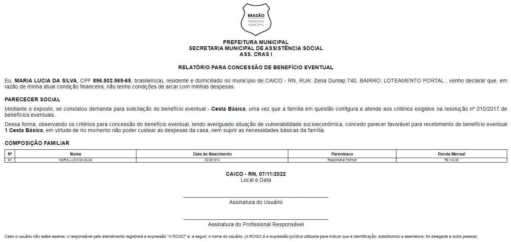

##### Gerando requerimento

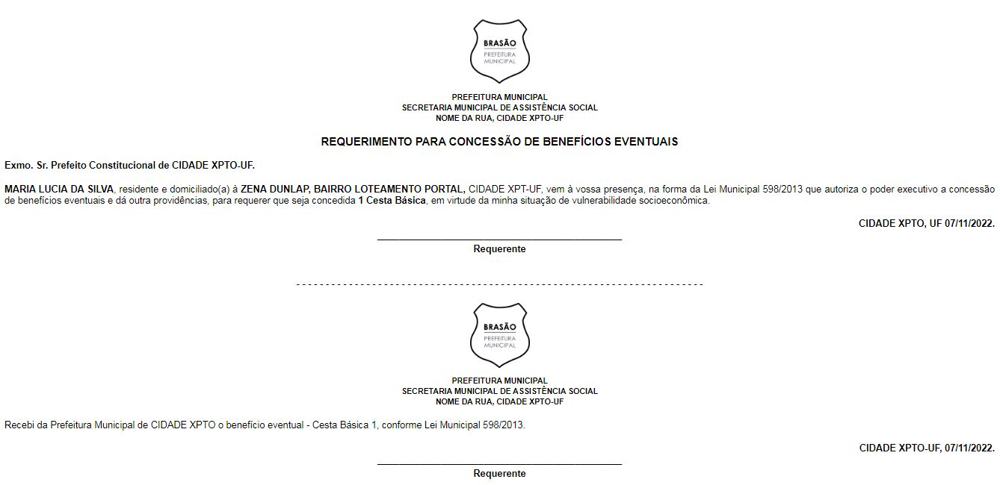

## Buscar família

Para buscar por um benefício eventual, deve-se ir em **Secretaria -> Benefícios eventuais -> Buscar família**, a seguinte tela será exibida.

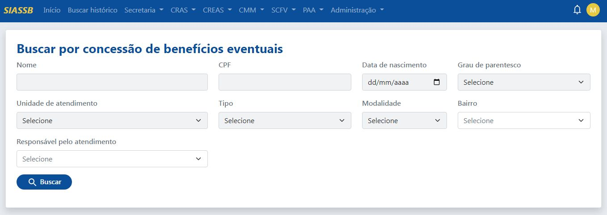

A busca pode ser realizada pelo nome do usuário, CPF, data de nascimento, grau de parentesco, unidade de atendimento, tipo, modalidade, bairro ou responsável pelo atendimento.

:::tip Dica 
O nome do usuário pode ser pesquisado em partes, ou seja, no lugar de digitar MARIA DA SILVA, pode ser digitado apenas MARIA que o sistema vai encontrar todas as MARIA's e retornar o resultado. 
:::

:::note Nota 
Não é necessário realizar a busca por todos os campos, basta preencher um determinado campo que o sistema faz a busca normalmente. 
:::

Ao clicar no botão de buscar e a pesquisa encontrar algum resultado conforme os parâmetros informados, o sistema vai exibir a seguinte página:

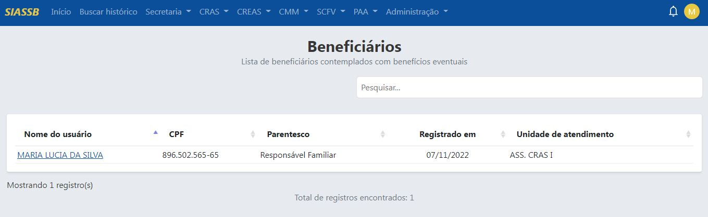

A busca acima realizada foi utilizando o parâmetro nome (MARIA). É mostrada uma tabela com as seguintes colunas:

- Nome do usuário
- CPF
- Grau de parentesco
- Regitrado em
- Unidade de atendimento

### Abas de acesso

Conforme imagem acima, ao clicar no nome do usuário, você será redirecionado para a tela mostrada abaixo:

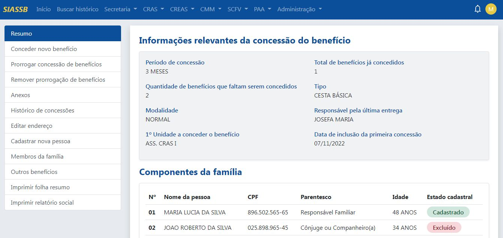

A Página é dividida em 12 abas:

1. Resumo
2. Conceder novo benefício
3. Prorrogar concessão de benefícios
4. Remover progragação de benefícios
5. Anexos
6. Histórico de concess~es
7. Editar endereço
8. Cadastrar nova pessoa
9. Membros da família
10. Outros benefícios
11. Imprimir folha resumo
12. Imprimir relatório social

#### Aba resumo

Na aba resumo constam informações relevantes da concessão do benefício e dados relacionados a composição familiar.

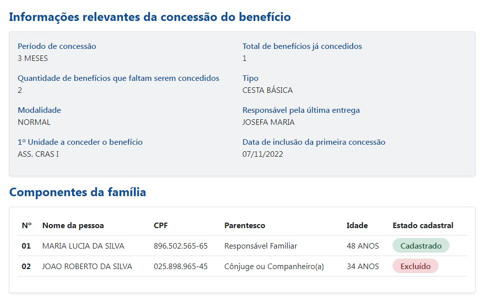

#### Aba conceder novo benefício

Quando o assistente social for conceder um novo benefício eventual para a família, deve-se utilizar esta aba, mas antes deve conferir se a família está apta a receber, na aba resumo existe um campo chamado quantidade de benefícios que faltam serem concedidos, se o valor for marcado com 0, é porque a família não está apta a receber mais benefícios eventuais, caso contrário a família poderá ser contemplada com novos benefícios.

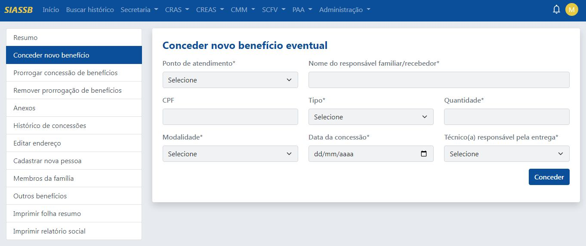

:::caution Atenção
Os campo marcados com * são de preenchimento obrigatórios.
:::

:::info Importante
Fique atento ao campo "Nome do responsável familiar/recebedor*", caso quem esteja recebendo o benefício não seja o responsável familiar, o mesmo deve ser informado neste campo.
:::

Após o preenchimento de todos os campos, basta clicar no botão "Conceder".

#### Aba prorrogar concessão de benefícios

Conforme a observação realizada pelo assistente social, se houver a necessidade de prorrogar o período de concessão do benefício eventual, o mesmo pode ser estendido por até 48 meses.

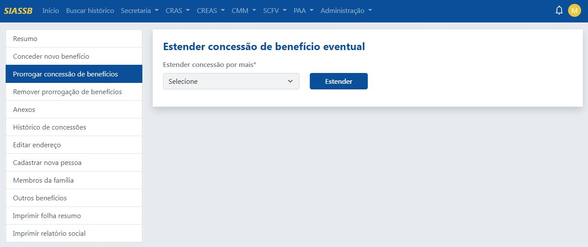

:::caution Atenção
O benefício eventual não pode ser caracterizado por um benefício concedido por tempo indeterminado. 
:::

Após a seleção da quantidade de meses, basta clicar no botão "Estender".

#### Aba remover prorrogação de benefícios

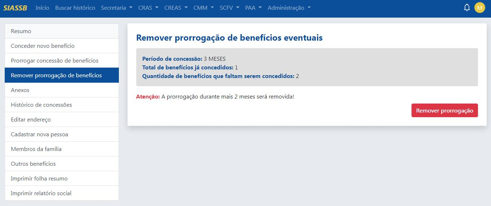

Conforme o exemplo mostrado acima, a família está apta a receber os benefícios eventuais durante 3 meses, onde foi concedido 1 benefício e ainda faltam serem concedidos mais 2 benefícios.

:::danger Muito cuidado
Ao remover a prorrogação de benefícios, automaticamente a família terá o seu cadastro "Desligado" e não estará mais apta a receber benefícios eventuais! Essa operação e irreversível!
:::

Feita a operação de remoção e caso queira continuar concedendo novos benefícios, deve ir na aba [prorrogar concessão de benefícios](#aba-prorrogar-concessão-de-benefícios).

#### Aba anexos

O processo de anexo dos documentos da família deve ser seguido, corforme o [bloco de anexos](#anexos).

#### Aba histórico de concessões

Na aba de histórico de concessões, o assistente social poderá visualizar os seguintes dados:

- Nome do rebedor (podendo ser o responsável familiar ou não)
- Unidade do programa (ponto de atendimento)
- Tipo (cesta básica, auxílio natalidade, aluguel social, ajuda financeira, auxílio funeral, auxílio passagem, item/kit específico para enfretamento de situações de emergência, outros)
- Qtd. (total de benefícios concedidos no dia do atendimento)
- Técnico responsável pela entrega (assistente social)
- Data (data da concessão no formato dd/mm/aaaa)
- Ações (ver requerimento e editar dados do histórico)

##### Ver requerimento

Clicando no ícone da folha de papel (ver requerimento), o sistema irá abrir uma nova página, sendo o mesmo requerimento mostrado [nessa página](#gerando-requerimento).

#### Aba editar endereço

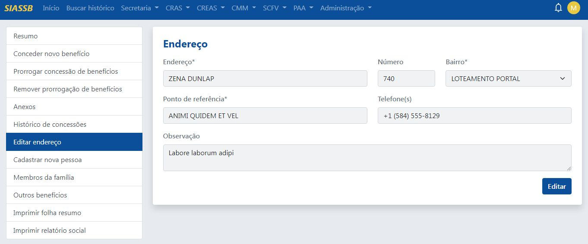

O processo de editar endereço da família deve ser seguido, corforme o [bloco de identificão](#identificação-e-controle).

#### Aba cadastrar nova pessoa

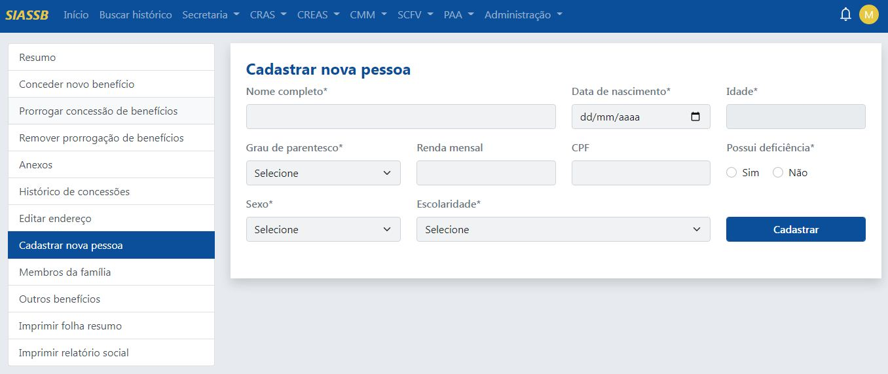

O processo de cadastrar nova pessoa da família deve ser seguido, corforme o [bloco de membros da família](#cadastrar-pessoa), feita todas as operações, basta clicar no botão "Cadastrar".

#### Aba membros da família

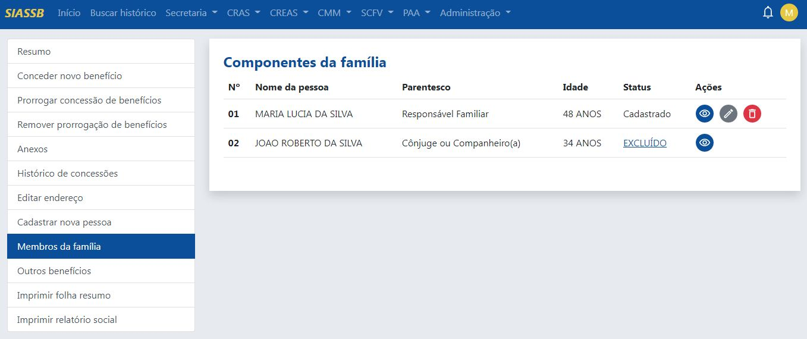

O processo de visualizar, editar e excluir uma pessoa da família deve ser seguido, corforme o [lista de membros da família](#lista-de-membros-da-família).

#### Aba outros benefícios

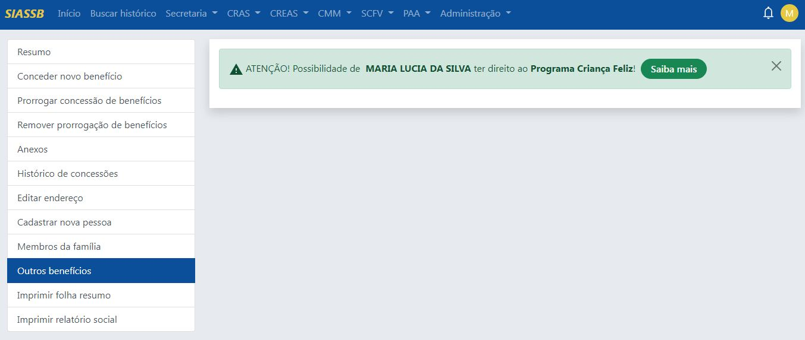

Aba onde serão exibidos outros benefícios.

:::info Importante
É importante que nestes casos, o assistente social oriente ao usuário dessa possibilidade da família ter direito à outros benefícios.
:::

#### Aba imprimir folha resumo

Ao clicar na aba de imprimir folha resumo, o sistema irá abrir uma nova aba, conforme a imagem abaixo.

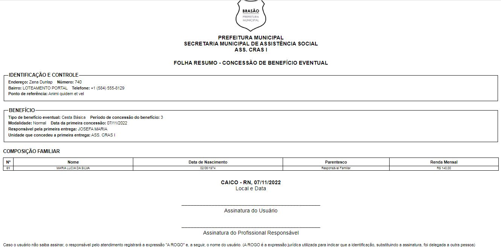

#### Aba imprimir relatório social

O processo de imprimir relatório social deve ser seguido, corforme o [bloco da impressão de relatório social](#gerando-relatório-social).

## Ver relatórios nominais

Para ver um relatório nominal, deve-se ir em **Secretaria -> Benefícios sociais -> Ver relatórios de benefícios concedidos**, a seguinte tela será exibida.

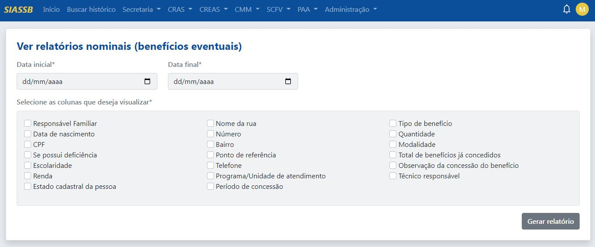

Para buscar por um relatório nominal, primeiramente deve-se selecionar a data de inicial e a data final, depois selecionar os campos que deseja visualizar, será aberta uma nova aba conforme a pesquisa informada, veja na imagem abaixo.

:::caution Atenção
A data inicial sempre deve ser menor que a data final, recomendamos que o período selecionado seja de no máximo um ano!
:::

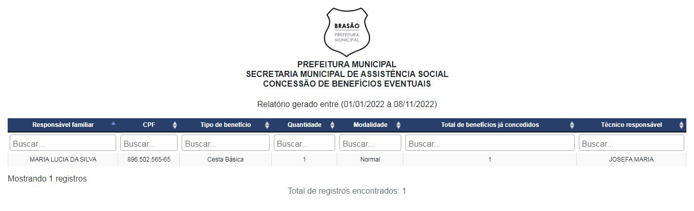

## Ver gráficos/relatórios quantitativos

Para ver gráficos dos benefícios eventuais, deve-se ir em **Secretaria -> Benefícios eventuais -> Ver relatórios gráficos/relatórios quantitativos**, a seguinte tela será exibida.

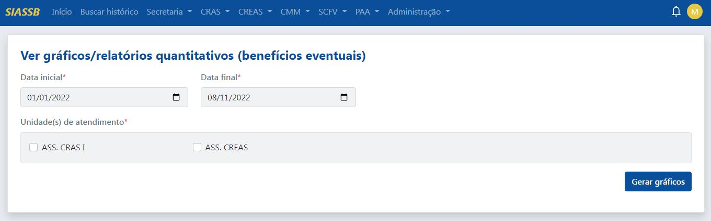

Primeiramente deve ser informado sempre uma data inicial e uma data final, selecionar a unidade de atendimento (admite múltipla seleção) e depois clicar no botão "Gerar gráficos", se a busca encontrar algum registro, a tela será renderizada com os seguintes gráficos.

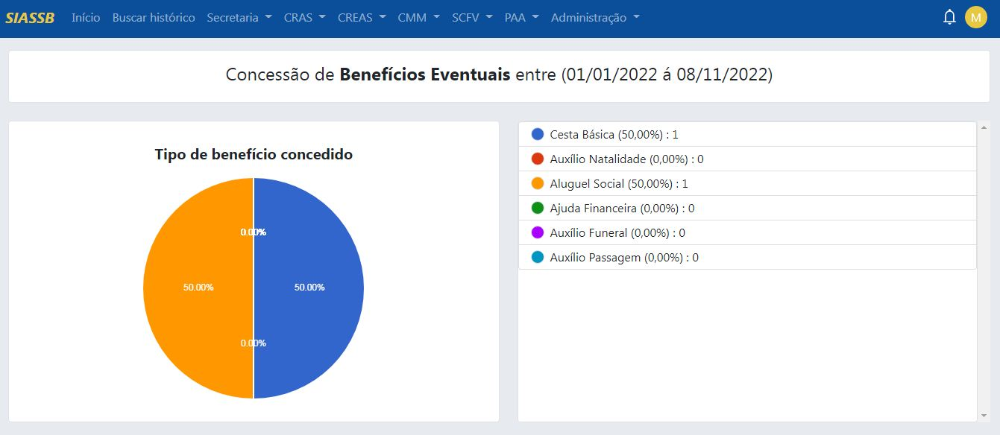
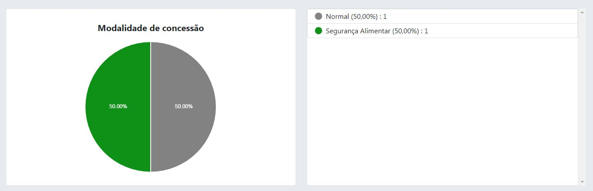
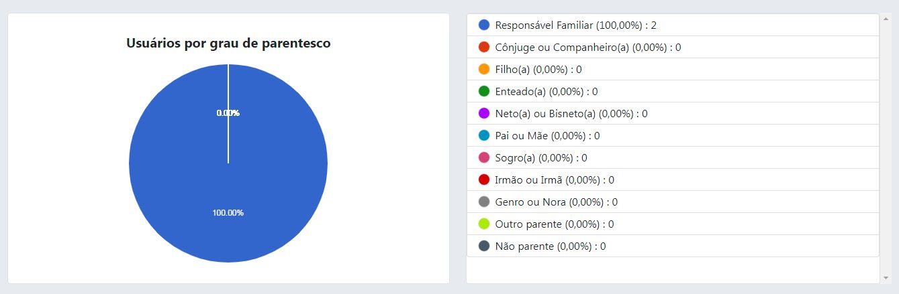
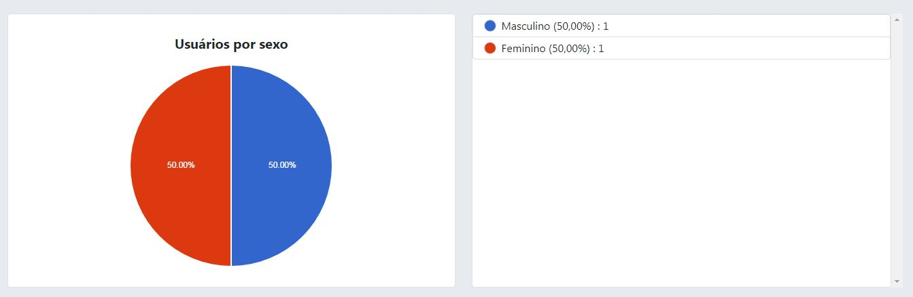
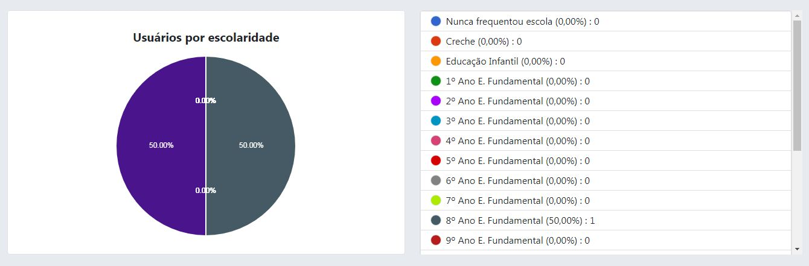
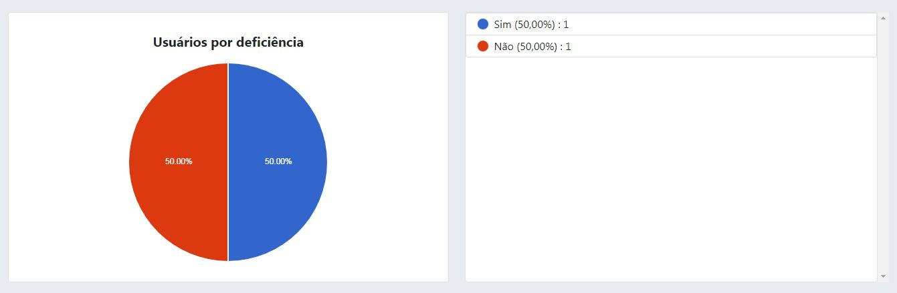
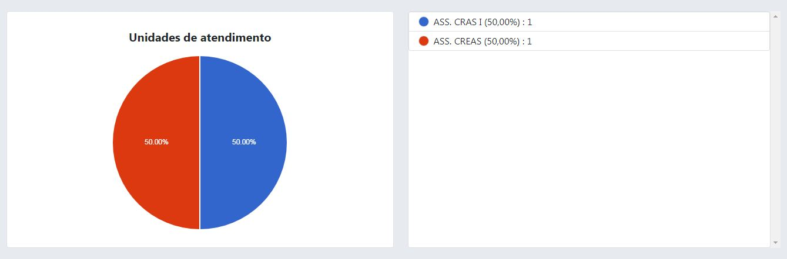
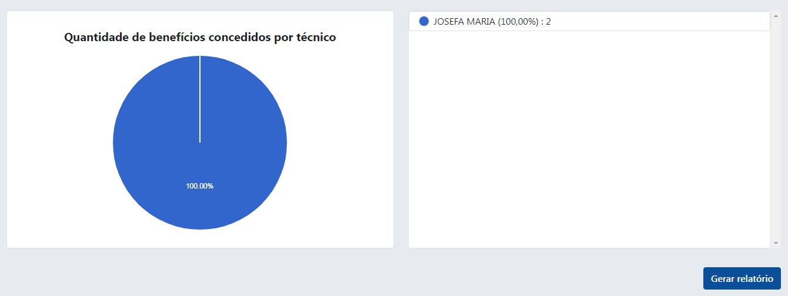

Além disso, no fim da página existe a possibilidade de gerar um relatório analítido dos dados gerados pelos gráficos. Clicando em "Gerar relatório", o sistema vai exibir uma nova página, veja na imagem abaixo.

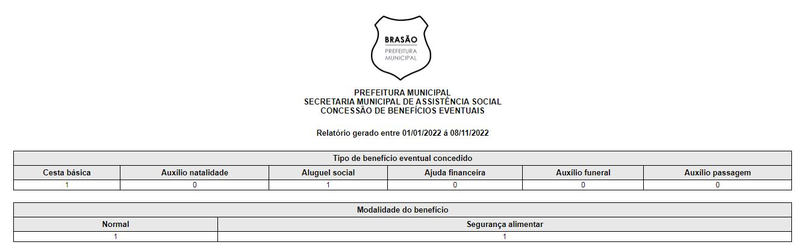
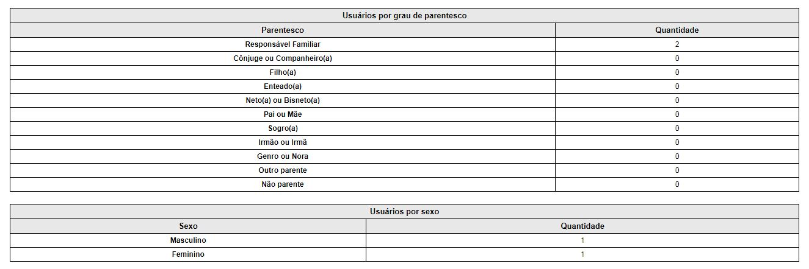
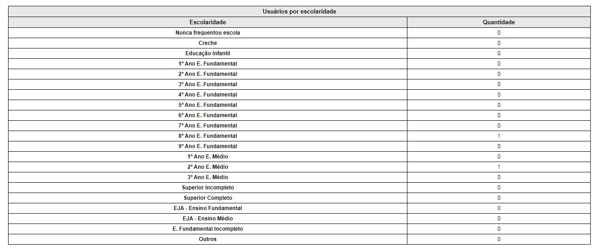
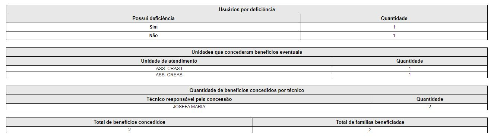
