# Denúncia

A funcionalidade de denúncia pode ser utilizada de forma anônima ou identificada, onde podem ser cadastradas qualquer tipo de denúncia.

Principais funcionalidades:

- Cadastrar
- Buscar
- Ver relatórios nominais
- Ver relatórios quantitativos/gráficos

## Registrar denúncia

Para registar uma nova denúncia, deve-se ir em **Secretaria -> Denúncia -> Cadastrar**, a seguinte tela será exibida.

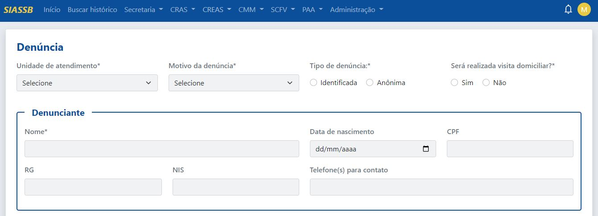
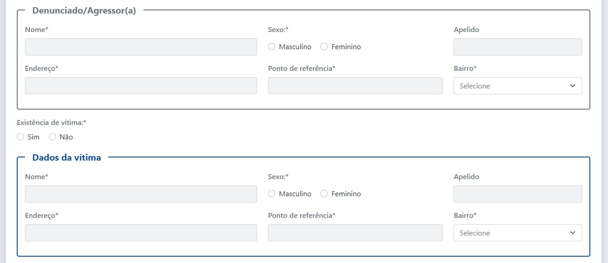
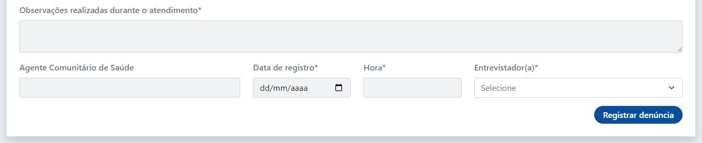

O formulário de denúncia posssui os seguintes campos:

- Unidade de atendimento (unidade que está sendo realizado o atendimento)
- Motivo da denúncia (motivo)
- Tipo de denúncia (identificada ou anônima). Caso a denúncia seja do tipo anômina, o bloco denunciante será desabilitado.
- Se será realizada a visita domiciliar

Bloco do denunciante

- Nome (nome completo)
- Data de nascimento
- CPF
- RG
- NIS
- Telefone(s) para contato

:::note Reforçando
O bloco de denunciante será desabilitado se o tipo de denúncia for maracada com oanÔnima.
:::

Bloco de denunciado/agressor(a)

- Nome (nome completo)
- Sexo
- Apelido
- Endereço
- Ponto de referência 
- Bairro

Se hou a existência de vitíma (sim ou não)
Se sim, o bloco de dados da vitima será habiltado.

Bloco de dados da vitima

- Nome (nome completo)
- Sexo
- Apelido
- Endereço
- Ponto de referência
- Bairro

Campo de observações realizadas durante o atendimento
Agente comunitário de saúde
Data de registro
Hora
Entrevistador

Após o preenchimnetos de todos os campos, basta clicar no botão de "Registrar denúncia"

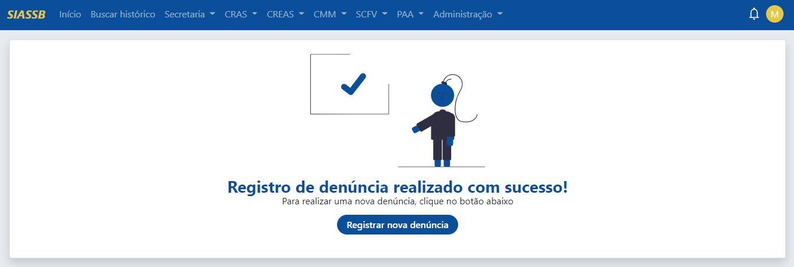

## Buscar denúncia

Para registar uma nova denúncia, deve-se ir em **Secretaria -> Denúncia -> Cadastrar**, a seguinte tela será exibida.

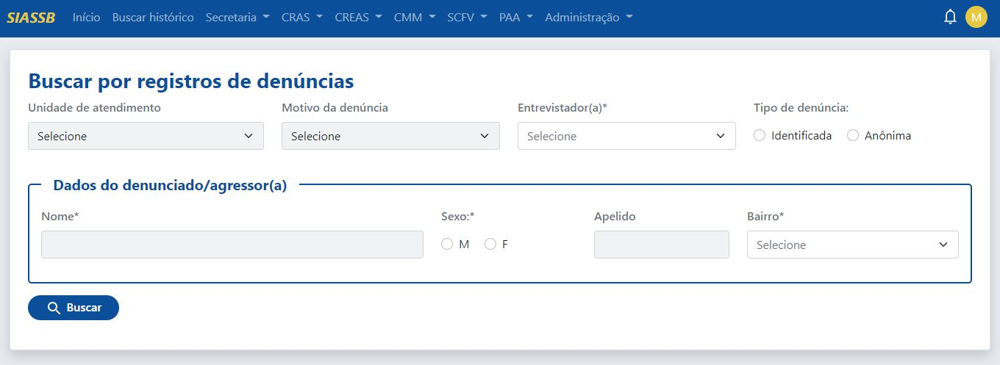

A busca pode ser realizada pela unidade de atendimento, motivo da denúncia, entrevistador(a), tipo de denúncia, ou pelos dados do agressor: nome, sexo, apelido e bairro.

:::tip Dica
O nome do agressor pode ser pesquisado em partes, ou seja, no lugar de digitar JOAO DA SILVA, pode ser digitado apenas JOAO que o sistema vai encontrar todas os JOAO's e retornar o resultado
:::

:::note Nota 
Não é necessário realizar a busca por todos os campos, basta preencher um determinado campo que o sistema faz a busca normalmente.
:::

Ao clicar no botão de buscar e a pesquisa encontrar algum resultado conforme os parâmetros informados, o sistema vai exibir a seguinte página:

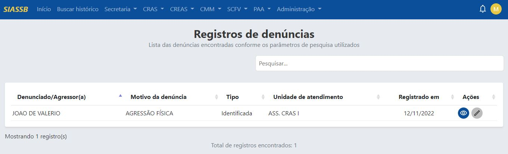

A busca acima realizada foi utilizando o parâmetro nome unidade de atendimento (ASS. CRAS I). É mostrada uma tabela com as seguintes colunas:

- Agressor 
- Motivo da denúncia
- Tipo
- Unidade de atendimento
- Data de registro
- Ações

### Visualizar dados da denúncia

Para visualizar os dados, basta clicar no ícone do olho, que o sistema irá redirecionar para a seguinte página.

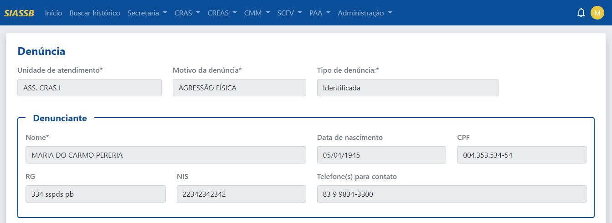
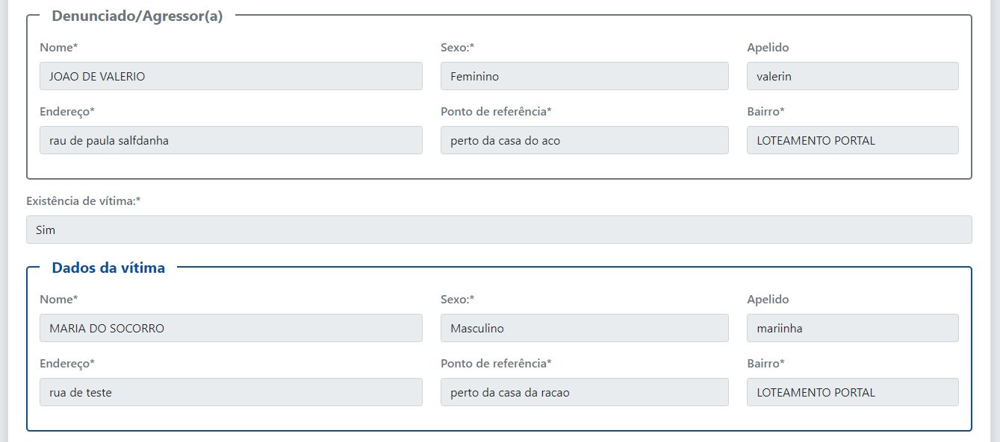
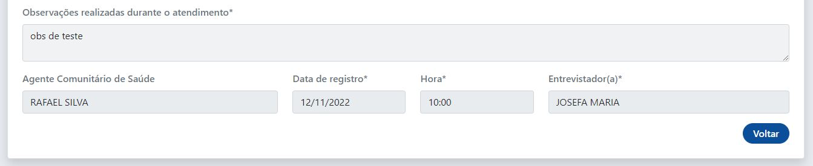

:::tip Dica
Além destes dados poderem serem visulizados os mesmos também podem ser impressos.
:::

### Editar dados da denúncia

Para editar uma determinada denúncia, deve-se ir em **Secretaria -> Denúncia -> Editar**, a seguinte tela será exibida.

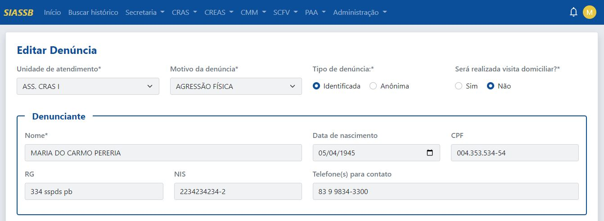
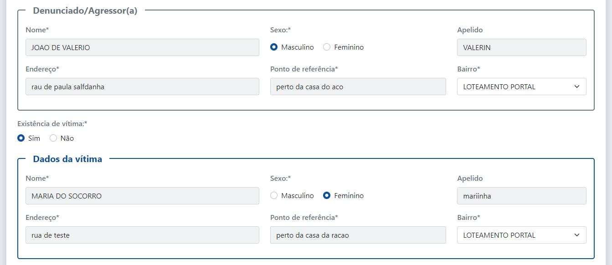
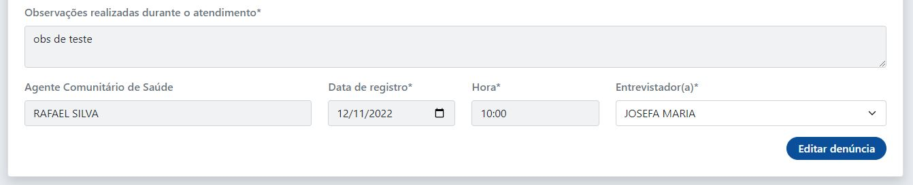

## Motivo (recurso)

O motivo é um recurso que pertence ao registro da denúncia. para ver todos os motivos, basta ir em **Secretaria -> Denúncia -> Motivo (recurso)**, a seguinte tela será exibida.

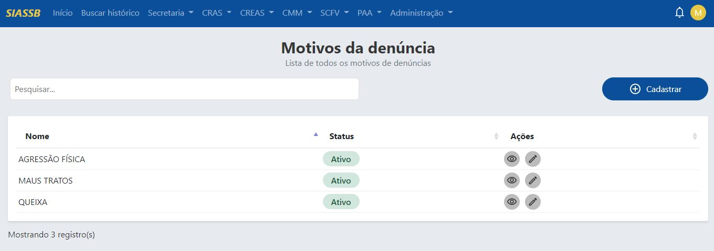

Como podemos observar, temos as opções de cadastrar, visualizar e editar um motivo existente.

### Cadastrar novo motivo de denúncia

Para cadastrar basta clicar no botão de cadastrar que o sistema irá redirecionar para a tela de cadastro.

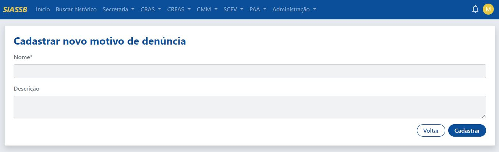

O campo nome é obrigatório, já o campo descrição é opcional, após o preenchimento basta clicar no botão "Cadastrar".

### Ver motivo de denúncia

Para ver um motivo de visita, basta selecionar o registro e clicar no ícone de visualizar, o sistema irá redirecionar para a tela de forma de acesso.

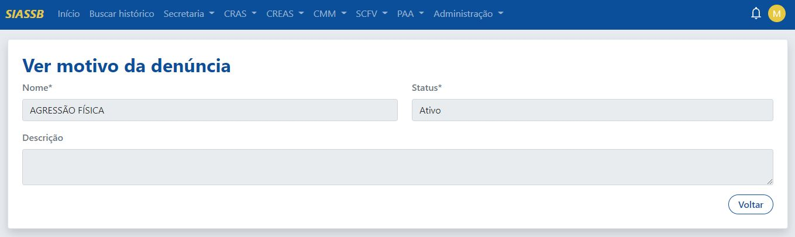

:::note Nota
Estes dados são apenas para visualizar, assim não é possível realizar a edição dos mesmos.
:::

### Editar motivo da visita

Para editar um determinado registro, basta clicar no ícone do lápis que o sistema irá redirecionar para a tela de edição.

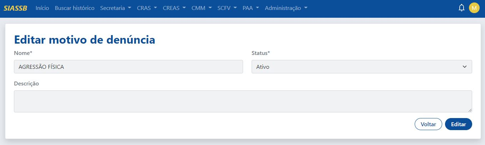

O campo nome e o status (ativo ou inativo) são obrigatórios, já o campo descrição é opcional, após o preenchimento basta clicar no botão "Editar".

:::info Atenção
Se o status for selecionado como inativo, o motivo da denúncia não será mais apresentado na página de registrar a denúncia.
:::

## Ver relatórios nominais

Para ver um relatório nominal, deve-se ir em **Secretaria -> Denúncia -> Ver relatórios nominais**, a seguinte tela será exibida.

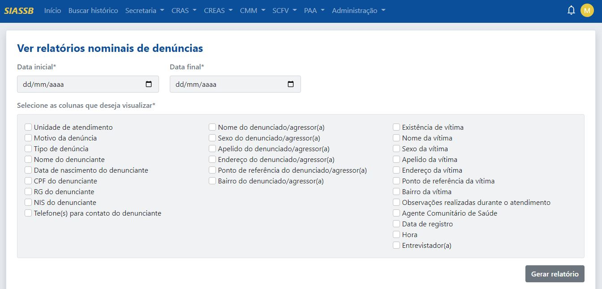

Para buscar por um relatório nominal, primeiramente selecionar a data de inicial e a data final, depois selecionar os campos que deseja visualizar, será aberta uma nova aba conforme a pesquisa informada, veja na imagem abaixo.

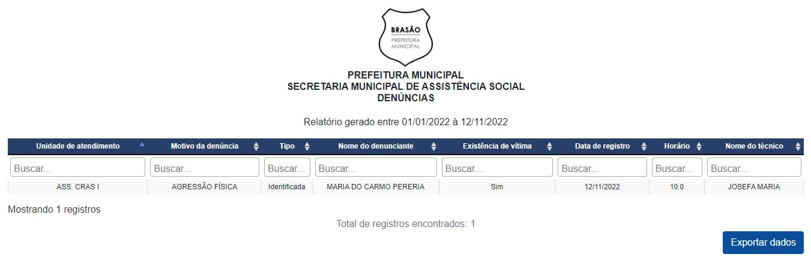

:::caution Atenção
A data inicial sempre deve ser menor que a data final, recomendamos que o período selecionado seja de no máximo um ano!
:::

## Ver gráficos/relatórios quantitativos

Para ver gráficos das solicitações de visitas domiciliares, deve-se ir em **Secretaria -> Denúncia -> Ver relatórios gráficos/relatórios quantitativos**, a seguinte tela será exibida.

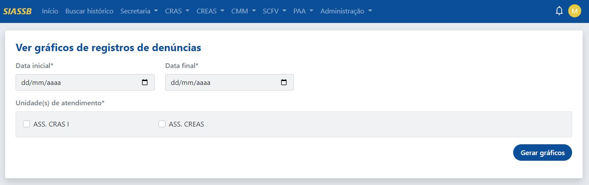

Primeiramente deve selecionar a data inicial e a data final e depois marcar as unidades que deseja ver os gráficos.

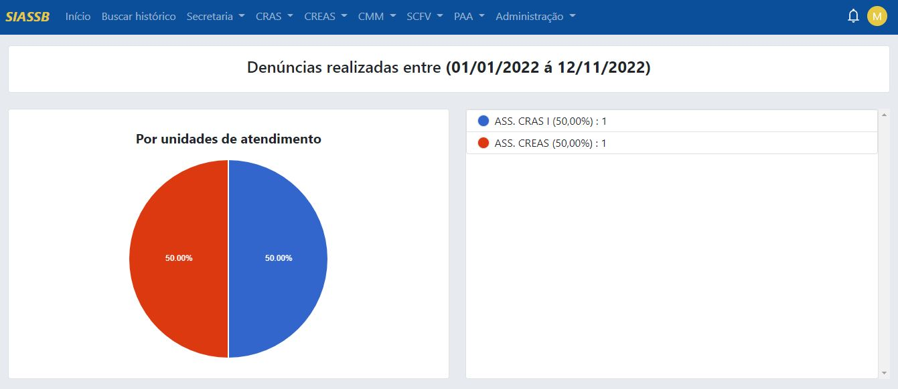
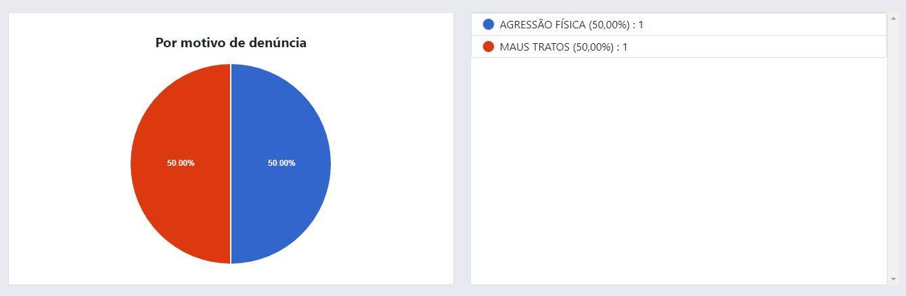
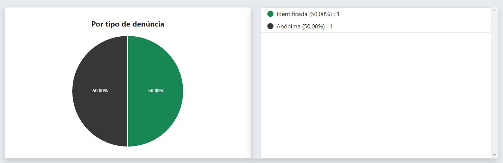
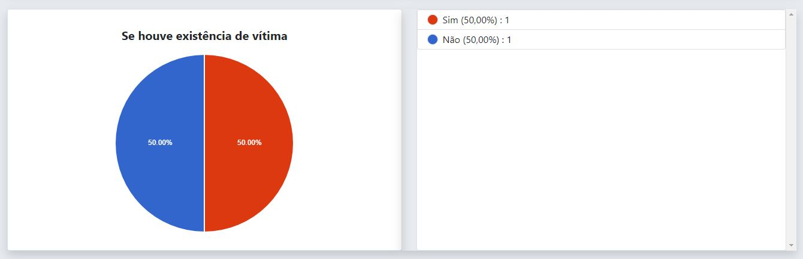
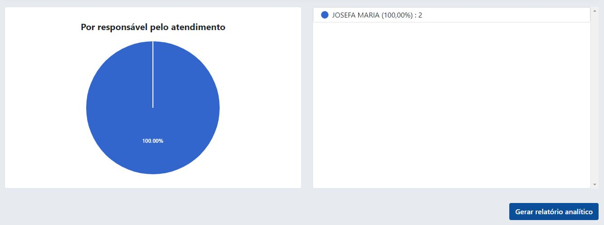

Além disso, no fim da página existe a possibilidade de gerar um relatório analítido dos dados gerados pelos gráficos. Clicando em "Gerar relatório", o sistema vai exibir uma nova página, veja na imagem abaixo.

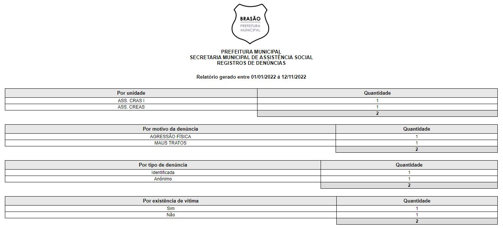

