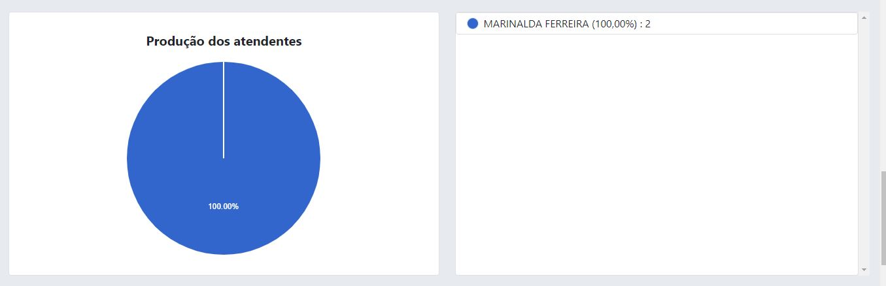

# Fichas (gestão de filas)

A funcionalidade de distribuição de fichas é caracterizado por um sub-sistema de gerenciamento de filas de atendimento, o objetivo principal é organizar os atendimentos por tipo (conforme [lei federal Nº 10.048, de 8 de Novembro de 2000](https://www.planalto.gov.br/ccivil_03/leis/l10048.htm)) e reduzir o tempo de espera do usuário.

:::info Importante
Antes de realizar o processo de gerar senha, deve-se realizar algumas configurações.
:::

## Configurando a impressão de senha

Após o processo de login no sistema, para configurar a impressão de senhas, basta clicar na **unidade da secretaria -> Fichas -> Configuração de impressão de senhas**, o sistema irá exibir a tela, conforme imagem abaixo:

No campo nome da unidade pode ser inserido o nome da prefeitura ou o nome da unidade de atendimento, conforme as necessidades do município, o mesmo vale para o campo de cabeçalho, já no campo habilitar impressão de senha, caso o mesmo esteja marcado como sim, o município vai necessitar de uma impressora, de preferência do tipo térmica, caso esteja marcado como não, não haverá a necessidade de impressão do papel.

No campo rodapé pode ser inserida uma frase conforme as necessidades do município, e os campos de exibir prioridade, exibir nome do serviço, data e hora não são campos com marcação obrigatória, ficando a disposição de mostrar esses campos ou não no ato da impressão da senha.

:::caution Atenção
A imagem destacada no lado direito da página é apenas uma prévia de como será a impressão, é uma imagem **meramente ilustrativa!**
:::

Feito todo os processo de configuração de impressão de senhas, basta clicar em no botão "Salvar configuração".

## Configurando o painel de mídias

Para configurar o painel de mídias, basta clicar na **unidade da secretaria -> Fichas -> Configuração de impressão de mídias**, o sistema irá exibir a tela, conforme imagem abaixo:

Conforme a imagem acima, existe um alerta informando a respeito das dimensões da imagem a ser carregada, recomendando o padrão de 1920px x 980px, isso se dá devido ao fato de se tratar de um painel de mídias onde as imagens vai ser visualizadas na maioria das vezes, por um aparelho de televisão.

Após carregar a imagem, basta clicar no botão "Enviar nova imagem" para que seja realizado o processo de ***upload*** (carregamento da imagem do seu computador para o servidor da aplicação).

Após realizado o carregamento da primeira imagem, a tela vai ser mostrada dessa forma.

Outras imagens podem ser carregadas, conforme a necessidade do órgão gestor.

Caso tenha carregado alguma imagem de forma errada ou queira realizar a exclusão de alguma imagem específica, basta selecionar a imagem e depois clicar no botão "Excluir", que irá abri uma janela modal de confirmação, veja na imagem abaixo.

## Visualizando o painel de mídias

Para configurar o painel de mídias, basta clicar em **Secretaria -> Fichas -> Abrir o painel de exibição de senhas**, o sistema irá exibir a tela numa nova aba, conforme imagem abaixo:

O painel é exibido em sua forma "limpa", conforme os usuários são chamados, o painel vai exibindo o nome do usuários que serão atendidos, conforme imagem abaixo:

Perceba que no lado direito do painel, a senha foi chamada e destacada de forma amarela TRA significa a sigla do tipo de serviço que será prestado, logo abaixo vem o nome do usuário e por fim o local de atendimento.

:::info Importante
Ao chamar o usuário, o painel executa um *beep* sonoro, além de emitir um aúdio da senha gerada, proporcionando uma maior acessibilidade para pessoas com deficiência.
:::

Quando é chamado um atendimento do tipo prioritário, a tela fica destacada na cor vermelha, conforme imagem abaixo:

## Locais de atendimento

Para listar ou cadastrar novos locais de atendimento, vá em **Secretaria -> Fichas -> Locais de atendimento**, o sistema irá exibir a tela, conforme imagem abaixo:

Por padrão o sistema já vem com um local de atendimento, chamado SALA DE ATENDIMENTO, podendo ser alterado por outro nome, bastante clicar no ícone do lapís (lado direito da tela).

Para cadastrar um novo local de atendimento, basta clicar no botão "Cadastrar", o sistema vai redirecionar para uma nova tela.

O cadastro é bem simples, pois se trata de um recurso que pertence a geração das fichas de atendimento, sendo assim, o único campo obrigatório é o nome do local de atendimento, após o preenchimento, basta clicar no botão "Cadastrar".

## Tipos de prioridades

Para listar ou cadastrar novos locais de atendimento, vá em **Secretaria -> Fichas -> Prioridades**, o sistema irá exibir a tela, conforme imagem abaixo:

Por padrão o sistema já vem com algumas prioridades:

- **DEFICIENTE**
- **GESTANTE**
- **IDOSO(A) COM 60 ANOS OU MAIS**
- **LACTANTE**
- **OBESO**
- **PESSOA COM CRIANÇA DE COLO**

:::caution Atenção
Todas essas prioridades listadas, estão amparadas pela lei federal Nº 10.048, de 8 de Novembro de 2000!
:::

Caso haja a necessidade de cadastrar novos tipos de prioridades, basta clicar no botão "Cadastrar", e irá exibir a tela, conforme imagem abaixo:

O cadastro é bem simples, pois se trata de um recurso que pertence a geração das fichas de atendimento, sendo assim, o único campo obrigatório é o nome da prioridade, após o preenchimento, basta clicar no botão "Cadastrar".

## Cadastrando atendentes

Para registrar um atendente, basta clicar em **Secretaria -> Fichas -> Atendentes**, o sistema irá exibir a tela, conforme imagem abaixo:

Perceba que não foi listado nenhum atendente, para registrar um novo profissional, bastar clicar no botão "Cadastrar".

Primeiramente deve selecionar o atendente é o profissional reigstrado no sistema, o local de atendimento que o profissional vai chamar os usuários, e os serviços que serão prestados por este profissional.

:::info Importante
O profissional só pode atender aos usuários conforme os serviços que ele presta. 

**Exemplo:** se o atendente só presta o serviço de Atendimento Assistente, e se na triagem o serviço que vai ser prestado é do tipo BPC, logo o atendimento do tipo BPC não vai aparecer na fila de atendimentos para o atendente que presta somente o serviço de Atendimento Assistente.
:::

Feito isso, basta clicar no botão "Cadastrar" que um novo atendente está apto a atender os usuários conforme os serviços prestados.

Feito isso, o próximo passo e iniciar o processo de gerar senhas.

## Gerar senha de atendimento

Para gerar uma senha de atendimento via recepção, vá em **Secretaria -> Fichas -> Gerar senha**, o sistema irá exibir a tela, conforme imagem abaixo:

Informe o nome do usuário, CPF (não obrigatório) mas é recomendado [`(saiba mais)`](/manual-siassb/historic/), unidade de atendimento por onde o usuário está passando (geralmente é a recepção), serviços que serão prestados podem ser selecionados mais de um. Serviço principal, Tipo de senha que será gerada se é convencional ou prioritária conforme [a lei federal Nº 10.048, de 8 de Novembro de 2000](https://www.planalto.gov.br/ccivil_03/leis/l10048.htm), se o tipo da senha selecionada for prioritária, selecionar a prioridade e depois clicar no botão "Gerar senha".

### Imprimindo a senha de atendimento

Após clicar em gerar senha, o sistema vai fazer um redirecionamento mostrando a senha gerada, basta realizar a impressão da senha.

Após isso basta imprimir

:::info Importante
Para a impressão das senhas, é recomendado utilizar uma impressora térmica não fiscal.
:::

## Chamando usuário da fila

Para chamar um usuário que está em espera na fila de atendimento, deve-se ir em **Secretaria -> Fichas -> Chamar usuário**, o sistema irá exibir a tela, conforme imagem abaixo:

Conforme imagem acima, existe um usuário na fila de espera, para chamar o usuário basta clicar no botão "Chamar Próximo Usuário".

A tela de atendimentos aos usuários é divida em dois blocos, o bloco superior e bloco inferior.

O bloco superior é composto pelo bloco do atendimento que exibe o nome da senha e do serviço prstado. E o bloco do usuário que exibe o nome e do CPF do usuário.

Já o bloco inferior é formado pelos seguintes botões:

- Chamar usuário novamente
- Iniciar atendimento
- Não compareceu
- Encaminhar

### Chamar usuário novamente

Existem momentos onde o atendente chama o usuário e o mesmo não entra para a sala de atendimento, neste caso, o atendente deve chamar o usuário novamente e aguardar em torno de 4 segundos, se o usuário não entrar novamente, o atendente deve aguardar mais 3 segundos e chamar novamente.

:::info Importante
É recomendado o atendente realizar até 3 chamadas consecutivas, caso o usuário não entre na sala de atendimento, clicar no botão "Não compareceu".
:::

### Usuário não compareceu ao local de atendimento

Ao clicar no botão "Não compareceu", será aberto a janela modal de confirmação, conforme a imagem abaixo:

Ao clicar no botão "Não compareceu" o atendimento será encerrado e o atendente estará liberado para realizar novos atendimentos.

:::caution Atenção
Após o cancelamento da senha, caso o usuário retorne futuramente para a unidade de atendimento, será necessário gerar uma nova senha.
:::

### Iniciar atendimento

Ao clicar no botão "Iniciar atendimento", será exibida uma nova página, onde o bloco inferior foi modificado, conforme a imagem abaixo.

Os novos blocos de funcionalidades são:

- Concluir atendimento
- Erro de triagem
- Faltou documentos

#### Faltou documentos

No andamento do atendimento, caso o usuário tenha esquecido de algum documento, o atendente deve clicar no botão "Faltou documentos", ao clicar neste botão, será aberta a seguinte janela modal:

Clicando em "Sim", o atendimento será encerrado e o atendente estará livre para chamar novos usuários que estão na fila de espera.

:::info Importante
Caso o usuário tenha esquecido de algum documento obrigatório, é recomendado que o atendente oriente o usuário para trazer a documentação necessária.

Caso o mesmo vá buscar os documentos, o usuário ficaria esperando em modo prioritário na recepção da unidade, aguardando o atendente liberar o atual atendimento, quando o atendimento encerrasse o mesmo entraria na sala pra ser antendido novamente, sem a necessidade de gerar uma nova senha.
:::

#### Erro de triagem

O erro de triagem acontece, quando o profissional que atua na recepção seleciona um determinado tipo de serviço e quando o usuário chega na sala, o atendente identifica que o tipo de serviço a ser prestado era outro.

Neste caso, o atendente tem duas opções, registrar o atendimento como erro de triagem ou encaminhar o usuário para o atendente correto que possui autonomia para atuar naquele tipo de serviço em específico.

Clicando em "Erro de triagem", será aberta a seguinte janela modal:

Clicando em "Sim", o atendimento será encerrado e o atendente estará livre para chamar novos usuários que estão na fila de espera.

#### Encaminhar usuário

Caso haja a necessidade de encaminhar o usuário, seja por erro de triagem ou por continuidade a novos atendimentos ao usuário, o atendente deve clicar em "Encaminhar", será exibida a janela modal a seguir.

Para realizar um novo encaminhamento, primeiro deve selecionar o tipo de serviço a ser prestado, e no campo de observação o atendente pode relatar o que aconteceu durante o seu atendimento com o usuário, isso é importante pois ao encaminhar o novo atendente que chamar já saberá o que aconteceu no atendimento anterior.

:::note Importante
O campo de observação não é obrigatório, mas é altamente recomendável que o atendente sempre que realizar um encaminhamento, preencher este campo.
:::

Clicando em "Encaminhar", o atendimento será encerrado e o atendente estará livre para chamar novos usuários que estão na fila de espera.

#### Concluir atendimento

Após o término do atendimento ao usuário final, o atendente deve clicar em "Concluir atendimento", ao clicar será aberta uma nova janela modal.

Ao clicar em "Sim", o atendimento será encerrado e o atendente estará livre para chamar novos usuários que estão na fila de espera ou não.

Quando não há mais ninguem na fila de espera, será exibida a seguinte tela.

## Ver usuários aguardando atendimento

Para ver todos os usuários que aguardam atendimento, vá em **Secretaria -> Fichas -> Ver usuários aguardando atendimento**, o sistema irá exibir a tela, conforme imagem abaixo:

Essa funcionalidade é importante, não apenas para ver os usuários na fila, mas também para realizar o **cancelamento** da senha ou para **reimprimir** a senha novamente.

### Reimprimindo a senha novamente

Por exemplo: vamos supor que queremos reimprimir a senha de MARIO AMEIDA, basta clicar em cima do seu nome que irá abrir uma janela modal com os seus dados, conforme a imagem abaixo:

Feito isso, deve clicar no botão "Imprimir ficha", que vai abrir uma nova aba [conforme este tópico](#imprimindo-a-senha-de-atendimento).

### Cancelando a senha do usuário

Imprevistos podem acontecer, como falta de energia, problemas de conexão com a internet, ou o usuário pode sair da fila de atendimento de forma inesperada e etc.

Quando houver algum problema inesperado no local de atendimento e todos os usuários que estavam na fila tiveram que ir embora, como uma falta de energia elétrica, ou uma conexão com a internet onde o provedor de internet notificou ao órgão gestor que estaria fazendo manutenção na rede, dentre outros imprevistos que podem acontecer, nestes casos o recomendado é que na hora que o serviço se normalizar, todos os usuários tenham sua senhas canceladas, dessa forma, o atendente não vai ter que ficar chamando usuários "Fantasmas" que estão na fila de espera.

Outro caso comum é quando o usuário tem que se ausentar do local de atendimento antes de ser chamado, neste contexto, o usuário comunicando a recepção que não vai mais permanecer no local, o profissional da recepção poderá cancelar a senha desse usuário em específico.

Para cancelar a senha, basta clicar em cima do usuário, vai abrir uma janela modal e depois deve clicar no botão "Cancelar senha".

:::danger Muito cuidado
O cancelamento da senha é um processo **irreversível**, é recomendado prestar muito atenção para não cancelar a senha de outro usuário que já está na fila de espera.
:::

### Ninguem aguardando atendimento

Quando não houver ninguém aguardando atendimento, o sistema vai mostrar uma imagem como essa abaixo:

O botão "Gerar nova ficha" redireciona o usuário [para a criação de uma nova senha](#gerar-senha-de-atendimento).

## Buscar usuário

Para buscar um usuário que já foi atendido, vá em **Secretaria -> Fichas -> Buscar usuário**, o sistema irá exibir a tela, conforme imagem abaixo:

A busca pode ser realizada pelo nome do usuário, CPF, senha, serviço prestado, tipo de senha prioritária, responsável pelo atendimento ou status da senha.

:::tip Dica
O nome do usuário pode ser pesquisado em partes, ou seja, no lugar de digitar MARIA DA SILVA, pode ser digitado apenas MARIA que o sistema vai encontrar todas as MARIA's e retornar o reultado
:::

:::note Nota
Não é necessário realizar a busca por todos os campos, basta preencher um determinado campo que o sistema faz a busca normalmente.
:::

Ao clicar no botão de buscar e a pesquisa encontrar algum resultado conforme os parâmetros informados, o sistema vai exibir a seguinte página:

A busca acima realizada foi utilizando o parâmetro de serviço prestado (Atendimento Assistente). É mostrada uma tabela com as seguintes colunas:

- **Senha** (que pode ser impressa novamente clicando no ícone da impressora)
- **Nome do usuário** (ao clicar em cima do nome, é exibida uma nova tela)
- **Serviço prestado**
- **Atendente** (quem realizou o atendimento, quando a ficha é cancelada não existe atendente vinculado, pois a ficha foi cancelada antes de iniciar do atendimento)
- **Status do atendimento** (Emitida, Chamada, Em atendimento, Concluída, Não compareceu, Erro de triagem, Faltou documentos, Cancelada)
- **Emitido em** (data e hora da emissão da senha)

### Visualizando ficha do usuário

Conforme imagem acima, ao clicar no nome do usuário, você será redirecionado para a tela mostrada abaixo:

Nesta tela, são apresentados os dados da ficha (lado esquerdo) e a ficha em formato de imagem ilustrativa (lado direito), caso haja a necessidade de imprimir a senha do usuário novamente, basta clicar em "Imprimir".

## Ver relatórios nominais

Os relatórios nominais são um forma de visualizar os dados de uma forma mais detalhada, o acesso se dá através da **Secretaria -> Fichas -> Ver relatórios nominais**.

Os relatórios nominais nos dão a possibilidade de identificarmos quem foram os usuários que foram atendidos ou não. Para isso, deve-se inserir uma data inicial, uma data final e selecionar as colunas que desejamos visualizar, assim conseguimos obter informações de forma mais detalhada.

:::caution atenção
A data inicial sempre deve ser menor que a data final, recomendamos que o período selecionado seja de no máximo um ano!
:::

Com a selelação correta da data inicial, data final e das colunas selecionadas, os registros serão exibidos numa nova aba.

Assim, os registros gerados podem ser impressos, salvos no formato PDF. Além disso, os dados podem ser salvos clicando no botão "Exportar dados", os dados serão baixados no formato CSV.

:::tip Dica
A grande vantagem de exportar os dados no formato CSV é o fato dele possibilitar a importação e exportação de arquivos de uma linguagem que vários aplicativos podem ler. Aplicativos como o Microsoft Excel, Google Planilhas e LibreOffice Calc podem facilmente ler esse tipo de arquivo, dessa forma os dados podem ser manipulados de várias formas diferentes, sejam para fins de pesquisas e análises de dados ou até mesmo para apoiar os gestores municipais nas suas tomadas de decisões.
:::

Além disso, os dados exportados no formato CSV também podem ser importados para outros sistemas próprios da gestão municipal.

## Ver relatórios quantitativos/gráficos

Os gráficos são um forma de visualizar os dados de uma forma quantitativa, para iniciar o processo de geração de gráficos, o acesso se dá através da **Secretaria -> Fichas -> Ver gráficos/relatórios quantitativos**.

Para gerar gráficos, é necessário selecionar a data inicial e a data final por fim basta clicar em gerar gráficos, o modelo dos gráficos gerados é do tipo pizza.

Além disso, existe o opção de gerar relatório analítico, basta clicar no botão azul chamado "gerar relatório analítico", será exibido um relatório em formato de tabelas numa nova aba com o total de serviços prestados.

O mesmo pode ser impresso ou salvo no formato PDF.
