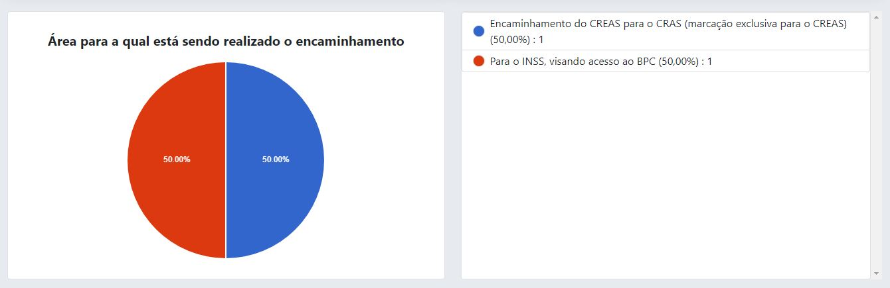

# Encaminhamentos

Funcionalidade utilizada pelos profissionais da assistência social para realizar encaminhamentos entre os equipamentos ou para outras unidades externas. Possibilidade de gerar o documento impresso para realizar a contra-referência.

:::info Importante
Quando os encaminhamentos são realizados entre as unidades da assistência social, o sistema exibe um **alerta** notificando toda a equipe que tem condições de realizar aquele tipo de atendimento, o alerta é exibido na tela inicial da aplicação, além disso o sistema registra todo o histórico das notificações de encaminhamentos.
:::

## Registrando encaminhamento

Para registar um novo encaminhamento, deve-se ir em **Secretaria -> Encaminhamentos -> Cadastrar**, a seguinte tela será exibida.

Conforme a imagem acima, os campos para preenchimento são:

- Unidade de origem (a unidade que o técnico está realizando o atendimento)
- Nome do usuário (nome completo)
- CPF do usuário
- Dados do endereço
    - Endereço (rua, av.)
    - Número
    - Bairro
    - Ponto de referência
    - Telefone(s)
- Se a unidade de destino pertence a secretaria de assistência social (sim ou não)
    - Caso sim, será exibido um novo campo para selecionar a unidade de atendimento.
- Localização do órgão/unidade
- Àrea para qual está sendo realizado o encaminhamento
- Nome do profissional
- Data do encaminhamento
- Descrição do encaminhamento (observações realizados pelo profissional)

Após o preenchimento de todos os campos, basta clicar no botão "Encaminhar".

### Encaminhando para uma unidade externa

Quando o encaminhamento é realizado para uma unidade externa (INSS, Casa da Cidadania, Caixa Econômica Federal, Cartório Eleitoral, Receita Federal, etc.), a ficha de encaminhamento **DEVE** ser impressa e entregue para o usuário. 

:::caution Atenção
A unidade de destino deve devolver ao usuário a ficha de Contra-referência, devidamente preenchida, para posterior apresentação no serviço de origem.
:::

### Encaminhando para outra unidade da assistência social

Quando o encaminhamento é realizado para uma unidade que pertence a secretaria de assistência social, não há a necessidade de imprimir a ficha, pois os profissionais da outra unidade serão notificados via sistema, veja um modelo de notificação abaixo.

Conforme a imagem acima, a usuária SILVANA FEITOSA RAMALHO foi encaminhada do CREAS para o CRAS, quando o técnico logou no sistema, recebeu o alerta. O alerta é composto da mensagem juntamente com dois botões de leia mais e marcar como lida.

#### Visualizando o alerta de encaminhamento 

Clicando no botão leia mais, o sistema irá redirecionar para a tela do encaminhamento.

Perceba que existe um botão chamado contra-referencia, caso o usuário já esteja no local de atendimento, basta clicar no botão de contra-referência, o sistema irá carregar a seguinte página.

Para registrar a contra-referência, deve-se o campo de anotações, selecionar o profissional que está realizado o atendimento e a data da contra-referência, após o preechimento dos campos, basta clicar no botão "Registrar contra-referência".

#### Marcar alerta como lido

Registrada a contra-referência, basta ir na tela inicial do sistema, ir no alerta e clicar no botão "Marcar como lida", ao clicar nesta opção o alerta irá desaparecer da tela inicial.

Caso o profissional queira rever o alerta novamente, basta ir na barra de menu superior do sistema, ir no lado direito e clicar no ícone do sino que a aplicação irá redirecionar para a seguinte tela:

Assim, você poderá acompanhar aquele encaminhamento novamente, clicando no botão "Leia mais".

## Imprimindo encaminhamentos

Feito o registro corretamente, o sistema irá redirecionar para a tela de impressão do encaminhamento, veja na imagem abaixo.

Basta clicar no botão "Imprimir encaminhamento" que o sistema irá exibir o encaminhamento numa nova aba, pronto pra impressão.

Após a impressão, o documento deve ser impresso para o usuário levar para a unidade de destino.

:::info Reforçando
Caso o encaminhamento seja realizado para outra unidade que pertence a secretaria de assistência social, não a necessidade de imprimir o ficha de encaminhamento, ficando por opção do profissional.
:::

## Buscar encaminhamentos

Para buscar por um encaminhamento existente, deve-se ir em **Secretaria -> Encaminhamentos -> Buscar**, a seguinte tela será exibida.

A busca pode ser realizada pelo nome do usuário, CPF, bairro, unidade de origem, responsável pelo atendimento e a área para a qual está sendo realizado o encaminhamento.

:::tip Dica
O nome do usuário pode ser pesquisado em partes, ou seja, no lugar de digitar MARIA DA SILVA, pode ser digitado apenas MARIA que o sistema vai encontrar todas as MARIA's e retornar o resultado
:::

:::note Nota 
Não é necessário realizar a busca por todos os campos, basta preencher um determinado campo que o sistema faz a busca normalmente.
:::

Ao clicar no botão de buscar e a pesquisa encontrar algum resultado conforme os parâmetros informados, o sistema vai exibir a seguinte página:

A busca realizada foi utilizando o parâmetro nome (MA). É mostrada uma tabela com as seguintes colunas:

- Nome do usuário (nome completo do usuário)
- CPF (não obrigatório, mas recomendado)
- Unidade de origem (unidade onde foi realizado o primeiro atendido)
- Unidade de destino (unidade para onde o usuário foi encaminhado)
- Encaminhado em (data do encaminhamento)
- Ações

Em ações existem 3 opções:
- ícone da impressora (imprimir a ficha de encaminhamento)
- Ícone da seta para a direita (registrar contra-referência)
- Ícone do lápis (editar encaminhamento)

### Imprimindo a ficha de encaminhamento

Caso haja a necessidade de re-imprimir a ficha de encaminhamento, basta clicar no ícone de impressão, que o sistema irá abrir uma nova aba. [Veja o passo a passo](#imprimindo-a-ficha-de-encaminhamento).

### Editando o encaminhamento

Caso o profissional inseriu algum dado incorreto, existe a possibilidade de editar os dados. Basta clicar no ícone do lápis, que o sistema irá redirecionar para a página de edição.

Realizado a edição de todos os campos necessários, basta clicar no botão "Editar encaminhamento".

### Registrar contra-referência

Caso o profissional deseje registrar a contra-referência. Basta clicar no ícone da seta, que o sistema irá redirecionar para a página de contra-referência.

Realizado todo o preenchimento dos dados, basta clicar no botão "Registrar contra-referência".

## Ver relatórios nominais

Para ver um relatório nominal, deve-se ir em **Secretaria -> Encaminhamentos -> Ver relatórios nominais**, a seguinte tela será exibida.

Para buscar por um relatório nominal, primeiramente selecionar a data de inicial e a data final,depois e clicar no botão "Ver", veja na imagem abaixo.

Assim, os registros realizados na triagem podem ser impressos, salvos no formato PDF. Além disso, os dados podem ser salvos clicando no botão "Exportar dados", os dados serão baixados no formato CSV.

:::tip Dica
A grande vantagem de exportar os dados no formato CSV é o fato dele possibilitar a importação e exportação de arquivos de uma linguagem que vários aplicativos podem ler. Aplicativos como o Microsoft Excel, Google Planilhas e LibreOffice Calc podem facilmente ler esse tipo de arquivo, dessa forma os dados podem ser manipulados de várias formas diferentes, sejam para fins de pesquisas e análises de dados ou até mesmo para apoiar os gestores municipais nas suas tomadas de decisões.
:::

Além disso, os dados exportados no formato CSV também podem ser importados para outros sistemas próprios da gestão municipal.

## Ver relatórios quantitativos/gráficos

Os gráficos são um forma de visualizar os dados de uma forma quantitativa, para iniciar o processo de geração de gráficos, o acesso se dá através da **Secretaria -> Encaminhamentos -> Ver relatórios quantitativos/gráficos**.

Para gerar gráficos, é necessário selecionar a data inicial e a data final por fim basta clicar em gerar gráficos, o modelo dos gráficos é do tipo pizza.

Além disso, existe o opção de gerar relatório analítico, basta clicar no botão azul chamado "gerar relatório analítico", será exibido um relatório em formato de tabelas numa nova aba com o total de encaminhamentos realizados.

O mesmo pode ser impresso ou salvo no formato PDF.
