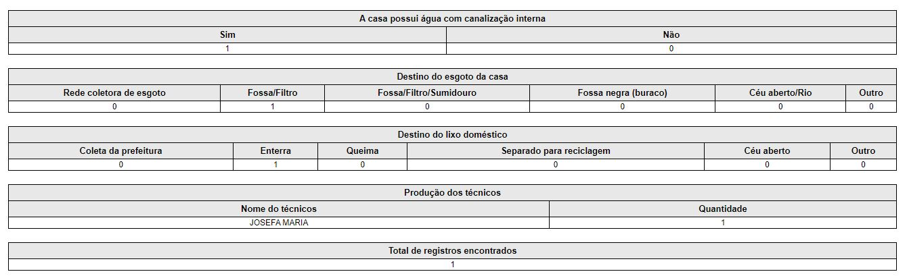

# Habitação

Os programas de Habitação de Interesse Social têm como objetivo viabilizar à população de baixa renda o acesso à moradia adequada e regular, bem como aos serviços públicos, reduzindo a desigualdade social e promovendo a ocupação urbana planejada. A ferramenta de habitação desenvolvida no sistema se refere a um pré-cadastro habitacional.

:::info Importante
Vale ressaltar que o pré-cadastro se trata apenas de um levantamento sobre a situação habitacional atual em que se encontra o município, portanto, não caracterizando qualquer contemplação.
:::

## Pré-cadastro em blocos

Para registrar o pré-cadastro, deve-se ir em **Secretaria -> Habitação -> Realizar pré-cadastro**, a seguinte tela será exibida. O pré-cadastro é dividido em oito blocos.

1. [`Identificação`](#identificação)
2. [`Composição familiar`](#composição-familiar)
3. [`Gastos mensais`](#gastos-mensais)
4. [`Informações gerais da família`](#informações-gerais-da-família)
5. [`Informações da edificação`](#informações-da-edificação)
6. [`Infraestrutura existente`](#infraestrutura-existente)
7. [`Observações técnicas`](#observações-técnicas)
8. [`Anexos`](#anexos)

A fim de facilitar o trabalho dos técnicos, todos os blocos possuem items númericos nos campos de preenchimento. 

### Identificação

O bloco de identificação e controle é dividido em dois sub-blocos:
- [`Identificação`](#identificação)
- [`Endereço`](#endereço)

:::info Importante
Todos os campos que possuem asteríscos (*) são de preenchimento obrigatório
:::

#### Identificação

No sub-bloco de identificação serão informadas dados relacionados ao responsável pela unidade familiar.

:::caution Atenção
O campo de renda mensal deve ser preenchido apenas com valores inteiros, caso o responsável familiar não possua renda, é recomendado inserir o valor 0 ou deixar o campo em branco.
:::

#### Endereço

No sub-bloco de endereço serão informadas dados relacionados ao endereço da família. Com relação ao campo número, caso o domicílio informado não possua número, o profissional pode informar o texto "S/N", "SN" ou deixar o campo em branco.

:::caution Importante
Caso a família possua mais de um telefone para contato, os mesmos podem ser informados no mesmo campo.
:::

Por fim, basta clicar no botão "Salvar e continuar" para prosseguir para o bloco 2.

### Composição familiar

O bloco de membros da família é dividido em dois sub-blocos:

- [`Cadastrar nova pessoa`](#cadastrar-nova-pessoa)
- [`Membros da família`](#membros-da-família)

Por padrão, ao acessar o bloco de membros da família, o mesmo já vem com o responsável familiar, pois os dados do mesmo, foram informados no bloco de identificação e controle.

#### Cadastrar nova pessoa

Ao preencher o campo data de nascimento, automaticamente o sistema calcula a quantidade de anos da pessoa.
 
:::caution Atenção
O campo de renda mensal deve ser preenchido apenas com valores inteiros, caso a pessoa não possua renda, é recomendado inserir o valor 0 ou deixar o campo em branco.
:::

Feito todo o preenchimento dos campos, basta clicar no botão "Adicionar membro".

#### Membros da família

No sub-bloco de membros da família, serão listados todos os dados dos membros da família.
Onde será possível realizações as operações de visualizar, alterar e excluir os dados dos membros da família.

Clicando no ícone do olho, será aberta uma janela modal, onde você poderá visualizar os dados da pessoa em específico, conforme a imagem abaixo.

Clicando no ícone do lapís, será aberta uma janela modal onde você poderá editar os dados da pessoa em específico, conforme a imagem abaixo.

:::caution Atenção
Sempre atentar para a renda mensa, utilizar apenas números inteiros, caso não possua renda preencher com valor 0 ou deixar em branco.
:::

Clicando no ícone da lixeira, será aberta uma janela modal, onde você poderá excluir uma pessoa da família, conforme a imagem abaixo.

Para realizar a exclusão de uma pessoa, é obrigatório informar o motivo. 

Realizada a exclusão da pessoa, os dados ainda podem ser visualizados, para isso basta ir no registro da pessoa que foi excluída, ir na coluna Estado cadastral	e clicar em "EXCLUÍDO", irá ser aberta uma janela modal informando o motivo da exclusão, data e quem excluiu. 

Realizada a inclusão de todos os membros da família, o próximo passo é prosseguir para o bloco de gastos mensais, basta clicar no botão "Continuar".

### Gastos mensais

Neste bloco devem ser registradas as seguintes despesas, conforme a imagem abaixo.

- Energia elétrica (despesa mensal que a família possui com energia elétrica)
- Água (despesa mensal que a família possui com água)
- Alimentação (despesa mensal que a família possui com produtos alimentícios)
- Gás (despesa mensal que a família possui com gás de cozinha)
- Aluguel (despesa mensal que a família possui com aluguel de casa)
- Transporte (despesa mensal que a família possui com gastos de transporte)
- Saúde (despesa mensal que a família possui com medicamentos)

:::caution Atenção
Todos os campos, onde existe despesa comprovada, devem ser preenchidos com números inteiros. Por exemplo: se o valor da energia elétrica for R$ 86,54 no sistema deve ser inserido o valor de 86.
:::

:::info Importante
Caso a família não possua despesas em alguns dos campos informados acima, é recomendado preencher estes campos com o valor 0 ou deixar vazio.
:::

Relizada tadas as alterações necessárias, o próximo passo é clicar no botão "Salvar e continuar".

### Informações gerais da família

Neste bloco, serão mostrados 3 sub-blocos com dados relacionados a família, conforme a imagem abaixo.

#### Sub-bloco pessoas

Por padrão, todos os campos (com exceção do campo de deficientes) já são auto-preenchidos, isso se da através de cálculos realizados no bloco de [`Composição familiar`](#composição-familiar). O bloco de deficientes deve ser informado com valores inteiros, caso não exista nenhum deficiente na família, deve ser informado o valor 0.

#### Sub-bloco renda

Por padrão, todos os campos já são auto-preenchidos, isso se da através de cálculos realizados no bloco de Composição familiar. O sistema automaticamente cálcula e exibe a faixa de renda da família que estão dividas em:

- Faixa 1 (de 0 a 1 salário mínimo)
- Faixa 2 (de 1 a 3 salários mínimos)
- Faixa 3 (de 3 a 6 salários mínimos)
- Faixa 4 (de 6 a 10 salários mínimos)
- Faixa 5 (superior a 10 salários mínimos)

O campo de renda mensal da família também é calculado automaticamente através do bloco [`Composição familiar`](#composição-familiar).

#### Sub-bloco programas sociais

No sub-bloco de programas socias, caso a família participa de algum programa, seja a nível nacional, estadual ou a nível municipal, deve ser marcado com sim, e informar os programas que a família participa ou é beneficiado. 

Para prosseguir para o próximo bloco, basta clicar no botão "Salvar e continuar".

### Informações da edificação

Neste bloco, serão apresentadas informações de edificação, conforme a imagem abaixo.

Conforme a imagem acima, o bloco de edificação é dividido em 10 sub-blocos.

#### Sub-bloco 01

É voltado para saber se existem mais de uma família morando na casa, caso sim, automaticamente o sistema preenche o campo "Quantas?*" com o valor 1, no campo abaixo ainda é perguntado se é por opção da família  ou por necessidade.

#### Sub-bloco 02

É perguntado se o entrevistado é o proprietário do terreno, se tem a escritura e se é o proprietário da casa.

#### Sub-bloco 03

Caso seja o proprietário da casa (item 5.04), os items do campo 5.05 serão todos desabilitados.

#### Sub-bloco 04

Pergunta como a casa foi construída:

1. Recursos próprios
2. Financiamento
3. Recursos de programas habitacionais
4. Outros

Se a casa foi construída com outros recursos, informar qual.

#### Sub-bloco 05

pergunta se existe mais uma casa ou anexo habitado por outra família neste terreno, e se é por opção da família ou por necessidade.

#### Sub-bloco 06

Pergunta qual o material de construção da casa:

1. Alvenaria/Tijolos
2. Madeira
3. Taipa
4. Mista
5. Outros

Caso a casa foi construída com outro material, informar qual.

#### Sub-bloco 07

Pergunta sobre o estado de conservação da casa:

1. Novo/Ótimo
2. Normal
3. Ruim (necessita de reforma)
4. Precária (inadequada para habitação)

E no próximo campo, informar o número de quartos da casa, deve ser informado um número inteiro.

#### Sub-bloco 08

Pergunta se há pessoas da família que precisam dormir na sala ou cozinha por falta de quartos, e se há algum cômodo onde dormem três pessoas, ou mais, todos os dias.

#### Sub-bloco 09

Pergunta se a casa possui banheiro, caso não, o campo "Quantos" é preenchido automaticamente com o valor 0, e o campo banheiro é dentro de casa é desabilidatado. 

#### Sub-bloco 10

É para assinalar se a área onde a casa encontra-se esta sujeita a uma ou mais das situações abaixo, esta resposta aceita múltiplas seleções. Caso casa não esteja em nenhuma das áreas informadas, pode proseguir para o próximo bloco pois este campo não é obrigatório.

Após o preenchimento de todos os campos, para prosseguir para o próximo bloco, basta clicar no botão "Salvar e continuar".

### Infraestrutura existente

O bloco de infraestrutura existente é dividido em 4 sub-blocos:

1. [`Energia elétrica`](#energia-elétrica)
2. [`Água canalizada`](#água-canalizada)
3. [`Esgoto da casa`](#esgoto-da-casa)
4. [`Lixo doméstico`](#lixo-doméstico)

#### Energia elétrica

Pergunta se a casa possui energia elétrica, caso sim, deve ser informada a fonte de energia elétrica (rede, elétrica sem medidor ou vela).

#### Água canalizada

Pergunta se a casa possui água com canalização interna, caso sim, deve ser informada qual a fonte da água (rede, poço ou nascente).

#### Esgoto da casa

Pergunta qual o destino do esgoto da casa:

1. Rede coletora de esgoto
2. Fossa/Filtro
3. Fossa/Filtro/Semidouro
4. Fossa negra (buraco)
5. Céu aberto/Rio
6. Outro

Se outro, deve ser informado qual é o destino do esgoto da casa.

#### Lixo doméstico

Pergunta qual é o destino do lixo doméstico:

1. Coleta da prefeitura
2. Enterra
3. Queima
4. Separa para reciclagem
5. Céu aberto
6. Outro

Se outro, deve ser informado qual é o destino do lixo doméstico.

Após o preenchimento de todos os campos, para prosseguir para o próximo bloco, basta clicar no botão "Salvar e continuar".

### Observações técnicas

No campo de observações técnicas devem ser escrita toda a observação realizada pelo assistente social durante o atendimento, após isso deve ser seleiconado o técnico responsável pelo atendimento e por fim informar a data do atendimento.

Após o preenchimento de todos os campos, para prosseguir para o próximo bloco, basta clicar no botão "Salvar e continuar".

### Anexos

Neste bloco devem ser anexados os documentos da família, veja na imagem abaixo.

Antes de iniciar o processo de anexo de documentos, recomendamos que a documentação seja escaneada e convertida para o formato PDF.

Com toda a documentação no formato PDF, basta clicar em escolher arquivos e depois clicar no botão "Carregar documentos".

:::caution Atenção
A funcionalidade de anexar documentos não é obrigatória! Caso o técnico observou que não há a necessidade de anexar documentos da família, deve pular para o próximo bloco, clicando no botão "Continuar".
:::

Por fim, basta clicar no botão "Finalizar pré-cadastro" que o sistema irá redirecionar para a seguinte página.

#### Imprimindo o pré-cadastro habitacional

Clicando em "gerar documento para impressão", será aberta uma nova aba com o formulário pronto para ser impresso, conforme a imagem abaixo.

## Buscar pré-cadastro habitacional

Para buscar o pré-cadastro, deve-se ir em **Secretaria -> Habitação -> Buscar pré-cadastro**, a seguinte tela será exibida. 

Após selecionado os parâmetros de busca, deve-se clicar no botão "Buscar".

### Visualizando registros

Caso a pesquisa seja bem sucedida, o sistema irá redirecionar para a página de registros, conforme a imagem abaixo.

Na opção de ações temos o ícone de visualizar os dados, basta clicar que o sistema irá redirecionar para uma nova página contendo as seguintes abas: 

- Resumo
- Identificação
- Composição familiar
- Gastos mensais
- Informações gerais da família
- Informações de edificação
- Infra-estrutura existente
- Observações técnicas
- Anexos
- Imprimir folha resumo
- Imprimir formulário

### Aba resumo

Na aba de dados da família é mostrado um resumo dos dados cadastrais do relatório social.

### Aba identificação

Nesta aba, o assistente social poderá realizar a alteração dos dados, conforme a imagem abaixo.

Realizada todas as modificações, basta clicar no botão "Editar".

### Aba Composição familiar

O processo de registro, visualização, alteração e exclusão dos dados das pessoas deve ser seguido, corforme o [`bloco de composição familiar`](#composição-familiar).

### Aba gastos mensais

Nesta aba, o assistente social poderá realizar a alteração dos dados, conforme a imagem abaixo.

Realizada todas as modificações, basta clicar no botão "Editar".

### Aba informações gerais da família

Nesta aba, o assistente social poderá realizar a alteração dos dados, conforme a imagem abaixo.

Realizada todas as modificações, basta clicar no botão "Editar".

### Aba informações de edificação

Nesta aba, o assistente social poderá realizar a alteração dos dados de edificação, conforme a imagem abaixo.

### Aba infra-estrutura existente

Nesta aba, o assistente social poderá realizar a alteração dos dados relacionados a infra-estrutura existente, conforme a imagem abaixo.

Realizada todas as modificações, basta clicar no botão "Editar".

### Aba observações técnicas

Nesta aba, o assistente social poderá realizar a alteração dos dados relacionados a infra-estrutura existente, conforme a imagem abaixo.

### Aba anexos

O processo de anexo dos documentos da família devem ser seguidos, conforme o [`bloco de anexos`](#bloco-de-anexos).

### Aba imprimir folha resumo

Ao clicar em Imprimir folha resumo, o sistema irá abrir uma nova aba, conforme a imagem abaixo.

A página pode ser impressa ou salva no formato PDF.

### Aba imprimir formulário

A aba de imprimir formuário é a mesma utilizada quando o pré-cadastro é realizado. [veja aqui](#imprimindo-o-pré-cadastro-habitacional) 

## Ver relatórios nominais

Para ver um relatório nominal, deve-se ir em **Secretaria -> Habitação -> Ver relatórios nominais**, a seguinte tela será exibida.

Para buscar por um relatório nominal, primeiramente deve selecionar a data de inicial e a data final, depois selecionar os filtros, marcar os campos que deseja visualizar, e por fim clicar no botão "Gerar relatório", será aberta uma nova aba conforme a pesquisa informada, veja na imagem abaixo.

A página pode ser impressa ou salva no formato PDF.

## Ver gráficos/relatórios quantitativos

Para ver gráficos dos pré-cadastros realizados, deve-se ir em **Secretaria -> Habitação -> Ver gráficos/relatórios quantitativos**, a seguinte tela será exibida.

Informar sempre uma data inicial e uma data final e depois clicar no botão "Gerar gráficos", se a busca encontrar algum registro, a tela será renderizada com os seguintes gráficos.

Além disso, no fim da página existe a possibilidade de gerar um relatório analítico dos dados gerados pelos gráficos. Clicando em "Gerar relatório", o sistem vai exibir uma nova página, veja na imagem abaixo.

