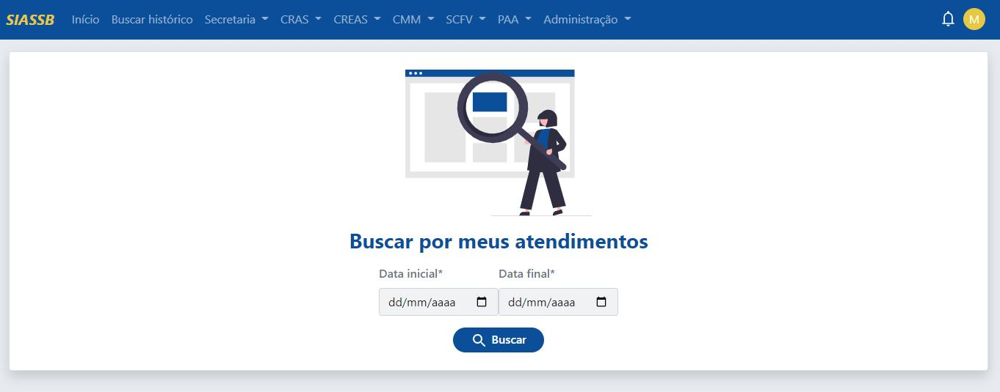
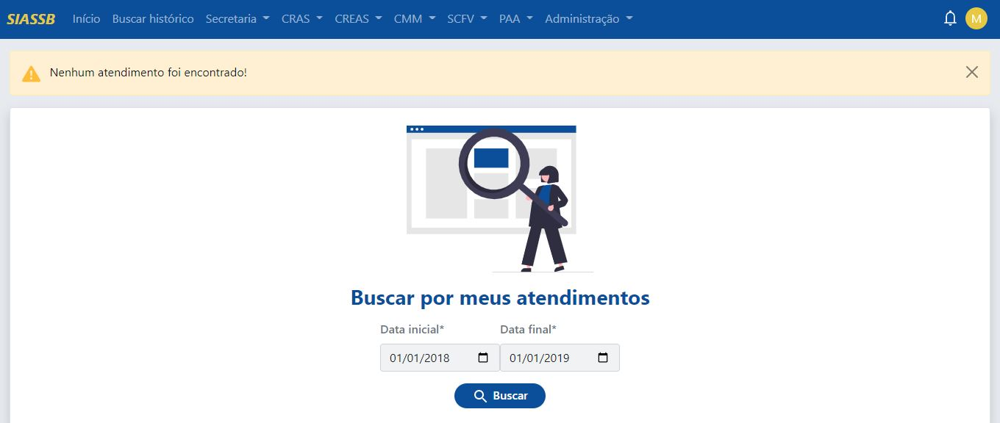
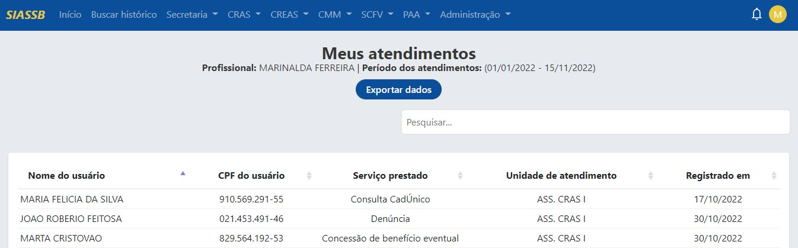

# Meus atendimentos

Para buscar pelos atendimentos realizados por você, deve-se ir em **Secretaria -> Meus atendimentos**, a seguinte tela será exibida.

- 1º passo - informar a data inicial
- 2º passo - informar a data final
- 3º passo - clicar no botão "Buscar".

Caso a busca não encontre nenhum resultado, o seguinte alerta será mostrado.

Caso a busca encontre algum resultado, os registros serão mostrados conforme a imagem abaixo.

Os dados mostrados são: nome do usuário, CPF do usuário, serviços prestados, unidade de atendimento e regitrado em.

Caso haja a necessidade de exportar os dados, basta clicar no botão "Exportar dados", os dados serão baixados no formato CSV.

:::tip Dica
A grande vantagem de exportar os dados no formato CSV é o fato dele possibilitar a importação e exportação de arquivos de uma linguagem que vários aplicativos podem ler. Aplicativos como o *Microsoft Excel*, *Google Planilhas* e *LibreOffice Calc* podem facilmente ler esse tipo de arquivo, dessa forma os dados podem ser manipulados de várias formas diferentes, sejam para fins de pesquisas e análises de dados ou até mesmo para apoiar os gestores municipais nas suas tomadas de decisões.
:::

Além disso, os dados exportados no formato CSV também podem ser importados para outros sistemas próprios da gestão municipal.
