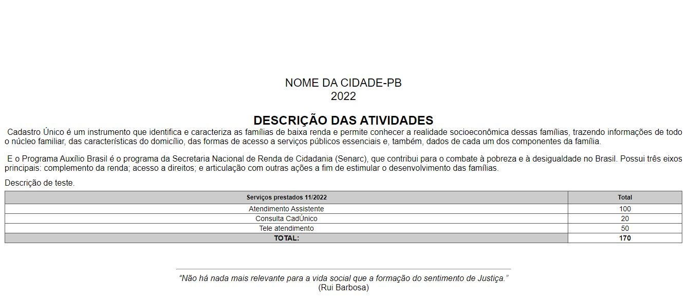
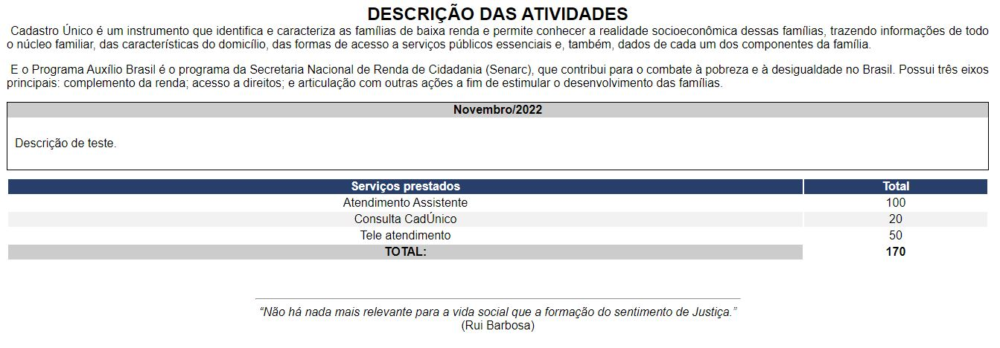

# Relatório de atividades mensais

Os relatórios de atividades mensais fazem parte da rotina de muitos profissionais que atuam no serviço público, sobretudo os de nível técnico. Eles podem servir para o órgão gestor dar os próximos passos em um projeto social ou como forma de acompanhar o trabalho de seus profissionais.

Esses documentos podem ter diferentes funções, desde serem decisivos para a tomada de decisões pelo gestor executivo ou apenas serem uma forma de acompanhar a produtividade da equipe durante o mês. 

O relatório reúne de forma organizada e detalhada o desenvolvimento de um trabalho realizado pela equipe em determinado mês.
Por exemplo: palestras, oficinas, reuniões, quantidade de atendimentos do mês, dentre outras ações/eventos. As funcionalidades disponibilizadas no sistema são:

- [Cadastrar](#cadastrar-relatório-de-atividade-mensal)
- [Ver todos os relatórios](#ver-todos-os-relatórios-de-atividades-mensais)
- [Buscar relatórios por período](#buscar-relatórios-de-atividades-mensais)

## Cadastrar relatório de atividade mensal

Para registrar um novo relatório de atividade mensal, deve-se ir em **Secretaria -> Relatórios de atividades mensais -> Cadastrar novo**, a seguinte tela será exibida.

No campo de coordenadores e assistentes sociais podem ser selecionados mais de um profissional.

:::info Importante
Atentar para o campo de descrição, onde deve ser descrito todas as atividades realizadas durante o mês. 
:::

Feito o preenchimento de todos os campos, basta clicar no botão "Cadastrar".

### Cadastro realizado com sucesso

Após o registro da atividade mensal, o sistema redireciona para a página de registros gerais, onde serão listados todos os registros de atividades mensais, veja na imagem abaixo:

Ao realizar o cadastro, o sistema emite um alerta, informando o mês/ano, caso queira registar um novo relatório, basta clicar no botão ["Cadastrar novo relatório mensal"](#cadastrar-relatório-de-atividade-mensal).

## Ver todos os relatórios de atividades mensais

Para ver todos os relatórios de atividades mensais, deve-se ir em **Secretaria -> Relatórios de atividades mensais -> Ver todos**, a seguinte tela será exibida.

O sistema organiza os relatórios por ano, ao clicar no ano o sistema ira abrir uma janela modal, conforme a iamgem abaixo:

O modal é separado pelas colunas de mês e as ações de:
- [Visualizar](#ver-relatório-individual-por-mês)
- [Editar](#editar-relatório-individual-por-mês)
- [Gerar documento (impressão)](#gerar-relatório-para-impressão)

### Ver relatório individual por mês

Formulário apenas para fins de visualização dos dados.

### Editar relatório individual por mês

Caso o profissional identificou a necessidade de alterar os dados do relatório, basta realizar as modificações necessárias, veja o formulário de edição logo abaixo.

Feita todas as alterações, basta clicar no botão "Editar".

### Gerar relatório para impressão

O relatório pode ser impresso ou salvo no formato PDF.

## Buscar relatórios de atividades mensais

Para buscar pelos relatórios de atividades mensais, deve-se ir em **Secretaria -> Relatórios de atividades mensais -> Buscar relatórios por período**, a seguinte tela será exibida.

Primeiramente deve inserir a data inicial e depois a data final, por fim clicar no botão "Gerar relatório".

Se o sistema encontrar algum registro o mesmo será exibido na tela seguinte:

