# Relatórios sociais

O relatório social é um documento específico do Assistente Social. Esse material é produzido após o profissional realizar a coleta de informações e dados relativos ao trabalho de intervenção da questão social. O relatório social serve para o assistente utilizar na produção de um parecer ou laudo social.

## Blocos dos relatórios sociais

O relatório social é dividido em sete blocos.

1. [`Identificação e controle`](#bloco-de-identificação-e-controle)
2. [`Membros da família`](#bloco-de-membros-da-família)
3. [`Anexo`](#bloco-de-anexos)
4. [`Família`](#bloco-da-família)
5. [`Tipo de benefício`](#bloco-do-tipo-de-benefício)
6. [`Despesas`](#bloco-de-despesas)
7. [`Observações técnicas`](#bloco-de-observações-técnicas)

A fim de facilitar o trabalho dos técnicos, todos os blocos possuem items númericos nos campos de preenchimento. 

### Bloco de identificação e controle

Neste bloco, é necessário registrar os dados de identificação da pessoa de referência bem como o endereço da família. A intenção desse bloco é proporcionar a equipe de referência fácil acesso a família usuária do serviço e assim melhor viabilizar o trabalho social com as famílias. Ter esses registros, além de facilitar o contato com a família, facilita também na mobilização/convite das famílias para a participação em ações e serviços ofertados pelas unidades, pela rede socioassistencial do SUAS e ainda pela rede setorial de políticas públicas.

O bloco de identificação e controle é dividido em dois sub-blocos:
- [`Identificação e controle`](#identificação)
- [`Endereço`](#endereço)

#### Identificação

Como uma forma de facilitar a identificação dos campos pelos profissionais, todos os campos deste bloco são todos númerados, conforme a imagem abaixo.

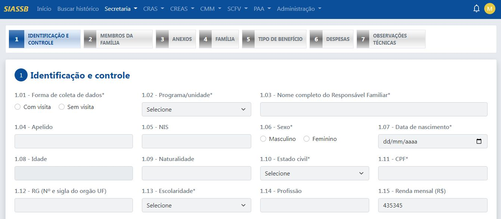

**1.01 - Forma de coleta de dados:** Selecionar a opção se o atendimento foi realizado "com visita domiciliar" ou "sem visita domiciliar".

**1.02 - Programa/unidade:** Selecionar o ponto onde está sendo realizado o atendimento.

**1.03 - Nome completo do Responsável Familiar:** Informe o nome completo da pessoa de referência da família, conforme consta na Certidão de Nascimento, Documento de Identidade, CPF ou outro documento legal. O registro dessa informação é de grande relevância para estabelecer um contato personalizado com a família.

**1.04 - Apelido:** O apelido se refere à forma como a pessoa de referência é conhecida socialmente ou como prefere ser chamada.

**1.05 - NIS:** O NIS se refere ao Número de Inscrição Social que é o número de referência do usuário no Cadastro Único. De posse deste número (NIS) os interessados podem se candidatar aos diversos programas sociais do Governo Federal, desde que atenda aos requisitos exigidos.

**1.06 - Sexo:** Este campo se refere ao sexo biológico de cada membro familiar, Masculino (M) ou Feminino (F).

**1.07 - Data de nascimento:** A data de nascimento deve constar o dia, mês e ano, seguindo o padrão dd/mm/aaaa, conforme consta no Registro Civil de Nascimento, Carteira de Identidade, CPF ou outros documentos
legais.

**1.08 - Idade:** O campo da idade é calculado automaticamente pelo sistema ao preencher o item 1.07 (data de nascimento).

**1.09 - Naturalidade:** Informar o nome do município e o estado de nascimento, conforme consta na Certidão de Nascimento, Documento de Identidade ou outro documento legal.

**1.10 - Estado civil:** É a situação de uma pessoa em relação ao matrimônio ou à sociedade conjugal, deve ser selecionado uma das seguintes opções:

- **`Solteiro(a):`** quem nunca se casou, ou teve um casamento anulado. Ou seja, todos nascemos solteiros e esse estado civil só será alterado com o casamento.
- **`Casado(a):`** quem se casou e se mantém casado.
- **`União Estável:`** É reconhecida como entidade familiar a união estável entre o homem e a mulher, configurada na convivência pública, contínua e duradoura e estabelecida com o objetivo de constituição de família.
- **`Separado(a):`** é um estado civil em extinção, já que não existem mais exigências para a homologação de divórcio, bastando que os cônjuges (aqueles que possuem matrimônio) manifestem o desejo de se divorciar. Contudo, como ele ainda está previsto no Código Civil, devemos saber que se trata daquele que ainda possui o vínculo jurídico do casamento, muito embora ele esteja dissolvido por decisão judicial.
- **`Divorciado(a):`** quem foi casado, mas teve o fim do vínculo jurídico do casamento homologado por escritura pública (divórcio extrajudicial) ou decisão judicial.
- **`Viúvo(a):`** é aquele que perdeu a condição de casado em decorrência do falecimento da pessoa com quem se casou.

**1.11 - CPF:** O CPF é destinado a pessoas físicas e é emitido pela Receita Federal. O CPF contém um número identificador que não muda mesmo em caso de segunda via do cartão.

**1.12 - RG (Nº, sigla do orgão e UF):** Anote nesse campo o número do Registro Geral (RG) contido no documento de identidade (Carteira de Identidade) da pessoa de referência, sigla do orgão emissor e o nome da Unidade Federativa no qual o RG foi registrado.

:::tip Dica
Caso a pessoa de referência não possua RG, a equipe técnica deverá realizar o encaminhamento para providenciar esse documento.
:::

**1.13 - Escolaridade:** Selecione a Escolaridade do responsável familiar, conforme a lista abaixo:

- Nunca frequentou escola
- Creche
- Educação Infantil
- 1º Ano E. Fundamental
- 2º Ano E. Fundamental
- 3º Ano E. Fundamental
- 4º Ano E. Fundamental
- 5º Ano E. Fundamental
- 6º Ano E. Fundamental
- 7º Ano E. Fundamental
- 8º Ano E. Fundamental
- 9º Ano E. Fundamental
- 1º Ano E. Médio
- 2º Ano E. Médio
- 3º Ano E. Médio
- Superior Incompleto
- Superior Completo
- EJA - Ensino Fundamental
- EJA - Ensino Médio
- Outros

**1.14 - Profissão:** Informe a profissão do RF, caso o mesmo não exerça nenhuma profissão, o campo pode ser deixado em branco ou ignorado.

**1.15 - Renda mensal (R$):** Informe nesse campo a renda mensal do RF, Essa informação é fundamental para identificar pessoas elegíveis aos programas de transferência de renda e ou benefícios assistenciais, mas que ainda não foram contempladas.

O valor da renda deve ser informado somente com números inteiros, caso o valor seja 89,90 deve-se arredondar para 89, se não trabalha e não possui nenhum outro tipo de renda, deve-se informar o valor 0.

:::caution Atenção
Para o registro de renda mensal não devem ser considerados os recursos provenientes de programas de transferência de renda como BPC ou PAB, por exemplo. 
:::

#### Endereço

Todos os campos deste sub-bloco são númerados, conforme a imagem abaixo.

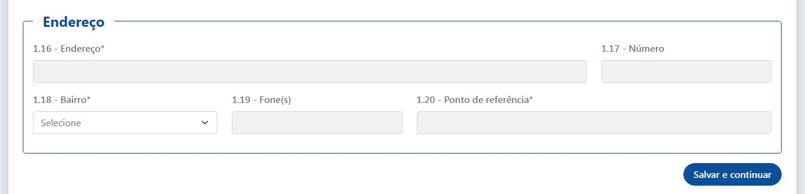

**1.16 - Endereço:** O profissional deverá registrar o local onde está situada a residência ou local de moradia da pessoa de referência considerando o nome da rua, avenida, praça, quadra e outras informações importantes que auxiliem na identificação do local onde a pessoa de referência reside.

**1.17 - Número:** Registrar o número da residência, caso não exista, informar o valor "SN" ou deixar o campo em branco.

**1.18 - Bairro:** Selecione o nome do bairro no qual está situado o local de moradia da pessoa de referência.

**1.19 - Fone(s):** Informe todos os telefones de contato da pessoa de referência ou dos indivíduos da
família, considerando o DDD e o número de telefone. 

:::tip Dica
Sugere-se registrar o número telefônico da residência, do local de trabalho, do celular e de um vizinho de referência, caso seja possível, para facilitar a localização da pessoa de referência.
:::

**1.20 - Ponto de referência:** Refere-se a um ou mais pontos estratégicos para facilitar a localização da moradia da pessoa de referência.

Por fim, basta clicar no botão "Salvar e continuar" para prosseguir para o bloco 2 ("Membros da Família").

### Bloco de Membros da família

Foi fundamentado no conceito de matricialidade sociofamiliar proposto pela PNAS (Política Nacional de Assistência Social) que o bloco da Composição Familiar foi pensado e elaborado. Sendo essencial que a equipe de referência registre nesse item e todas as informações pessoais de cada membro da família usuária do serviço, o que contribui para o planejamento da oferta qualificada dos serviços socioassistenciais .

A intenção desse bloco, além de contribuir para o planejamento do trabalho social com a família, é viabilizar o efetivo acesso da população aos seus direitos. Por exemplo, nos casos em que se identifiquem membros das famílias sem algum ou alguns dos documentos civis (CPF, RG, dentre outros), a equipe técnica deverá orientá-lo e encaminhá-lo para providenciar os documentos. 

O bloco de membros da família é dividido em dois sub-blocos:

- [`Cadastrar nova pessoa`](#cadastrar-nova-pessoa)
- [`Membros da família`](#membros-da-família)

Por padrão, ao acessar o bloco de membros da família, o mesmo já vem com o responsável familiar, pois os dados do mesmo já foram informados no bloco anterior de identificação e controle.

#### Cadastrar nova pessoa

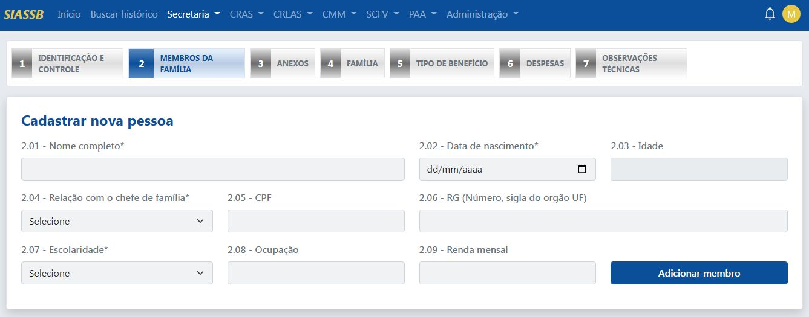

Ao preencher o campo data de nascimento, automaticamente o sistema calcula a quantidade de anos da pessoa.

**2.01 - Nome completo:** Informe o nome completo do membro familiar, conforme consta na Certidão de Nascimento, Documento de Identidade, CPF ou outro documento legal.

**2.02 - Data de nascimento:** A data de nascimento deve constar o dia, mês e ano, seguindo o padrão dd/mm/aaaa, conforme consta no Registro Civil de Nascimento, Carteira de Identidade, CPF ou outros documentos
legais.

**2.03 - Idade:** O campo da idade é calculado automaticamente pelo sistema ao preencher o item 2.02 (data de nascimento).

**2.04 - Relação com o chefe de família:** O parentesco com a pessoa de referência deve ser marcado conforme a lista de parentescos contida na seguinte lista:

**1.** Pessoa de Referência  
**2.** Cônjuge/companheiro(a)  
**3.** Filho(a)  
**4.** Enteado(a)  
**5.** Neto(a) Bisneto(a)  
**6.** Pai/Mãe  
**7.** Sogro(a)  
**8.** Irmão/irmã  
**9.** Genro/Nora  
**10.** Outro parente  
**11.** Não parente  

**2.05 - CPF:** O CPF é destinado a pessoas físicas e é emitido pela Receita Federal. O CPF contém um número identificador que não muda mesmo em caso de segunda via do cartão.

**2.06 - RG (Número, sigla do orgão e UF):** Anote nesse campo o número do Registro Geral (RG) contido no documento de identidade (Carteira de Identidade) da pessoa de referência, sigla do orgão emissor e o nome da Unidade Federativa no qual o RG foi registrado.

:::tip Dica
Caso a pessoa de referência não possua RG, a equipe técnica deverá realizar o encaminhamento para providenciar esse documento.
:::

**2.07 - Escolaridade:** Selecione a Escolaridade do responsável familiar, conforme a lista abaixo:

- Nunca frequentou escola
- Creche
- Educação Infantil
- 1º Ano E. Fundamental
- 2º Ano E. Fundamental
- 3º Ano E. Fundamental
- 4º Ano E. Fundamental
- 5º Ano E. Fundamental
- 6º Ano E. Fundamental
- 7º Ano E. Fundamental
- 8º Ano E. Fundamental
- 9º Ano E. Fundamental
- 1º Ano E. Médio
- 2º Ano E. Médio
- 3º Ano E. Médio
- Superior Incompleto
- Superior Completo
- EJA - Ensino Fundamental
- EJA - Ensino Médio
- Outros

**2.08 - Ocupação:** Informe a profissão do RF, caso o mesmo não exerça nenhuma profissão, o campo pode ser deixado em branco ou ignorado.

**2.09 - Renda mensal:** Informe nesse campo a renda mensal do RF, Essa informação é fundamental para identificar pessoas elegíveis aos programas de transferência de renda e ou benefícios assistenciais, mas que ainda não foram contempladas.

O valor da renda deve ser informado somente com números inteiros, caso o valor seja 89,90 deve-se arredondar para 89, se não trabalha e não possui nenhum outro tipo de renda, deve-se informar o valor 0.

:::caution Atenção
Para o registro de renda mensal não devem ser considerados os recursos provenientes de programas de transferência de renda como BPC ou PAB, por exemplo. 
:::

Feito todo o preenchimento dos campos, basta clicar no botão "Adicionar membro".

#### Membros da família

No sub-bloco de membros da família, serão listados todos os dados dos membros da família.
Onde será possível realizações as operações de visualizar, alterar e excluir os dados dos membros da família.

##### Visualizar membro da família

Clicando no ícone do olho, será aberta uma janela modal, onde você poderá visualizar os dados da pessoa em específico, conforme a imagem abaixo.

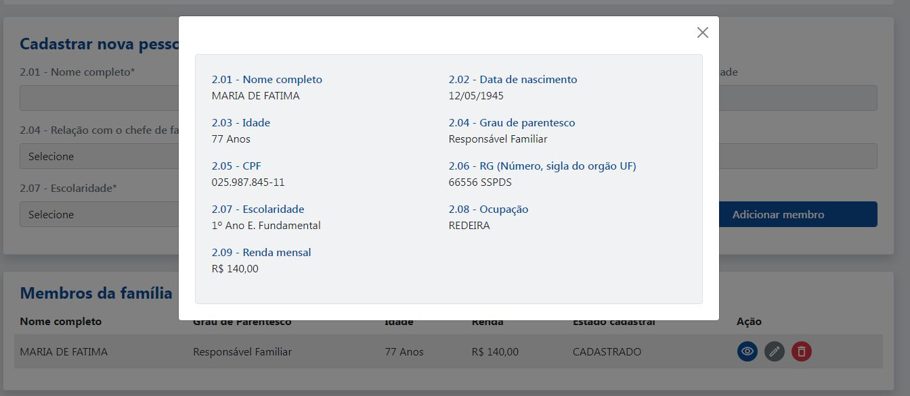

##### Editar membro da família

Clicando no ícone do lapís, será aberta uma janela modal onde você poderá editar os dados da pessoa em específico, conforme a imagem abaixo.

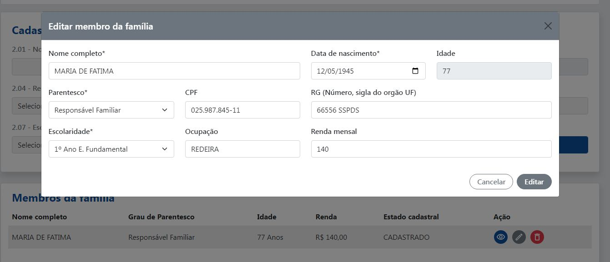

:::caution Atenção
Sempre atentar para a renda mensal, utilizar apenas números inteiros, caso não possua renda, preencher com valor 0 ou deixar em branco.
:::

##### Remover membro da família

Clicando no ícone da lixeira, será aberta uma janela modal, onde você poderá excluir uma pessoa da família, conforme a imagem abaixo.

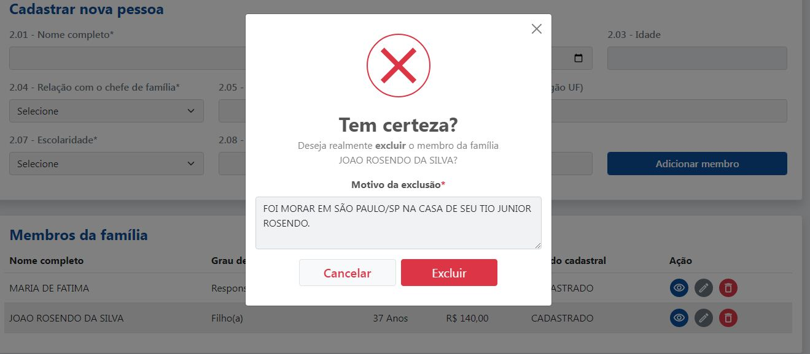

Para realizar a exclusão de uma pessoa, é obrigatório informar o motivo. 

Realizada a exclusão da pessoa, os dados ainda podem ser visualizados, para isso basta ir no registro da pessoa que foi excluída, ir na coluna Estado cadastral	e clicar em "EXCLUÍDO", irá ser aberta uma janela modal informando o motivo da exclusão, data e quem excluiu. 

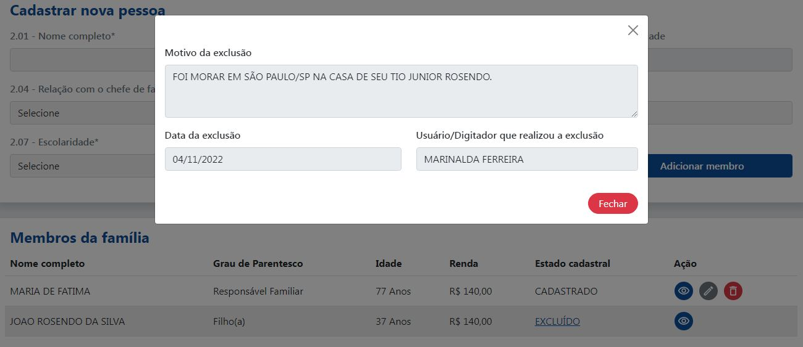

Realizada a inclusão de todos os membros da família, o próximo passo é prosseguir para o bloco de Anexos, basta clicar no botão "Continuar".

### Bloco de anexos

Neste bloco devem ser anexados os documentos da família, veja na imagem abaixo.

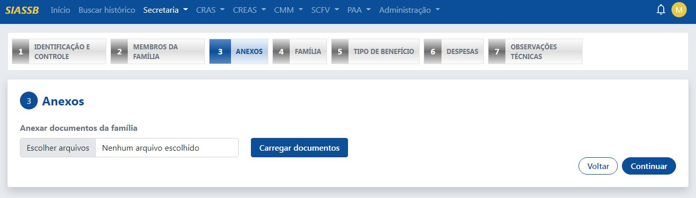

Antes de iniciar o processo de anexo de documentos, recomendamos que a documentação seja escaneada e convertida para o formato PDF.

Com toda a documentação no formato PDF, basta clicar em escolher arquivos e depois clicar no botão "Carregar documentos".

:::caution Atenção
A funcionalidade de anexar documentos não é obrigatória! Caso o técnico observou que não há a necessidade de anexar documentos da família, deve pular para o próximo bloco, clicando no botão "Continuar".
:::

### Bloco da família

A intenção desse bloco é possibilitar aos técnicos uma leitura do acesso da família aos programas sociais/transferência de renda, com o objetivo de promover uma reflexão sobre as peculiaridades que podem impactar na dinâmica familiar e assim implementar ações adequadas às experiências vividas pela família.

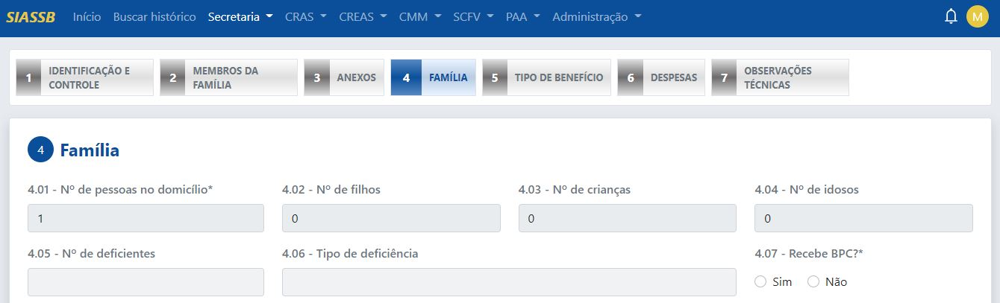
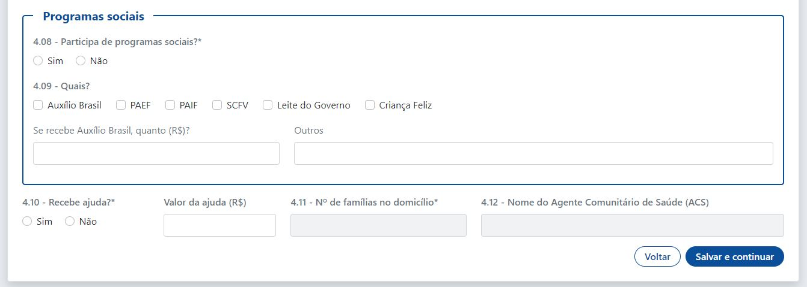

**4.01 - Nº de pessoas no domicílio** Este campo é preenchido automaticamente, conforme a quantidade de pessoas declarada na composição familiar. 

**4.02 - Nº de filhos** Este campo é preenchido automaticamente e voltado somente para leitura, conforme a quantidade de filhos declarado no bloco 2 (composição familiar). 

**4.03 - Nº de crianças** Este campo é preenchido automaticamente, conforme a quantidade de crianças declaradas no bloco 2 (composição familiar).

**4.04 - Nº de idosos** Este campo é preenchido automaticamente, conforme a quantidade de idosos declarados no bloco 2 (composição familiar).

**4.05 - Nº de deficientes** Es

Neste bloco, serão mostrados campos relacionados a família. O campo Nº de deficientes deve ser preenchido com números inteiros, caso a família não tenha nenhum deficiente em sua composição familiar, é recomendado preencher este campo com o valor 0 ou deixar vazio. Caso existem membros com deficiência, informar o tipo.

No sub-bloco de programas socias, caso a família participe de algum programa, seja a nível nacional, estadual ou a nível municipal, deve ser marcado com "Sim", e selecionar os programas que a família participa ou é beneficiado.

Caso a família receba alguma ajuda financeira, o valor da ajuda deve ser um valor do tipo inteiro.

Com relação ao Nº de famílias no domicílio, caso sejam famílias conviventes, devem ser informado mais de uma família, caso contrário o valor informado deve ser 1.

:::info Importante
Os campos Nº de pessoas no domicílio, Nº de filhos, Nº de crianças, Nº de idosos são preenchidos de forma automática pelo sistema.
:::

Para prosseguir para o próximo bloco, basta clicar no botão "Salvar e continuar".

### Bloco do tipo de benefício

Neste bloco, deve ser selecionado o tipo de benefício, se é um benefício do tipo Auxílio Brasil ou Benefício Eventual, conforme a imagem abaixo.

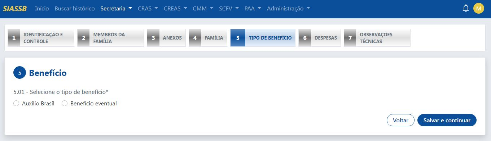

Caso o benefício seja do tipo auxílio brasil, selecionar e prosseguir para o próximo bloco, clicando no botão "Salvar e continuar".

Caso o tipo de benefício, seja benefício eventual, será exibida uma nova tela, conforme a imagem abaixo.

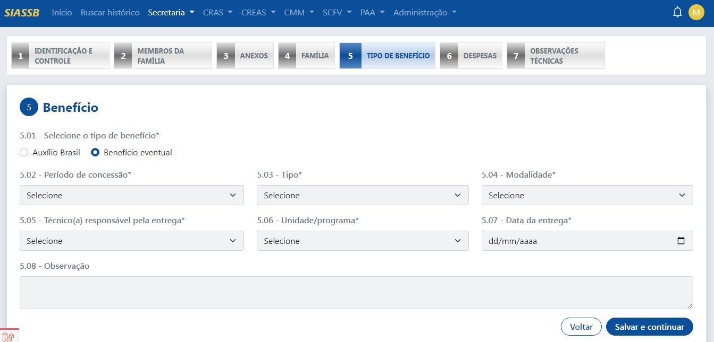

:::info Importante
O período de concessão é relacionado a quantidade de meses que o benefício será concedido.
:::

Após o preenchimento de todos os campos, basta prosseguir para o próximo bloco, clicando no botão "Salvar e continuar".

### Bloco de despesas

Neste bloco devem ser registradas as seguintes despesas, conforme a imagem abaixo.

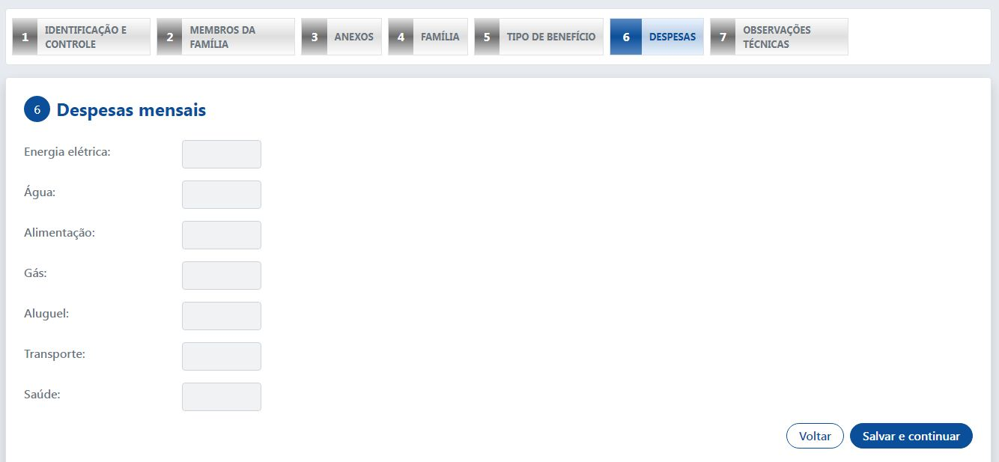

- Energia elétrica (despesa mensal que a família possui com energia elétrica)
- Água (despesa mensal que a família possui com água)
- Alimentação (despesa mensal que a família possui com produtos alimentícios)
- Gás (despesa mensal que a família possui com gás de cozinha)
- Aluguel (despesa mensal que a família possui com aluguel de casa)
- Transporte (despesa mensal que a família possui com gastos de transporte)
- Saúde (despesa mensal que a família possui com medicamentos)

:::caution Atenção
Todos os campos, onde existe despesa comprovada, devem ser preenchidos com números inteiros. 

Por exemplo: se o valor da energia elétrica for R$ 86,54 deve ser inserido o valor de 86.
:::

:::info Importante
Caso a família não possua despesas em alguns dos campos informados acima, é recomendado preencher estes campos com o valor 0 ou deixar vazio.
:::

Relizada tadas as alterações necessárias, o próximo passo é clicar no botão "Salvar e continuar".

### Bloco de observações técnicas

É o bloco final para finalizar o relatório feito pelo assistente social, veja na imagem abaixo.

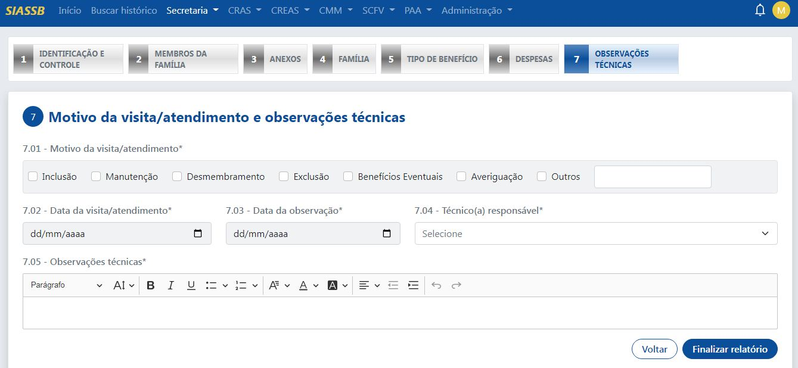

No campo de motivo da visia/atendimento podem ser selecionadas mais de uma opção, caso não exista a opção a ser selecionada, basta marcar a opção outros e informar o motivo no campo a frente.

Já no campo de observações técnicas devem ser escrita toda a observação realizada pelo assistente social durante o atendimento.

Por fim, basta clicar no botão "Finalizar relatório" que o sistema irá redirecionar para a seguinte página.

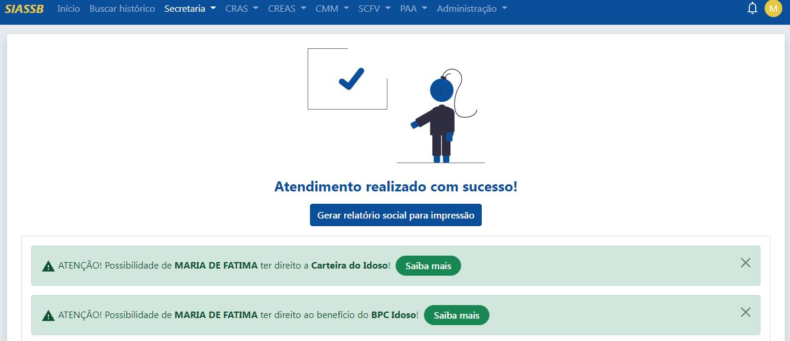

Com isso, o atendimento foi finalizado e o assistente social poderá realizar a impressão do relatório social. Além disso o sistema exibe alertas sobre a possibilidade da família que foi atendida ter direito a outros benefícios sociais.

## Consultar relatório social

Para buscar um relatório social, deve ir em **Secretaria -> Relatórios socias -> Buscar**, a seguinte tela será exibida.

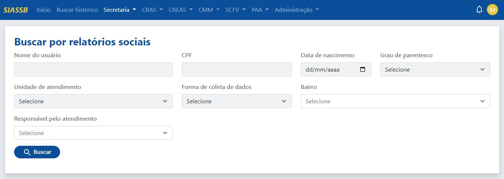

Após selecionado os parâmetros de busca, deve-se clicar no botão "Buscar".

### Visualizando registros

Caso a pesquisa seja bem sucedida, o sistema irá redirecionar para a página de registros, conforme a imagem abaixo.

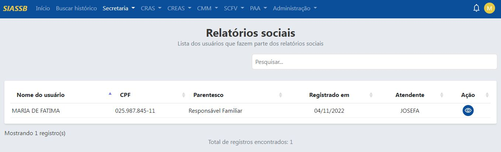

Os registros são exibidos com as seguintes colunas: nome do usuário, CPF, parentesco, data de registro, atendente, e ações.

Na opção de ações temos o ícone de visualizar os dados, basta clicar que o sistema irá redirecionar para uma nova página divida nas abas:
`
- [`Dados da família`](#aba-dados-da-família)
- [`Indetificação e controle`](#aba-identificação-e-controle)
- [`Componentes da família`](#aba-componentes-da-família)
- [`Anexos`](#aba-anexos)
- [`Família`](#aba-família)
- [`Benefício`](#aba-benefício)
- [`Despesas`](#aba-despesas)
- [`Motivo da visita/Atendimento`](#aba-motivo-da-visitaatendimento)

### Aba dados da família

Na aba de dados da família é mostrado um resumo dos dados cadastrais do relatório social, além disso também possui a opção de gerar uma folha reusmo (caso a família necessite) e de gerar o relatório social para impressão.

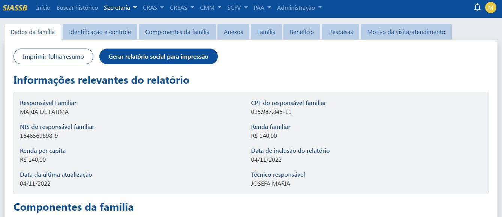
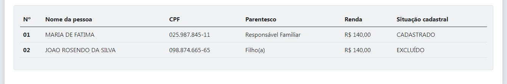

### Aba identificação e controle

Nesta aba, o assistente social poderá realizar a alteração dos dados, conforme a imagem abaixo.

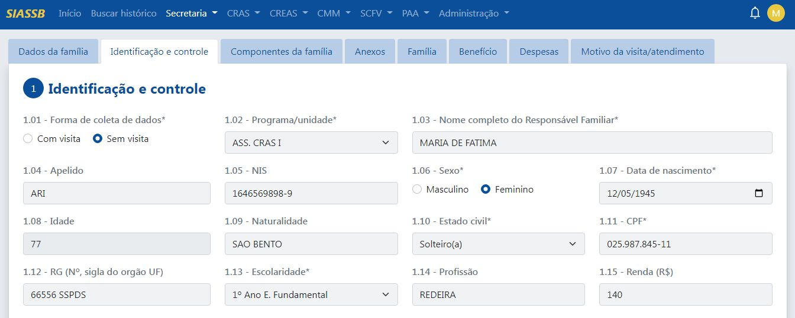
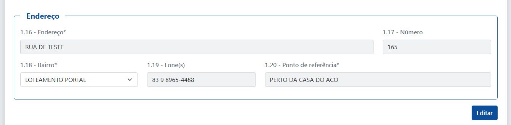

Realizada todas as modificações, basta clicar no botão "Editar".

### Aba componentes da família

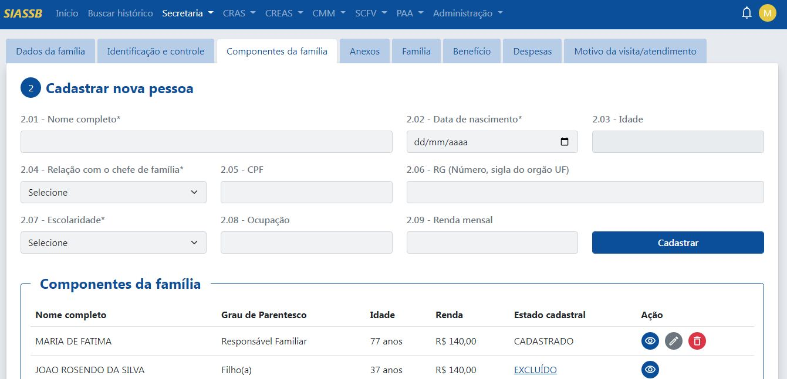

O processo de registro, visualização, alteração e exclusão dos dados das pessoas deve ser seguido, corforme o [`bloco de membros da família`](#bloco-de-membros-da-família).

### Aba anexos

O processo de anexo dos documentos da família devem ser seguidos, corforme o [`bloco de anexos`](#bloco-de-anexos).

### Aba família

Nesta aba, o assistente social poderá realizar a alteração dos dados, conforme a imagem abaixo.

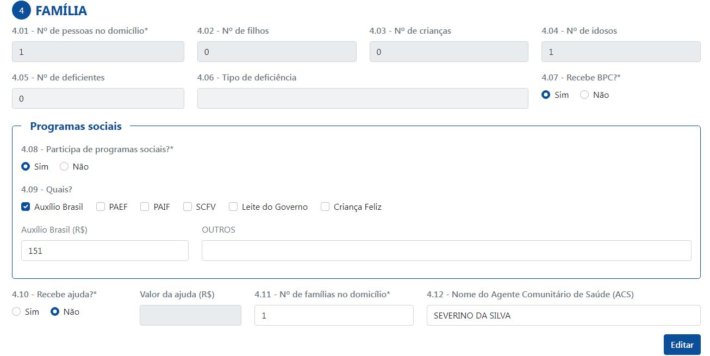

Realizada todas as modificações, basta clicar no botão "Editar".

### Aba benefício

Na aba de benefício, os dados só podem ser visualizados, com isso, não existem alterações de dados nessa aba, veja na imagem abaixo.

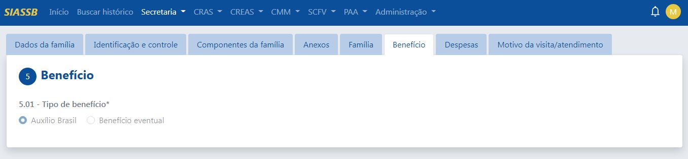

### Aba despesas

Nesta aba, o assistente social poderá realizar a alteração dos dados, conforme a imagem abaixo.

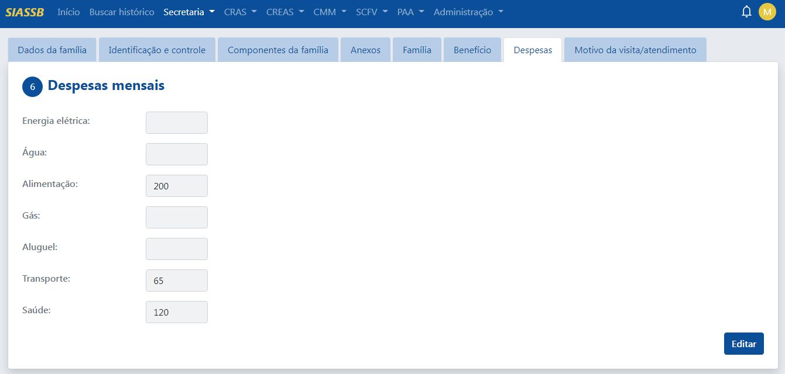

Realizada todas as modificações, basta clicar no botão "Editar".

### Aba motivo da visita/Atendimento

Nesta aba, o assistente social poderá realizar a alteração dos dados, conforme a imagem abaixo.

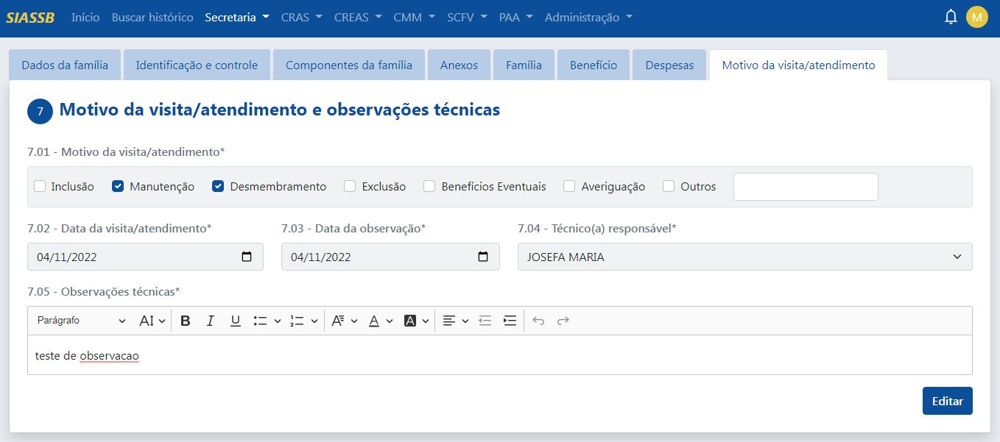

Realizada todas as modificações, basta clicar no botão "Editar".

## Ver relatórios nominais

Para ver um relatório nominal, deve-se ir em **Secretaria -> Relatórios socias -> Ver relatórios nominais**, a seguinte tela será exibida.

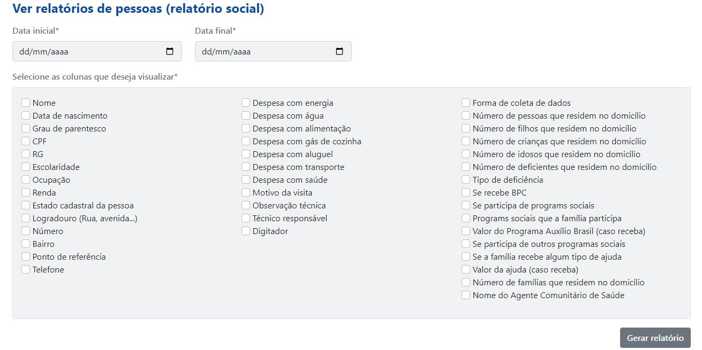

Para buscar por um relatório nominal, primeiramente selecionar a data de inicial e a data final, depois selecionar os campos que deseja visualizar, será aberta uma nova aba conforme a pesquisa informada, veja na imagem abaixo.

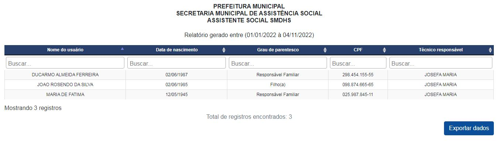

A página pode ser impressa ou salva no formato PDF. Clicando no botão "Exporta dados", os dados serão exportados no formato CSV.

:::tip Dica
A grande vantagem de exportar os dados no formato CSV é o fato dele possibilitar a importação e exportação de arquivos de uma linguagem que vários aplicativos podem ler. Aplicativos como o Microsoft Excel, Google Planilhas e LibreOffice Calc podem facilmente ler esse tipo de arquivo, dessa forma os dados podem ser manipulados de várias formas diferentes, sejam para fins de pesquisas e análises de dados ou até mesmo para apoiar os gestores municipais nas suas tomadas de decisões.
:::

Além disso, os dados exportados no formato CSV também podem ser importados para outros sistemas próprios da gestão municipal.

## Ver gráficos/relatórios quantitativos

Para ver gráficos dos relatórios sociais, deve-se ir em **Secretaria -> Relatórios socias -> Ver relatórios gráficos/relatórios quantitativos**, a seguinte tela será exibida.

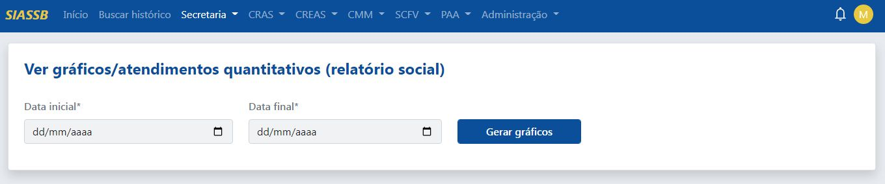

Informar sempre uma data inicial e uma data final e depois clicar no botão "Gerar gráficos", se a busca encontrar algum registro, a tela será renderizada com os seguintes gráficos.

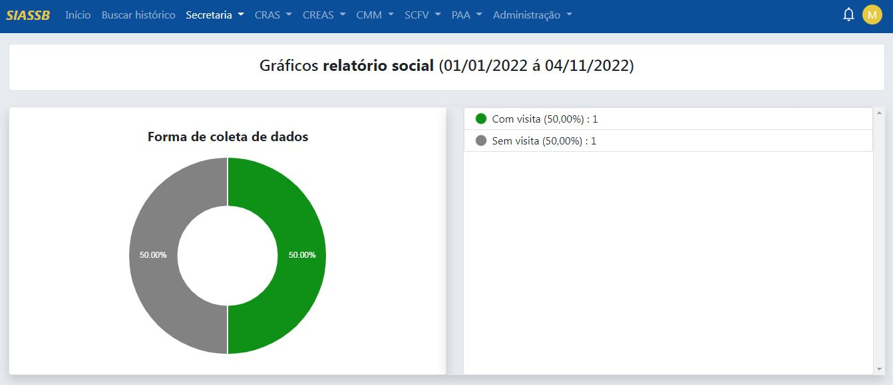
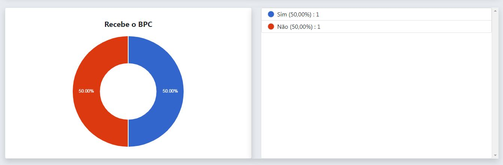
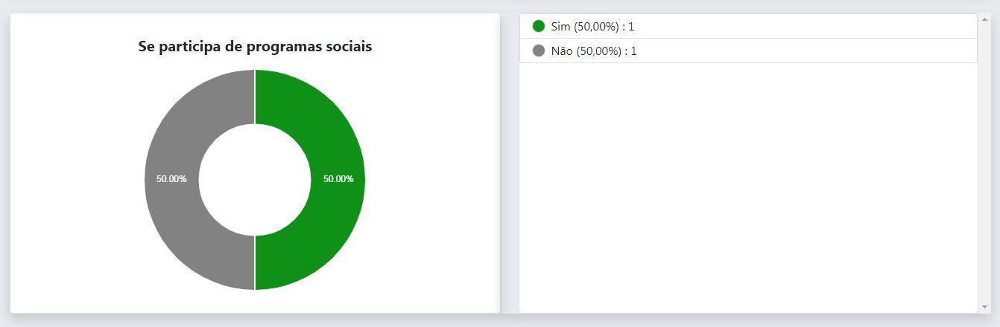
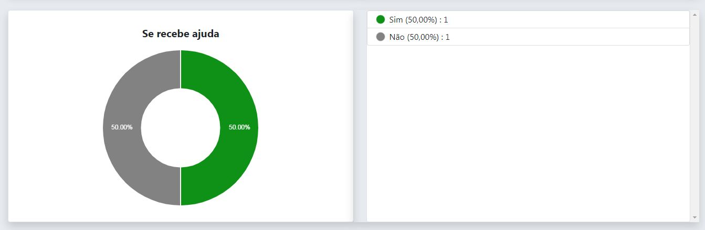
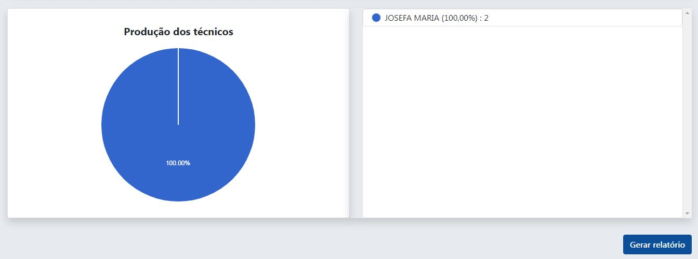

Além disso, no fim da página existe a possibilidade de gerar um relatório analítido dos dados gerados pelos gráficos. Clicando em "Gerar relatório", o sistem vai exibir uma nova página, veja na imagem abaixo.

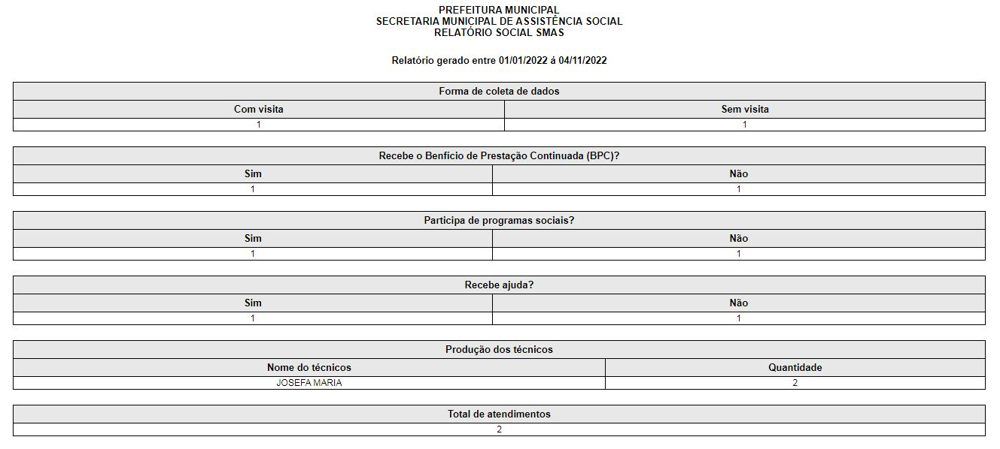
