# Agendamentos

Funciona da seguinte forma, o usuário pergunta ao profissional da recepção quais são as datas e os horários disponíveis para agendamento, o profissional verifica os dias e os horários vagos e realiza a marcação em minutos. Com isso, o usuário não tem que lidar com filas ou telefones ocupados.

Há uma série de benefícios decorrentes da utilização dos agendamentos, onde podemos citar, mais agilidade no atendimento, redução do número de faltas, horário otimizado e melhor gestão de atendimentos.

As principais funcionalidades no sistema são:

- [Realizar agendamento](#realizar-agendamento-do-usuário)
- [Buscar agendamento](#buscar-agendamento)
- [Ver usuários agendados para hoje](#ver-usuários-agendados-para-hoje)
- [Ver usuários agendados (todos)](#ver-usuários-agendados-todos)
- [Registrar perídodo de agendamento](#registrando-período-de-agendamento)
- [Remover perídodo de agendamento](#removendo-período-de-agendamento)
- [Ver relatórios nominais](#ver-relatórios-nominais)
- [Serviços disponíveis para agendamento](#serviços-disponíveis-para-agendamento)
- [Unidades disponíveis para agendamento](#ativando-unidades-para-receber-agendamentos)

## Registrando período de agendamento

Inicialmente devemos registrar um período de agendamento, após o processo de login no sistema, devemos ir em **Secretaria -> Agendamentos -> Registrar período de agendamento**, o sistema irá exibir a tela, conforme a imagem abaixo:

Perceba que o registro de um novo período de atendimento foi negado, mostrando a seguinte mensagem: não existem unidades de atendimento vinculadas para o seu perfil de atendimento!

Com isso, devemos fazer uma vinculação e ativar as unidades de atendimento que irão receber agendamentos.

### Ativando unidades para receber agendamentos

Conforme a imagem acima e clicando no botão "Ver unidades disponíveis", seremos redirecionados para uma nova tela, veja abaixo:

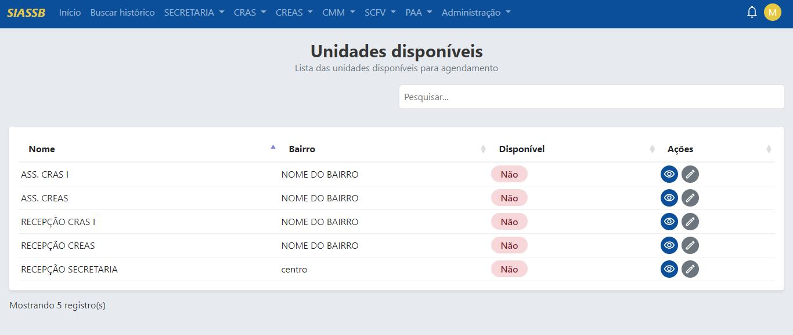

Perceba que na coluna disponível, todas estão marcadas como "Não", iremos ativar a unidade de atendimento "RECEPÇÃO SECRETARIA" para isso devemos ina na coluna ações e clicar no ícone do lápis referente ao registro correspondente. Clicando no ícone do lápis será mostrada a seguinte página.

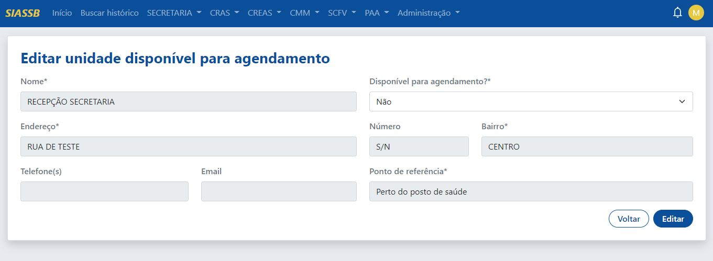

Perceba que o campo "Disponível para agendamento?*" está marcado como "Não", devemos alterar o valor deste campo para "Sim" e depois clicar no botão "Editar". Após essa alteração, seremos redirecionados novamente para a tela das unidades disponíveis para agendamento.

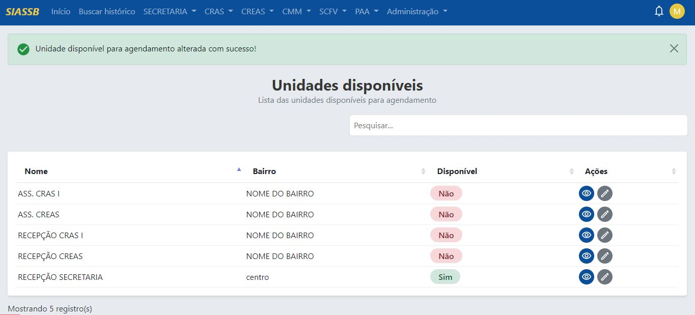

Agora a unidade de atendimento "RECEPÇÃO SECRETARIA" está disponível para agendamento, assim podemos voltar novamente para a página de registrar período de agendamento, em: **Secretaria -> Agendamentos -> Registrar período de agendamento**.

O processo de registrar período de agendamento é dividido em 2 etapas:
1. Registrar data de agendamento
2. Registrar horário de agendamento

### Registrando data de agendamento

Automaticamente a unidade "RECEPÇÃO SECRETARIA" já apareceu, basta agora apenas informar a data que serão realizados os agendamentos futuros, para fins de teste a data informada será 25/11/2022, depois basta clicar em "Registrar data". 

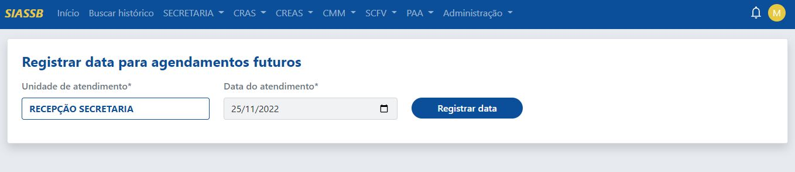

:::caution Atenção
A data do atendimento informado deve ser superior a data atual, por exemplo se a data de hoje for 02/11/2022, a data do atendimento deve ser no mínimo 03/11/2022.
:::

### Registrando horário de agendamento

Após clicar em registrar data, haverá um redirecionamento para a tela de registrar horário, conforme a imagem abaixo.

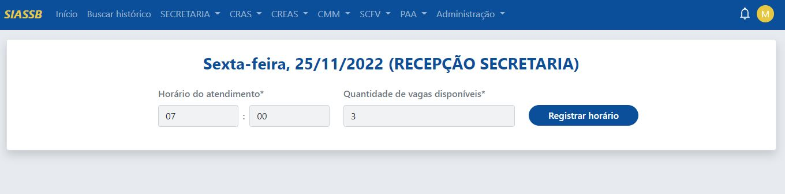

Como foi informado a data 25/11/2022, automaticamente o sistema já exibe o dia (sexta-feira) como uma forma de facilitar o trabalho do profissional.

Por fim, para registrar o período, deve inicialmente informar o horário e depois a quantidade de vagas. No exemplo acima, estamos definindo o horário as 07:00 e inserindo 3 vagas disponíveis, sendo assim, teremos 3 vagas agendadas para o dia 25/11/2022 às 07:00. Depois basta clicar em "Registrar horário".

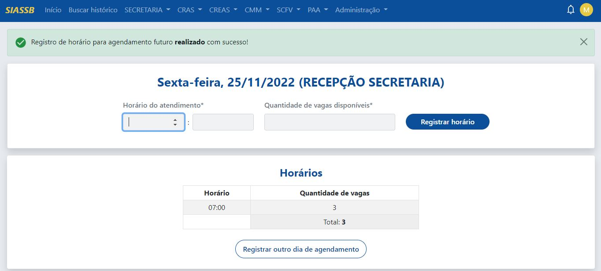

Perceba que apareceu um novo bloco abaixo, onde são mostrados todos os horários agendados para o dia 25/11/2022. Vamos adicionar um novo horário, ás 08:00 com 4 vagas disponíveis.

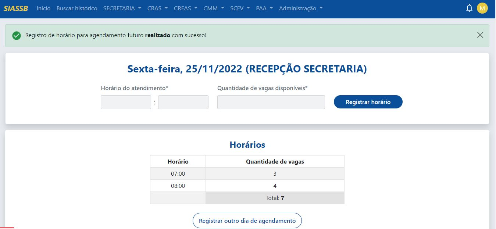

Perceba que foi adicionado um novo horário ás 08:00 com 4 vagas disponíveis, caso o profissional queira adicionar uma nova data para agendamento, basta repetir o [processo inicial](#registrando-data-de-agendamento) ou clicar no botão "Registrar outro dia de agendamento".

## Removendo período de agendamento

As vezes, uma data pode ter sido agendada de forma errada, ou foi feito um agendamento para um feriado, pensando nisso, existe a funcionalidade de remover um determinado período de agendamento. Para isso, devemos ir em **Secretaria -> Agendamentos -> Remover período de agendamento**, o sistema irá exibir a tela, conforme a imagem abaixo:

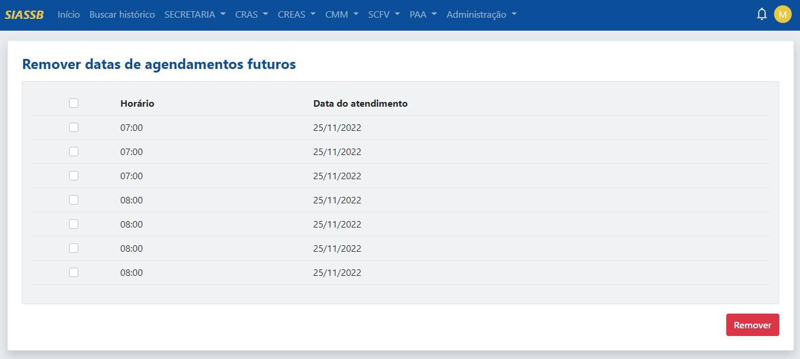

O sistema exibe a data e o horário do agendamento com as suas respectivas vagas, o profissional pode selecionar um ou mais horários e depois basta clicar no botão "Remover".

## Serviços disponíveis para agendamento

Antes de iniciar o processo de agendamento dos usuários, devemos registrar os serviços disponíveis para agendamento, para isso, vá em **Secretaria -> Agendamentos -> Serviços disponíveis para agendamento**.

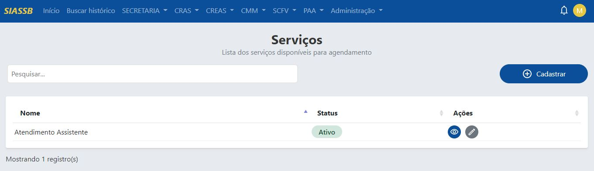

Por padrão o sistema já vem com um serviço disponível chamado "Atendimento Assistente", caso esse tipo de serviço não seja disponível, basta inativar ou editar.

Vamos registrar um novo serviço clicando no botão "Cadastrar".

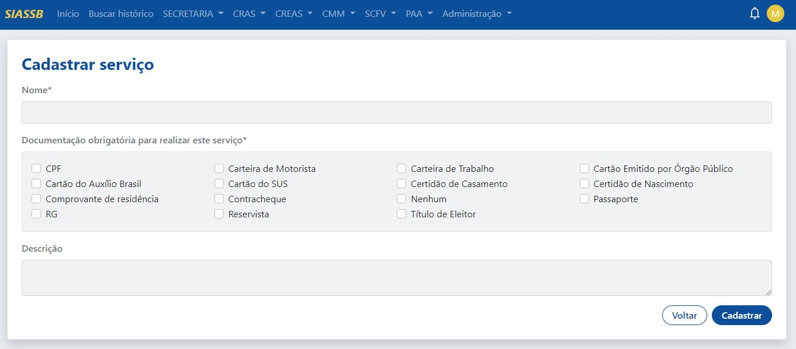

Para cadastrar um novo serviço, deve-se informar o nome do serviço e selecionar a documentação necessária para realizar aquele tipo de serviço, a descrição não é um campo obrigatório, assim iremos criar o serviço chamado "Atualização CadÚnico", conforme a imagem abaixo.

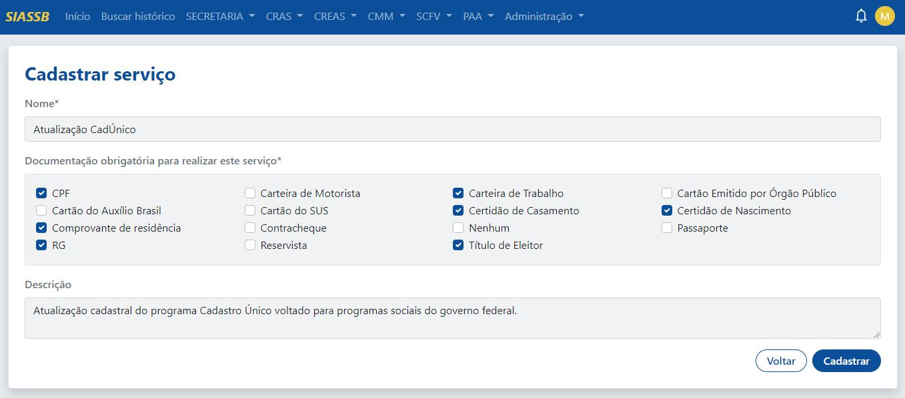

Criado o serviço, haverá um redirecionamento para a página de serviços disponíveis para agendamento.

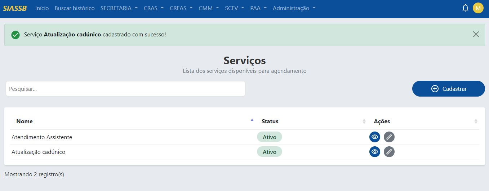

Com os serviços disponíveis para agendamento, o próximo passo é registrar o agendamento do usuário.

## Realizar agendamento do usuário

Para realizar o agendamento do usuário, devemos ir em **Secretaria -> Agendamentos -> Realizar agendamento**.

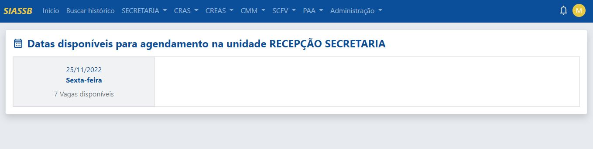

Como anteriormente foi registrado um período de agendamento, logo o sistema consegue identificar e já mostrar os dias e a quantidade de vagas disponíveis, assim facilitando todo o processo de agendamento. Ao clicar em cima da data, o sistema irá redirecionar para a seguinte tela.

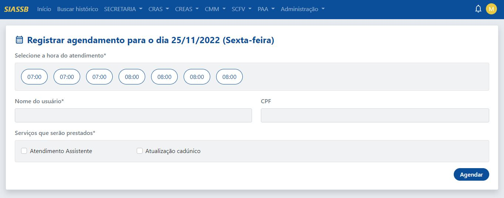

Primeiramente deve selecionar um horário disponível para agendamento (no exemplo acima 07:00 ou 08:00), informar o nome do usuário, CPF (não obrigatório, mas recomendado), e os serviços que serão prestados.

Feito o agendamento do usuário, haverá o redirecionamento para a tela de impressão do comprovante de agendamento.

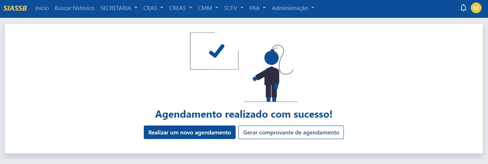

### Imprimindo o comprovante de agendamento

Ao clicar em "Gerar comprovante de agendamento", o sistema irá abrir o comprovante em uma nova aba.

:::tip Dica
O comprovante de agendamento pode ser impresso numa impressora comum multifuncional ou através de uma impressora térmica, recomendamos que a impressão seja realizada utilizando uma impressora térmica, pois haverá uma grande economia de papel.
:::

## Ver usuários agendados para hoje

Para ver os usuários agendados para hoje, basta ir em **Secretaria -> Agendamentos -> Ver usuários agendados para hoje**.

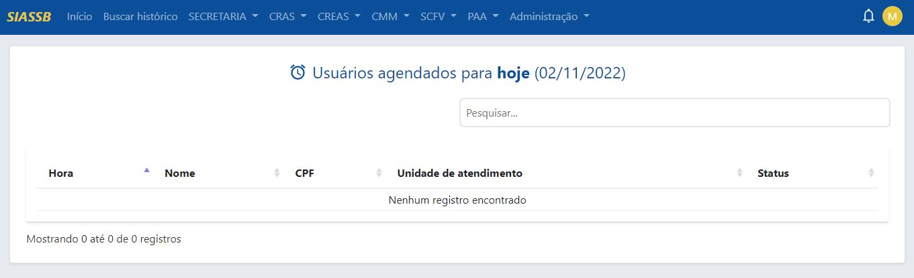

Como podemos observar, nenhum registro foi encontrado pois não temos agendamentos para esta data.

## Ver usuários agendados (todos)

Para ver os usuários agendados para hoje, devemos ir em **Secretaria -> Agendamentos -> Ver usuários agendados (todos)**.

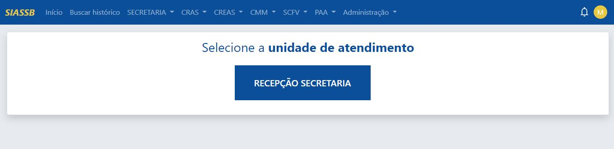

Devemos selecionar a unidade que possui agendamento para prosseguir com a visualização dos usuários agendados.

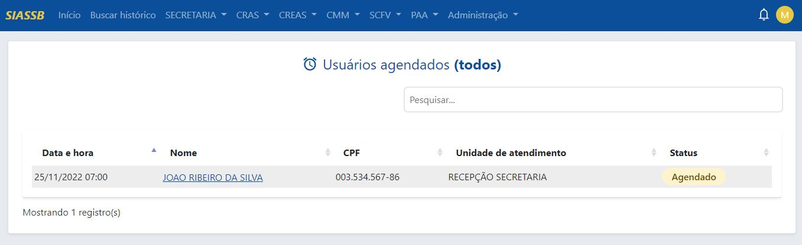

Como mostrado na imagem acima, existe um usuário agendado para a data 25/11/2022 com o status agendado.

Para ver mais informações do agendamento, basta clicar em cima do nome do usuário.

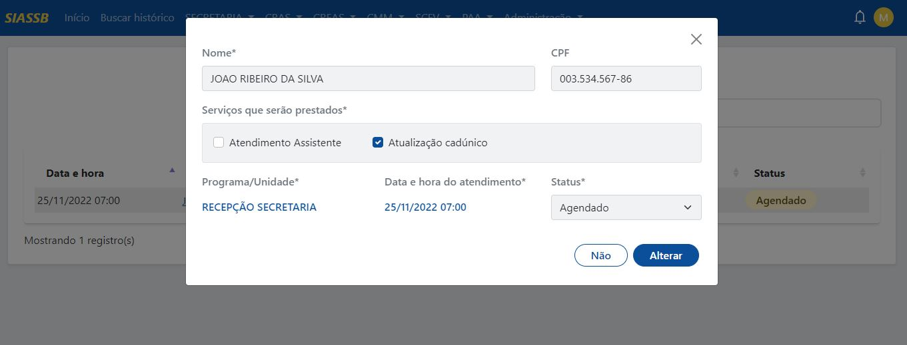

### Alterando o status do agendamento

Ao clicar no nome do usuário uma janela modal será aberta, caso queria mudar o status do atendimento, basta selecionar o novo status e clicar em "Alterar".

:::info Importante
Os tipos de status são:
- **Agendado** (usuário agendado para uma data futura)
- **Atendimento realizado** (usuário compareceu ao local e foi atendido)
- **Remarcado** (usuário solicitou uma remarcação de seu agendamento)
- **Não aguardou o atendimento** (usuário por algum motivo/imprevisto, decidiu não aguardar o atendimento)
- **Não compareceu** (usuário não compareceu na data do seu atendimento)
- **Cancelado** (operação realizada pelo profissional ou pelo sistema de forma automática)
:::

Além disso, outros dados do usuário também podem ser alterados. Feito a alteração, o status do agendamento irá mudar, conforme imagem abaixo:

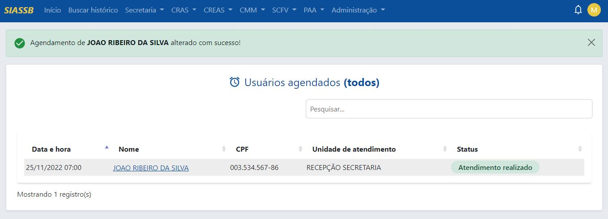

## Buscar agendamento

Para realizar uma busca por um determinado agendamento, basta clicar em **Secretaria -> Agendamentos -> Buscar agendamento**, o sistema irá mostra uma nova tela, conforme a imagem abaixo:

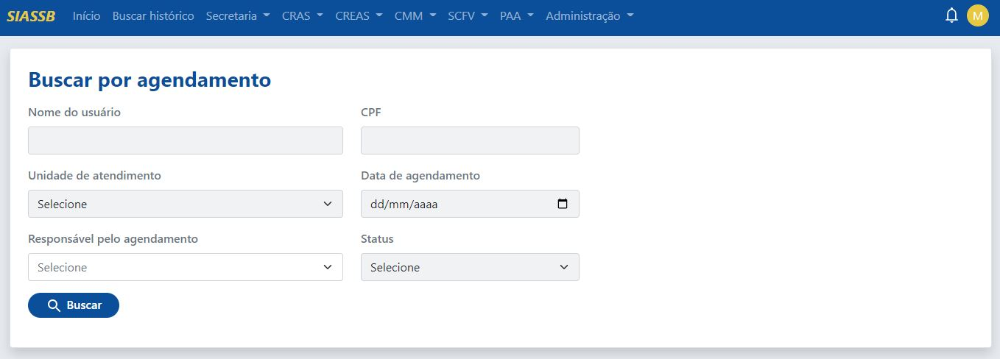

A busca pode ser realizada pelo nome do usuário, CPF, unidade de atendimento, data do agendamento, responsável pelo atendimento e status.

:::tip Dica
O nome do usuário pode ser pesquisado em partes, ou seja, no lugar de digitar MARIA DA SILVA, pode ser digitado apenas MARIA que o sistema vai encontrar todas as MARIA's e retornar o resultado.
:::

:::note Nota
Não é necessário realizar a busca por todos os campos, basta preencher um determinado campo que o sistema faz a busca normalmente.
:::

Ao clicar no botão de **Buscar** e a pesquisa encontrar algum resultado conforme os parâmetros informados, o sistema vai exibir a seguinte página:

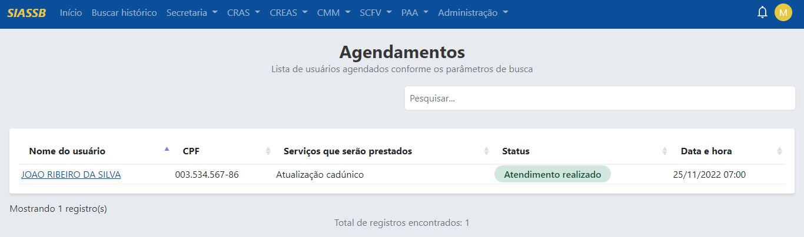

O sistema vai exibir uma tabela com vários registros, com as colunas de nome do usuário, CPF, data de registro e serviços que serão prestados, status, data e hora, ao clicar no nome do usuário, o sistema vai mostrar 4 abas:

1. [`Resumo`](#aba-resumo)
2. [`Editar dados`](#aba-editar-dados)
3. [`Editar status do agendamento`](#aba-status-do-agendamento)
4. [`Ver comprovante de agendamento`](#aba-ver-comprovante-de-agendamento)

### Aba resumo

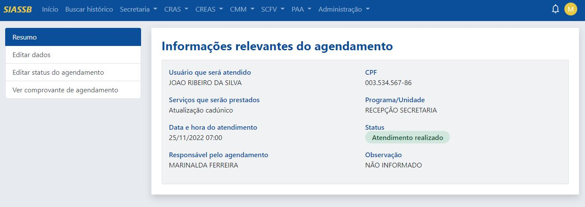

Na aba resumo é onde são exibidas as informações relevantes do agendamento, como nome do usuário, CPF, serviços que serão prestados, Programa/Unidade, data e hora do agendamento, status, responsável pelo atendimento e observações.

### Aba editar dados

Já na aba de editar dados, o profissional poderá alterar os dados daquele agendamento em específico, realizando as alterações pertinentes e depois basta clica no botão "Alterar agendamento".

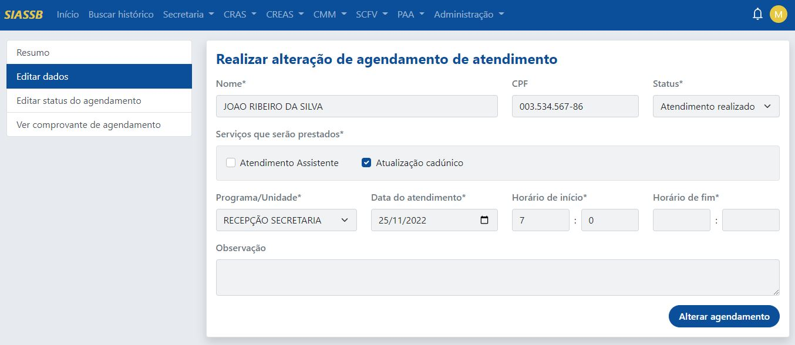

### Aba status do agendamento

Na aba de status do agendamento, o profissional poderá alterar o status daquele agendamento em específico, como também inserir o motivo e depois basta clica no botão "Alterar status".

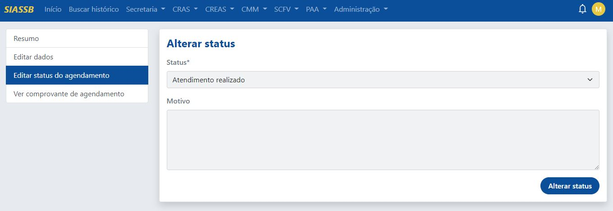

### Aba ver comprovante de agendamento

Ao clicar em ver comprovante de agendamento, será aberta uma nova aba no navegador para impressão, conforme já mencionado [aqui](#imprimindo-o-comprovante-de-agendamento).

## Ver relatórios nominais

Para realizar uma busca por um relatório nominal, basta clicar em **Secretaria -> Agendamentos -> Ver relatórios nominais**, o sistema irá mostra uma nova tela, conforme a imagem abaixo:

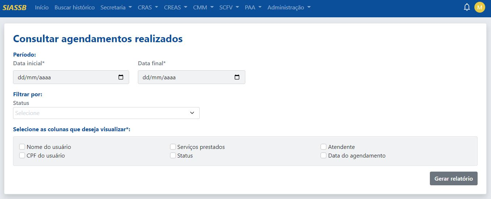

Os relatórios nominais nos dão a possibilidade de identificarmos quem foram os usuários que foram agendados. Para isso, deve-se inserir uma data inicial e uma data final, selecionar um tipo de filtro de status, e por fim selecionar as colunas que deseja visualizar. Com isso, é gerado o relatório, conforme a imagem abaixo.

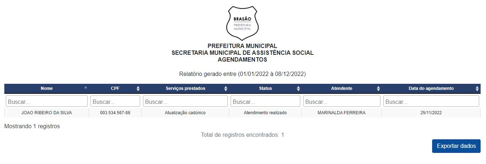

Assim, os registros realizados na triagem podem ser impressos, salvos no formato PDF. Além disso, os dados podem ser salvos clicando no botão "Exportar dados", os dados serão baixados no formato CSV.

:::tip Dica
A grande vantagem de exportar os dados no formato CSV é o fato dele possibilitar a importação e exportação de arquivos de uma linguagem que vários aplicativos podem ler. Aplicativos como o *Microsoft Excel*, *Google Planilhas* e *LibreOffice Calc* podem facilmente ler esse tipo de arquivo, dessa forma os dados podem ser manipulados de várias formas diferentes, sejam para fins de pesquisas e análises de dados ou até mesmo para apoiar os gestores municipais nas suas tomadas de decisões.
:::

Além disso, os dados exportados no formato CSV também podem ser importados para outros sistemas próprios da gestão municipal.
