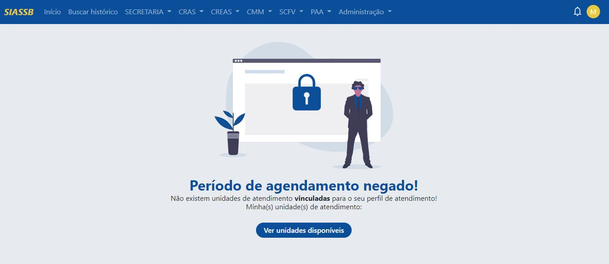
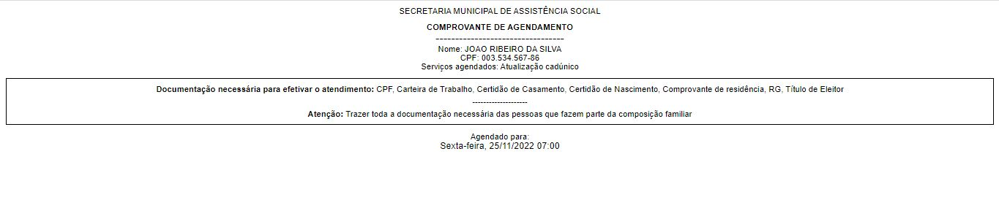

# Agendamentos

Há uma série de benefícios decorrentes da utilização dos agendamentos, onde podemos citar, mais agilidade no atendimento, redução do número de faltas, mais facilidade para novos cadastros e melhor gestão dos atendimentos.

## Registrando período de agendamento

Inicialmente devemos registrar um período de agendamento, após o processo de login no sistema, devemos ir em **Secretaria -> Agendamentos -> Registrar período de agendamento**, o sistema irá exibir a tela, conforme a imagem abaixo:

Perceba que o registro de um novo período de atendimento foi negado, mostrando a seguinte mensagem: não existem unidades de atendimento vinculadas para o seu perfil de atendimento!

Com isso devemos fazer uma vinculação e ativar uma determinada unidade de atendimento, para que a unidade possa receber agendamentos.

### Ativando unidades para receber agendamentos

Conforme a imagem acima e clicando no botão "Ver unidades disponíveis", seremos redirecionados para uma nova tela, como essa:

Percaba que na coluna disponível, todas estão marcadas como "Não", iremos ativar a unidade de atendimento "RECEPÇÃO SECRETARIA" para isso devemos ina na coluna ações e clicar no ícone do lápis referente ao registro correspondente. Clicando no ícone do lápis será mostrada a seguinte página.

Perceba que o campo "Disponível para agendamento?*" está marcado como "Não", devemos alterar o valor deste campo para "Sim" e depois clicar no botão "Editar". Após essa alteração, seremos redirecionados novamente para a tela das unidades disponíveis para agendamento.

Agora a unidade de atendimento "RECEPÇÃO SECRETARIA" está disponível para agendamento, assim podemos voltar novamente para a página de registrar período de agendamento, em: **Secretaria -> Agendamentos -> Registrar período de agendamento**.

O processo de registrar período de agendamento é dividido em 2 etapas:
1. Registrar data de agendamento
2. Registrar horário de agendamento

### Registrando data de agendamento

Automaticamente a unidade "RECEPÇÃO SECRETARIA" já apareceu, basta agora apenas informar a data que serão realizados os agendamentos futuros, para fins de teste a data informada será 25/11/2022, depois basta clicar em "Registrar data". 

:::caution Atenção
A data do atendimento informado deve ser superior a data atual, por exemplo se a data de hoje for 02/11/2022, a data do atendimento deve ser no mínimo 03/11/2022
:::

### Registrando horário de agendamento

Após clicar em registrar data, haverá um redirecionamento para a tela de registrar horário, conforme a imagem abaixo.

Como foi informado a data 25/11/2022, automaticamente o sistema já exibe o dia (sexta-feira) como uma forma de facilitar o trabalho do profissional.

Por fim, para registrar o período, deve inicialmente informar o horário e depois a quantidade de vagas. No exemplo acima, estamos definindo o horário as 07:00 e inserindo 3 vagas disponíveis, sendo assim, teremos 3 vagas agendadas para o dia 25/11/2022 às 07:00. Depois basta clicar em "Registrar horário".

Perceba que apareceu um novo bloco abaixo, onde são mostrados todos os horários agendados para o dia 25/11/2022. Vamos adicionar um novo horário, as 08:00 com 4 vagas disponíveis.

Perceba que foi adicionado um novo horário as 08:00 com 4 vagas disponíveis, caso o profissional queira adicionar uma nova data para agendamento, basta repetir o [processo inicial](#registrando-data-de-agendamento) ou clicar no botão "Registrar outro dia de agendamento".

## Removendo período de agendamento

As vezes, uma data pode ter sido agendada de forma errada, ou foi feito um agendamento para um feriado, pensando nisso, existe a funcionalidade de remover um determinado período de agendamento. Para isso, devemos ir em **Secretaria -> Agendamentos -> Remover período de agendamento**, o sistema irá exibir a tela, conforme a imagem abaixo:

O sistema exibe a data e o horário do agendamento com as suas respectivas vagas, o profissional pode selecionar um ou mais horários e depois basta clicar no botão "Remover".

## Serviços disponíveis para agendamento

Antes de iniciar o processo de agendamento dos usuários, devemos registrar os serviços disponíveis para agendamento, para isso, vá em **Secretaria -> Agendamentos -> Serviços disponíveis para agendamento**.

Por padrão o sistema já vem um serviço disponível chamado "Atendimento Assistente", caso esse tipo de serviço não seja disponível, basta inativar ou editar.

Vamos registrar um novo serviço clicando no botão "Cadastrar".

Para cadastrar o novo serviço deve informar o nome do serviço, e selecionar a documentação necessáriA para realizar aquele tipo de serviço, a descrição não é um campo obrigatório, iremos criar o serviço chamado "Atualização CadÚnico", conforme a imagem abaixo.

Criado o serviço, você será redirecionado a página de serviços disponíveis para agendamento.

Com os serviços dispponíveis para agendamento, o próximo passo é registrar agendamento do usuário.

## Realizar agendamento do usuário

Para realziar o agendamento do usuário, devemos ir em **Secretaria -> Agendamentos -> Realizar agendamento**.

Como anteriormente foi registrado um período de agendamento, logo o sistema consegue identificar e já mostrar os dias e a quantidade de vagas disponíveis, assim facilitando todo o processo de agendamento. Ao clicar em cima da data, o sistema irá redirecionar para a seguinte tela.

Primeiramente deve selecionar um horário disponível para agendamento (no exemplo acima 07:00 ou 08:00), informar o nome do usuário, CPF (não obrigatório, mas recomendado), e os serviços que serão prestados.

Feito o agendamento do usuário, haverá o redirecionamento para a tela de impressão do comprovante de agendamento.

Ao clicar em "Gerar comprovante de agendamento", o sistema irá abrir o comprovante em uma nova aba.

:::tip Dica
O comprovante de agendamento pode ser impresso numa impressora comum multifuncional ou através de uma impressora térmica, recomendamos que a impressão seja realizada utilizando uma impressora térmica, pois haverá uma grande economia de papel.
:::

## Ver usuários agendados para hoje

Para ver os usuários agendados para hoje, devemos ir em **Secretaria -> Agendamentos -> Ver usuários agendados para hoje**.

Nenhum registro foi encontrado pois não temos agendamentos para esta data.

## Ver usuários agendados (todos)

Para ver os usuários agendados para hoje, devemos ir em **Secretaria -> Agendamentos -> Ver usuários agendados (todos)**.

Devemos selecionar a unidade que possui agendamento para prosseguir com a visualização dos usuários agendados.

Como mostrado na imagem acima, existe um usuário agendado para a data 25/11/2022 com o status agendado.

Para ver mais informações do agendamento, basta clicar em cima do nome do usuário.

