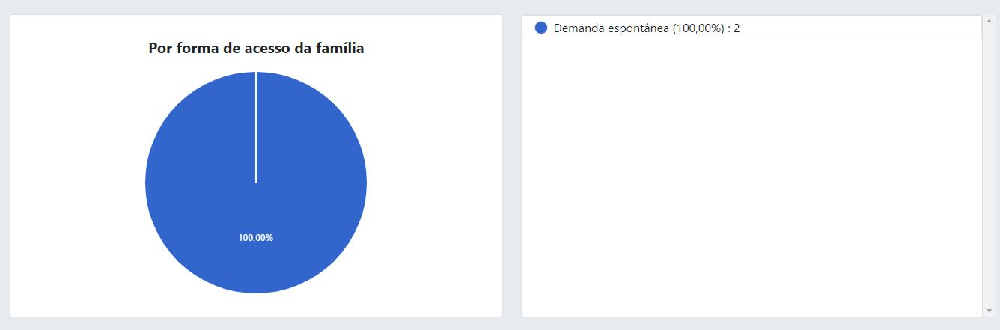
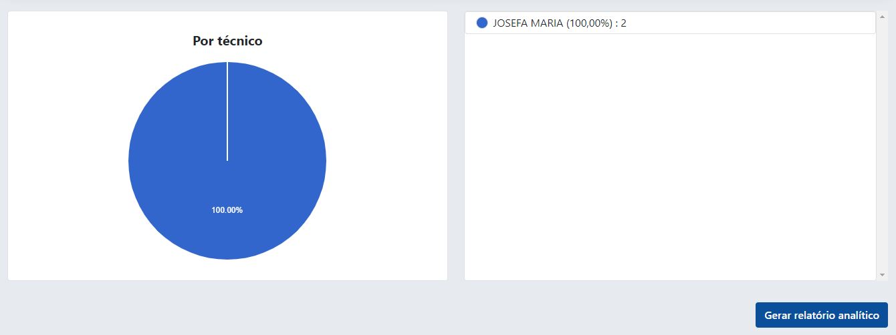

# Solicitação de visita domiciliar

As solicitações de visitas domiciliares são realizadas através dos profissionais da assistência social. As solicitações são registradas no sistema e podem ser facilmente buscadas.

Funcionalidades no sistema:

- Registrar nova solicitação
- Editar solicitação
- Registrar visita domiciliar
- Ver visitas realizadas
- Imprimir solicitação de visita
- Ver modelo de aviso (família não encontrada)
- Ver relatórios nominais
- Ver gráficos

## Registrar nova solicitação

Para registar uma nova solicitação, deve-se ir em **Secretaria -> Solicitação de visita domiciliar -> Cadastrar**, a seguinte tela será exibida.

Conforme a imagem acima, a primeiro e o segundo bloco de campos são:

1. Primeiro bloco:
    - Unidade de atendimento (a unidade que o técnico está realizando o atendimento)
    - Nome (nome completo do usuário)
    - Apelido (ou nome social)
    - RG (deve ser incluído o número, orgão expedidor e UF, exemplo: 20392123 SSPDS RN)
    - CPF (não é obrigatório, porém **é recomendado o seu preenchimento** para o registro do [histórico de atendimentos do usuário](../historic.md)).
    - Data de nascimento (no formato dd/mm/aaaa)
    - NIS (número de identificação social)

2. Segundo bloco:
    - Endereço (nome da rua)
    - Bairro (bairro onde reside o usuário)
    - Ponto de referência
    - Telefone(s)

3. Terceiro bloco:
    - Forma de acesso da família, possui as seguintes opções:
        - Demanda espontânea
        - Encaminhamento pelo conselho tutelar
        - Encaminhamento pelo disk 100 e 123
        - Encaminhamento pelo sistema de justiça e garantia de direitos
        - Encaminhamentos da educação
        - Encaminhamentos da Saúde
        - Encaminhamentos de outros serviços/unidade de proteção especial
        - Encaminhamentos de outros serviços/unidade de proteção social básica
        - Encaminhamentos por outras políticas setorias
        - Outros encaminhamentos

    - Se houver encaminhamento, especifique o órgão/unidade que encaminhou

    :::caution Atenção
    Caso seja selecionado a opção "Demanda espontânea", este campo será desabilidatado!
    :::

    - Motivo da visita, possui as seguintes opções:
        - Averiguação cadastral
        - Denúnica

    :::tip Dica
    Outras opções de motivo da visita podem ser cadastradas, ficando a disposição do técnico.
    :::

    - Nº de pessoas (númeo de pessoas que residem no domicílio)
    - ACS (nome do Agente Comunitário de Saúde)
    - Entrevistador(a) (profissional que está realizado o atendimento)
    - Data de registro (data no formato dd/mm/aaaa)
    - Observação (observação realizada pelo ténico durante o atendimento)

Após todo o preenchimento dos campos, deve-se clicar no botão "Solicitar Visita". Caso o cadastro seja bem sucedido, o sistema irá redirecionar para a tela abaixo.

## Visualizar solicitação de visita domiciliar

Feito o registro da visita, basta clicar em "Visualizar solicitação", o sistema irá redirecionar para a tela mostrada abaixo.

:::info Importante
Este papel deve ser impresso e assinado pelo usuário e pelo técnico, além disso, esta solicitação **DEVE** ser levada no ato da visita domiciliar.
:::

:::caution Atenção
É **extremamente importante** que o profissional não se esqueça de levar esse documento no ato da visita, pois é através dele e do campo OBSERVAÇÕES DURANTE A VISITA que após o retorno ao local de trabalho e das anotações realizadas que deve ser preenchido o cadastro da visita domiciliar.
:::

É recomendado que os profissionais deem prioridade as solicitações de visitas mais antigas.

## Modelo de aviso (família não encontrada)

Caso a visita seja realizada e a família não foi encontrada, o profissional tem a possibilidade de deixar um aviso no domicílio.
Para imprimir o aviso, basta ir em **Secretaria -> Solicitação de visita domiciliar -> Modelo de aviso (família não encontrada)**, o sistema irá abrir uma nova aba com o documento pronto para ser impresso, conforme a imagem abaixo.

Este aviso deve ser impresso e levado junto ao profissional que irá realizar a visita domiciliar,
caso a família não seja encontrada, o profissional deve deixar esse aviso na casa da família.

:::info Importante
O aviso deixado na residência é importante pois é uma prova de que os profissionais da assistência realizaram a visita e que houve a tentativa de solucionar o problema. 
:::

## Buscar solicitação de visita domiciliar

Para buscar por uma solicitação de visita, deve-se ir em **Secretaria -> Solicitação de visita domiciliar -> Buscar**, a seguinte tela será exibida.

A busca pode ser realizada pelo nome do usuário, CPF, data de nascimento, bairro, unidade de atendimento, forma de acesso da família, motivo da visita, responsável pelo atendimento e status.

:::tip Dica
O nome do usuário pode ser pesquisado em partes, ou seja, no lugar de digitar MARIA DA SILVA, pode ser digitado apenas MARIA que o sistema vai encontrar todas as MARIA's e retornar o resultado
:::

:::note Nota 
Não é necessário realizar a busca por todos os campos, basta preencher um determinado campo que o sistema faz a busca normalmente.
:::

Ao clicar no botão de buscar e a pesquisa encontrar algum resultado conforme os parâmetros informados, o sistema vai exibir a seguinte página:

A busca acima realizada foi utilizando o parâmetro nome (MARIA). É mostrada uma tabela com as seguintes colunas:

- Registrado em (com íncone de impressão da solicitação)
- Nome (nome completo do usuário)
- CPF (não obrigatório, mas recomendado)
- Unidade de atendimento (unidade onde o usuário foi atnedido)
- Status (status da solicitação)

Para visualizar as abas, registrar novas visitas e realizar edições, basta clicar no nome do usuário, que o sistema irá redirecionar para a seguinte página.

A página posusi as seguintes abas:

- Aba resumo
- Aba Editar solicitação de visita
- Aba Registra visita domiciliar
- Imprimir solicitação de visita

### Aba resumo 

Conforme a imagem acima, a aba resumo possui várias informações importantes, detre elas podemos citar
Responsável Familiar, Data de nascimento, CPF do responsável familiar, NIS, Motivo da visita, Nº de pessoas da família, Data do atendimento, Situação da visita e por fim a observação.

:::caution Atenção
É importante sempre verificar a situação da visita e ficar alerta a menagem que está no cabeçalho da página.
:::

### Aba Editar solicitação de visita

Realizada todas as alterações, basta clicar no botão "Editar".

### Aba Registrar visita domiciliar

Ao clicar na aba de registrar visita domiciliar, a imagem abaixo será exibida.

O formulário de registro de visita domiciliar, possui os seguintes campos:

- Relatório da visita (descrição)
- Situação da visita domiciliar, que possui os seguintes status:
    - Resolvido na unidade de atendimento
    - Resolvida na visita domiciliar
    - Visita realizada e família não encontrada
    - Rsolvido em outra unidade de atendimento
- Data da visita
- Entrevistador(a)

:::info Importante
O relatório da visita deve ser escrito se possível de forma formal e deve ser informado tudo o que foi realizada na visita.
:::

Preenchido todos os campos, basta clicar no botão "Registrar".

Após o registro da visita domiciliar, perceba que o status na aba de resumo mudou, antes estava status pendente para Resolvido na visita domiciliar, e perceba que também foi mostrado um alerta na de Visita domiciliar registrada com sucesso, veja na imagem abaixo.

### Aba visitas realizadas

Após o cadastro da visita domiciliar, esta aba foi exibida, perceba que ela estava oculta, assim o profisisonal poderá visualizar todas as visitas já realizadas.

A aba de visitas domiciliares está dividida 

### Visualizar visita domiicliar

Ao clicar no ícone de visualizar, uma janela modal será aberta com os dados da visita.

### Editar visita domiciliar

Caso exista a necessidade de editar algum dado, realizada todas as mudanças, deve-se clicar no botão "Editar".

### Imprimir visita domiciliar

Ainda na aba de visita domicilair, caso haja a necessidade de imprimir o documento da visita domiciliar, basta clicar no botão de "Imprimir", o sistema irá abrir uma nova aba com a página pronta pra ser impressa.

### Imprimir solicitação de visita domiciliar

Caso o profissional tenha esquecido de imprimir ou perdeu o documento da solicitação de visita domiciliar, o documento pode ser impresso novamente, além disso, é extremamente importante que esse documento seja levado para a visita domiciliar.

:::caution Atenção
A [impressão da solicitação da visita](#visualizar-solicitação-de-visita-domiciliar) não é igual a impressão da visita domiciliar!
:::

## Ver relatórios nominais

Para ver um relatório nominal, deve-se ir em **Secretaria -> Solicitação de visita domiciliar -> Ver relatórios nominais**, a seguinte tela será exibida.

Para buscar por um relatório nominal, primeiramente selecionar a data de inicial e a data final,depois os filtros e por fim os os campos que deseja visualizar, será aberta uma nova aba conforme a pesquisa informada, veja na imagem abaixo.

:::caution Atenção
A data inicial sempre deve ser menor que a data final, recomendamos que o período selecionado seja de no máximo um ano!
:::

## Ver gráficos/relatórios quantitativos

Para ver gráficos das solicitações de visitas domiciliares, deve-se ir em **Secretaria -> Solicitação de visita domiciliar -> Ver relatórios gráficos/relatórios quantitativos**, a seguinte tela será exibida.

Primeiramente deve selecionar a data inicial e a data final e depois marcar as unidades que deseja ver os gráficos.

Além disso, no fim da página existe a possibilidade de gerar um relatório analítido dos dados gerados pelos gráficos. Clicando em "Gerar relatório", o sistema vai exibir uma nova página, veja na imagem abaixo.

## Formas de acesso da família (recurso)

As formas de acesso da família é um recurso que pertence ao cadastro da solicitação de visita domiciliar. para ver todas as formas de acesso, basta ir em **Secretaria -> Solicitação de visita domiciliar -> Forma de acesso da família (recurso)**, a seguinte tela será exibida.

Como podemos observar, temos as opções de cadastrar, visualizar e editar uma forma de acesso existente.

### Cadastrar nova formas de acesso da família

Para cadastrar basta clicar no botão de cadastrar que o sistema irá redirecionar para a tela de cadastro.

O campo nome é obrigatório, já o campo descrição é opcional, após o preenchimento basta clicar no botão "Cadastrar".

### Ver forma de acesso da família

Para ver uma forma de acesso, basta selecionar o registro e clicar no ícone de visualizar, o sistema irá redirecionar para a tela de forma de acesso.

:::note Note
Estes dados são apenas para visualizar, assim não é possível realizar a editação dos mesmos.
:::

### Editar forma de acesso da família

Para editar um determinado registro, basta clicar no ícone do lápis que o sistema irá redirecionar para a tela de edição.

O campo nome e o status (ativo ou inativo) são obrigatórios, já o campo descrição é opcional, após o preenchimento basta clicar no botão "Editar".

:::info Atenção
Se o status for selecionado como inativo, a forma de acesso não será mais apresentada na página de realizar a solicitação da visita domiciliar.
:::

## Motivos (recurso)

Os motivos é um recurso que pertence ao cadastro da solicitação de visita domiciliar. para ver todos os motivos, basta ir em **Secretaria -> Solicitação de visita domiciliar -> Motivos (recurso)**, a seguinte tela será exibida.

Como podemos observar, temos as opções de cadastrar, visualizar e editar um motivo existente.

### Cadastrar novo motivo da visita

Para cadastrar basta clicar no botão de cadastrar que o sistema irá redirecionar para a tela de cadastro.

O campo nome é obrigatório, já o campo descrição é opcional, após o preenchimento basta clicar no botão "Cadastrar".

### Ver motivo da visita

Para ver um motivo de visita, basta selecionar o registro e clicar no ícone de visualizar, o sistema irá redirecionar para a tela de forma de acesso.

:::note Nota
Estes dados são apenas para visualizar, assim não é possível realizar a edição dos mesmos.
:::

### Editar motivo da visita

Para editar um determinado registro, basta clicar no ícone do lápis que o sistema irá redirecionar para a tela de edição.

O campo nome e o status (ativo ou inativo) são obrigatórios, já o campo descrição é opcional, após o preenchimento basta clicar no botão "Editar".

:::info Atenção
Se o status for selecionado como inativo, o motivo da visita não será mais apresentado na página de realizar a solicitação da visita domiciliar.
:::
