# Atendimento esporádico

É o tipo de atendimento que ocorre poucas vezes, que se realiza somente em alguns casos. Dentre as funcionalidades, podemos citar:

- [`Registrar atendimento`](#registrando-atendimento-esporádico)
- [`Buscar`](#buscar-atendimento-esporádico)
- [`Ver relatórios nominais`](#ver-relatórios-nominais)
- [`Ver gráficos`](#ver-gráficosrelatórios-quantitativos)
- [`Tipos de serviços prestados`](#serviços-prestados)

## Registrando atendimento esporádico

Para ver um relatório nominal, deve-se ir em **Secretaria -> Atendimentos esporádicos -> Cadastrar**, a seguinte tela será exibida.

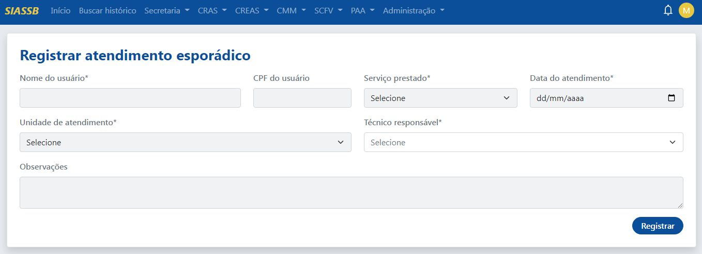

Os seguintes campos serão apresentados:

- Nome do usuário (informar o nome completo)
- CPF do usuário (não obrigatório)
- Serviço prestado (o serviço que está sendo prestado, caso o mesmo não se encontre na lista, deve ser cadastrado em -> Secretaria -> Atendimentos esporádicos -> Serviços)
- Data do atendimento (no formato dd/mm/aaaa)
- Unidade do atendimento (ponto de atendimento)
- Técnico responsável (técnico responsável pelo cadastramento das informações)
- Observações (não obrigatório)

:::info Importante
Todos os campos que possuem * (asterísco) são de preenchimento obrigatório
:::

Preenchido todos os campos, clicar no botão "Registrar".

### Atendimento registrado com sucesso

Após clicar no botão "Registrar", o sistema irá redirecionar para a página de "Sucesso", conforme a imagem abaixo.

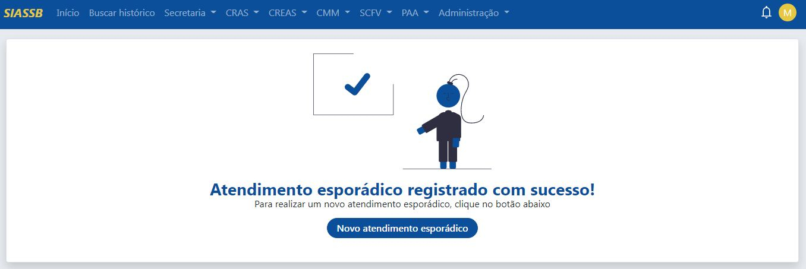

Com isso, o atendimento foi registrado e o técnico poderá realizar um novo atendimento clicando no botão "Novo atendimento esporádico".

## Buscar atendimento esporádico

Para realizar uma busca por um atendimento esporádico, deve-se ir em **Secretaria -> Atendimentos esporádicos -> Buscar**, a seguinte tela será exibida.

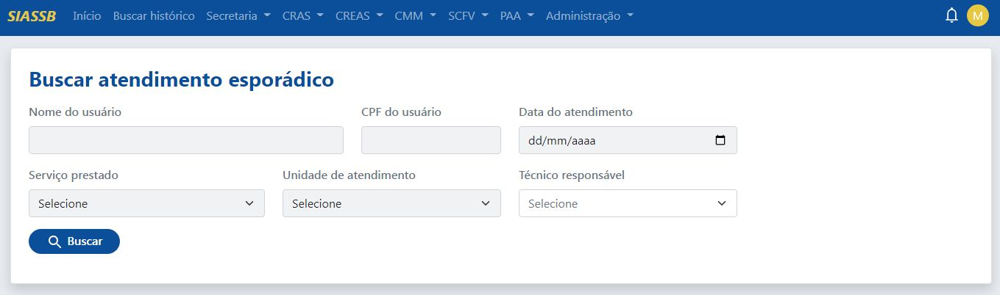

A busca pode ser realizada pelo nome do usuário, CPF, data do atendimento, serviço prestado, unidade de atendimento ou pelo nome do técnico responsável.

:::tip DICA! O NOME DO USUÁRIO PODE SER BUSCADO POR PARTES.
Por exemplo: imagina que a busca é para retornar o usuário MARIA FRANCISCA. Logo, no ato da busca basta digitar MARIA que o sistema vai retornar todas as Marias
:::

Realizada a busca, conforme os parâmetros informador pelo profissional, será exibida uma tela com todos os registros encontrados.

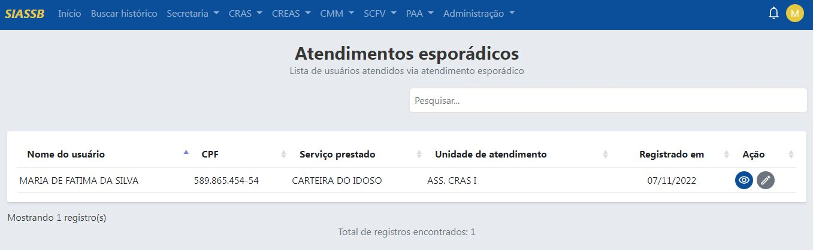

É apresentada uma tabela com todos os registros encontrados, contendo os seguintes campos:
Nome do usuário, CPF, serviços prestados, undiade de atendimento, registrado em e ações.

Caso o profissional necessite visualizar as informações de um determinado registro, basta clicar no ícone de visualizar, conforme a imagem abaixo.

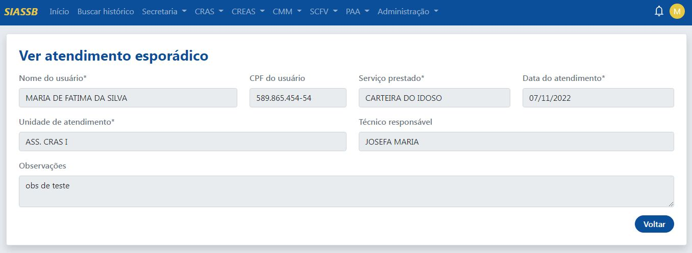

:::info Importante
Os dados acima mostrados são apenas para fins de visualização
:::

Caso o profissional necessite editar os dados de um determinado registro, basta clicar no ícone de lápis, conforme a imagem abaixo.

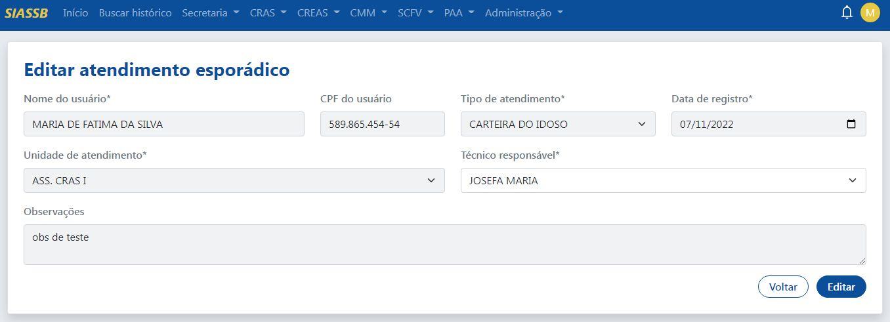

Realizada todas as alterações, basta clicar no botão "Editar".

## Ver relatórios nominais

Para ver um relatório nominal, deve-se ir em **Secretaria -> Atendimentos esporádicos -> Ver relatórios nominais**, a seguinte tela será exibida.

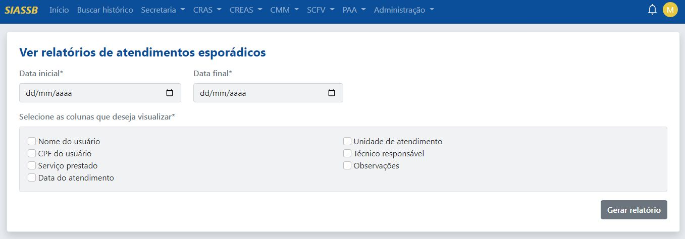

Para buscar por um relatório nominal, primeiramente selecionar a data de inicial e a data final, depois selecionar os campos que deseja visualizar, será aberta uma nova aba conforme a pesquisa informada, veja na imagem abaixo.

:::caution
A data inicial sempre deve ser menor que a data final, recomendamos que o período selecionado seja de no máximo um ano!
:::

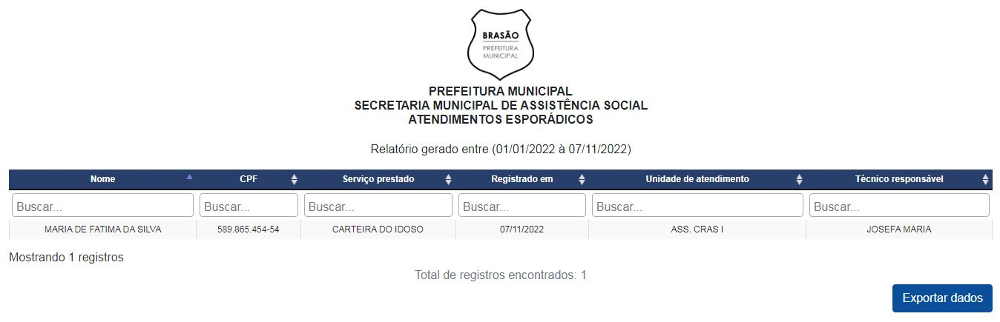

A página pode ser impressa ou salva no formato PDF. Clicando no botão "Exporta dados", os dados serão exportados no formato CSV.

:::tip Dica
A grande vantagem de exportar os dados no formato CSV é o fato dele possibilitar a importação e exportação de arquivos de uma linguagem que vários aplicativos podem ler. Aplicativos como o Microsoft Excel, Google Planilhas e LibreOffice Calc podem facilmente ler esse tipo de arquivo, dessa forma os dados podem ser manipulados de várias formas diferentes, sejam para fins de pesquisas e análises de dados ou até mesmo para apoiar os gestores municipais nas suas tomadas de decisões. 
:::

Além disso, os dados exportados no formato CSV também podem ser importados para outros sistemas próprios da gestão municipal.

## Ver gráficos/relatórios quantitativos

Para ver gráficos dos atendimentos esporádicos, deve-se ir em **Secretaria -> Atendimentos esporádicos -> Ver relatórios gráficos/relatórios quantitativos**, a seguinte tela será exibida.

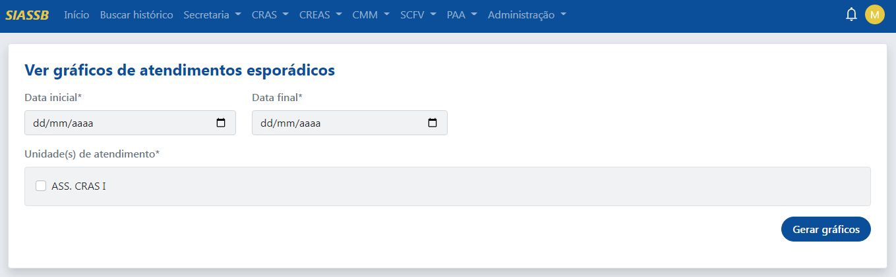

Primeiramente deve ser informado sempre uma data inicial e uma data final, selecionar a undiade de atendimento e depois clicar no botão "Gerar gráficos", se a busca encontrar algum registro, a tela será renderizada com os seguintes gráficos.

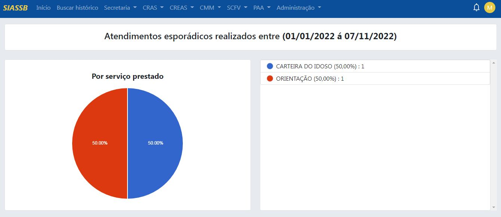
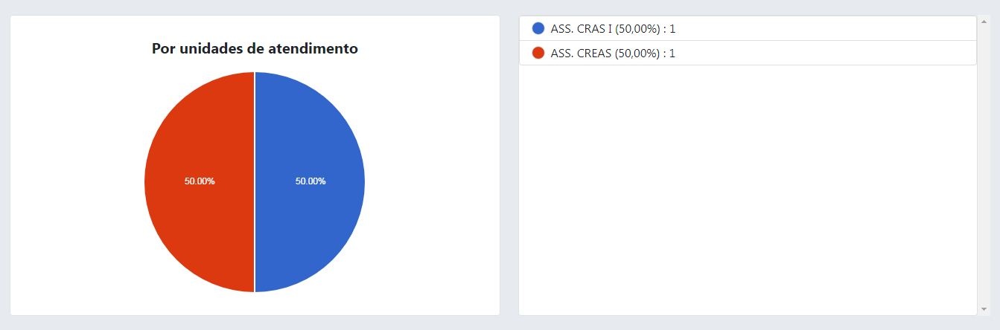
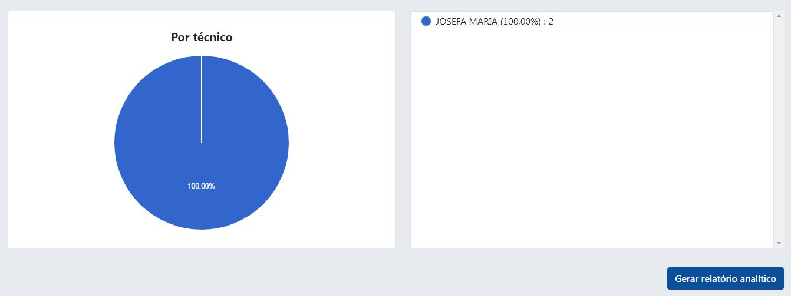

Além disso, no fim da página existe a possibilidade de gerar um relatório analítido dos dados gerados pelos gráficos. Clicando em "Gerar relatório analítico", o sistema vai exibir uma nova página, veja na imagem abaixo.

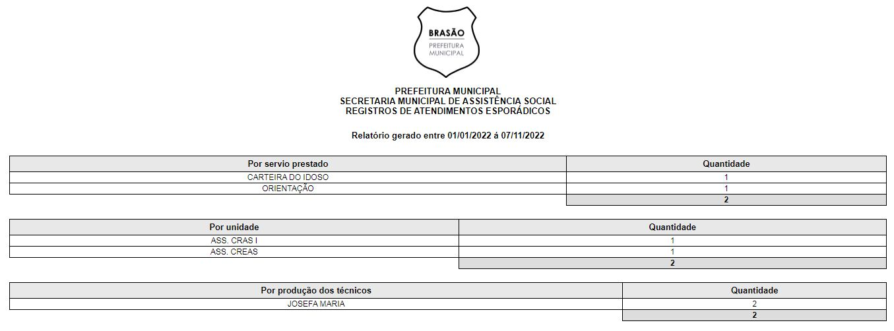

## Serviços prestados

Caso haja a necessidade de ver/editar/cadastrar um novo tipo de serviço, basta ir em **Secretaria -> Atendimentos esporádicos -> Serviços**, a seguinte tela será exibida.

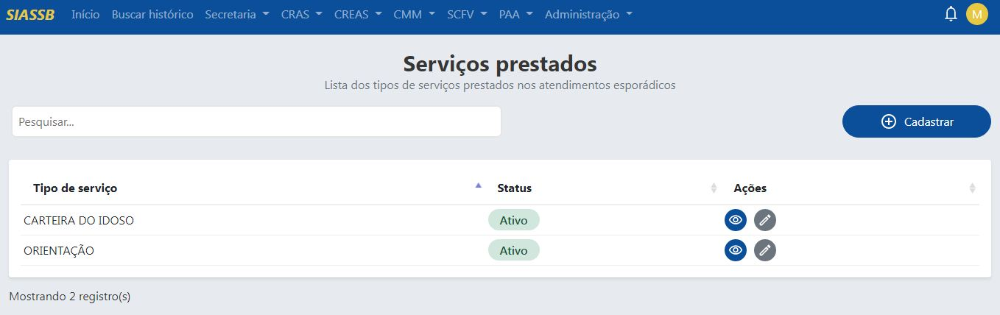

### Cadastrando um novo serviço

Para cadastrar um novo serviço, deve-se clicar no botão "Cadastrar", o sistema irá redirecionar para a tela de cadastro.

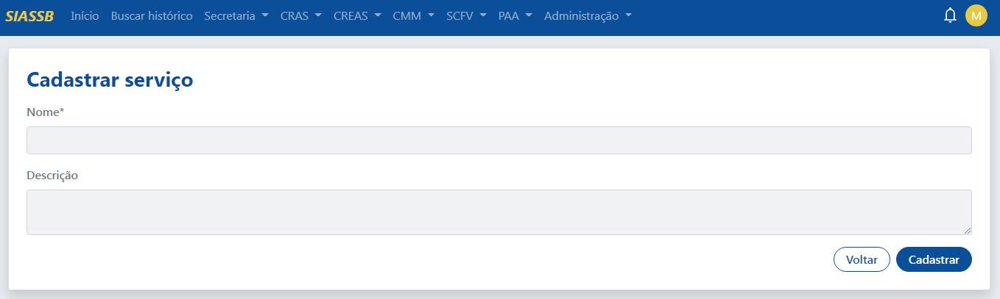

O campo com asterísco é obrigatório, após o preenchimento dos campos, basta clicar no botão "Cadastrar". O sistema irá redirecioanr novamente para a tela de serviços.

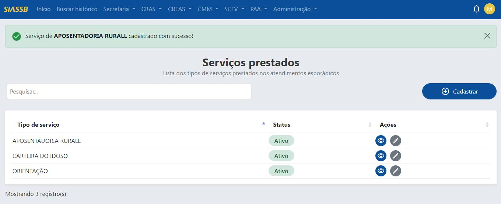

Conforme exibido na imagem acima, foi registrado um novo tipo de serviço chamado APOSENTADORIA RURALL, caso haja a necessidade de editar os dados, basta selecionar o registro e clicar no ícone de edição, o sistema irá redirecionar para a seguinte tela.

### Editando um serviço já existente

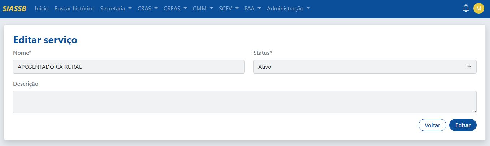

Feita as devidas correções, basta clicar no botão "Editar". O sistema irá redirecioanr novamente para a tela de serviços.

### Visualizando um serviço já existente

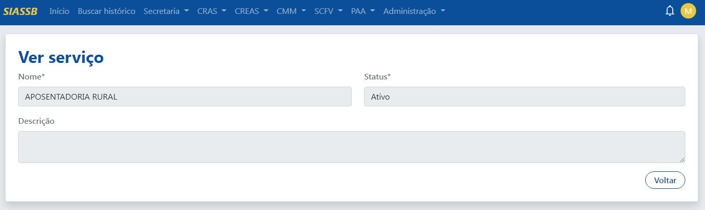
