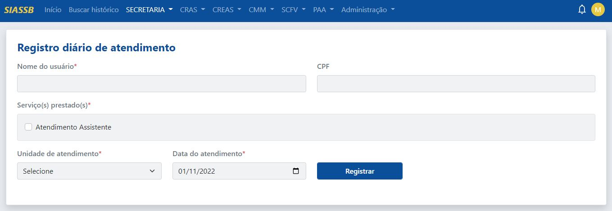
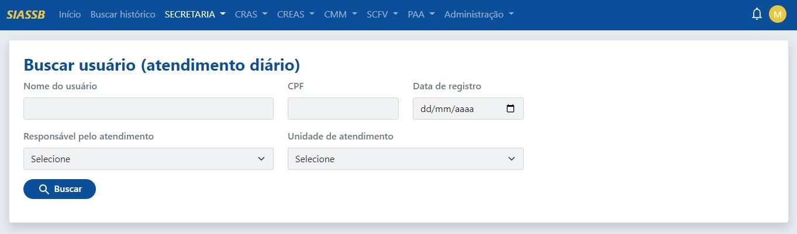
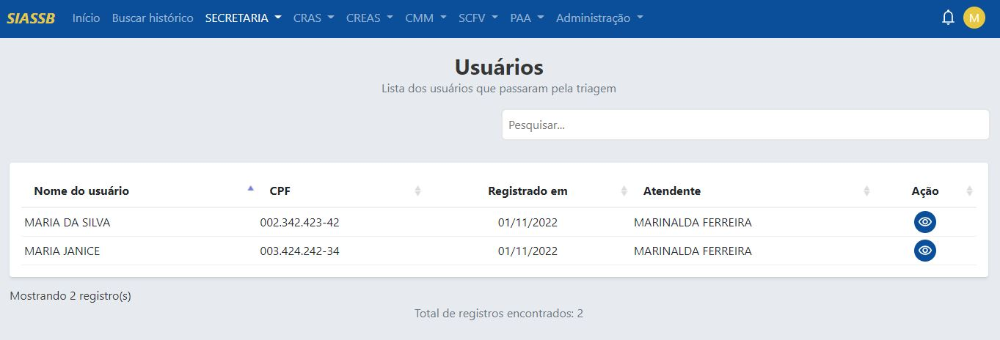
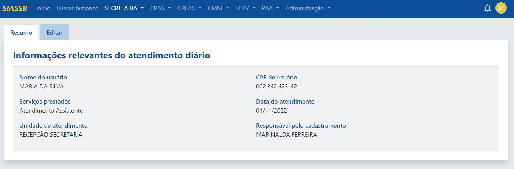
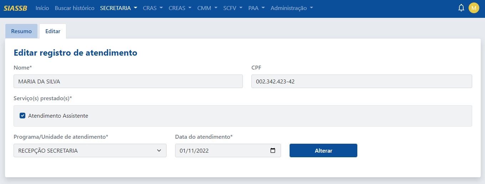
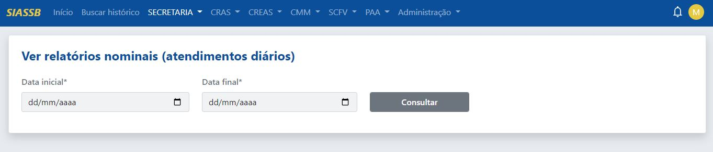
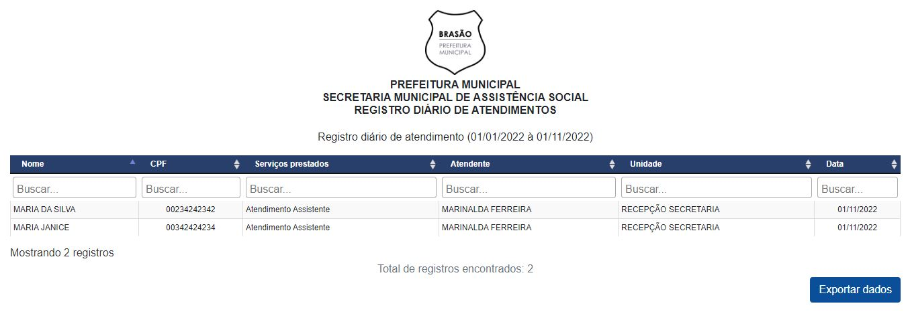
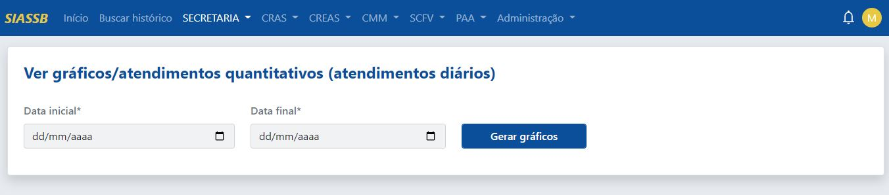
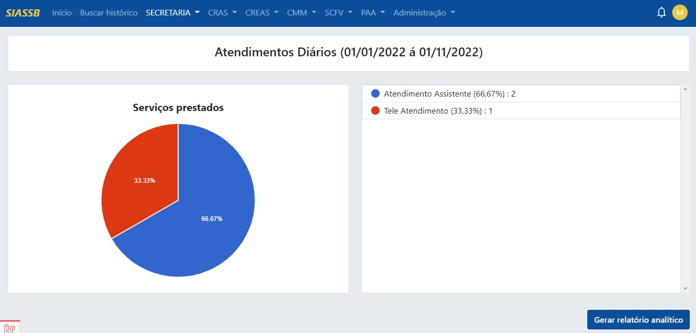
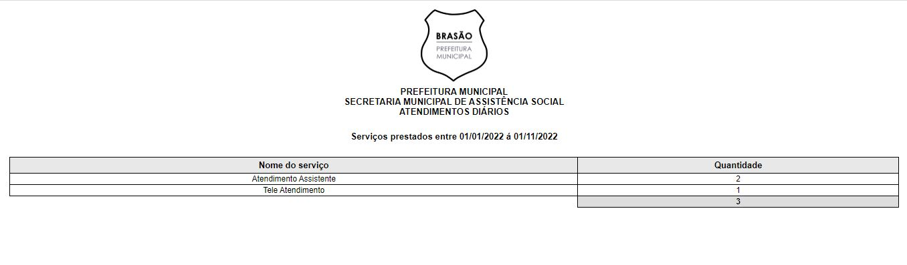

# Atendimentos diários (triagem)

O módulo de triagem da secretaria é usado para recepcionar os usuários que procuram a unidade, sejam por meio de demanda espontânea ou por outra forma de acesso, e será a principal ferramenta utilizada pelos profissionais da recepção da secretaria.

O objetivo principal da triagem é agilizar o atendimento, fazendo com que os técnicos da assistência social ganhem tempo e os usuários ganhem qualidade durante sua passagem pelo equipamento. Isso ajuda na redução de filas de espera e na superlotação desses espaços.

## Registrando seu primerio atendimento diário

Após o processo de login no sistema, para registrar um atendimento na recepção, basta clicar na **unidade da secretaria -> Atendimentos diários -> Registrar atendimento diário**, o sistema irá mostra a tela de registrar atendimento diário, conforme a imagem abaixo:

Os campos utilizados para registrar o usuário são:
- **Nome do usuário** (é recomendado não incluir acentuação)
- **CPF** do usuário
- **Serviços prestados** (podem ser selecionados mais de um)
- **Unidade de atendimento** (geralmente o ponto de atendimento da recepção)
- **Data do atendimento** (o sistema exibe a data atual, mas pode ser alterada para fins de atendimento tardio, ou seja, se o atendimento foi realizado ontem e o sistema estava indisponível por algum motivo, o atendimento pode ser registrado no papel e no dia seguinte pode ser registrado no sistema como um atendimento tardio).

:::info Importante
Todos os campos que possuem * são de preenchimento obrigatório
:::

É recomendado o preenchimento do campo CPF, caso o CPF não seja informado, o registro do usuário não vai para a linha do tempo dos atendimentos, e com isso não haverá a unificação dos dados do usuário.

Para saber mais, leia: [`como funciona o histórico de atendimentos`](/manual-siassb/historic).

## Buscar atendimento diário

Para realizar uma busca por um determinado registro, basta clicar em **Secretaria -> Atendimentos diários -> Buscar atendimento diário**, o sistema irá mostra uma nova tela, conforme a imagem abaixo:

A busca pode ser realizada pelo nome do usuário, CPF, data de registro, responsável pelo atendimento ou pela unidade de atendimento.

:::tip Dica
O nome do usuário pode ser pesquisado em partes, ou seja, no lugar de digitar MARIA DA SILVA, pode ser digitado apenas MARIA que o sistema vai encontrar todas as MARIA's e retornar o reultado.
:::

:::note Nota
Não é necessário realizar a busca por todos os campos, basta preencher um determinado campo que o sistema faz a busca normalmente.
:::

Ao clicar no botão de **buscar** e a pesquisa encontrar algum resultado conforme os parâmetros informados, o sistema vai exibir a seguinte página:

O sistema vai exibir uma tabela com vários registros, com as colunas de nome do usuário, CPF, data de registro, atendente e ação. para visualizar os dados de um usuário basta selecionar o usuário desejado e clicar no ícone de "Visualizar", assim o sistema irá fazer um redirecionamento e vai mostrar a seguinte aba:

Na aba de resumo, são mostrados os dados do atendimento gerado na recepção, e na aba de Editar, serão mostrados os dados disponíveis para edição, caso o usuário queira atualizar os dados, basta clicar na aba sequente e será exibida a seguinte tela: 

Caso o operador do sistema queria realizar alguma alteração, basta editar os dados necessários e clicar no botão "Alterar", que o sistema realizará todas as modificações.

## Visualizando relatórios nominais

Os relatórios nominais nos dão a possibilidade de identificarmos quem foram os usuários que passaram pela triagem da recepção. Para isso, deve-se inserir uma data inicial e uma data final para obtermos o relatório de forma mais detalhada.

:::caution atenção
A data inicial sempre deve ser menor que a data final, recomendamos que o período selecionado seja de no máximo um ano!
:::

Com a selelação correta da data inicial e data final, os registros serão exibidos numa nova aba.

Assim, os registros realizados na triagem podem ser impressos, salvos no formato PDF. Além disso, os dados podem ser salvos clicando no botão "Exportar dados", os dados serão baixados no formato CSV.

:::tip Dica
A grande vantagem de exportar os dados no formato CSV é o fato dele possibilitar a importação e exportação de arquivos de uma linguagem que vários aplicativos podem ler. Aplicativos como o *Microsoft Excel*, *Google Planilhas* e *LibreOffice Calc* podem facilmente ler esse tipo de arquivo, dessa forma os dados podem ser manipulados de várias formas diferentes, sejam para fins de pesquisas e análises de dados ou até mesmo para apoiar os gestores municipais nas suas tomadas de decisões.
:::

Além disso, os dados exportados no formato CSV também podem ser importados para outros sistemas próprios da gestão municipal.

## Ver relatórios quantitativos/gráficos

Os gráficos são um forma de visualizar os dados de uma forma quantitativa, para iniciar o processo de geração de gráficos, o acesso se dá através da **Secretaria -> Atendimentos diários -> Ver gráficos/relatórios quantitativos**.

Para gerar gráficos, é necessário selecionar a data inicial e a data final por fim basta clicar em gerar gráficos, o modelo dos gráficos é do tipo pizza.

Além disso, existe o opção de gerar relatório analítico, basta clicar no botão azul chamado "Gerar relatório analítico", será exibido um relatório numa nova aba com o total de serviços prestados.

O mesmo pode ser impresso ou salvo no formato PDF.
