# Atualização escolar

A família beneficiária do Programa Auxílio Brasil (PAB) cujos filhos mudaram de escola ou em casos onde a frequência escolar está abaixo da estabelecida pelo programa, precisam atualizar os dados cadastrais no CadÚnico. Caso contrário, poderão ter o seu benefício bloqueado.

Para ter direito ao Auxílio Brasil, a família deve atender aos critérios estabelecidos pelo programa, além disso é preciso cumprir compromissos nas áreas de educação e saúde. Com o objetivo de notificar o setor da educação, foram desenvolvidas as seguintes funcionalidades:

- [`Cadastrar atualização escolar`](#cadastrar-atualização-escolar)
- [`Buscar atualização escolar`](#buscar-atualização-escolar)
- [`Ver atualizações escolares pendentes`](#ver-atualizações-pendentes)
- [`Ver relatórios nominais`](#ver-relatórios-nominais)
- [`Escolas (recurso)`](#escolas)

## Cadastrar atualização escolar

Para ver um relatório nominal, deve-se ir em **Secretaria -> Atualização escolar -> Cadastrar**, a seguinte tela será exibida.

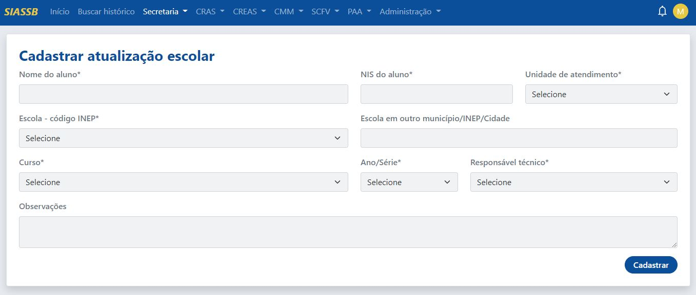

Os seguintes campos serão apresentados:

- Nome do aluno (informar o nome completo)
- NIS do aluno (preencher com o Número de Inscrição Social)
- Unidade de atendimento (sua unidade de atendimento)
- Escola - código INEP (Atenção: )
- Escola em outro município
- Curso
- Ano/Série
- Responsável Técnico (técnico responsável pelo cadastramento das informações)
- Observações

:::caution Atenção
Com relação ao campo **Escola - código INEP**, se a escola que você deseja selecionar não aparecer na lista, a mesma deverá ser registrada, veja [como cadastrar uma nova escola](#escolas)
:::

:::info Importante
Todos os campos que possuem * (asterísco) são de preenchimento obrigatório!
:::

Preenchido todos os campos, deve-se clicar no botão "Cadastrar".

### Atendimento registrado com sucesso

Após clicar no botão "Cadastrar", o sistema irá redirecionar para a página de "Sucesso", conforme a imagem abaixo.

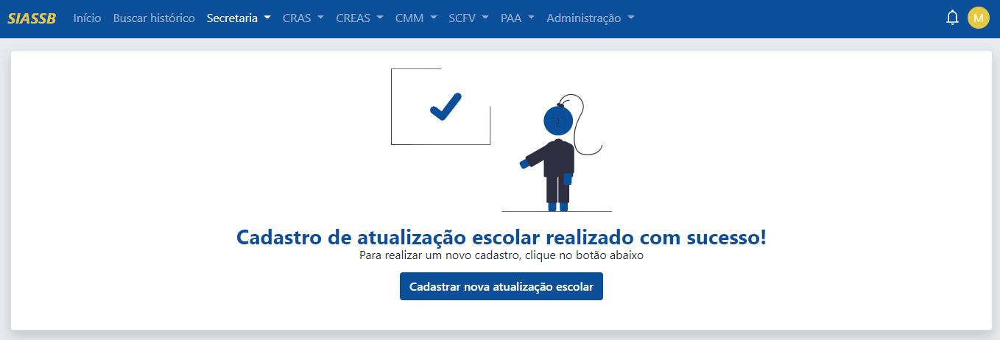

Com isso, o atendimento foi registrado e o técnico poderá realizar um novo cadastro de atualização escolar clicando no botão "Cadastrar nova atualização escolar".

## Buscar atualização escolar

Para realizar uma busca por uma atualização escolar, deve-se ir em **Secretaria -> Atualização escolar -> Buscar**, a seguinte tela será exibida.

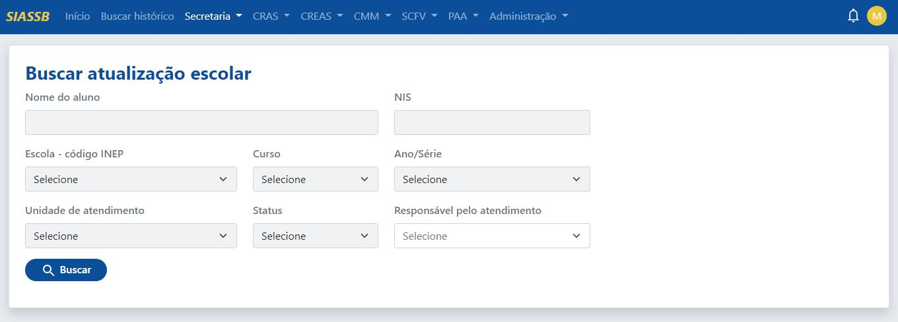

A busca pode ser realizada pelo nome do aluno, NIS, escola, curo, ano/série, unidade de atendimento, status ou pelo técnico responsável.

:::tip DICA! O NOME DO ALUNO PODE SER BUSCADO POR PARTES.
Por exemplo: imagina que a busca é para retornar o usuário MARIA FRANCISCA. Logo, no ato da busca basta digitar MARIA que o sistema vai retornar todas as Marias, inclusive a Maria Francisca que pode está inscrito como Maria Fracisca.
:::

Realizada a busca, conforme os parâmetros informador pelo profissional, será exibida uma tela com todos os registros encontrados.

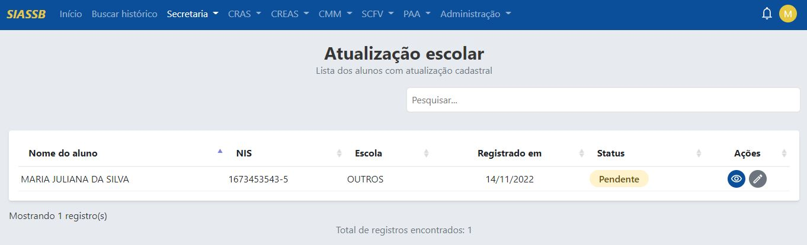

É apresentada uma tabela com todos os registros encontrados, contendo os seguintes campos:
Nome do aluno, NIS, escola, registrado em, status e ações.

### Visualizando atualização escolar

Caso o profissional necessite visualizar as informações de um determinado registro, basta clicar no ícone de visualizar, conforme a imagem abaixo.

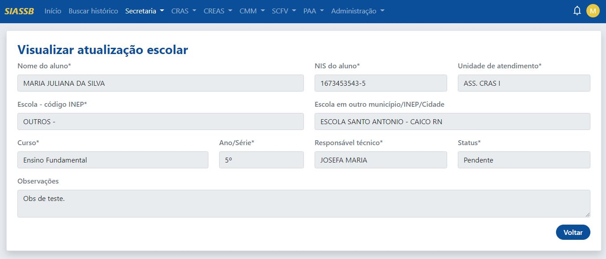

:::info Importante
Os dados acima mostrados são apenas para fins de visualização.
:::

### Editando atualização escolar

Caso o profissional necessite editar os dados de um determinado registro, basta clicar no ícone de lápis, que será redirecionado para a seguinte página.

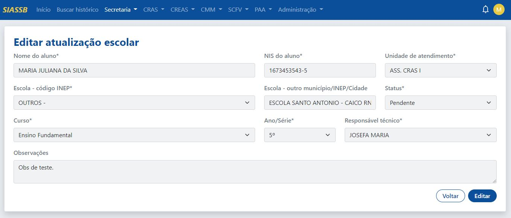

Realizada todas as alterações, basta clicar no botão "Editar".

## Ver atualizações pendentes

Para verificar se existe alguma atualização escolar pendente, deve-se ir em **Secretaria -> Atualização escolar -> Ver atualizações pendentes**, a seguinte tela será exibida.

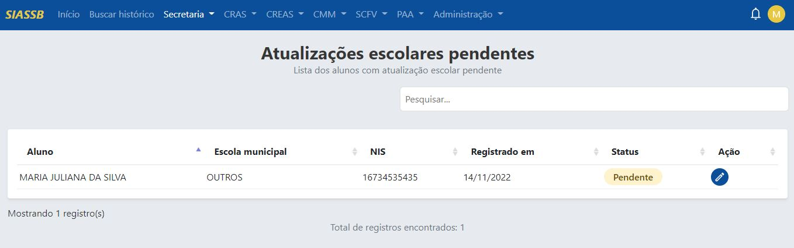

### Alterar status

Para alterar o status da atualização, basta clicar no botão do lápis, será aberta uma janela modal conforme a imagem abaixo:

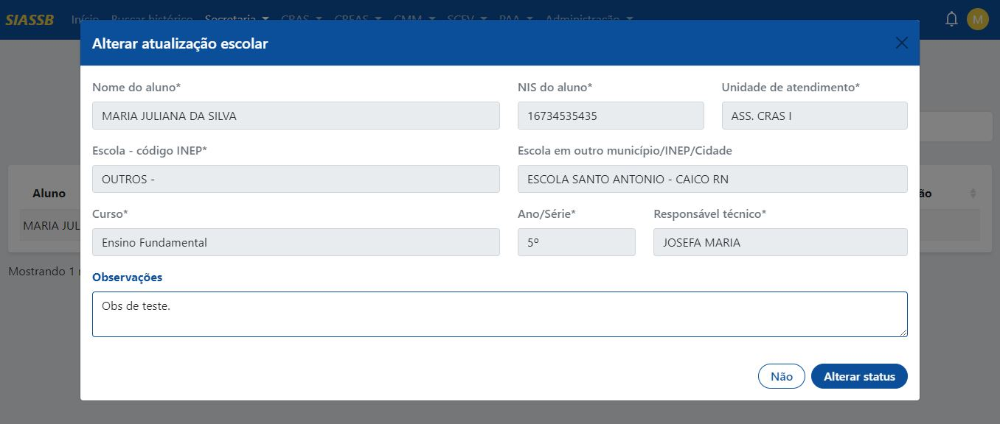

O único campo editável é o campo das observações, após isso, basta clicar no botão "Alterar status" que o sistema irá alterar o status de pendente para informado no sistema!.

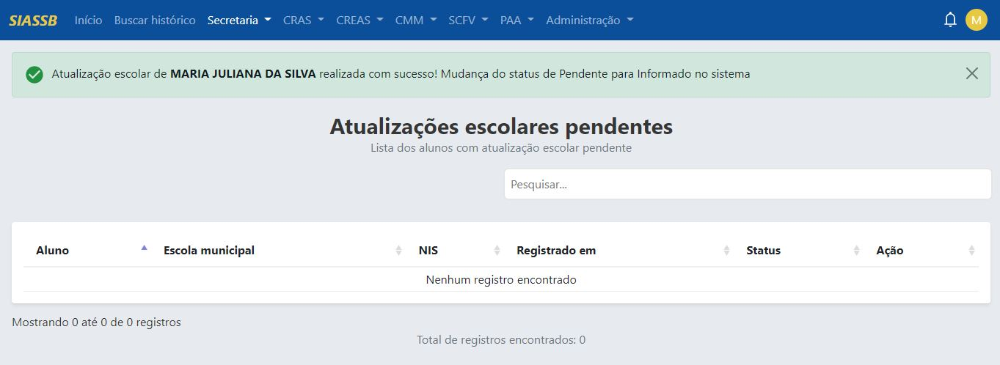

Perceba que o registro da aluna MARIA JULIANA sumiu da lista de pendentes, pois o status foi alterado.

## Escolas

Caso haja a necessidade de ver/editar/cadastrar uma nova escola, basta ir em **Secretaria -> Atualização escolar -> escolas (recurso)**, a seguinte tela será exibida.

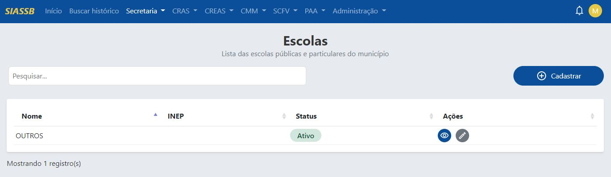

Por padrão, só existe uma escola cadastrada, mas o profissional pode cadastrar quantas escolas quiser.

### Cadastrando uma nova escola

Para cadastrar uma nova escola, deve-se clicar no botão "Cadastrar", o sistema irá redirecionar para a tela de cadastro.

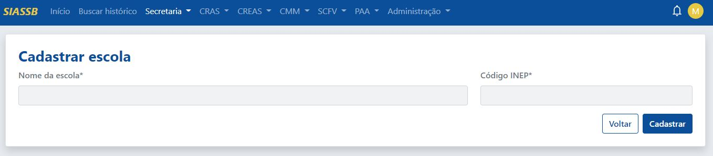

Os campos com asteríscos são obrigatórios, após o preenchimento dos campos, basta clicar no botão "Cadastrar". O sistema irá redirecioanr novamente para a tela de serviços.

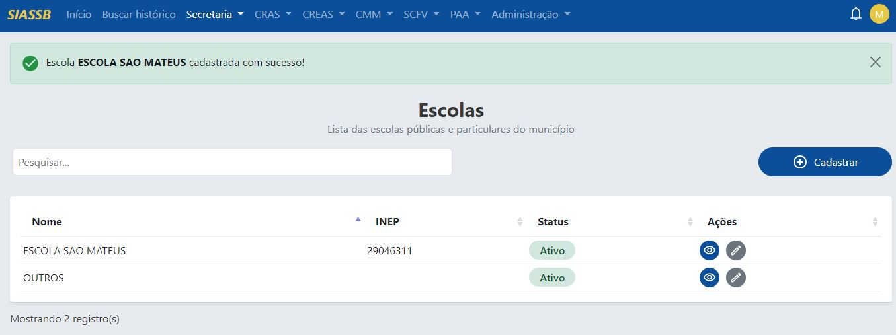

Conforme exibido na imagem acima, foi registrado uma nova escola chamada ESCOLA SAO MATEUS	, caso haja a necessidade de editar os dados, basta selecionar o registro e clicar no ícone do lápis, o sistema irá redirecionar para a seguinte tela.

### Editando um serviço já existente

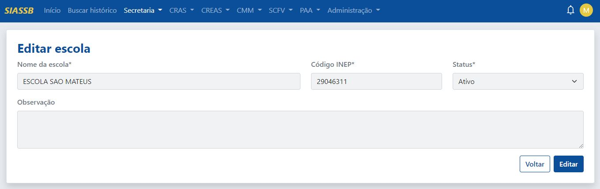

Feita as devidas correções, basta clicar no botão "Editar". O sistema irá redirecioanr novamente para a tela de serviços.

## Ver relatórios nominais

Para ver um relatório nominal, deve-se ir em **Secretaria -> Atualização escolar -> Ver relatórios nominais**, a seguinte tela será exibida.

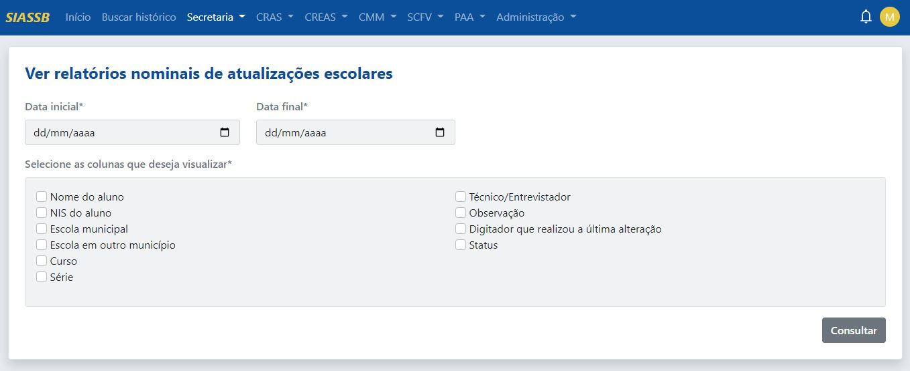

Para buscar por um relatório nominal, primeiramente selecionar a data de inicial e a data final, depois selecionar os campos que deseja visualizar, será aberta uma nova aba conforme a pesquisa informada, veja na imagem abaixo.

:::caution
A data inicial sempre deve ser menor que a data final, recomendamos que o período selecionado seja de no máximo um ano!
:::

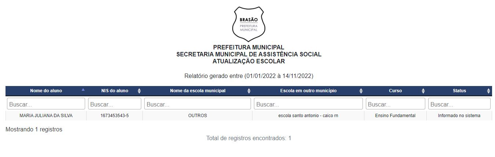
